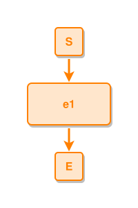

# Layout Test DSL Reference

Complete reference for the layout testing Domain-Specific Language (DSL).

## Overview

The layout test DSL provides a declarative way to validate layout algorithm behavior. Rules are embedded in specification documents using `ipmdev-layout-rule` code blocks and automatically extracted for testing.

**Design Philosophy:**
- Declarative assertions, not imperative commands
- Rules accumulate and compact as tests progress
- More specific rules override general ones
- Later rules override earlier ones when specificity is equal
- Scope directives control which tests see which rules

### Two-Stage Filtering

The DSL uses a two-stage filter hierarchy:

1. **Stage 1: Scope Filter** - Determines which tests see a rule (test-level filtering)
2. **Stage 2: Selector Filter** - Determines which nodes within a test are validated (node-level filtering)

**Example:**
```dsl
@scope global tags: long-text         # Stage 1: Test must have "long-text" tag
each type=event text-len>72 has height>=140  # Stage 2: Event nodes with >72 chars
```

This rule only applies to:
- Tests tagged with "long-text" (scope filter)
- Event nodes with >72 character labels within those tests (selector filter)

## Scope Directives

Scope directives control which tests a rule applies to. They provide test-level filtering before node-level selector filtering.

### Basic Scopes

**Global Scope** - Applies to all tests:
```dsl
@scope global
each type=event has width=120
each type=boundary has size=40x40
```

**Local Scope** - Applies only to the current test (under the same ### heading):
```dsl
@scope local
all #S,#e1,#E have same center-x
#e1 is below #S with gap=60
```

**Parent Scope** - Applies to all following tests in the same ## section:
```dsl
@scope parent
each type=event has width=120
each type=event has height=60
```

### Tag Filters

Add tag expressions to scopes for fine-grained filtering:

```dsl
@scope global tags: long-text
each type=event has height>=140

@scope global tags: !experimental
each type=event has width=120

@scope parent tags: fork-pattern || merge-pattern
all #E1,#E2 have same center-y

@scope local tags: complex && !experimental
all #S,#e1,#E have same center-x
```

**Tag Expression Syntax:**
- `TAG` - Tests with TAG
- `TAG1 || TAG2` - Tests with TAG1 OR TAG2
- `!TAG` - Tests WITHOUT TAG
- `TAG1 && TAG2` - Tests with both TAG1 AND TAG2
- `(TAG1 || TAG2) && !TAG3` - Boolean expressions with grouping

**Precedence:** `!` (NOT) > `&&` (AND) > `||` (OR)

**Negation Semantics:** If a test has no tags (empty tag set), `!TAG` evaluates to `true` for any TAG.

### Test Tags

Define tags in ipmt test blocks:

```ipmt
# @test-tags: simple, single-event, long-text
e1 ::e [This is a very long label that needs more height]
```
<!-- ipm-svg id=100 hash=6e63d16c -->


Multiple `@test-tags` lines accumulate tags.

### Scope Specificity Hierarchy

When rules conflict, scope specificity determines the winner:

1. `@scope local tags: EXPR` - Most specific (single test with tag filter)
2. `@scope local` - Single test
3. `@scope parent tags: EXPR` - Section tests with tag filter
4. `@scope parent` - Section tests
5. `@scope global tags: EXPR` - All tests with tag filter
6. `@scope global` - All tests (least specific, default)

**Within same scope:** Later rules override earlier rules when specificity is equal.

### Scope Defaults and Persistence

**Default Scope:** Each new `ipmdev-layout-rule` code fence starts with `@scope local` as the default.

**Scope Persistence:** A `@scope` directive remains active until the next `@scope` directive within the same code fence.

**Code Fence Boundary:** Each code fence is independent - scope settings do not carry over to the next fence.

```dsl
# No @scope directive = @scope local (default)
all #S,#e1,#E have same center-x
```

```dsl
@scope global
each type=event has width=120  # Global scope active

@scope local
all #S,#e1,#E have same center-x  # Switched back to local
```

### Scope Ordering Rules

Within each rule block, scopes must appear in order of increasing specificity:

```dsl
# ✓ CORRECT: General to specific
@scope global
each type=event has width=120

@scope parent
each type=event has height=60

@scope local
all #S,#e1,#E have same center-x
```

```dsl
# ✗ INCORRECT: Cannot revert to less specific scope
@scope local
all #S,#e1,#E have same center-x

@scope global  # ERROR: Cannot go back to global after local
each type=event has width=120
```

**Note:** Each new `ipmdev-layout-rule` code fence starts fresh with default `@scope local`.

## Selector Syntax

Selectors identify which nodes a rule applies to.

### Quantifier Keywords

The DSL uses two quantifier keywords with different semantics:

**`each` - Universal Quantifier (Type-based)**
- Applies constraints to **every node of a type** individually
- Used with type selectors: `each type=event`
- Grammar: Uses singular verb `has`
- Meaning: "For every node matching this type, the property **must** satisfy..."

```dsl
each type=event has width=120        # Every event must be 120px wide
each type=boundary has size=40x40    # Every boundary must be 40x40
```

**`all` - Group Selector (ID-based)**
- Selects a **specific list of nodes by ID** to check together
- Used for equality constraints: `all #id1,#id2,... have same PROPERTY`
- Grammar: Uses plural verb `have`
- Meaning: "These specific nodes **must share** the same value for..."

```dsl
all #S,#E have same center-x         # S and E must have identical center-x
all #e1,#e2,#e3 have same y          # These three events must align vertically
```

**Key Difference:**
- `each` validates properties **independently** on matching nodes
- `all` validates **equality** across a specific group of nodes

### Type Selectors

Select all nodes of a specific type:

```dsl
each type=event has width=120
each type=thing has height=60
each type=concept has size=120x60
each type=boundary has size=40x40
```

**Supported types:** `event`, `thing`, `concept`, `unresolved`, `boundary`

**Empty-class semantics:** a type selector that matches NO nodes passes
vacuously — a parent-scope `each type=event ...` rule must not fail a
fixture the class doesn't occur in (e.g. an event-less taxonomy
diagram).

### ID Selectors

Select nodes by their unique identifier:

```dsl
#1 has height=60
#e1 has x=100
all #S,#E have same center-x
all #S,#e1,#E have same center-x
```

**Syntax:**
- `#id` - Single node by ID
- `all #id1,#id2,...` - Multiple nodes (comma-separated, no spaces)

**Strictness:** ID selectors are STRICT — a reference to a missing node
id fails the rule instead of passing vacuously (a missing ID is a
corpus bug; the v6-assessment harness-integrity rule).

### Conditional Selectors

Select nodes based on dynamic properties:

```dsl
each type=event text-len>36 has height>=80
each type=event text-len>72 has height>=140
each type=thing text-len<=20 has height=60
```

**Text Length Conditions:**
- `text-len>N` - Text longer than N characters
- `text-len>=N` - Text N or more characters
- `text-len<N` - Text shorter than N characters
- `text-len<=N` - Text N or fewer characters
- `text-len=N` - Text exactly N characters

**Note:** Text length is measured on the node's label (display text).

### Compound Selectors

Combine multiple conditions (all must match):

```dsl
each type=event text-len>72 has height>=140
```

This selects nodes where:
- Type is "event" AND
- Text length is greater than 72 characters

## Property Assertions

Properties define what to validate about selected nodes.

### Exact Values

```dsl
#1 has width=120
#1 has height=60
#1 has size=120x60
#1 has x=100
#1 has y=200
```

**Supported exact properties:**
- `width` - Node width in pixels
- `height` - Node height in pixels
- `size` - Combined width x height (e.g., `120x60`)
- `x` - Horizontal position (left edge)
- `y` - Vertical position (top edge)
- `center-x` - Horizontal center position
- `center-y` - Vertical center position

### Comparison Operators

```dsl
#1 has height>=140
each type=event has height>=60
```

**Supported operators:**
- `=` - Exact equality
- `>=` - Greater than or equal

`<=`, `<`, and `>` are NOT implemented for property assertions (only `=` and
`>=`); a `<=` on a property mis-parses. (The `text-len` *selector* is separate
and does support `<`/`<=`/`>`/`>=`/`=`.)

**Note:** Only numeric properties support comparisons (width, height, x, y, center-x, center-y).

### Relative Properties

```dsl
all #S,#E have same center-x
all #e1,#e2,#e3 have same x
```

Assert multiple nodes share the same property value.

**Syntax:** `all #id1,#id2,... have same PROPERTY`

### Positional Constraints

```dsl
#e1 is below #S with gap=60
#t1 is right-of #e1 with gap=40
```

Assert spatial relationships between nodes.

**Supported relations:**
- `is below #id with gap=N` - Vertical spacing
- `is above #id with gap=N` - Vertical spacing (reversed)
- `is right-of #id with gap=N` - Horizontal spacing
- `is left-of #id with gap=N` - Horizontal spacing (reversed)

**Gap:** Distance in pixels between edges (not centers).

### Midpoint Constraints

```dsl
#e1 is vertically-centered-between #tA,#tB
#c1-note is horizontally-centered-between #tA,#tB
```

Assert that the selected node sits at the midpoint of two anchors (±10px) —
used for a node shared between two anchors that must read as belonging to both.

- `is vertically-centered-between #a,#b` - center-y at the midpoint of the two
  targets' center-ys (a node between two anchors on different rows).
- `is horizontally-centered-between #a,#b` - center-x at the midpoint of the two
  targets' center-xs (a node above/below a same-row anchor pair).

## Edge Assertions

Validate properties of a specific edge between two nodes.

```dsl
edge #S,@e1 has type=leadsto
edge #e1,#e2 has type=leadsto
edge @e2,#E has type=leadsto
```

**Syntax:** `edge #from,#to has type=TYPE`

**Endpoint prefixes:**
- `#id` - Node ID
- `@id` - Alias-style node ID (treated the same as `#id`)

**Supported edge types:**
- `leadsto`
- `partof`
- `expresses`
- `nearto`

### Edge geometry assertions

These reason about where a routed edge attaches and whether two edges cross. The
runner computes the routed endpoints (`ComputeEdgeRoutes`) and feeds each edge's
attachment sides and endpoint points to the matchers.

```dsl
edge #e1,#e2 has target-side=top      # the e1→e2 edge meets e2's top side
edge #t1,#e1 has source-side=bottom   # the t1→e1 edge leaves t1's bottom side
edge #left,#leftChild does not cross edge #right,#rightChild
```

- **`target-side=` / `source-side=`** — the resolved attachment side of the edge's
  target/source endpoint: one of `top|bottom|left|right`. A "center" port resolves
  to the side the centre→centre line actually exits (`layout.EdgeEndpointSide`).
- **`target-position=` / `source-position=`** — the fractional position (0..1)
  of the endpoint along its side: `0.5` is the centre, `0.35`/`0.65` the spread
  ports a distributed pair uses. Compared with a small tolerance.
- **`does not cross edge #c,#d`** — the two routed segments must not *properly*
  cross. Shared endpoints (a fork/join meeting at a common node) do **not** count
  as a crossing.
- **`node #x does not straddle edge #a,#b`** — a *node* rule: node `x`'s box must
  not lie on the routed a→b segment (box shrunk 2px, so touching a border is
  fine). Use it to keep aux nodes out of leads-to / boundary edge corridors.
- **`node #x keeps gap=N from edge #a,#b`** — a stronger *node* rule: every
  segment of the routed a→b polyline stays at least N px clear of node `x`'s box.
  The detour-clearance aesthetic — a bend routes through free space, it does not
  hug the box it is avoiding.
- **`edge #a,#b has visibility=visible` / `=stubbed`** — the edge's rendering
  class. A `stubbed` edge draws as a numbered stub pair instead of a full line
  (the anchor-edge contract: a shared concept/thing stays fully connected to its
  first user while its other long ties hide). `visible` asserts the full line.
- **`edge #a,#b has min-corner-angle=N`** — every bend corner on the routed
  polyline turns by at least N degrees (in `(0,180]`): no near-straight kinks
  that read as a wobble rather than a deliberate turn.
- **`edge #a,#b has max-bends=N`** — the routed polyline has at most N interior
  bends (a straight edge has 0). Its companion quantifier
  **`each edge has max-bends=N [except #a,#b #c,#d ...]`** sets the default bend
  budget for *every* edge in the diagram, with an optional `except` list of
  space-separated `#from,#to` pairs lifted out (usually then pinned to a looser
  per-edge `max-bends` on their own line). `max-bends` is the only each-edge
  property.
- **`edge #a,#b is horizontal` / `is vertical`** — the routed segment is
  axis-aligned (endpoint Ys, resp. Xs, equal within 1px). Aligned neighbours —
  nodes sharing a row or a column, even partially — connect with one straight
  line on the shared band's midline.
- **`edge #a,#b has min-slope=0.2`** — the routed segment is steep enough:
  |dy| ≥ ratio·|dx| between its endpoints (vertical edges always pass). Guards
  the flow-edge slope floor — near-horizontal leads-to/boundary edges drown
  their arrowheads in the node border.
- **`edge #a,#b has max-len=1200`** — the routed edge's total length is at most
  N px. Guards "keeps its edge short" cases where a join could otherwise be
  levered far from its predecessors into a very long merge edge.

## Rule Specificity

When multiple rules apply to the same node and property, specificity determines which rule wins.

### Specificity Scoring

Rules are scored from most specific (highest) to least specific (lowest):

1. **ID selector** (e.g., `#1 has height=60`) - Score: 100
2. **Type + Conditions** (e.g., `each type=event text-len>72 has height>=140`) - Score: 11
3. **Type only** (e.g., `each type=event has height=60`) - Score: 1

**Per condition:** Each condition adds 10 points to specificity score.

### Compaction Rules

When rules have equal specificity:
- **Later rules override earlier rules**
- Line number determines precedence (higher line = later)

When rules have different specificity:
- **More specific rule wins** regardless of line number

### Comparison Merging

When multiple comparison rules apply:

```dsl
each type=event has height>=60   # Line 36
each type=event has height>=80   # Line 50
```

Result: `height>=80` (stricter constraint wins)

```dsl
each type=event has height=60    # Line 36
each type=event has height>=80   # Line 50
```

Result: `height>=80` (comparison overrides exact value)

### Examples

**Example 1: Type vs Type+Condition**

```dsl
each type=event has height=60           # Line 36, specificity 1
each type=event text-len>72 has height>=140  # Line 57, specificity 11
```

For an event with 79 characters:
- Both rules match
- Line 57 has higher specificity (11 > 1)
- Final validation: `height>=140`

**Example 2: Same Specificity, Different Lines**

```dsl
#1 has height=60    # Line 36
#1 has height=80    # Line 50
```

For node #1:
- Both rules match with same specificity (100)
- Line 50 is later
- Final validation: `height=80`

**Example 3: ID vs Type+Condition**

```dsl
each type=event text-len>36 has height>=80  # Line 50, specificity 11
#1 has height=60                      # Line 70, specificity 100
```

For event node #1 with 40 characters:
- Both rules match
- Line 70 has higher specificity (100 > 11)
- Final validation: `height=60`

## Reference Tables

### Filter Selection Matrix

| Filter Type | What It Filters | Applied When | Basis |
|-------------|----------------|--------------|-------|
| `@scope global` | Tests | Before test runs | All tests pass |
| `@scope global tags: EXPR` | Tests | Before test runs | Tag expression (all tests) |
| `@scope parent` | Tests | Before test runs | Section name match |
| `@scope parent tags: EXPR` | Tests | Before test runs | Tag expression (section tests) |
| `@scope local` | Tests | Before test runs | Heading name match |
| `@scope local tags: EXPR` | Tests | Before test runs | Tag expression (current test) |
| `type=X` | Nodes | During validation | Node type |
| `#id` | Nodes | During validation | Node ID |
| `text-len>N` | Nodes | During validation | Label length |

### Scope Specificity Levels

| Scope | Specificity | Description |
|-------|-------------|-------------|
| `@scope local tags: EXPR` | 5 | Most specific: single test with tag filter |
| `@scope local` | 4 | Single test (current heading) |
| `@scope parent tags: EXPR` | 3 | Section tests with tag filter |
| `@scope parent` | 2 | All tests in section |
| `@scope global tags: EXPR` | 1 | All tests with tag filter |
| `@scope global` | 0 | Least specific: all tests |

### Test Metadata (Available for Scope Filtering)

| Property | Type | Example | Used By |
|----------|------|---------|---------|
| `tags` | `[]string` | `["simple", "long-text"]` | Tag expression filters |
| `heading` | `string` | `"one event"` | `@scope local` |
| `section` | `string` | `"Events"` | `@scope parent` |

### Selectors (Node-Level Filtering)

| Selector | Example | Specificity | Description |
|----------|---------|-------------|-------------|
| `type=X` | `each type=event` | 1 | All nodes of type X |
| `#id` | `#1`, `#e1` | 100 | Single node by ID |
| `all #id1,#id2` | `all #S,#E` | 100 (each) | Multiple nodes |
| `text-len>N` | `text-len>36` | +10 | Text longer than N chars |
| `text-len>=N` | `text-len>=72` | +10 | Text N or more chars |
| `text-len<N` | `text-len<20` | +10 | Text shorter than N chars |
| `text-len<=N` | `text-len<=50` | +10 | Text N or fewer chars |
| `text-len=N` | `text-len=36` | +10 | Text exactly N chars |

### Edge Selectors

| Selector | Example | Description |
|----------|---------|-------------|
| `edge #from,#to` | `edge #S,@e1` | Directed edge from `from` to `to` |

### Node Types (For Selectors)

| Type | Example Nodes | Description |
|------|---------------|-------------|
| `event` | `e1`, `e2`, `S`, `E` | Events and boundary nodes |
| `thing` | `t1`, `A`, `B` | Things |
| `concept` | `c-X`, `c-Y` | Concepts |
| `unresolved` | `deploy ::?etc` | Undecided nodes (`::?` marker) not yet resolved to a kind |
| `boundary` | `S`, `E`, `S1`, `E1` | Start/End boundary nodes |

### Properties

| Property | Type | Example | Description |
|----------|------|---------|-------------|
| `width` | Exact/Comparison | `width=120`, `width>=100` | Node width in pixels |
| `height` | Exact/Comparison | `height=60`, `height>=140` | Node height in pixels |
| `size` | Exact only | `size=120x60` | Width x height |
| `x` | Exact/Comparison | `x=100`, `x>=50` | Left edge position |
| `y` | Exact/Comparison | `y=200`, `y>=100` | Top edge position |
| `center-x` | Exact/Comparison | `center-x=180` | Horizontal center |
| `center-y` | Exact/Comparison | `center-y=250` | Vertical center |

### Edge Properties

| Property | Type | Example | Description |
|----------|------|---------|-------------|
| `type` | Exact only | `type=leadsto` | Edge style/type string |
| `target-side` | Exact only | `target-side=top` | Side of the target node the edge attaches to (`top\|bottom\|left\|right`) |
| `source-side` | Exact only | `source-side=bottom` | Side of the source node the edge leaves |
| `target-position` | Exact only | `target-position=0.5` | Fractional position (0..1) of the target endpoint along its side |
| `source-position` | Exact only | `source-position=0.35` | Fractional position (0..1) of the source endpoint along its side |
| `visibility` | Exact only | `visibility=stubbed` | Rendering class: `visible` (full line) or `stubbed` (numbered stub pair) |
| `min-slope` | Ratio | `min-slope=0.2` | Routed segment is steep enough: `\|dy\| ≥ ratio·\|dx\|` |
| `max-len` | Length | `max-len=1200` | Routed edge total length is at most N px |
| `min-corner-angle` | Degrees | `min-corner-angle=30` | Every bend corner turns by at least N° (in `(0,180]`) |
| `max-bends` | Count | `max-bends=2` | At most N interior bends on the routed polyline |
| `is horizontal` / `is vertical` | Axis | `edge #a,#b is horizontal` | Routed segment is axis-aligned (within 1px) |
| `does not cross` | Edge pair | `does not cross edge #c,#d` | The two routed edges must not properly cross |
| `does not straddle` | Node vs edge | `node #x does not straddle edge #a,#b` | Node box must not lie on the routed segment |
| `keeps gap` | Node vs edge | `node #x keeps gap=N from edge #a,#b` | Every segment stays ≥N px clear of the node box |
| `each ... max-bends` | Quantifier | `each edge has max-bends=0 except #a,#b` | Default bend budget for all edges, with an `except` list |

> `min-gap-to-others>=N` (a node property) also flags **overlaps** (gap < 0), so
> `each type=event\|thing\|concept has min-gap-to-others>=10` doubles as a
> no-overlap guard across the whole layout.

### Operators

| Operator | Example | Description |
|----------|---------|-------------|
| `=` | `height=60` | Exact equality |
| `>=` | `height>=140` | Greater than or equal |

### Relations

| Relation | Example | Description |
|----------|---------|-------------|
| `is below X with gap=N` | `#e1 is below #S with gap=60` | Vertical spacing (downward) |
| `is above X with gap=N` | `#S is above #e1 with gap=60` | Vertical spacing (upward) |
| `is right-of X with gap=N` | `#t1 is right-of #e1 with gap=40` | Horizontal spacing (rightward) |
| `is left-of X with gap=N` | `#e1 is left-of #t1 with gap=40` | Horizontal spacing (leftward) |
| `is vertically-centered-between #a,#b` | `#e1 is vertically-centered-between #tA,#tB` | center-y at the two anchors' midpoint (±10px) |
| `is horizontally-centered-between #a,#b` | `#c1 is horizontally-centered-between #tA,#tB` | center-x at the two anchors' midpoint (±10px) |
| `have same PROP` | `all #S,#E have same center-x` | Shared property value |

## Pattern Matching Rules

Pattern matching rules allow you to define constraints based on edge relationships, eliminating the need for repetitive ID-specific rules.

### Overview

Pattern rules use **pattern variables** (prefixed with `$`) and **edge operators** (`~L~`, `~P~`, `~X~`, `~N~`) to match graph structures and apply constraints to all matched instances.

**Key Benefits:**
- Define rules once that apply to all matching relationships
- Automatically handle any number of nodes in a pattern
- Reduce rule duplication by ~65%
- More maintainable: change gaps in one place instead of many

### Basic Syntax

```dsl
each $var ~EDGETYPE~ $var has CONSTRAINTS
```

**Components:**
- `each` - Universal quantifier (for every match)
- `$var` - Pattern variable (represents a node)
- `~EDGETYPE~` - Edge operator (`~L~`, `~P~`, `~X~`, `~N~`)
- `has` - Assertion keyword
- `CONSTRAINTS` - Spatial/property constraints on matched nodes

### Edge Type Operators

| Operator | Edge Type | Meaning |
|----------|-----------|---------|
| `~L~` | leadsto | Temporal/causal flow |
| `~P~` | partof | Hierarchical containment |
| `~X~` | expresses | Conceptual relationship |
| `~N~` | nearto | Proximity/association |

**Note:** Only single-letter shortcuts are accepted. Full names like `leadsto` or aliases like `::L` are not supported in patterns.

### Type Filtering

Pattern variables can include type filters using parentheses:

```dsl
each $child(type=event) ~P~ $parent(type=event) has $child right-of $parent with gap=60
```

**Syntax:** `$var(SELECTOR)` where SELECTOR is any valid DSL selector

**Examples:**
- `$var(type=event)` - Only event nodes
- `$var(type=thing)` - Only thing nodes
- `$var(type=event text-len>72)` - Events with long text

**Without type filter:** Pattern matches ANY node types:
```dsl
each $a ~L~ $b has $a below $b with gap=60  # Any leadsto edge
```

### Constraint Types

#### Positional Constraints

Define spatial relationships between pattern variables:

```dsl
each $child ~P~ $parent has $child right-of $parent with gap=60
each $a ~L~ $b has $a below $b with gap=60
each $thing ~X~ $event has $thing left-of $event with gap=40
```

**Supported directions:**
- `right-of` - Horizontal spacing (rightward)
- `left-of` - Horizontal spacing (leftward)
- `below` - Vertical spacing (downward)
- `above` - Vertical spacing (upward)

**Gap:** Distance in pixels between node edges (not centers)

#### Alignment Constraints

Assert multiple pattern variables share the same property:

```dsl
each $child ~P~ $parent has $child,$parent same center-y
each $a ~L~ $b has $a,$b same center-x
```

**Supported properties:**
- `center-x` - Horizontal center alignment
- `center-y` - Vertical center alignment
- `x` - Left edge alignment
- `y` - Top edge alignment

#### Property Constraints

Validate properties of matched nodes:

```dsl
each $event(type=event) ~L~ $next has $event has height>=60
```

### Pattern Examples

#### Simple Partof (Any Types)

```dsl
# All partof edges: child positioned right of parent
each $child ~P~ $parent has $child right-of $parent with gap=60
```

This matches:
- Event partof event (e2 → e1)
- Thing partof event (t1 → e1)
- Any other partof relationship

#### Partof with Type Filtering

```dsl
# Only event-partof-event relationships
each $child(type=event) ~P~ $parent(type=event) has $child right-of $parent with gap=60
each $child(type=event) ~P~ $parent(type=event) has $child,$parent same center-y
```

This applies ONLY to partof edges where both nodes are events.

#### Leadsto Vertical Flow

```dsl
# All leadsto edges: source below target
each $a ~L~ $b has $a below $b with gap=60
```

#### Leadsto with Center Alignment

```dsl
# Events connected by leadsto align horizontally
each $a(type=event) ~L~ $b(type=event) has $a,$b same center-x
```

#### Thing Created by Event

```dsl
# Things are positioned left of their creating events
each $thing(type=thing) ~P~ $event(type=event) has $thing left-of $event with gap=40
```

### Multi-Hop Patterns

Chain multiple edges together to match paths:

```dsl
# Two-hop leadsto chain: all three aligned vertically
each $a ~L~ $b ~L~ $c has $a,$b,$c same center-x
```

**Matches:**
- e1 → e2 → e3 (binds $a=e1, $b=e2, $c=e3)
- e2 → e3 → e4 (binds $a=e2, $b=e3, $c=e4)

**Multi-hop partof:**
```dsl
# Partof chain maintains horizontal alignment
each $a ~P~ $b ~P~ $c has $a,$b,$c same center-y
```

### Pattern Matching Semantics

**Quantification:**
- `each` validates constraint for EVERY matched instance
- If no matches found, rule passes (vacuous truth)
- If multiple matches, ALL must satisfy constraint

**Variable Binding:**
- Variables start with `$` (e.g., `$a`, `$child`, `$parent`)
- Each variable represents a node in the graph
- Same variable name in pattern must match same node
- Different variable names must match different nodes

**Empty Graphs:**
- If pattern requires 2 nodes but graph has 0 or 1, no match occurs
- Rule passes (vacuous truth)

**Example Execution:**

Graph:
```
Nodes: e1, e1a, e1b
Edges: (e1a→e1, partof), (e1b→e1, partof)
```

Rule:
```dsl
each $child(type=event) ~P~ $parent(type=event) has $child right-of $parent with gap=60
```

Matching:
1. Find all partof edges
2. Filter: both nodes must be type=event
3. Matches: {$child:e1a, $parent:e1}, {$child:e1b, $parent:e1}

Validation:
- Match 1: e1a.x >= e1.x + e1.width + 60?
- Match 2: e1b.x >= e1.x + e1.width + 60?

Both must pass for rule to pass.

### Pattern vs Explicit ID Rules

**Before (Explicit IDs):**
```dsl
@scope local
edge #e2,#e1 has type=partof
#e2 is right-of #e1 with gap=60
all #e1,#e2 have same center-y
```

**After (Pattern):**
```dsl
@scope global
each $child(type=event) ~P~ $parent(type=event) has $child right-of $parent with gap=60
each $child(type=event) ~P~ $parent(type=event) has $child,$parent same center-y
```

**Benefits:**
- Defined once globally, applies to ALL tests automatically
- Handles any number of partof relationships
- Change gap in one place affects all tests
- Add new tests with partof → automatically validated

### Common Pattern Use Cases

**All Partof Edges (Event Containment):**
```dsl
@scope global
each $child(type=event) ~P~ $parent(type=event) has $child right-of $parent with gap=60
each $child(type=event) ~P~ $parent(type=event) has $child,$parent same center-y
```

**All Leadsto Edges (Temporal Flow):**
```dsl
@scope global
each $a(type=event) ~L~ $b(type=event) has $a below $b with gap=60
each $a(type=event) ~L~ $b(type=event) has $a,$b same center-x
```

**Leadsto Chains (Multi-hop Alignment):**
```dsl
@scope global
each $a ~L~ $b ~L~ $c has $a,$b,$c same center-x
```

**Partof Chains (Horizontal Alignment):**
```dsl
@scope global
each $a ~P~ $b ~P~ $c has $a,$b,$c same center-y
```

### When to Use Patterns vs Explicit IDs

**Use Patterns When:**
- Rule applies to ALL edges of a type (e.g., all partof relationships)
- Same constraint repeats across multiple tests
- Number of nodes varies between tests
- Relationship structure is consistent (e.g., always child right-of parent)

**Use Explicit IDs When:**
- Rule is specific to one test case
- Nodes have unique positioning requirements
- Testing edge cases or exceptions
- Boundary conditions (e.g., S and E placement)

### Pattern Rule Specificity

Pattern rules have **medium specificity** (score: 50):
- Less specific than ID rules (score: 100)
- More specific than type-only rules (score: 1)
- Type+condition rules (score: 11)

**Override behavior:**
```dsl
@scope global
each $child ~P~ $parent has $child right-of $parent with gap=60  # Pattern rule (specificity 50)

@scope local
#e2 is right-of #e1 with gap=80  # ID rule (specificity 100) - WINS for #e2,#e1
```

Local ID rule overrides global pattern for specific nodes.

### Limitations

**Current Implementation:**
- Single constraint per `each` statement (use multiple lines for multiple constraints)
- No wildcard expansion (`$*`) in current version
- No negative patterns (`not $a ~L~ $a`) in current version
- No fork/join pattern syntax (multiple edges to/from same node)

**Future Extensions:**
- Wildcard patterns: `all $* same center-x`
- Negative patterns: `not $a ~L~ $a` (forbid self-loops)
- Fork patterns: `each $src ~L~ $t1, $src ~L~ $t2 has ...`
- Join patterns: `each $s1 ~L~ $tgt, $s2 ~L~ $tgt has ...`

## Common Patterns

### Base Sizing with Overrides

```dsl
# General rule for all events
each type=event has width=120
each type=event has height=60

# Override for long text events
each type=event text-len>72 has height>=140
```

### Progressive Sizing

```dsl
# Base height for short text (1-3 lines)
each type=event has height=60

# Medium text (4-5 lines, ~36-72 chars at 12 chars/line)
each type=event text-len>36 has height>=80

# Long text (6+ lines, >72 chars)
each type=event text-len>72 has height>=140
```

### Alignment Groups

```dsl
# All nodes in vertical spine share X coordinate
all #S,#e1,#e2,#e3,#E have same center-x

# Multiple events at same Y level
all #e1,#e2,#e3 have same y
```

### Spatial Constraints

```dsl
# Event chain with 60px gaps
#e1 is below #S with gap=60
#e2 is below #e1 with gap=60
#E is below #e2 with gap=60
```

## Best Practices

### Rule Organization

**1. Use Dedicated `### rules` Sections**

Place section-wide rules in a `### rules` heading **before** test examples:

~~~~md
## Events

### rules

```ipmdev-layout-rule
@scope parent
# Applies to all FOLLOWING tests under ## Events section
each type=event has width=120
each type=event has height=60
all #S,#E have same center-x
```

### one event

```ipmt
# @test-tags: simple
e1 ::e
```
<!-- ipm-svg id=110 hash=3da25b17 -->


### two events

```ipmt
e1 ::e --> e2 ::e
```
<!-- ipm-svg id=120 hash=633ee46f -->

~~~~

**Benefits:**
- Clear separation of section rules and test examples
- `@scope parent` intent is obvious
- Easy to find and maintain section-wide rules
- Rules apply to all sibling tests under same `##` section

**Important:** Define `@scope parent` rules **before** test examples. Parser will error if `@scope parent` appears after any `###` test heading (except `### rules`) in the same section.

**2. Group Selectors for Same Property**

All node filters (selectors) for the same property **MUST** be in a single code block:

```dsl
# ✓ CORRECT: All height variations together
each type=event has height=60                    # Base case
each type=event text-len>36 has height>=80       # Medium text
each type=event text-len>72 has height>=140      # Long text
```

```dsl
# ✗ INCORRECT: Splitting across blocks creates confusion
each type=event has height=60

# ... (other content) ...

each type=event text-len>72 has height>=140  # Hard to find, unclear override behavior
```

**Why:** Splitting related rules makes it unclear which variations apply and confuses override behavior.

**Exception:** Different scopes may split rules for same property:

```dsl
# Different scopes = acceptable to split
@scope global
each type=event has height=60
```

```dsl
@scope global tags: long-text
each type=event has height>=140  # Different scope, different tests
```

**3. Organize Within Blocks**

```dsl
@scope SCOPE_TYPE

# Property 1: base rules
each type=TYPE has property=value

# Property 1: conditional variations
each type=TYPE condition1 has property=value1
each type=TYPE condition2 has property=value2

# Property 2: base rules
each type=TYPE has property2=value

# Property 2: conditional variations
each type=TYPE condition has property2=value2
```

### General Guidelines

4. **Start general, add specific** - Define base rules for all nodes of a type, then add conditional rules for special cases
5. **Split composite properties** - Use separate `width` and `height` rules instead of `size` when you need to override just one dimension
6. **Use comparisons for ranges** - `height>=140` documents minimum requirements, allows implementation flexibility
7. **Document intent** - Add prose explanations above rule blocks to explain WHY the constraints exist
8. **Test incrementally** - Add one rule at a time and verify tests still pass

## Complete Worked Example

This example demonstrates how scope filtering and rule compaction work together:

~~~~md
## Events

### rules

```ipmdev-layout-rule
@scope global
each type=event has width=120
```

```ipmdev-layout-rule
@scope parent
each type=event has width=180
```

### one event

```ipmt
# @test-tags: simple
e1 ::e
```
<!-- ipm-svg id=130 hash=3da25b17 -->


```ipmdev-layout-rule
@scope local
each type=event has width=200
```

### one event with long text

```ipmt
# @test-tags: long-text
e1 ::e [This is a very long label that needs more height]
```
<!-- ipm-svg id=140 hash=29f5e3da -->


```ipmdev-layout-rule
@scope global tags: long-text
each type=event has height>=140
```
~~~~

### Filtering and Compaction Results

**Test: "one event" (tags: `[simple]`)**

1. **Stage 1: Scope Filtering** (which rules apply to this test?)
   - `@scope global` width=120 → ✓ applies (all tests)
   - `@scope parent` width=180 → ✓ applies (same section)
   - `@scope local` width=200 → ✓ applies (same heading)
   - `@scope global tags: long-text` height>=140 → ✗ doesn't apply (missing tag)

2. **Stage 2: Rule Compaction** (which rule wins for width?)
   - All three width rules apply to the same property
   - Scope specificity comparison:
     - global: specificity 0
     - parent: specificity 2
     - local: specificity 4
   - **Winner: local width=200** (highest scope specificity)

3. **Final Validation:** `e1` must have `width=200`

**Test: "one event with long text" (tags: `[long-text]`)**

1. **Stage 1: Scope Filtering**
   - `@scope global` width=120 → ✓ applies
   - `@scope parent` width=180 → ✓ applies
   - `@scope local` width=200 → ✗ doesn't apply (different heading)
   - `@scope global tags: long-text` height>=140 → ✓ applies (has tag)

2. **Stage 2: Rule Compaction**
   - Width: global (spec 0) vs parent (spec 2)
   - **Winner: parent width=180**
   - Height: only one rule applies (no compaction needed)

3. **Final Validation:** `e1` must have `width=180` and `height>=140`

### Key Takeaways

- **Scope filters at test level** - determines which rules are visible
- **Compaction resolves conflicts** - when multiple rules apply to same property
- **Scope specificity wins first** - local > parent > global, regardless of line order
- **Selector specificity wins second** - only when scope specificity is equal
- **Line number wins third** - only when both scope and selector specificity are equal

## Error Messages

When a rule fails, the error message shows:

```
Error: rule 2 (line 57): node 1 has height=140, expected >=140
```

**Components:**
- `rule 2` - Which rule failed (cumulative count)
- `line 57` - Source line in specification where rule is defined
- `node 1` - Which node failed the assertion
- `has height=140` - Actual value from layout
- `expected >=140` - What the rule required

Use the line number to jump directly to the rule definition in the spec.

## Implementation Notes

**Rule Extraction:** Rules are automatically extracted from `ipmdev-layout-rule` code blocks by `cmd-dev/sync-test-cases` and written to `tests/layout-gen-rules/*.dsl` files.

**Rule binding:** Each test case is checked against its own `@scope local` rules plus the inherited `@scope parent`/`@scope global` rules from earlier in the spec (bounded by the next case's line). `@scope parent` rules accumulate down the document, so adding a new case never weakens earlier cases. (`make layout-fitness` and `-all` survey use this same correct binding.)

**Fitness Score:** The line number of the last passing test (scoring mode stops at the first failure). Higher = more complete; it increases monotonically as features are added.

## Not yet expressible (known DSL gaps)

Some layout invariants are still guarded only by Go unit tests because the DSL
has no vocabulary for them. Highest-leverage additions first:

- **Port distinctness/ordering** — `target-position=`/`source-position=` assert an endpoint's exact fraction, but there is still no "these ports are distinct / ordered by source-Y" predicate. (Node-vs-edge straddle is now covered by `node #x does not straddle edge #a,#b`.)
- **Arbitrary-set centroid** — the two-anchor midpoint IS expressible
  (`is vertically-centered-between`/`is horizontally-centered-between`), but there
  is no "A's centre = centroid of an arbitrary set {B,C,D,…}".
- **Bounds + range/inequality positions** — position minimums exist (`#h1 has y>=300`, also `x`/`center-x`/`center-y`), but there is no `<=` implementation for any property, no `bounds.width/height <= N`, no `gap` ranges or open `>`/`<`, no count predicate (`>= N rows`).
- **Disjunction** — no `any-of { … } { … }` for "either horizontal- or vertical-near is acceptable".
