# Layout algorithm — extensions and combinations

Extension cases for `gl:docs/dev/layout-gen/layout-alg.md`: each section
**combines several base cases** to verify the behaviours hold together — base
cases prove a rule in isolation; these prove the rules compose. Same executable
mechanics: `ipmdev-layout-rule` blocks are extracted by
`gl:cmd-dev/sync-test-cases` into `tests/layout-gen-ext-rules/*.dsl` and run by
`go run ./cmd-dev/layout-test-runner --dir tests/layout-gen-ext` against
`tests/layout-gen-ext/*.ipmt`.

## Event lines

```ipmt
e1 ::e --> e2 ::e --> e3 ::e
e4a ::e --> e4b ::e
e4a, e4b --::P--> e4 ::e
e4Cx ::e --> e4Cy ::e --> e4Cz ::e
e4Cx, e4Cy, e4Cz --::P--> e4a
e3, e4 --> e5 ::e

e5a ::e --> e5b ::e
e5a, e5b --::P--> e5
```
<!-- ipm-svg id=100 hash=7e3f7dc0 -->
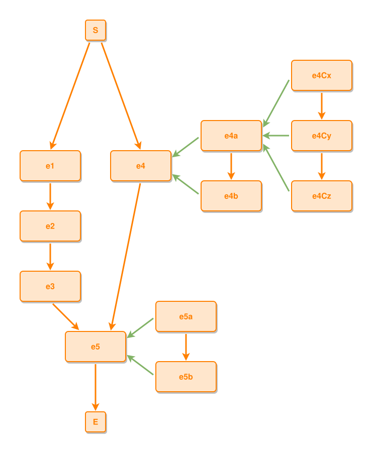

A multi-level composition: a main chain, composite events with their own
internal leads-to chains, and a join into a final composite. The global
no-overlap rule below applies to every case in this document (it checks each
event against ALL nodes, aux included; thing/concept-only gaps are asserted
locally where those kinds exist).

```ipmdev-layout-rule
@scope parent
each type=event has min-gap-to-others>=10
```

### disconnected graphs combine branches, containment and a long label

Combines `not connected many events`, `uneven sibling branches keep their
vertical lanes`, `event contains connected sub-events and sub-sub-events` and
`long event widens and stays centered` from `layout-alg.md` in one input:
three disconnected components placed left to right, each keeping its own
S/E spine, while all the per-component behaviours hold simultaneously.

```ipmt
e1-start ::e --> e2-leftA ::e
e1-start --> e3-midB ::e
e1-start --> e4-rightA ::e
e2-leftA --> e5-leftB ::e --> e6-leftC ::e
e4-rightA --> e7-rightB ::e
e3-midB --> A deliberately very long event label that wraps onto many many lines so that the aspect ratio width rule grows this event to two hundred and forty pixels wide while every branch lane stays vertical and centered wide::a ::e

y1 ::e --> y2 ::e
y1 <--::P-- y1a ::e, y1b ::e
y1a --> y1b
y1b <--::P-- y1b1 ::e

z1 ::e --> z2 ::e --> z3 ::e
```
<!-- ipm-svg id=110 hash=c76797f8 -->
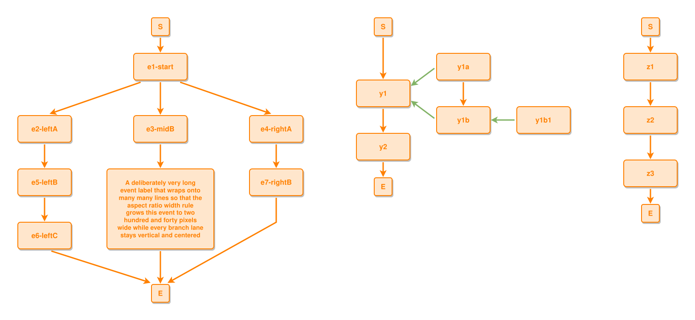

Layout rules:
- Component 1: 'e1-start' forks into three branches of different lengths (left: 3
  events, middle: the one widened event, right: 2). Every branch keeps its
  vertical lane; the widened event grows to 240px **and stays centered on the
  spine** (centering is by the column line, not the left edge).
- Branch rhythm is **per lane**: each event sits one standard gap below its own
  predecessor — the tall widened event in the middle branch must not inflate
  the left branch's e5-leftB→e6-leftC gap (fork siblings still share their row).
- Component 2: the y-spine stays vertical; sub-events nest one column right,
  the sub-sub-event one column further.
- Component 3: a plain chain on its own vertical line.

```ipmdev-layout-rule
@scope local
each type=event text-len>=200 has width>=240
each type=event text-len<200 has width=120
all #e1-start,#e3-midB,#wide have same center-x
all #e2-leftA,#e5-leftB,#e6-leftC have same center-x
all #e7-rightB,#e4-rightA have same center-x
all #e2-leftA,#e3-midB,#e4-rightA have same y
all #y1,#y2 have same center-x
all #y1a,#y1b have same center-x
#y1a is right-of #y1 with gap=60
#y1b1 is right-of #y1b with gap=60
all #z1,#z2,#z3 have same center-x
#e5-leftB is below #e2-leftA with gap=60
#e6-leftC is below #e5-leftB with gap=60
```

## Wide things and concepts

The aspect-ratio width rule of `layout-alg.md` ("long event widens and stays
centered") applies to **all node kinds**, not only events.

### long thing widens and stays centered

```ipmt
tShort --> A deliberately very long label that wraps onto many many lines so that the aspect ratio width rule grows the width of this node to two hundred and forty pixels while the column stays centered on one line wideT::a ::t
```
<!-- ipm-svg id=120 hash=75d03b5e -->
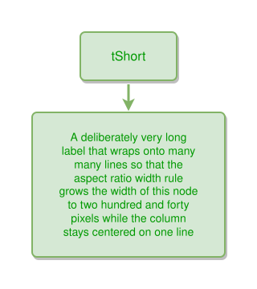

The part-of column keeps one centre line: the short part sits directly above the
widened whole, both on the same center-x.

```ipmdev-layout-rule
@scope local
each type=thing text-len>=190 has width>=240
each type=thing text-len<190 has width=120
all #tShort,#wideT have same center-x
#tShort is above #wideT with gap=40
```

### long concept widens and stays centered

```ipmt
cShort ::c --> A deliberately very long label that wraps onto many many lines so that the aspect ratio width rule grows the width of this node to two hundred and forty pixels while the column stays centered on one line wideC::a ::c
```
<!-- ipm-svg id=150 hash=040f0460 -->
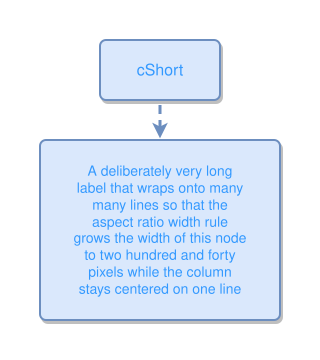

```ipmdev-layout-rule
@scope local
each type=concept text-len>=190 has width>=240
each type=concept text-len<190 has width=120
all #cShort,#wideC have same center-x
#cShort is above #wideC with gap=40
```

### diamond branches stay compact with outer concepts

```ipmt
e1-hub ::e --> L ::e
e1-hub --> R ::e
L --> e2-sink ::e
R --> e2-sink
L --> cL1 ::c
L --> cL2 ::c
R --> cR1 ::c
R --> cR2 ::c
```
<!-- ipm-svg id=15i hash=6e68f64c -->
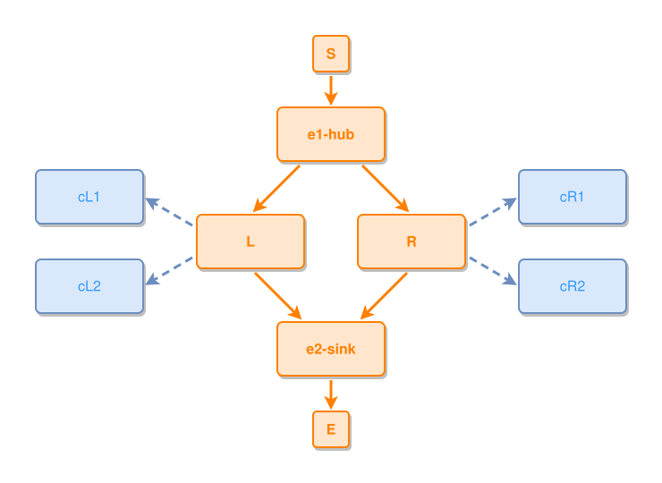

Each branch of the diamond expresses two concepts. Off-spine events get ALL
their aux forced to the outer side once positions exist — and the branch
spacing reserves for that final assignment, not for the first position-less
balanced split (which used to leave two empty columns between the branches):
the branches sit one standard gap apart with the concepts outside them.

```ipmdev-layout-rule
@scope local
#R is right-of #L with gap=60
all #L,#R have same y
#cL1 is left-of #L with gap=60
#cR1 is right-of #R with gap=60
#L is below #e1-hub with gap=60
#e2-sink is below #L with gap=60
```

The fan edges are BALANCED: e1-hub→L and L→e2-sink span the same vertical gap
(a side stack centered on L may rise beside the previous row in its own
empty column — it no longer pushes L's row down, which made the incoming
fork edges nearly twice as long as the outgoing ones).

### nested composite's concept takes the left flank

```ipmt
e1a ::e --::P--> e1 ::e
e1a1 ::e --::P--> e1a
e1a --> cX ::c
```
<!-- ipm-svg id=15r hash=e3f00c43 -->
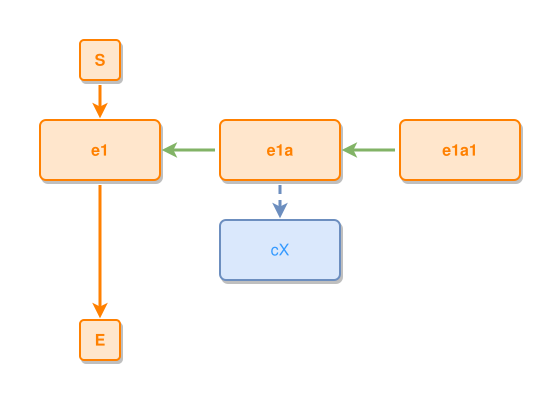

'e1a' is e1's child AND owns its own sub-event. Its sub-event column
owns the right side (v7P3: part-of indents right) and its LEFT row hosts
the parent's part-of corridor (v7P6: reserved) — so its concept DROPS
BELOW, centred on its owner (v7P4): the shortest edge, both
corridors clear, and E still caps the timeline below it (v7P3). One
grammar.

```ipmdev-layout-rule
@scope local
all #e1,#e1a,#e1a1 have same y
all #cX,#e1a have same center-x
#cX is below #e1a with gap=40
#e1a1 is right-of #e1a with gap=60
node #cX does not straddle edge #e1a1,#e1a
node #cX does not straddle edge #e1a,#e1
#E is below #cX with gap=40
```

### shared things keep their band and tie the second event

Two things ('tB', 't1-shared') are each part-of BOTH events, so both center
vertically between their anchors — but they must not center onto the same
point: a shared node takes the nearest clear position around the anchors'
midpoint — when its column is fully packed (here: tA, tB and 't1-shared' all
share it after row compaction), the loser takes the nearest clear slot further
down the same column. A shared **fan-in child** (here 'cX', expressed by both
'tA' and 'tB') is positioned by its own fan-in logic, not dragged along
when one of its parents re-centers. Reduced from a corpus example where
'tB'/'t1-shared' landed on one point and the dragged children overlapped.

```ipmt
tA ::t --> cX ::c
tB ::t --> cX
tB --> cY ::c
e1 ::e --> e2 ::e
e2 --> cZ ::c
tA --> e1
tB --> e1
tB --> e2
t1-shared ::t --> e1
t1-shared --> e2
```
<!-- ipm-svg id=160 hash=0ee53695 -->
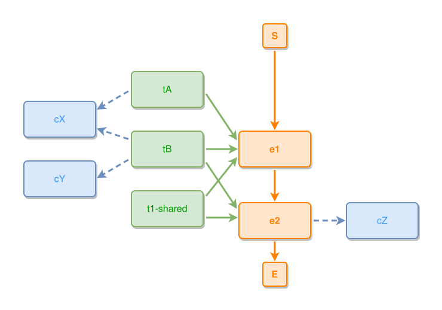

Every shared node here follows anchor-and-tie (v7P1/P7: nothing
hovers centred between its anchors; part-of never repositions anything
against the flow): 'tB' and 't1-shared' keep e1's LEFT band with 'tA' —
one centre-line stack, affinity-ordered (tA and tB cluster: they share
'cX'; 't1-shared' follows) with the band's middle on e1's centre — and
their e2 connectors DRAW as ties. 'cX', the shared fan-in concept
of the adjacent pair, BRACKETS it (one step outward, centred on the pair's
midpoint, v7P4/P7); tB's exclusive 'cY' takes the down-and-outward
step. E caps the timeline below everything.

```ipmdev-layout-rule
@scope local
each type=thing has min-gap-to-others>=10
each type=concept has min-gap-to-others>=10
all #tA,#tB,#t1-shared have same center-x
#tA is left-of #e1 with gap=60
#tB is below #tA with gap=40
#t1-shared is below #tB with gap=40
#e1 is vertically-centered-between #tA,#t1-shared
#cX is left-of #tA with gap=60
#cX is vertically-centered-between #tA,#tB
edge #tB,#e2 has visibility=visible
edge #t1-shared,#e2 has visibility=visible
edge #tA,#cX does not cross edge #tB,#cY
```

### wide thing in a graph keeps clearances

A widened node must not push the layout into overlaps: column spacing follows
the widest node, so a 240px-wide thing beside the spine still keeps every gap —
width AND height are respected by the neighbours, and no edge cuts through it.

```ipmt
A deliberately very long label that wraps onto many many lines so that the aspect ratio width rule grows the width of this node to two hundred and forty pixels while the column stays centered on one line wideH::a ::t --> e1 ::e
tB ::t --> e1
e1 --> e2 ::e
e1 --> cX ::c
```
<!-- ipm-svg id=170 hash=917b76f5 -->
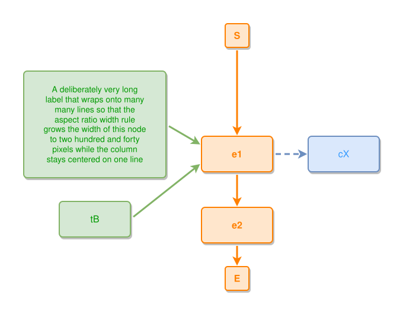

The wide node initially widens every column step ("column spacing follows the
widest node" keeps placement overlap-free), but bands then **compact back
toward the spine**: each event-side band slides in until it is one standard
gap from its anchor (or whatever it meets first) — 'cX' ends
one normal gap from the event instead of a wide-column away, while the left
band (including 'tB', centred on its wide member) already sits flush against it.

```ipmdev-layout-rule
@scope local
each type=thing text-len>=200 has width>=240
all #e1,#e2,#S,#E have same center-x
all #wideH,#tB have same center-x
node #wideH does not straddle edge #S,#e1
node #wideH does not straddle edge #e1,#e2
#tB is below #wideH with gap=40
all #e1,#cX have same y
#e1 is left-of #cX with gap=60
```

### a late side-branch merge keeps its join edge short

A main chain `e1→e8→e3→e4` on the left — `e8` a composite whose sub-event
`e2` in turn holds the sub-chain `e5→e6→e7` — and a late side branch
`e9→e10` merging in from the right. The
leads-to flow connects WHOLE events (`e1→e8→e3`, never into a sub-part) per
IPMV2.9; the inner `e5→e6→e7` is a same-container sub-event chain: `multiple events lead
to one event (join)` over a wide multi-branch skeleton, with `expresses`
members filling the columns between branches. The join `e11` has two
predecessors — the deep left-chain event `e4` and the side branch's `e10`,
which sits a couple of columns over from the join's own lane. A member box
lands in the corridor between `e10` and the join, hugging `e10`'s outgoing
port.

The leads-to corridor-clearance pass would relocate the join downward to slip
the `e10 → e11` edge below that box — but a blocker hugging the port levers a
modest box depth into a multi-row push (the required member top scales by
span/den; here it shoves the join from y954 to y3644 — ~2700px — stretching
the merge edge into a ~3150px near-vertical skew). Past `MaxCorridorLeverage`
(2×) the join stays in rhythm and the edge is routed instead.

The `e9 → e10 → e11` side branch gets its OWN column. Two mechanisms hold it:

- **Flow-corridor reservation** (v7P6, `gl:pkg/layout7/groups.go`): the
  vertical strip below each event is reserved for its downward leads-to flow.
  A thing/concept anchored to a DIFFERENT event that lands in that strip is
  pushed out to a fresh column (widening the diagram) — the event skeleton has
  priority, the aux yields. Here `tD` and `tF` (satellites of `e5`/`e7`) were
  packed into a column the merge edge would cross; they are shifted right so the
  merge lane stays clear.
- **Join centring** (v7P9, `gl:pkg/layout7/route.go`): the join `e11` centres
  between its predecessors `e4` and `e10` rather than being levered down, so the
  `e10 → e11` merge draws as a single clean diagonal into the join's top — a
  SHORT edge (well under `max-len`), not the long near-vertical skew the
  corridor-leverage path would have forced.

The displaced `tD` and `tF` now reach `e5`/`e7` from the right, where their
part-of edges would cross the `e10 → e11` merge. They do not: the router STUBS
a thing→event part-of edge that crosses the reserved event flow (v7P9's
no-acceptable-route rule; stub geometry in `gl:pkg/layout/edge_stubs.go`), so
the merge keeps a clean lane — a thing edge yields
to the event skeleton, never the reverse, and the loose relation stays
discoverable as a numbered stub. The same rule stubs `tB → e2`, a long part-of
edge that crossed the `e5 → e6` event edge.

```ipmt
e1 ::e
  --> e8 ::e
  --> e3 ::e
  --> e4 ::e

e5 ::e
  --> e6 ::e
  --> e7 ::e

e5 ::e,
  e6 ::e,
  e7 ::e
  --::P--> e2 ::e

e2
  --::P--> e8 ::e

e1 <-- tA --> cA ::c
e2 <-- tB --> tC
e5 <-- tD --> tB, tE
e7 <-- tF --> tG
e3 <-- tH --> tI
e4 ::e <-- tJ --> tK

e9 ::e
  --> e10 ::e

e9 <-- tL --> tC
e10 <-- tM --> tN

e4, e10
  --> e11 ::e <-- tM, tB

e11
  --> e12 ::e <-- tH
```
<!-- ipm-svg id=180 hash=92671cd3 -->
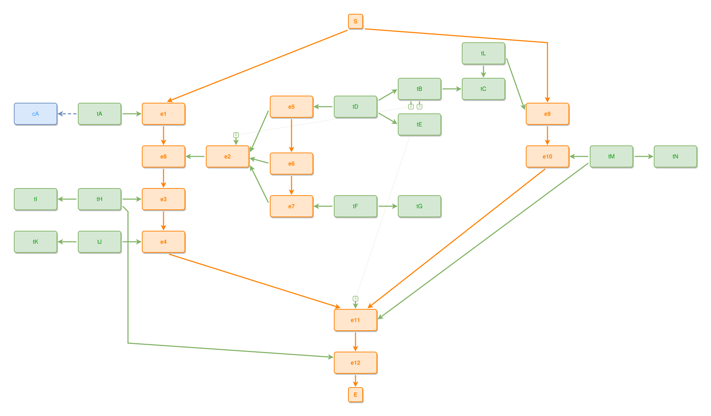

```ipmdev-layout-rule
@scope local
edge #e10,#e11 has max-len=1200
edge #tD,#e5 has visibility=visible
edge #tD,#e5 has max-bends=0
edge #tF,#e7 has visibility=visible
edge #tF,#e7 has max-bends=0
edge #tB,#e2 has visibility=stubbed
edge #tH,#e12 has visibility=visible
edge #tH,#e12 has max-bends=2
edge #tH,#e12 has source-side=right
edge #tH,#e12 has target-side=left
```

### a shared thing anchors to its first event and ties the rest

A thing is part-of three events that share NO event structure of their own
(`tA → e1/e2/e3` — one tool emitting several independent outputs), each
event expressing one concept. Under
the ANCHOR-AND-TIE membership rule (v7P1) the shared thing does
NOT fuse the three events into one process: `tA` anchors to its FIRST
declared user (`e1`), and `tA → e2` / `tA → e3` become CROSS-COMPONENT ties.
The tied components take flanks by the v7P2 grid:
e3's timeline on the row's left flank, e2's on the second row directly
under `tA` — so `tA → e2` draws as ONE VERTICAL line (the slid straight
passes beside e2's own S boundary; user: "tA to e2 can be fully
vertical"), `tA → e1` is the plain band line, and `tA → e3` rides a
2-bend lane under the row, in full.

```ipmt
tA --> e1 ::e
tA --> e2 ::e
tA --> e3 ::e
e1 --> cA ::c
e2 --> cB ::c
e3 --> cC ::c
```
<!-- ipm-svg id=190 hash=0c9f1b79 -->
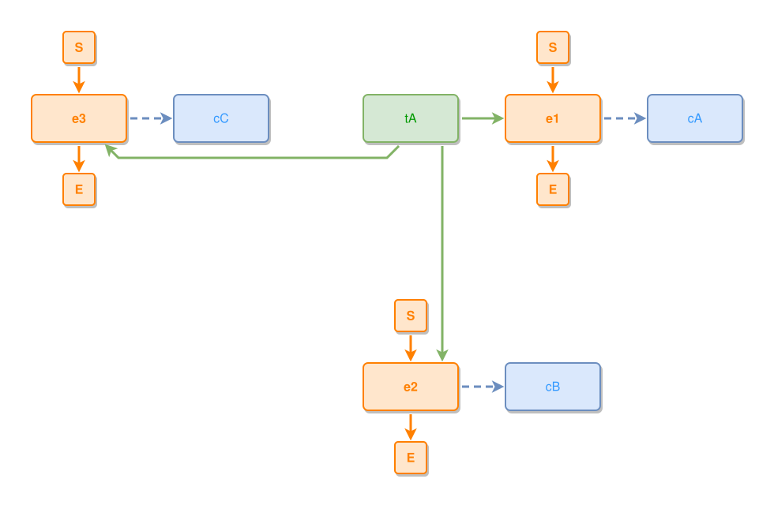

```ipmdev-layout-rule
@scope local
all #tA,#e1,#cA have same y
#tA is left-of #e1 with gap=60
#cA is right-of #e1 with gap=60
all #tA,#e2 have same center-x
#e2 is below #tA with gap=280
edge #tA,#e1 has visibility=visible
edge #tA,#e2 has visibility=visible
edge #tA,#e2 has max-bends=0
edge #tA,#e2 is vertical
edge #tA,#e3 has visibility=visible
edge #tA,#e3 has max-bends=2
```

### the chain-spanning thing takes the flank opposite its band rivals

Three things share one three-event chain with OVERLAPPING windows: `tP` is
part-of EVERY chain event, `tA` of the first two, `tB` of the last two
(a person wearing, swapping and wearing again — the shirts local to their
steps). The canon (things left) would stack `tP` and `tA` in e1's one left
band — and two band-mates that BOTH tie down the spine cannot both draw
clean from one flank: whichever sits higher must fan past the other's edges
(tP→e2 crossed tA→e1; tP→e3 laned around the whole left column). So the
band election SPLITS them: the widest-spanning root — the thing part-of
MORE chain events than any band rival — takes the RIGHT flank when it is
free (no concepts, no sub-event columns on its events), and the step-local
things keep the canon left band (user: "Patrick should be on opposite side
then other things"). Two rivals of EQUAL span keep the canon — the split
needs a unique protagonist ('shared things keep their band' above stays as
it is).

Ports (v7P9 "use one side for the same edge type and direction", the
band reading): `tP` sits ON `e1`'s row and meets it on the HORIZONTAL
through its facing side; its same-rel ties to the other chain events fan
from that SAME side and land on the events' facing sides — not off `tP`'s
bottom onto the events' top corners (user: "if Patrick is connected via
his left side at the top-most connection, the other two should prefer the
left side too"). That mirrors what `tA`/`tB` do from the left band by
construction. Each join holds inside the 150° cap (border gaps) and on a
clean trial straight, and a side takes at most two such arrivals; a
steeper or third tie keeps its vertical exit while the facing ties stay
put. Nodes with NO aligned band edge keep the vertical unification
('thing connected to two layers' still leaves the top).

```ipmt
e1 ::e
  --> e2 ::e
  --> e3 ::e

tP --> e1, e2, e3
tA --> e1, e2
tB --> e2, e3
```
<!-- ipm-svg id=19i hash=a6942e84 -->
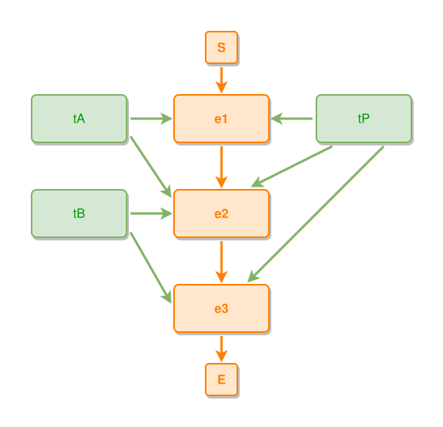

```ipmdev-layout-rule
@scope local
all #e1,#e2,#e3 have same center-x
#tA is left-of #e1 with gap=60
#tB is left-of #e2 with gap=60
#tP is right-of #e1 with gap=60
edge #tP,#e1 has visibility=visible
edge #tP,#e2 has visibility=visible
edge #tP,#e3 has visibility=visible
edge #tA,#e1 has visibility=visible
edge #tA,#e2 has visibility=visible
edge #tB,#e2 has visibility=visible
edge #tB,#e3 has visibility=visible
edge #tP,#e2 does not cross edge #tA,#e1
edge #tP,#e3 does not cross edge #tA,#e1
edge #tP,#e3 does not cross edge #tB,#e2
each edge has max-bends=0
edge #tP,#e1 has source-side=left
edge #tP,#e2 has source-side=left
edge #tP,#e3 has source-side=left
edge #tP,#e1 has target-side=right
edge #tP,#e2 has target-side=right
edge #tP,#e3 has target-side=right
edge #tA,#e1 has source-side=right
edge #tA,#e2 has source-side=right
edge #tB,#e2 has source-side=right
edge #tB,#e3 has source-side=right
edge #tA,#e2 has target-side=left
edge #tB,#e3 has target-side=left
edge #tP,#e3 does not cross edge #tP,#e2
edge #tP,#e3 does not cross edge #e1,#e2
edge #tP,#e3 does not cross edge #e2,#e3
```

### a part-of thing-fan centres on its event and the sole concept drops below

Combines `multiple things part-of event`, the shared fan-in concept (a concept
expressed by two of the fan's things) and a sole expressed concept on one
OFF-SPINE event: `e1a` (part-of `e1`) receives a part-of
fan of four things — two of them more related than the rest, marked by the
shared `cY` concept they express — and itself expresses one `cX`
concept.

The fan and the concept are TWO DIFFERENT GROUPS. The four incoming things stay
one symmetric side band: same column, even `ThingVGap` gaps, band middle exactly
on `e1a`'s centre — the shared `cY` bracketing the top pair is what shows
the sub-grouping, not ragged spacing. (Two bugs used to break this: a rejected
group-re-gap trial leaked its global re-gap shove into the band's
non-group members — 40/80/40 gaps — and the sole concept stacked at the band's
bottom as a fifth sibling, dragging the union centring 50px off the event.) The
sole expressed `cX` concept instead drops BELOW its event: an off-spine,
non-composite event whose forced side
is dominated by a ≥2-thing part-of fan sends its single sole-parent expressed
concept to the below channel, where it hangs under the event with a short
vertical expresses edge. Composite owners route the concept by their own rule
(see "nested composite's concept takes the left flank"), and on-spine events
keep the balanced left/right split — this rule only fires where the fan and the
concept would otherwise fight for one column.

```ipmt
e1 ::e
e1a ::e --::P--> e1
e1a --> cX ::c

w1 ::t, w2 ::t --> e1a
w1, w2 --> cY ::c

d1 ::t, d2 ::t --> e1a
```
<!-- ipm-svg id=1a0 hash=d788ddeb -->
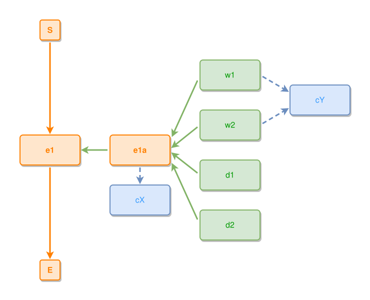

```ipmdev-layout-rule
@scope local
all #w1,#w2,#d1,#d2 have same center-x
#w2 is below #w1 with gap=40
#d1 is below #w2 with gap=40
#d2 is below #d1 with gap=40
#e1a is vertically-centered-between #w1,#d2
#cY is right-of #w1 with gap=60
#cY is vertically-centered-between #w1,#w2
all #e1a,#cX have same center-x
#cX is below #e1a with gap=40
```

## v7 acceptance targets

Acceptance suite for the v7 engine (`gl:pkg/layout7`): each case pins a
covers-example of the principles
(`gl:docs/dev/layout-gen/layout-principles.md`). They all pass and
gate every engine change. Rule gaps use the proven constants the spec
carries over (v7P8): 60 between columns/rows, 40 inside an aux stack. The
engine's map, status and the old-corpus reconciliation scoreboard are in
`gl:docs/dev/layout-gen/layout7-engine.md`.

### rules

```ipmdev-layout-rule
@scope parent
each type=event has min-gap-to-others>=10
```

### a middle-branch thing widens only its own gap

v7P6/P8: `A` is part-of the MIDDLE branch of a three-way fork-join, so
both its natural side spots are flow corridors. The fan grows PER GAP:
only the x–m gap widens to host `A` on the branch row beside its
anchor; the m–z gap keeps the fan's own breathe gap (80 for
a three-member fan — "wide forks breathe"). The corridor
never yields — `m` stays on the fork parent's axis — and the join
stays on that same spine axis (under `s`/`m`), not shifted to its
predecessors' barycentre. Every flow edge stays
straight (the skeleton never yields, space does — exactly the space
asked for, on the side that asked).

```ipmt
s ::e --> x ::e
s --> m ::e
s --> z ::e
x --> j ::e
m --> j
z --> j
A ::t --> m
```
<!-- ipm-svg id=1b0 hash=bdd04099 -->
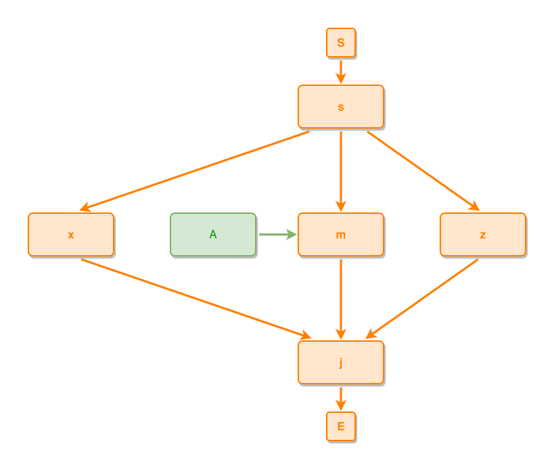

```ipmdev-layout-rule
@scope local
each type=thing has min-gap-to-others>=10
all #x,#m,#z,#A have same y
#A is left-of #m with gap=60
#x is left-of #A with gap=80
#z is right-of #m with gap=80
all #s,#m have same center-x
edge #s,#x has max-bends=0
edge #s,#m has max-bends=0
edge #s,#z has max-bends=0
edge #x,#j has max-bends=0
edge #m,#j has max-bends=0
edge #z,#j has max-bends=0
node #A does not straddle edge #s,#x
node #A does not straddle edge #x,#j
node #A does not straddle edge #s,#m
node #A does not straddle edge #m,#j
```

### aux sibling affinity clusters the pair and brackets the shared concept

v7P4: `A` anchors on e1's row and fully OWNS its hierarchy — `B1, B2, B3`
and their shared `cS` touch no other event, so the subtree renders as
LAYERED GENERATIONS, exactly as a separate pure component would (the
zoom canvas's foldable unit — a click on `A` folds it).
The wholes share one generation row below `A`, AFFINITY still orders the
row — `B1` and `B3` share `cS`, so they cluster adjacent with the loose
`B2` outside — and `cS` centres UNDER the pair, bracketing it into one
join. The tree shifts left as one unit so nothing parks in e1's flow
corridor (v7P6); `A` keeps its band spot. (A flat fan with no shared
concept still clusters when a sibling tie declares the affinity — see the
sibling-tie case below.)

```ipmt
A --> e1 ::e
A --> B1, B2, B3
B1, B3 --> cS ::c
```
<!-- ipm-svg id=1c0 hash=eca65b15 -->
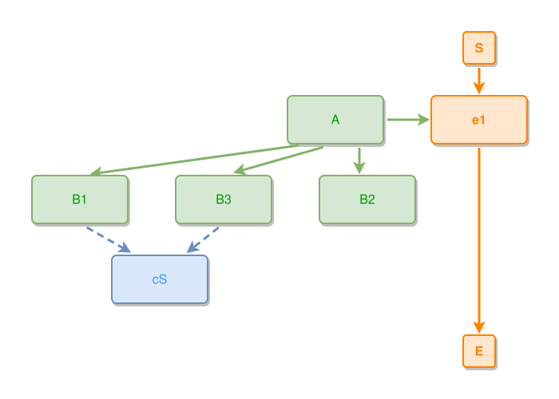

```ipmdev-layout-rule
@scope local
each type=thing has min-gap-to-others>=10
each type=concept has min-gap-to-others>=10
#A is left-of #e1 with gap=60
all #A,#e1 have same y
all #B1,#B3,#B2 have same y
#B1 is left-of #B3 with gap=60
#B3 is left-of #B2 with gap=60
#B2 is below #A with gap=40
#cS is below #B3 with gap=40
#cS is horizontally-centered-between #B1,#B3
node #B2 does not straddle edge #e1,#E
```

### a sibling tie orders the stack adjacent

v7P5: the same-anchor sibling tie `B1 --- B3` re-places nobody but ORDERS
the generation row (`A` fully owns the flat fan, so it renders as one row
below `A` — the foldable unit): the tied pair clusters
adjacent exactly as a shared further connection would (a tie is a declared
affinity), the loose `B2` steps outside, and the tie draws as a short
horizontal between the neighbours.

```ipmt
A --> e1 ::e
A --> B1, B2, B3
B1 --- B3
```
<!-- ipm-svg id=1d0 hash=2146b759 -->
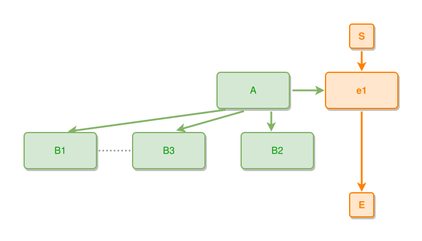

```ipmdev-layout-rule
@scope local
each type=thing has min-gap-to-others>=10
#A is left-of #e1 with gap=60
all #A,#e1 have same y
all #B1,#B3,#B2 have same y
#B1 is left-of #B3 with gap=60
#B3 is left-of #B2 with gap=60
#B2 is below #A with gap=40
edge #B1,#B3 has visibility=visible
edge #B1,#B3 is horizontal
```

### a deep shared thing beats the first-declared anchor

v7P7: `T` is part-of both `W1` (depth 1, directly on e1) and `W2` (depth 2,
part of `V` which is part-of e2). The DEEPEST user wins placement: `T`
anchors to `W2` and stacks above it as an incoming part, keeping the
containment chain one connected shape on e2's row; `T → W1` draws as a tie.
The e1–e2 row gap grows to host
the tower — space yields, the skeleton does not (v7P6/P8).

```ipmt
e1 ::e --> e2 ::e
W1 ::t --> e1
V ::t --> e2
W2 ::t --> V
T ::t --> W1
T --> W2
```
<!-- ipm-svg id=1e0 hash=52772761 -->
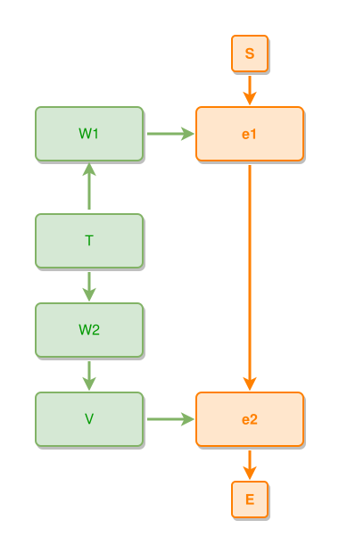

```ipmdev-layout-rule
@scope local
each type=thing has min-gap-to-others>=10
#W1 is left-of #e1 with gap=60
all #W1,#e1 have same y
#V is left-of #e2 with gap=60
all #V,#e2 have same y
all #V,#W2,#T have same center-x
#W2 is above #V with gap=40
#T is above #W2 with gap=40
edge #T,#W1 has visibility=visible
```

### a deep shared concept beats the first-usage anchor

v7P7, concept version: `cX` is expressed by `e1` (an event — depth 0) and by
`V` (a thing on e2 — depth 1). The deepest user wins — `cX` anchors to `V`,
keeping V's band column — and v7P4's PULL slides it up that column to the
closest approach with `e1`: cX lands on e1's row, adjacent to BOTH its
users, `e1 → cX` a short drawn tie.

```ipmt
e1 ::e --> e2 ::e
e1 --> cX ::c
V ::t --> e2
V --> cX
```
<!-- ipm-svg id=1f0 hash=472a18bf -->
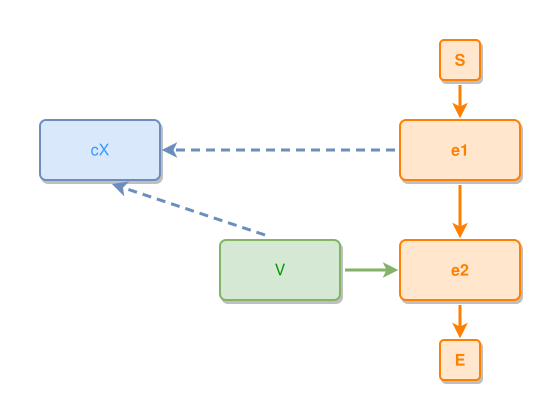

```ipmdev-layout-rule
@scope local
each edge has max-bends=0
each type=thing has min-gap-to-others>=10
each type=concept has min-gap-to-others>=10
#V is left-of #e2 with gap=60
all #V,#e2 have same y
all #cX,#e1 have same y
#cX is left-of #V with gap=60
edge #e1,#cX has visibility=visible
edge #V,#cX has visibility=visible
```

### a deep concept fan survives a foreign band's column

v7P4: `r2`'s concept subtree — the chain `kA → kB → kC` with a leaf fan
at every link — is a hierarchy `kA` fully OWNS (no member touches
another event), so it renders as LAYERED GENERATIONS below `kA`, exactly
as a separate pure component would (the zoom canvas's foldable
unit — a click on `kA` folds it): each node's children share
one generation row, parents centre over their children. `r1`'s three
band concepts land in `kA`'s column; the no-overlap floor resolves the
collision by stepping the colliding member together with its placement
DESCENDANTS — the whole tree steps down as one unit below `cS` and every
internal offset survives (per-node stepping used to shear single members
out of the group).

```ipmt
e1-top ::e
r1 ::e --::P--> e1-top
r2 ::e --::P--> e1-top
r1 --> r2
r1 --> cM ::c
r1 --> cR ::c
r1 --> cS ::c
r2 --> kA ::c
kA --> kB ::c
kA --> kA1 ::c
kA --> kA2 ::c
kB --> kC ::c
kB --> kB1 ::c
```
<!-- ipm-svg id=1fi hash=9fbefd0a -->
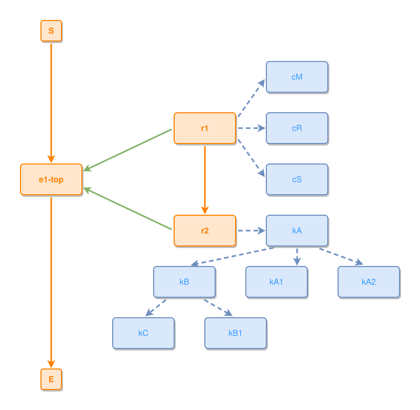

```ipmdev-layout-rule
@scope local
each edge has max-bends=0
all #kB,#kA1,#kA2 have same y
#kB is left-of #kA1 with gap=60
#kA1 is left-of #kA2 with gap=60
all #kC,#kB1 have same y
#kC is left-of #kB1 with gap=60
#kA1 is below #kA with gap=40
#kC is below #kB with gap=40
```

### cross-component arrivals keep the approach order

v7P1's full cross-link example doubles as the arrival-order guard: `C`
and `e2` both reach `e4`'s right border from the lower right. The
steeper line (`C`, the near partner) takes the LOWER slot, the shallow
one (`e2`) the upper — swapped, the two lines must cross (the final
v7P9 repair pass re-sorts every side's movable arrivals by approach
angle, trading at worst a crossing for a cheaper graze and never
introducing a box hit).

```ipmt
e1 ::e --> e2 ::e
A ::t --> e1
e3 ::e --> e4 ::e
B ::t --> e3
A --- B
e2 --::X--> e4
e1 --- e3
A, B --> cX ::c
e2, e4 --> cY ::c
C --> e2, e4
```
<!-- ipm-svg id=1fr hash=cd8e0906 -->
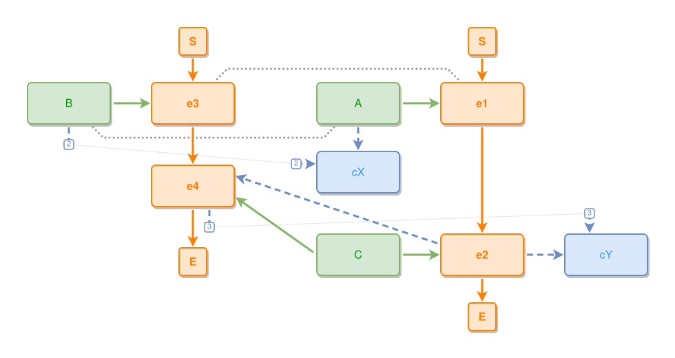

```ipmdev-layout-rule
@scope local
edge #e2,#e4 does not cross edge #C,#e4
edge #C,#e4 has target-side=right
edge #C,#e4 has target-position=0.75
edge #e2,#e4 has target-side=right
edge #e2,#e4 has target-position=0.25
edge #C,#e4 has visibility=visible
edge #e2,#e4 has visibility=visible
edge #C,#e2 has visibility=visible
```

### a flank tie crosses the fan under the kind budget

v7P9: `P` and `Q` sit on the fan's outer flanks and their tie must traverse
it. A route crossing ONE flow edge is acceptable (near-to × leads-to —
DIFFERENT kinds), and a flank bypass around the component crosses none;
spearing `m`'s box or crossing two same-kind edges is not — and then the tie,
never the flow, would be the hide victim. The tie DRAWS: the single-crossing
budget is kind-aware, so the near-to × leads-to crossing stays within it.

```ipmt
s ::e --> x ::e
s --> m ::e
s --> z ::e
P ::t --> x
Q ::t --> z
P --- Q
```
<!-- ipm-svg id=1g0 hash=cd732253 -->
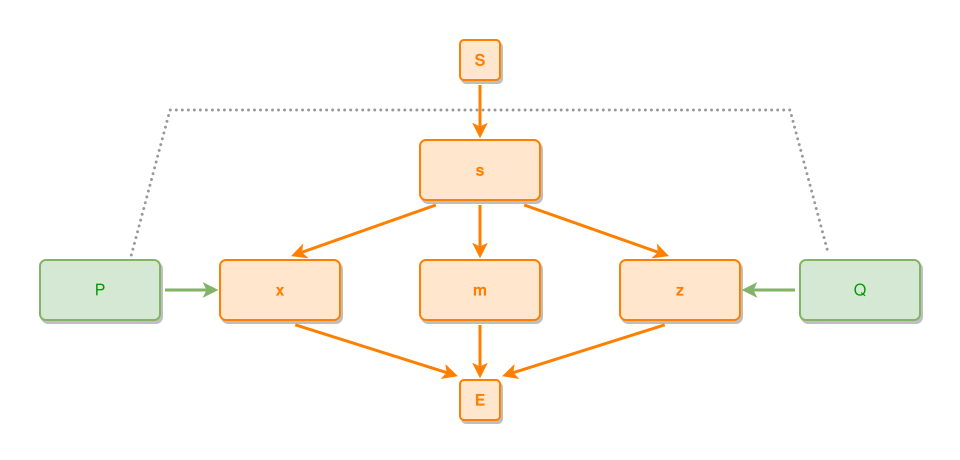

```ipmdev-layout-rule
@scope local
each type=thing has min-gap-to-others>=10
all #x,#m,#z have same y
#P is left-of #x with gap=60
all #P,#x have same y
#Q is right-of #z with gap=60
all #Q,#z have same y
edge #P,#Q has visibility=visible
node #m does not straddle edge #P,#Q
node #x does not straddle edge #P,#Q
node #z does not straddle edge #P,#Q
```

(The route may cross ONE flow edge — near-to × leads-to are different
kinds, exactly the budget the spec's covers example allows.)

### near-to satellites wrap as the outermost layer

v7P5: `B`, `C` and `D` have no placing relation — only ties to `A`. They join
A's component as its OUTERMOST onion layer, right next to their partner: one
layer outward of `A`, stacked in declaration order with the layer centred on
`A`; other components would begin only beyond that layer. (Layer order and
stand-off are v7P8's decision — this case pins them: declaration order top to
bottom, and the near-to stand-off of 100, visibly MORE than an attached
column's 60 because near-to is adjacency, not attachment.)

```ipmt
e1 ::e --> e2 ::e
A ::t --> e1
A --- B ::t
A --- C ::t
A --- D ::t
```
<!-- ipm-svg id=1h0 hash=27481fb6 -->
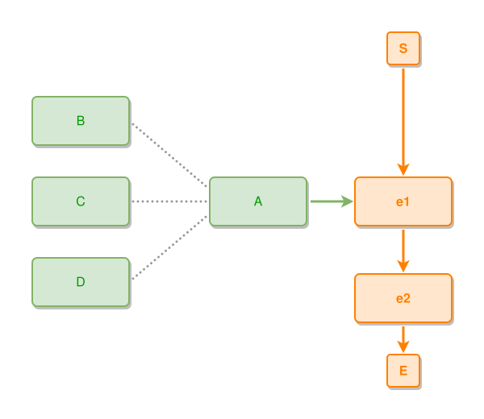

```ipmdev-layout-rule
@scope local
each type=thing has min-gap-to-others>=10
#A is left-of #e1 with gap=60
all #A,#e1 have same y
all #B,#C,#D have same center-x
#B is left-of #A with gap=100
#C is below #B with gap=40
#D is below #C with gap=40
#A is vertically-centered-between #B,#D
edge #A,#B has visibility=visible
edge #A,#C has visibility=visible
edge #A,#D has visibility=visible
```

### a satellite wraps a pure grid from the outer flank

v7P5 + v7P9: two exclusive chains (`tA`'s and `tB`'s) render as a pure
layered grid and JOIN at `cJ`. `cP` and `cQ` are tie-only
satellites of mid-grid members — the flank test measures against the GRID's
midline, not the frame node, so each wraps from its partner's OUTER flank
(a satellite sent INTO the grid crosses the descent corridors: `cP`
placed between the columns had its tie cross an expresses edge). And
the expresses edges into the join leave the source's BOTTOM as clean
slid diagonals — never a zero-leg side dogleg hugging the
corner (v7P9's minimum dogleg leg applies to structurals too).

```ipmt
tA --> cA ::c --> cB ::c --> cL ::c
cL --> cJ ::c
cL --- cP ::c

tB --> cD ::c --> cR ::c --> cJ ::c
cR --- cQ ::c
```
<!-- ipm-svg id=1h9 hash=7c465068 -->
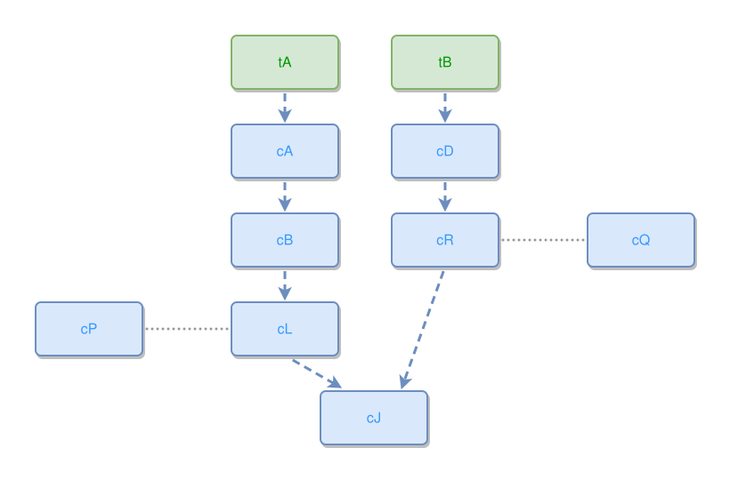

```ipmdev-layout-rule
@scope local
#cP is left-of #cL with gap=100
all #cP,#cL have same y
#cQ is right-of #cR with gap=100
all #cQ,#cR have same y
edge #cL,#cJ has source-side=bottom
edge #cR,#cJ has source-side=bottom
edge #cR,#cJ has target-side=top
edge #cL,#cJ has max-bends=0
edge #cR,#cJ has max-bends=0
edge #cL,#cP does not cross edge #cR,#cJ
edge #cL,#cP has visibility=visible
edge #cR,#cQ has visibility=visible
```

### a shared child concept centres between its column parents

v7P3 reaches into the aux lattice: `cZ` is expressed by BOTH `cX`
and `cY`, and the anchor election picks `cX` only by declaration
order (v7P7) — the losing edge demotes to a tie. The child must not read
as belonging to the election winner: when the anchor's user and the tie
partner are peers in one stack column and the child hangs one layer out,
it reads as their JOIN and centres between them — equal gaps, mirror
diagonals — instead of sliding to closest approach with the tie partner
(should `cZ` be symmetrical between `cX` and `cY`? — yes;
which parent won the election is a coin flip symmetry must not
depend on).

```ipmt
e1 ::e
tA --> e1
tB --> e1
tA --> cX ::c
tB --> cY ::c
cX --> cZ ::c
cY --> cZ ::c
```
<!-- ipm-svg id=1hd hash=0a9e7149 -->
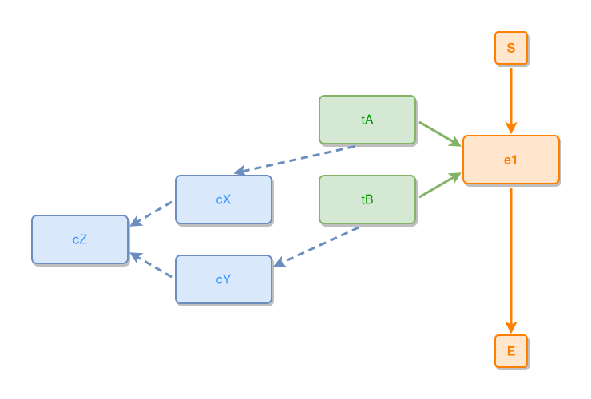

```ipmdev-layout-rule
@scope local
all #cX,#cY have same center-x
#cZ is vertically-centered-between #cX,#cY
#cZ is left-of #cX with gap=60
edge #cX,#cZ has max-bends=0
edge #cY,#cZ has max-bends=0
edge #cX,#cZ has visibility=visible
edge #cY,#cZ has visibility=visible
```

### a sole band member follows the dominant travel axis

v7P9 + v7P8 §4: the band's horizontal side-port rule exists to spread
a FAN over the event's border — an event with a SOLE band member has
nothing to crowd. `e1b`'s only concept TUCKS below it in the wedge
beside the flow corridor (its beside spot is taken by the inner
sub-event band): the e1b→e1c row gap GROWS one step so the
e1c→e1 part-of diagonal passes a full visible gap under the
wedge — a stranded leaf posts a row-gap demand and the layout
re-solves once (add vertical space, place the node
closer — the sole concept sits closer and no edges
cross). The edge follows the dominant axis: out
the source's BOTTOM, onto the target's TOP, one short clean diagonal
crossing nothing.

```ipmt
e1 ::e
e1a ::e
  --> e1b ::e
  --> e1c ::e
e1a --::P--> e1
e1b --::P--> e1
e1c --::P--> e1
e1b1 ::e --::P--> e1b
e1b2 ::e --::P--> e1b
e1b3 ::e --::P--> e1b
e1b1 --> e1b2 --> e1b3
e1b --> cX ::c
```
<!-- ipm-svg id=1hf hash=d67dc7ef -->
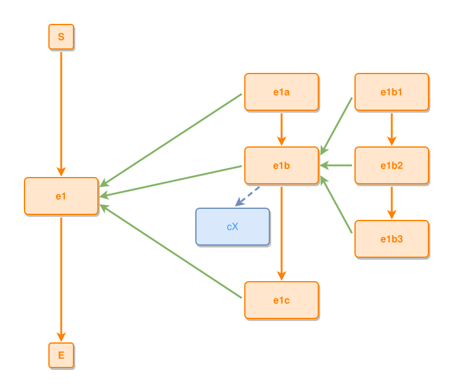

```ipmdev-layout-rule
@scope local
#cX is below #e1b with gap=40
edge #e1b,#cX has source-side=bottom
edge #e1b,#cX has target-side=top
edge #e1b,#cX has max-bends=0
edge #e1b,#cX has visibility=visible
edge #e1b,#cX does not cross edge #e1c,#e1
```

### a budgeted crossing beats a two-bend detour

v7P9: `cY` is shared by `e1a` (anchor, straight) and `e1c` —
the demoted tie from `e1c` must pass `cZ`, which blocks every
tidy shape. A SLID BEELINE clears it: one plain diagonal into the low
end of cY's facing border, paying ONE same-kind crossing (over
`e1b → cZ`) — and the free two-bend flank detour is NOT
allowed to steal the pick (a rescue never adds more than one bend).
One crossing on a direct shape reads better than bending around.

```ipmt
e1 ::e
e1 --> cX ::c

e1a ::e
  --> e1b ::e
  --> e1c ::e

e1a --::P--> e1
e1b --::P--> e1
e1c --::P--> e1

e1a --> cY ::c
e1c --> cY ::c
e1b --> cZ ::c
```
<!-- ipm-svg id=1hg hash=78c1c4b8 -->
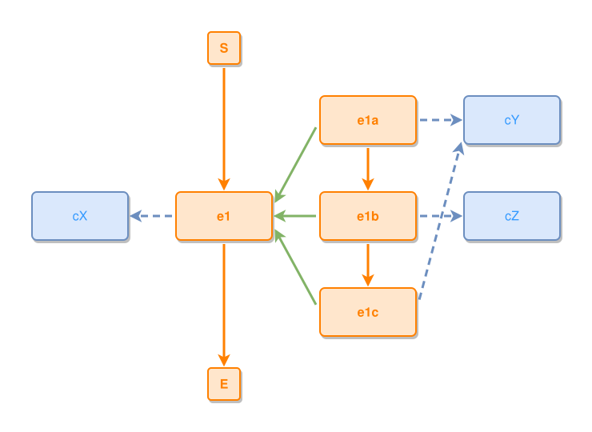

```ipmdev-layout-rule
@scope local
edge #e1a,#cY has max-bends=0
edge #e1c,#cY has max-bends=0
edge #e1c,#cY has target-side=left
edge #e1c,#cY has visibility=visible
edge #e1b,#cZ has max-bends=0
```

### a thing and its concept read as one unit

RATIFIED: v7P8's reads-as-paired guard, promoted from
checker finding to placement force. The band's down-and-outward spot
would land `cX` beside the unrelated
`tB` at column rhythm — a CROSS-KIND hug that reads as false
attachment. A thing's sole leaf concept moves UP to its owner's row
instead ("nodes sit next to what places them", v7P4): the
`tA → cX` pair reads as one horizontal unit,
clearly distinct from the `tB` subgraph. Concept-beside-concept
never fires (the satellite row and the concept column are the
legitimate concept LAYER), a concept in a RELATED column stays, and
when the owner-row spot is taken the concept slides outward to the
near-to stand-off — distance encodes relation strength.

```ipmt
tA --> cX ::c
e1 ::e
tA, tB --> e1
```
<!-- ipm-svg id=1hh hash=09f3500e -->
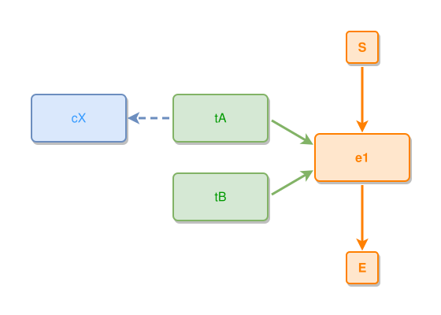

```ipmdev-layout-rule
@scope local
all #tA,#cX have same y
#cX is left-of #tA with gap=60
edge #tA,#cX has visibility=visible
edge #tA,#cX has max-bends=0
edge #tA,#cX is horizontal
```

### a bent tie's approach follows its last leg

v7P8: entries at one border keep their approach order, and for a BENT
route the approach is its LAST LEG, not the source's centre.
`tC` (demoted into tD's hierarchy) reaches
`e1` through a bend, arriving HORIZONTALLY at mid-height — sorted
by source centre it takes the lower slot and tB's diagonal
crosses it; sorted by the last bend the horizontal arrival slots
above the from-below diagonal and nothing crosses.

```ipmt
e1 ::e --> e2 ::e --> e3 ::e
tA, tB --> e1
tC --> e1
tD --> e2
tE --> e3
tB, tD --> e3
tD --> tC
tC --> tF
tD --> tG
```
<!-- ipm-svg id=1ih hash=4719e29f -->
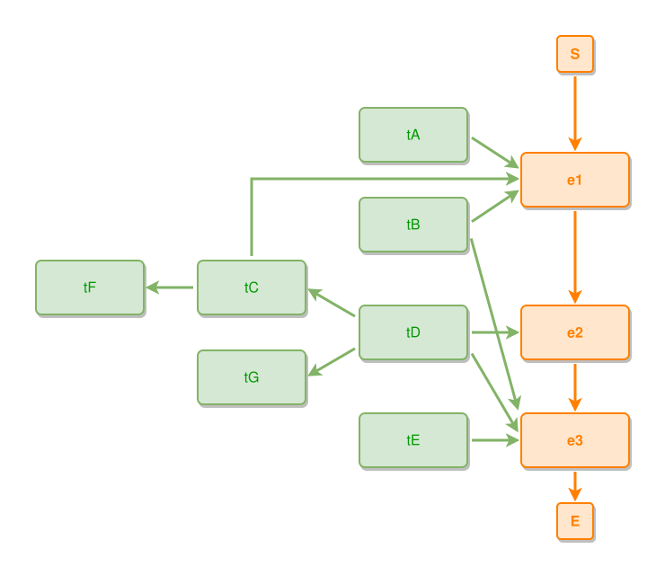

```ipmdev-layout-rule
@scope local
edge #tB,#e1 does not cross edge #tC,#e1
edge #tC,#e1 has visibility=visible
edge #tB,#e1 has max-bends=0
```

### a far join child tucks to the parents' column

v7P3/v7P4 (a whole pitch of separation "while half of the node width
would be fine"): the shared child still CENTRES
vertically between its column parents — but when it sits a full row
pitch clear of BOTH, nothing lies between them, and a full column of
horizontal separation buys nothing. The child TUCKS to half a node
width off the parents' column: the join edges steepen toward the
hierarchy's vertical read and the canvas narrows. The tight join (the
shared-child fixture above) keeps its full pitch — there the parents'
rows are close and the child needs the room.

```ipmt
e1 ::e --> e2 ::e --> e3 ::e --> e4 ::e
tA --> e1
tB --> e4
tA --> cX ::c
tB --> cY ::c
cX --> cZ ::c
cY --> cZ ::c
```
<!-- ipm-svg id=1jh hash=02705fb1 -->
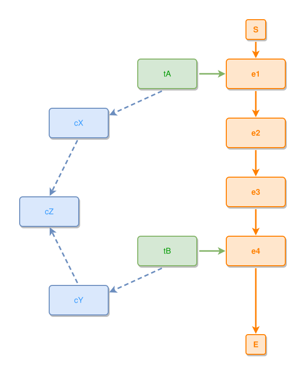

```ipmdev-layout-rule
@scope local
all #cX,#cY have same center-x
#cZ is vertically-centered-between #cX,#cY
#cZ has x=40
edge #cX,#cZ has source-side=bottom
edge #cX,#cZ has target-side=top
edge #cY,#cZ has source-side=top
edge #cY,#cZ has target-side=bottom
edge #cX,#cZ has max-bends=0
edge #cY,#cZ has max-bends=0
edge #cX,#cZ has source-position=0.5
edge #cX,#cZ has target-position=0.5
edge #cY,#cZ has source-position=0.5
edge #cY,#cZ has target-position=0.5
```

The two joins differ only in DIRECTION — `cX` reaches down to `cZ`, `cY`
reaches up — so they must be drawn the same way, and the four
`*-position` rules above are what pin that. They are not decoration:
sides and bend counts alone cannot tell the two renderings apart, and
for a long time `cY→cZ` was in fact drawn `top@0.25 → bottom@0.75`
while its twin used the centres. Both satisfy every side-and-bend rule.

That asymmetry came from the paired-port straightener acting on a
slot that was no longer real. `cY`'s top border carries TWO ends when
the spread runs (`tB→cY` and `cY→cZ`), so the pair takes the quarters;
`tB→cY` then leaves for `cY`'s right flank, and the survivor is holding
an ABANDONED quarter. The straightener read that stale `0.25`, dragged
the target to `0.75` to match, and the edge then looked axis-aligned —
which made the slot RE-CENTRE pass veto its own correct answer to avoid
"breaking a vertical" that the previous pass had just invented.

### a satellite's tree never evicts its own frame

v7P4 + v7P6: `mj41.cz` is a tie-only SATELLITE of `MJ` and owns an
exclusive concept tree, so the tree's footprint rule considers what
sits inside its bounding box — but `MJ` is the tree root's own FRAME,
family of the same anchor event, and keeps its band spot. Evicting it
would have thrown the band member across the diagram into the S→E
flow corridor (v7P6 is absolute: nothing is ever moved INTO the
corridor). The frame keeps the event's row, both satellites wrap one
layer outward symmetric about it, and each satellite's concepts hang
below its own row.

```ipmt
MJ::a Michal Jurosz --> life::a mj's life stories ::e
MJ --- mj41, mj41.cz
mj41 --> nick name ::c
mj41.cz --> URL ::c, web page ::c, internet server ::c
```
<!-- ipm-svg id=1kh hash=237724cb -->
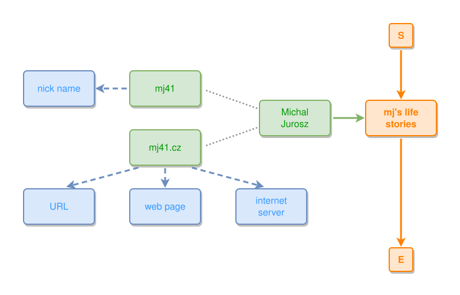

```ipmdev-layout-rule
@scope local
all #MJ,#life have same y
#MJ is left-of #life with gap=60
all #mj41,#mj41.cz have same center-x
#MJ is vertically-centered-between #mj41,#mj41.cz
#mj41 is left-of #MJ with gap=100
edge #MJ,#mj41 has visibility=visible
edge #MJ,#mj41.cz has visibility=visible
edge #life,#E has max-bends=0
```

### up to three components share one row

```ipmt
tA --> e1 ::e
tA --> e2 ::e
tB --> cX ::c
```
<!-- ipm-svg id=1hi hash=6626dfc7 -->
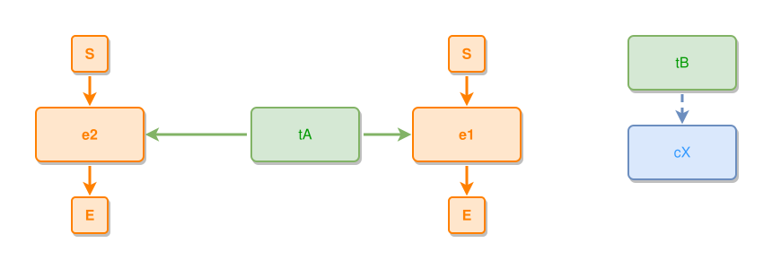

Three components (a tied pair of timelines plus an untied pure one) sit
NEXT TO EACH OTHER on one horizontal band — the count ladder's first
step holds up to three tiles in a single row, and a
placed tied group counts as one row-1 tile, so the untied component
joins its right instead of dropping to a second row.

```ipmdev-layout-rule
@scope local
all #tB,#cX have same center-x
#cX is below #tB with gap=40
#tB is right-of #tA with gap=300
all #tA,#e1,#e2 have same y
```

### a chain of ties rings ring by ring

v7P2: a component tied to an already-placed one is placed AROUND it — and a
snowflake is that rule applied TRANSITIVELY: satellites of satellites ring
their own hub. Here `r1` ties to the hub story at `h2`, `r2` ties only to
`r1`, `r3` only to `r2` — a branch of three with no fork. The ring pass runs
to a fixpoint, so each one rings the one before it, and the branch reads as
one row off the hub, one component gap per link. A single ordered pass
could not: `r2` precedes `r1` in centrality order (equal ties, declared
first), reached `r1` unplaced, and fell to the aspect-ratio wrap — and once
wrapped it could never be a hub for `r3`, which wrapped after it. The
branch was torn: `r2`,`r3` on the hub's top row 360px away, `r1` alone
beside `h2`. (kubernetes: kubectl → interact-via-CLI → Kubernetes stood
4650px apart with both ties hidden as too long.)

```ipmt
h1 ::e --> h2 ::e --> h3 ::e
p ::e --::X--> h1
q ::e --::X--> h3
r2 ::e --::X--> r1 ::e
r3 ::e --::X--> r2
r1 --::X--> h2
```
<!-- ipm-svg id=1hr hash=d5e9745d -->
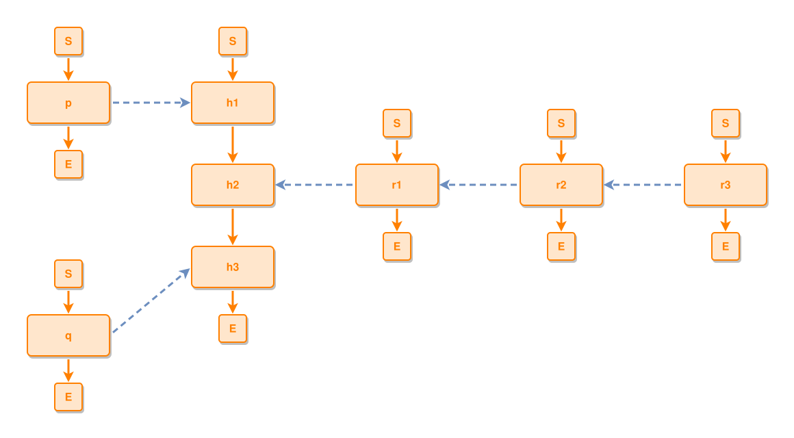

```ipmdev-layout-rule
@scope local
all #h2,#r1,#r2,#r3 have same y
#h2 is left-of #r1 with gap=120
#r1 is left-of #r2 with gap=120
#r2 is left-of #r3 with gap=120
each edge has max-bends=0
```

### every tied cluster is its own snowflake, then the rest wraps

v7P2, one level up: the ring pass reaches everything tied — transitively —
to the SEED hub, and nothing else. A tied cluster with no tie to the seed's
cluster used to go to the wrap as INDIVIDUALS, and the count ladder split it:
here `a1→a2→a3` and `b1` are tied only to each other, `c1→c2` and `d1` too,
and their members interleave in centrality order (`a` three events, `c` two,
`b` and `d` one each), so the old wrap laid the row a, c, b, d — `b1` a
row below `a3`, `d1` far from `c2`. Now the components are clustered by
their ties first; each cluster of two or more is built as its own
snowflake — its most central member the hub, the same fixpoint and
recentring — and the wrap tiles snowflakes and singles alike. `b1` sits one
component gap off `a3`, `d1` off `c2`. (kubernetes root: `nodes` near-to
`API server`, two components tied only to each other, stood 1170px apart with
a V between them; brains: every tie drawn where 488 had been hidden.)

```ipmt
h1 ::e --> h2 ::e
h2 --> h3 ::e
s1 ::e --::X--> h2
s2 ::e --::X--> h2
a1 ::e --> a2 ::e
a2 --> a3 ::e
b1 ::e --::N-- a3
c1 ::e --> c2 ::e
d1 ::e --::N-- c2
```
<!-- ipm-svg id=1hv hash=595ded10 -->
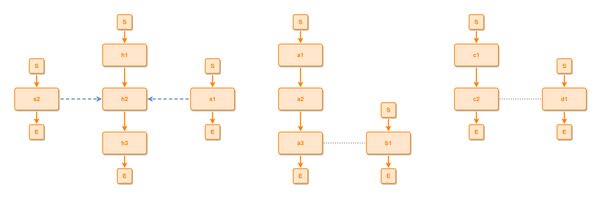

```ipmdev-layout-rule
@scope local
all #a3,#b1 have same y
#a3 is left-of #b1 with gap=120
all #c2,#d1 have same y
#c2 is left-of #d1 with gap=120
all #s1,#s2 have same y
each edge has max-bends=0
```

### untied components wrap toward the canvas

v7P2: eight identical single-event components with no ties pack by the
COUNT LADDER: columns start at three, then rows and
columns grow alternately — 3×1, 3×2, 4×2, 4×3, 5×3 … — a rectangle
canvas by default, never a per-tile greedy wrap that would split eight
equal tiles 3+5. Eight tiles take the 4×2 step and land 4+4, evenly
filled in reading order.

```ipmt
a1 ::e
b1 ::e
c1 ::e
d1 ::e
f1 ::e
g1 ::e
h1 ::e
i1 ::e
```
<!-- ipm-svg id=1i0 hash=773b07f2 -->
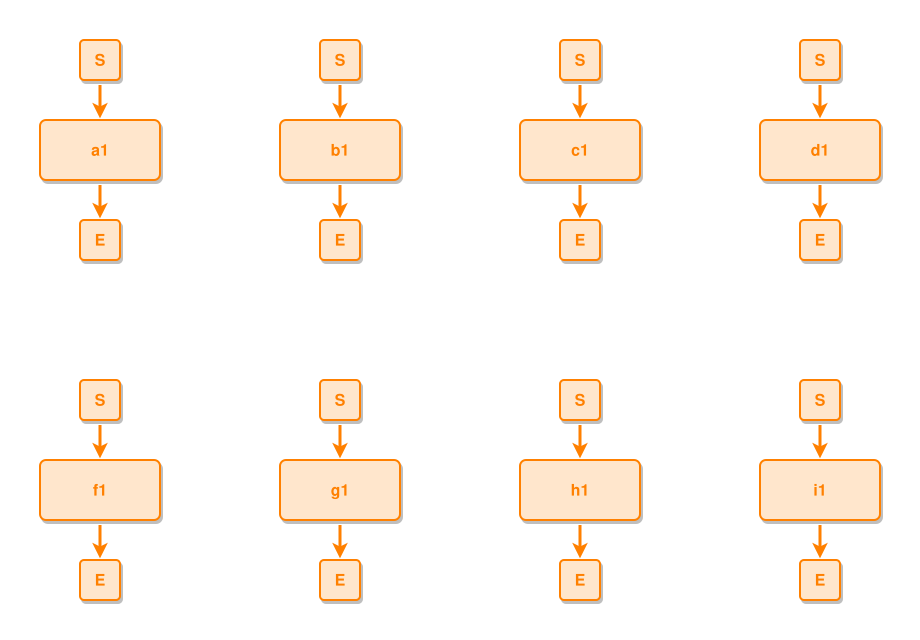

```ipmdev-layout-rule
@scope local
all #a1,#b1,#c1,#d1 have same y
all #f1,#g1,#h1,#i1 have same y
#f1 has y>=300
#i1 has y>=300
all #a1,#f1 have same center-x
all #b1,#g1 have same center-x
all #c1,#h1 have same center-x
all #d1,#i1 have same center-x
```

### a leads-to into a sub-grid member bends around the members above

v7P3/v7P9: a leads-to that ENTERS a composite's sub-grid from an event
beside the grid comes in from the side, and its straight line to a member
low in the column runs through every member above it. Flow never hides
(v7P9's hierarchy) — but "flow never hits a box" was read as "flow is never
blocked", and the straight was kept, boxes and all (CFEngine:
`editfiles field_edits -> insert_lines` through `delete_lines` and
`field_edits`). Such a leads-to is a BLOCKED structural edge like any
other: it resolves cost-aware — a slid straight, a dogleg, a lane beside the
column — and when nothing clears, the fewest boxes speared wins over the
fewest crossings (one box beats twenty-five, however cheap the crossing
count). The externals `x1..x4` each lead to their own member; whatever the
placement, no member sits on another external's line.

```ipmt
m1 ::e, m2 ::e, m3 ::e, m4 ::e --::P--> eC ::e
x1 ::e --> m1
x2 ::e --> m2
x3 ::e --> m3
x4 ::e --> m4
```
<!-- ipm-svg id=1j0 hash=b51740ba -->
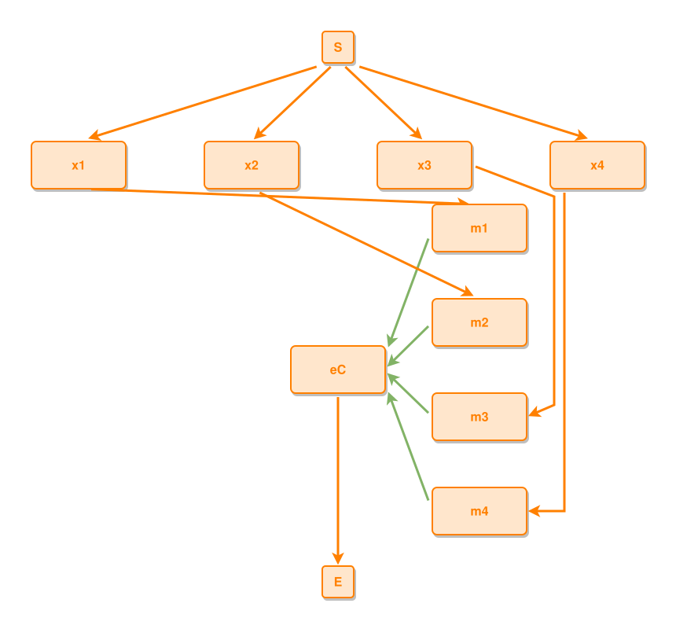

```ipmdev-layout-rule
@scope local
edge #x3,#m3 has visibility=visible
edge #x4,#m4 has visibility=visible
node #m1 does not straddle edge #x3,#m3
node #m2 does not straddle edge #x3,#m3
node #m1 does not straddle edge #x4,#m4
node #m2 does not straddle edge #x4,#m4
node #m3 does not straddle edge #x4,#m4
node #m1 does not straddle edge #x2,#m2
edge #x3,#m3 has max-bends=2
edge #x4,#m4 has max-bends=2
```
