# layout-gen algorithm step by step

## Implementation and tests

Moved to `gl:docs/dev/layout-gen/layout7-engine.md` (section
"Implementation and tests") — the engine map keeps the source pointers,
the fixture-extraction workflow and the required checklists in one
place. In short: the `ipmdev-layout-rule` blocks in THIS document are
executable tests; prose without a rule block is intent, not enforcement.

## Introduction

- Axes are like on screen computer graphics: X axis is horizontal, Y axis is vertical, (0,0) is top-left corner.

## How this catalogue is ordered

The placement principles themselves live in
[layout-principles.md](layout-principles.md): the event skeleton comes first
and never yields (v7P3, v7P6), things and concepts attach around it in groups
(v7P4). The catalogue follows the same build-up — the sections below run
**Events → Things → Concepts**, and the fitness rules grow the same way: the
event-only rules must hold whether or not things and concepts are present.
When adding rules, add them in this order of increasing complexity.

### Observing the layout

- `layout-debug --table` shows the final rows and columns (shared y's,
  shared centre-x's, the child grid indent) plus a COMP column with each
  node's component (v7P1 — checkable without rendering).
- `layout-debug --edges` shows every edge's ports, bends, crossings and
  length (flow edges `bottom@0.50→top@0.50`, spread ports, bypass shapes,
  `stubbed` visibility — v7P9).
- `make layout-fitness` scores the corpus; `make layout-check` checks the
  universal invariants across the corpora and every doc's diagrams.

## Edge routing invariants

These apply to EVERY diagram, not to one fixture — they live here, before the
first fixture, so the runner (which only applies rules at or above each test's
line) sees them for all tests.

### edges run straight by default

An edge is drawn straight unless an obstacle forces a detour; a spurious bend is
a routing regression. The fitness default is therefore ZERO bends on every
rendered edge. A fixture whose edges legitimately detour overrides this locally —
`each edge has max-bends=0 except #a,#b` lifts those edges out of the default, and
each is pinned by its own `edge #a,#b has max-bends=N`. Stubbed (hidden) edges
draw no line and are not counted.

```ipmdev-layout-rule
@scope global
each edge has max-bends=0
```

## Events

### one event

```ipmt
e1 ::e
```
<!-- ipm-svg id=100 hash=02e562ff -->
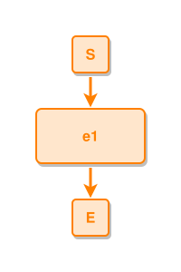

Visual rules:
- Event 'e1' is orange.
- Font color is dark orange.
- Node has a thin (2px) dark orange border.
- Text is horizontally and vertically centered in node.
- Event-to-event edges are straight solid orange vertical lines.
- Connecting lines are vertical and centered.

Layout global rules:
- Base width of 'e1' is 120.
- Base size of 'S' and 'E' is 40x40 px (a square marker — never widened).
- When an event contains another event (partof relationship), the child event is positioned to the right of the parent event with 60px horizontal gap.
- Events must maintain a minimum gap of 10px between their bounding boxes (no overlap or touching edges allowed).

```ipmdev-layout-rule
@scope parent
each type=event has width=120
each type=event has min-gap-to-others>=10
each type=boundary has size=40x40
```

Layout local rules:
- If there is at least one event, implicit 'S' (start) and 'E' (end) events are added.
- Base height of 'e1' with short text is 60.
- One vertical line of nodes 'S', 'e1', 'E'.
- Horizontal center of all nodes are aligned on the same vertical line (same center X coordinate).
- Vertical gap from S bottom edge to e1 top edge is 40px (boundary↔event gap).
- Vertical gap from e1 bottom edge to E top edge is 40px (boundary↔event gap).
- Leadsto edges are added from 'S' to 'e1' and from 'e1' to 'E'.

```ipmdev-layout-rule
@scope local
each type=event has height=60
all #S,#e1,#E have same center-x
edge #S,@e1 has type=leadsto
edge #e1,@E has type=leadsto
#e1 is below #S with gap=40
#E is below #e1 with gap=40
```

### one event with long text

```ipmt
This event happen when many things are involved and the description is long. ::e
```
<!-- ipm-svg id=110 hash=92f72df9 -->
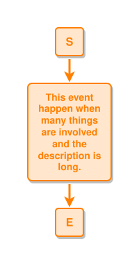

Layout local rules:
- One line can fit 10 to 14 characters (depending on letters).
- Base height can show 3 lines.
- Event 'e1' with long description text should grow vertically to fit text.
- Each additional line adds 20px to height.

```ipmdev-layout-rule
@scope local
each type=event text-len>72 has height>=140
```

#### Aspect-ratio width rule

A node's height grows with its label while its width starts at 120px, so a *very*
long label would otherwise produce an extreme tall-thin box. To keep boxes
readable, width and height are computed together:

- Compute the height at the base width (120px, ~12 characters per line).
- While that height is at least 3× the width (height ≥ 360px at width 120), grow
  the width by one base step (120 → 240 → 360 → …) and re-flow the text at the
  wider line length (~24 chars/line at 240, ~36 at 360 …), which shortens the box.
  Stop once the box is below 3:1, or when the width reaches the 600px cap.
- A label still over 3:1 at the 600px cap stays that wide and remains tall.

Re-flow keeps the layout consistent with the renderer, which wraps text by the
node's actual width. When a node widens, its column widens too (column spacing
follows the widest node in the component), so wider boxes never overlap their
neighbours. The same rule applies to things and concepts; boundary nodes are
fixed-size and exempt.

### two events connected

```ipmt
e1 ::e --> e2 ::e
```
<!-- ipm-svg id=120 hash=633ee46f -->
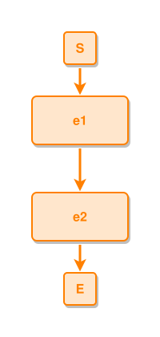

Visual rules:
- Two events 'e1' and 'e2' are orange.
- They are connected with a 3px straight solid orange vertical line.
- Edge leads from 'e1' to 'e2' and has a solid orange arrow at 'e2'.

Layout rules:
- Vertically aligned nodes 'S', 'e1', 'e2', 'E'.

```ipmdev-layout-rule
@scope local
all #S,#e1,#e2,#E have same center-x
```

### five events connected

```ipmt
e1 ::e --> e2 ::e --> e3 ::e --> e4 ::e --> e5 ::e
```
<!-- ipm-svg id=130 hash=951953f0 -->
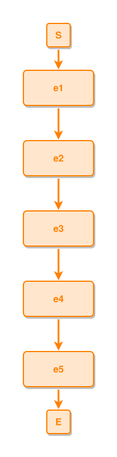

Visual rules:
- Five events 'e1', 'e2', 'e3', 'e4', 'e5' are orange.
- They are connected with straight orange vertical lines.

Layout rules:
- All lines are in the same vertical line.
- Vertically aligned nodes 'S', 'e1', 'e2', 'e3', 'e4', 'e5', 'E'.

```ipmdev-layout-rule
@scope local
all #S,#e1,#e2,#e3,#e4,#e5,#E have same center-x
```

### one event leads to multiple events (fork)

```ipmt
e1 ::e --::L--> e2 ::e, e3 ::e
```
<!-- ipm-svg id=140 hash=800ed73c -->
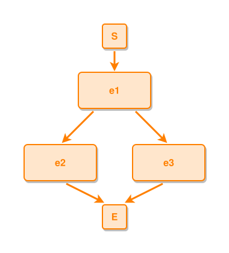

Layout rules:
- Event 'e1' leads to both 'e2' and 'e3' (fork/branch pattern).
- The comma expansion creates two separate leads-to edges: e1→e2 and e1→e3.
- Both 'e2' and 'e3' are end events (no outgoing leads-to edges).
- The component gets a SINGLE 'E' boundary: both terminal events fan in to it
  (and a single 'S' feeds e1) — one boundary pair per component, not one per
  terminal.
- Events 'e2' and 'e3' are placed side-by-side horizontally (not stacked
  vertically), and the fork parent 'e1' is horizontally centered between
  them; S, e1 and E share the fork's center line.

```ipmdev-layout-rule
@scope local
all #e2,#e3 have same y
#e1 is horizontally-centered-between #e2,#e3
all #e1,#S,#E have same center-x
```

### fork keeps siblings on one row with a tall aux

```ipmt
e1 ::e --::L--> ea ::e, eb ::e
e1 --::X "used for"--> "setup tasks like config init or dependency checks" ::c
```
<!-- ipm-svg id=150 hash=a72056da -->
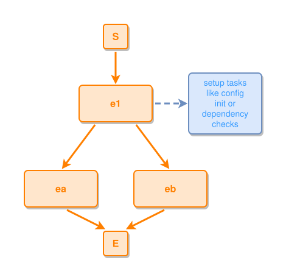

'e1' both forks to two end events and expresses a tall concept. The aux makes the
previous level taller on one side, but both 'ea' and 'eb' must shift down together
so the fork stays on one horizontal row. Regression: a tall aux used to push
only the first sibling down, and the two events that both lead to 'E' ended up
on different rows.

The row also stays **compact**: a child clears the previous row's aux boxes only
where its own lane (or the diagonal corridor of its leads-to edge) actually
passes under them — never the full width of the previous row. Here 'eb' passes
30px under the tall concept, so the row sits 80px below 'e1' (60px base pitch +
20px clearance) instead of clearing the whole concept band, which used to
stretch the fork edges far longer than needed.

```ipmdev-layout-rule
@scope local
all #ea,#eb have same y
#ea is below #e1 with gap=80
```

### wide fork keeps readable edge slopes

```ipmt
e1-hub ::e --> wA ::e
e1-hub --> wB ::e
e1-hub --> wC ::e
e1-hub --> wD ::e
e1-hub --> wE ::e
```
<!-- ipm-svg id=15i hash=50aae36c -->
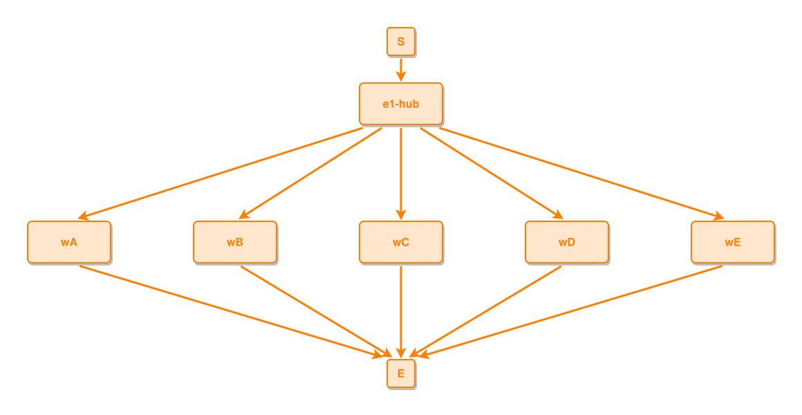

A wide fork's outer edges run dominantly sideways; left unchecked the fan
spreads near-flat and the arrowheads drown in the children's top borders.
The fork-fan ANGLE is capped at 150° (MaxFanAngleDeg, unified with the S/E
boundary cap): the whole fork subtree gains vertical room until
even the outermost edge is within 75° of vertical (|dy| ≥ |dx|/tan75 ≈
|dx|×0.27), so the two outer edges span at most 150° — never an obtuse near-flat
fork. Pushing the fork down cascades to its descendants (the chain below
follows), the same single 150° angle an S/E boundary fan uses.

```ipmdev-layout-rule
@scope local
all #wA,#wB,#wC,#wD,#wE have same y
edge #e1-hub,#wA has min-slope=0.25
edge #e1-hub,#wE has min-slope=0.25
```

### asymmetric terminals center the boundaries

```ipmt
b1 ::e --> b2 ::e, b3 ::e
b3 --> b3a ::e
b3 --> b3b ::e
b3b --> b3c ::e
```
<!-- ipm-svg id=15r hash=76dc938f -->
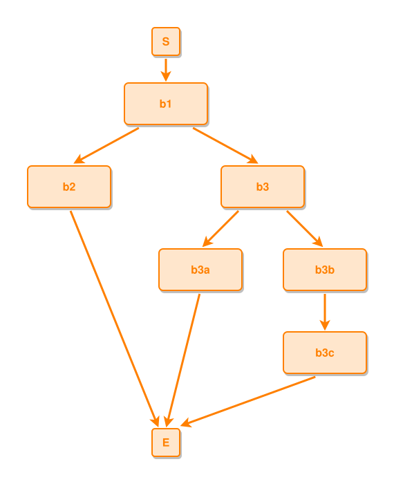

The three terminal events ('b2', 'b3a', 'b3c') end at different depths and
columns, skewed to the right of the first fork's center line. With a SINGLE
start event the component has a STEM: S sits exactly on 'b1' (the S→b1 edge
is flow and reads vertical), and E RETURNS to the same stem axis — the
reader scans one vertical line from entry to exit (S, b1 and E belong
on one line). Components with MULTIPLE start
events have no stem; each boundary then centers on the midpoint of the
horizontal extremes of its own fan, which keeps the longest boundary edge as
short as that fan allows (an axis pinned to the first spine's column made a
wide multi-lane component's E edge thousands of px long).

The b2→E edge must clear 'b3a'. It drops VERTICALLY in 'b2''s own column —
which already lies left of 'b3a' (so the vertical leg keeps the gap=25
clearance) — and then takes a SINGLE bend straight to E ("vertical
first and then one bend going directly to E"). A vertical leave
reads as flow and avoids the wide leftward sweep an obstacle-corner detour
would otherwise take (the column detour is gated to boundary-incident edges,
so dense internal graphs keep their corner routing).

The three terminals fan UP into E. That fan's spread is capped by
`MaxFanAngleDeg` (150°, the same cap a wide fork fan uses), E dropping until
the widest terminal's edge is within 75° of vertical. b3c is the widest, held
at the cap.

```ipmdev-layout-rule
@scope local
all #S,#b1,#E have same center-x
node #b3a keeps gap=25 from edge #b2,@E
edge #b2,@E has source-side=bottom
edge #b3c,@E has min-slope=0.25
each edge has max-bends=0 except #b2,@E
edge #b2,@E has max-bends=1
```

### multiple events lead to one event (join)

```ipmt
e1 ::e --> e3 ::e
e2 ::e --> e3
```
<!-- ipm-svg id=160 hash=021ca8a3 -->
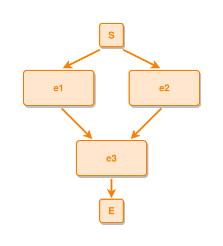

Layout rules:
- Events 'e1' and 'e2' both lead to 'e3' (join/merge pattern).
- Both 'e1' and 'e2' are start events (no incoming leads-to edges from other events).
- The component gets a SINGLE 'S' boundary fanning out to both start events
  (one boundary pair per component, mirroring the fork's single E).
- Events 'e1' and 'e2' are placed side-by-side horizontally; the join target
  'e3' is horizontally centered between them, and S, e3 and E share that
  center line.

```ipmdev-layout-rule
@scope local
all #e1,#e2 have same y
#e3 is horizontally-centered-between #e1,#e2
all #e3,#S,#E have same center-x
```

### join-sharing fork branches cluster adjacent

```ipmt
s ::e --> x ::e
s --> y ::e
s --> z ::e
x --> j ::e
z --> j
```
<!-- ipm-svg id=16e hash=4eb37dec -->
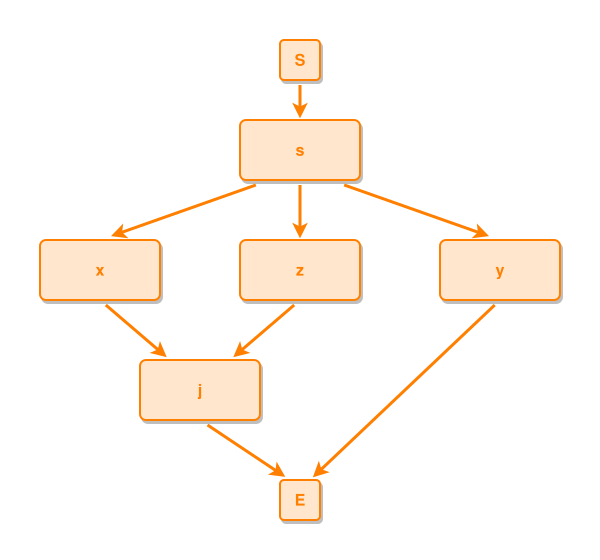

`x` and `z` join into `j`, `y` does not — so the row is `x, z, y`: the
joining pair clusters ADJACENT (led by its first-declared member `x`), `j`
centres under the x+z lanes, and `y` drops straight toward E with no
crossing. In plain declaration order (`x, y, z`) `j` would land under `y`
— an event that is NOT its predecessor — forcing `x → j` to cross and
`y → E` to bend around `j` (v7P3 fork rules, probe f4 in the v7
analysis). A fork whose joiners are already contiguous (a plain
diamond) keeps declaration order unchanged.

```ipmdev-layout-rule
@scope local
all #x,#z,#y have same y
#z is right-of #x with gap=80
#y is right-of #z with gap=80
#j is horizontally-centered-between #x,#z
edge #y,#E does not cross edge #x,#j
edge #y,#E does not cross edge #z,#j
```

Gap note (v7 re-derivation): a three-member fork row takes the breathe
gap (80, "wide forks breathe"), not the base 60 column gap.

### a leads-to edge stays straight past a thing or concept

```ipmt
e1 ::e --> e2 ::e
e1, e2 <--::P-- t1 ::t
```
<!-- ipm-svg id=16s hash=934033bb -->
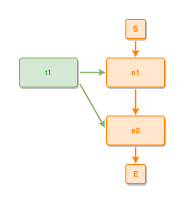

A leads-to (flow) edge is NEVER bent because of a thing or concept (move
the aux, or add space — don't kink the flow edge). 't1' is a
thing shared by 'e1' and 'e2', so it is parked in their side band right beside
the vertical e1→e2 corridor; the obstacle-avoidance graze nudge that would push
an expresses/near-to edge (or a flow edge around an EVENT) out of the way is
suppressed for a flow edge grazing an AUX box, so e1→e2 stays a straight
vertical line. The aux's own placement is what keeps it clear.

```ipmdev-layout-rule
@scope local
edge #e1,#e2 is vertical
```

### diamond pattern (fork and join)

```ipmt
e1 ::e --> e2 ::e, e3 ::e
e2 --> e4 ::e
e3 --> e4
```
<!-- ipm-svg id=170 hash=baa9afee -->
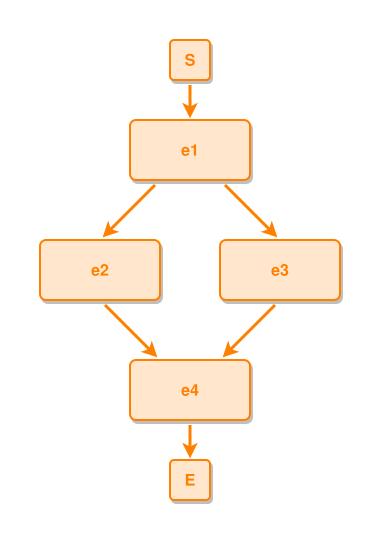

Layout rules:
- Event 'e1' forks to 'e2' and 'e3', which both join at 'e4'.
- Single 'S' connects to 'e1' (only one start event).
- Single 'E' connects from 'e4' (only one end event).
- Events 'e2' and 'e3' are placed side-by-side horizontally at the same Y level.
- 'e1' is centered above 'e2' and 'e3'.
- 'e4' is centered below 'e2' and 'e3'.
- Edge from e1 to e2 goes down-left, edge from e1 to e3 goes down-right.
- Edge from e2 to e4 goes down-right, edge from e3 to e4 goes down-left.

```ipmdev-layout-rule
@scope local
all #e2,#e3 have same y
all #S,#e1,#e4,#E have same center-x
```

### diamond pattern with aux on every event

```ipmt
e1 ::e --> e2 ::e, e3a ::e
e3a --> e3b ::e
e2 --> e4 ::e
e3b --> e4
t1 ::t --> e1
e1 --> c1 ::c
t2 ::t --> e2
e2 --> c2 ::c
t3a ::t --> e3a
e3a --> c3a ::c
t3b ::t --> e3b
e3b --> c3b ::c
t4 ::t --> e4
e4 --> c4 ::c
```
<!-- ipm-svg id=17i hash=fafc6c63 -->
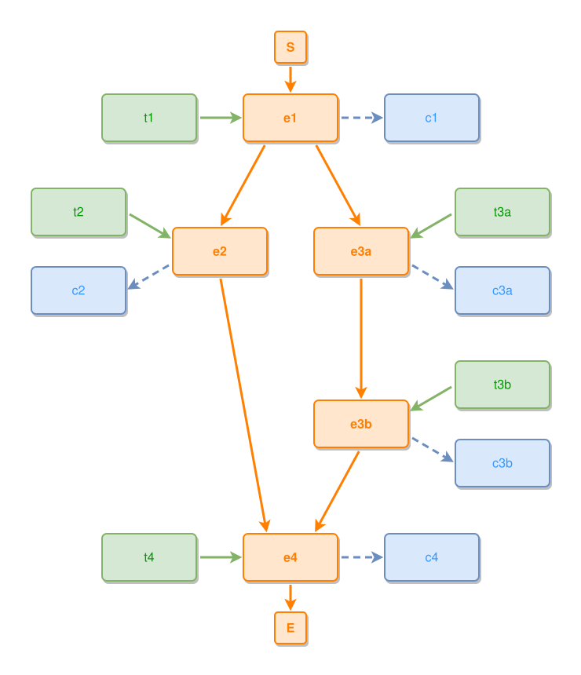

The diamond with an UNEVEN right branch (e3a → e3b) and one thing plus one
concept on every event. Branch aux goes OUTWARD — the left branch's thing
and concept stack on its left, the right branch's on its right — keeping the
diamond's interior clear for the flow edges. Spine events (e1, e4) split
their aux left/right beside themselves; the join sits below the longer
branch's end, centered on the spine.

```ipmdev-layout-rule
@scope local
all #e2,#e3a have same y
all #e3a,#e3b have same center-x
all #S,#e1,#e4,#E have same center-x
#e1 is horizontally-centered-between #e2,#e3a
#t2 is left-of #e2 with gap=60
all #t2,#c2 have same center-x
#t3a is right-of #e3a with gap=60
all #t3a,#c3a have same center-x
#t3b is right-of #e3b with gap=60
all #t3b,#c3b have same center-x
#t1 is left-of #e1 with gap=60
#c1 is right-of #e1 with gap=60
#t4 is left-of #e4 with gap=60
#c4 is right-of #e4 with gap=60
```

### sibling events do not cross

```ipmt
e1-start ::e --> e2-left ::e
e1-start --> e3-right ::e
e3-right --> e4-rightChild ::e
e2-left --> e5-leftChild ::e
```
<!-- ipm-svg id=180 hash=1e044628 -->
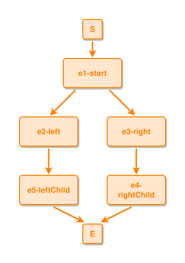

Two siblings ('e2-left', 'e3-right') fan out from 'e1-start'; each leads to one child.
The children must be ordered by their parents' left→right position so the two
leads-to edges run straight down their columns instead of crossing. (Without
parent-aware ordering the children would sort by node id and swap sides, making
'e2-left'→'e5-leftChild' cross 'e3-right'→'e4-rightChild'.)

Layout rules:
- 'e5-leftChild' (under 'e2-left') is left of 'e4-rightChild' (under 'e3-right'), same row.
- Each child sits directly below its parent, so each leads-to edge enters the
  child's top side.
- The two leads-to edges do not cross.

```ipmdev-layout-rule
@scope local
all #e5-leftChild,#e4-rightChild have same y
#e5-leftChild is left-of #e4-rightChild with gap=60
edge #e2-left,#e5-leftChild has target-side=top
edge #e3-right,#e4-rightChild has target-side=top
edge #e2-left,#e5-leftChild does not cross edge #e3-right,#e4-rightChild
```

### uneven sibling branches keep their vertical lanes

```ipmt
e1-start ::e --> e2-leftA ::e
e1-start --> e3-middleB ::e
e1-start --> e4-rightA ::e
e2-leftA --> e5-leftB ::e --> e6-leftC ::e --> e7-leftD ::e
e4-rightA --> e8-rightB ::e
``` 
<!-- ipm-svg id=18i hash=54a94140 -->
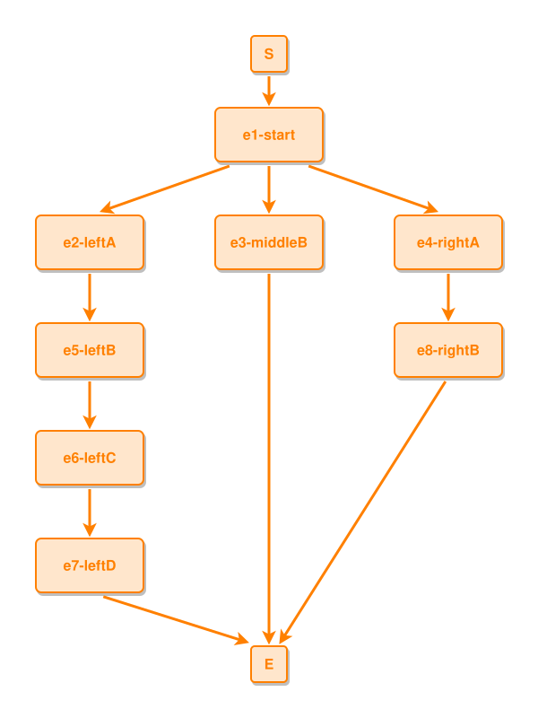

Three branches fork from 'e1-start' with **different lengths** (4, 1, and 2 events).
Each branch is a leads-to chain, and a chain must read as one straight vertical
line — an event stays in its **branch's lane** (directly under its predecessor),
even when other branches on the same row are shorter or longer. Rows are *not*
re-centered independently: that would pull a deeper, lonelier row back toward
the spine and bend the branch verticals (and can even drop a branch event onto
another branch's edge path).

Layout rules:
- The middle branch sits on the spine: 'S', 'e1-start', 'e3-middleB' share center-x.
- The left branch is one straight vertical: 'e2-leftA'..'e7-leftD' share center-x.
- The right branch likewise: 'e4-rightA', 'e8-rightB' share center-x.
- The three branch heads share the fork row, ordered left to right, with the
  THREE-member fan gap (80px — fan gaps grow with the member count, see
  "wide forks breathe").

```ipmdev-layout-rule
@scope local
all #S,#e1-start,#e3-middleB have same center-x
all #e2-leftA,#e5-leftB,#e6-leftC,#e7-leftD have same center-x
all #e4-rightA,#e8-rightB have same center-x
all #e2-leftA,#e3-middleB,#e4-rightA have same y
#e2-leftA is left-of #e3-middleB with gap=80
#e3-middleB is left-of #e4-rightA with gap=80
```

### start boundary stays on the start event over an uneven fan

```ipmt
b1 ::e --> b2 ::e, b3 ::e
b2 --> c1 ::e
b3 --> c2 ::e, c3 ::e
```
<!-- ipm-svg id=18m hash=b3985b26 -->
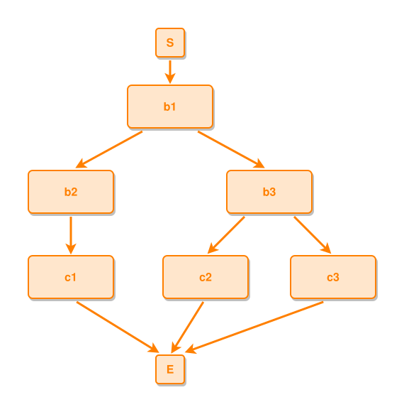

The end fan is wider on the right (b3 has two children), but the single
start event gives the component a STEM: S sits exactly on b1's vertical
line (the S→b1 edge is flow and reads vertical) and E returns to the same
stem — entry and exit on one line.

Branches are SEPARATE CHAINS read top-to-bottom:
the b2→c1 chain stays on ONE vertical line, and b3's fork (c2, c3) centers
on b3's line. When row separations push the deepest row apart, the parents
re-center bottom-up onto their own children rather than the row sliding
everyone off their lanes with a balancing shift.

```ipmdev-layout-rule
@scope local
all #S,#b1,#E have same center-x
#b1 is horizontally-centered-between #b2,#b3
all #c1,#c2,#c3 have same y
all #b2,#c1 have same center-x
#b3 is horizontally-centered-between #c2,#c3
```

### fork merge fork keeps a vertical spine

```ipmt
e1-start ::e --> a1 ::e
e1-start --> b1 ::e
e1-start --> c1 ::e
a1 --> a2 ::e --> a3 ::e
c1 --> c2 ::e
a3 --> e2-merge ::e
b1 --> e2-merge
c2 --> e2-merge
e2-merge --> d1 ::e
e2-merge --> f1 ::e
d1 --> d2 ::e --> d3 ::e
d3 --> e3-end ::e
f1 --> e3-end
```
<!-- ipm-svg id=18r hash=ad8f159a -->
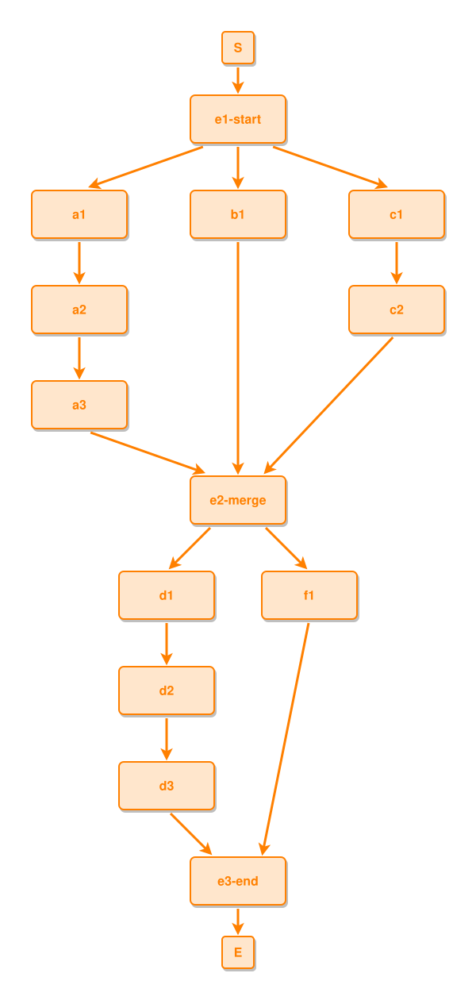

'e1-start' forks into three branches of different lengths (a: 3 events, b: 1,
c: 2), all merge into 'e2-merge', which forks again into two branches of different
lengths (d: 3 events, f: 1) that join at 'e3-end'. The structural single events —
'e1-start', 'e2-merge', 'e3-end' — and the middle branch 'b1' all sit on **one vertical
line from 'S' to 'E'**; each branch keeps its own vertical lane regardless of
the neighbours' lengths.

Layout rules:
- One vertical spine: 'S', 'e1-start', 'b1', 'e2-merge', 'e3-end', 'E' share center-x.
- Each branch is vertical: a1–a3 share center-x, c1–c2 share center-x,
  d1–d3 share center-x.
- First fork row: 'a1', 'b1', 'c1' share y and are ordered left to right,
  centered around the spine.
- Second fork row: 'd1', 'f1' share y.

```ipmdev-layout-rule
@scope local
all #S,#e1-start,#b1,#e2-merge,#e3-end,#E have same center-x
all #a1,#a2,#a3 have same center-x
all #c1,#c2 have same center-x
all #d1,#d2,#d3 have same center-x
all #a1,#b1,#c1 have same y
#a1 is left-of #b1 with gap=80
#b1 is left-of #c1 with gap=80
all #d1,#f1 have same y
```

### aux chain gets its own corridor

```ipmt
e0 ::e --> e1 ::e
e0 --> e2 ::e
e0 --> e3 ::e
e1 --> e4 ::e
e2 --> e5 ::e
e2 --> c5 ::c
c5 --> c6 ::c
```
<!-- ipm-svg id=18v hash=66de09da -->
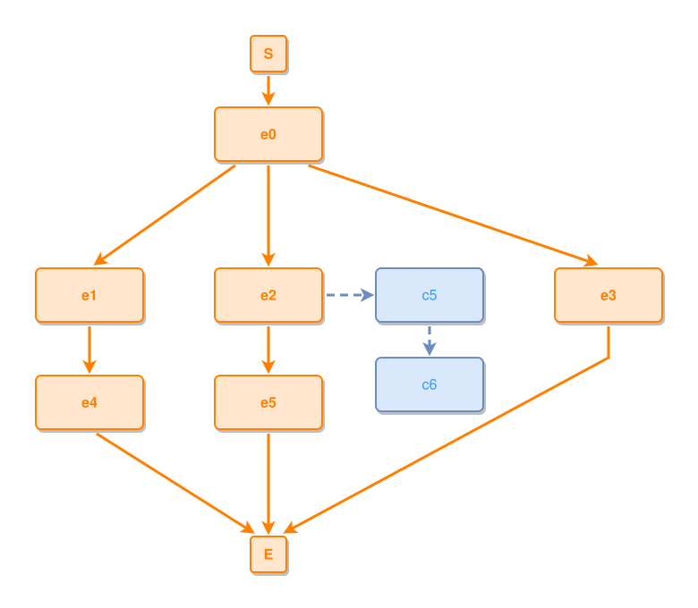

The interior fork branch 'e2' owns a concept chain (c5 → c6) while its row
neighbours 'e1' and 'e3' occupy the adjacent lanes. The fan GROWS to host
the chain beside its anchor (v7P6: the gap on the side needing room opens): 'c5' takes e2's
row and 'c6' sits DIRECTLY BELOW it — the degenerate one-column tree
(v7P4: a diagonal step reads corner-to-corner distant — a concept
root's single child stacks like any exclusive chain). No
aux node lies on any surrounding edge corridor: a boundary-fan edge whose
straight line would spear the chain drops in its own lane instead and
converges just before E (v7P9: edges avoid nodes; the flow never hides).

```ipmdev-layout-rule
@scope local
each edge has max-bends=0 except #e3,@E
edge #e3,@E has max-bends=1
all #e1,#e2,#e3 have same y
all #e1,#e4 have same center-x
all #e2,#e5 have same center-x
all #c5,#e2 have same y
#c5 is right-of #e2 with gap=60
#c6 is below #c5 with gap=40
all #c5,#c6 have same center-x
node #c5 does not straddle edge #e3,@E
node #c6 does not straddle edge #e3,@E
node #c5 does not straddle edge #e2,#e5
node #c6 does not straddle edge #e2,#e5
node #c5 does not straddle edge #e0,#e3
node #c6 does not straddle edge #e0,#e3
```

### event contains event

```ipmt
e2 ::e --::P--> e1 ::e
```
<!-- ipm-svg id=190 hash=ea3c120f -->
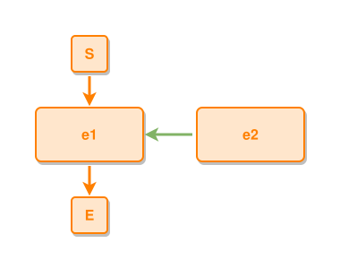

Visual rules:
- The part of edge is rendered with the "partof" style (typically solid line with specific arrow).

Layout rules:
- Event 'e2' is part of event 'e1' (hierarchical/compositional relationship).
- Both events belong to the same subgraph and share the same boundary nodes.
- Single 'S' connects to 'e1' (the containing event is the start).
- Single 'E' connects from 'e1' (S --> e1 --> E in the left column).
- **Sub-event 'e2' is NOT connected to 'S' or 'E'.**
- 'e1' is placed in the left vertical spine: S --> e1 --> E.
- 'e2' is positioned to the right of 'e1'.
- Horizontal gap between 'e1' and 'e2' is 60px.
- 'e2' center aligns with 'e1' center (same Y coordinate for centers).

```ipmdev-layout-rule
@scope local
all #S,#e1,#E have same center-x
edge #S,@e1 has type=leadsto
edge #e2,#e1 has type=partof
edge #e1,@E has type=leadsto
#e1 is below #S with gap=40
#E is below #e1 with gap=40
#e2 is right-of #e1 with gap=60
all #e1,#e2 have same center-y
```

### event contains multiple events

```ipmt
e2 ::e --::P--> e1 ::e
e3 ::e --::P--> e2 ::e
```
<!-- ipm-svg id=1a0 hash=5300af51 -->
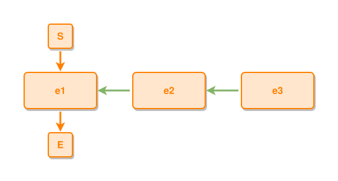

When multiple events are connected via contains:
- All events (e1, e2, e3) are in the same subgraph.
- Single 'S' and single 'E' for the entire chain.
- The leads-to spine is just 'S', 'e1', 'E' — vertically aligned on one centre line.
- Sub-events 'e2' (part-of e1) and 'e3' (part-of e2) nest to the **right** of the
  spine, one step further out each level, so the contains nesting reads as
  rightward indentation rather than stacking on the spine.

```ipmdev-layout-rule
@scope local
all #S,#e1,#E have same center-x
#e2 is right-of #e1 with gap=60
#e3 is right-of #e2 with gap=60
edge #S,@e1 has type=leadsto
edge #e2,#e1 has type=partof
edge #e3,#e2 has type=partof
edge #e1,@E has type=leadsto
```

### a leads-to between sub-events keeps the pair adjacent

```ipmt
e1-outer ::e
b ::e --::P--> e1-outer
a ::e --::P--> e1-outer
a --> b
c ::e --::P--> e1-outer
d ::e --::P--> e1-outer
```
<!-- ipm-svg id=1ai hash=feb1043b -->
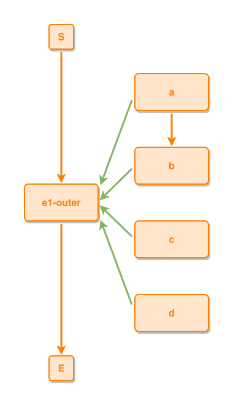

Four sub-events of one composite, where only ONE pair has a declared
leads-to (`a --> b`) — a partial order, the everyday state of a growing
model (IPMV2.7 warns about the rest). The declared flow ORDERS the child
column: `a` and `b` stay ADJACENT in flow order, then the unordered
siblings follow in their usual (level, id) order. The flat level sort used
to put every unordered sibling between the pair — the flow edge ended
first-to-last across the whole column ("a --> b is not used to order
the column of sub-events"). Chains are
connected components over sibling-internal leads-to, flattened
topologically; a column with no internal flow keeps its order unchanged.

```ipmdev-layout-rule
@scope local
all #a,#b,#c,#d have same center-x
#b is below #a with gap=60
edge #a,#b is vertical
#c is below #b with gap=60
#d is below #c with gap=60
```

### event contains with mixed leads-to

```ipmt
e1 ::e --> e2 ::e
e3 ::e --::P--> e1 ::e
```
<!-- ipm-svg id=1b0 hash=4ef7b498 -->
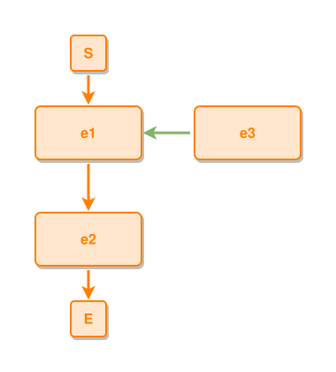

When contains is mixed with leads-to:
- All events are in the same subgraph (contains creates subgraph membership).
- Single 'S' and single 'E' for the group.
- Contains edges are treated as subgraph-forming edges similar to leads-to.
- e1 is the main event on the spine (connected to following events via leadsto).
- e3 is a sub-event (connected to parent via partof, not on the main timeline).

```ipmdev-layout-rule
@scope local
edge #e1,#e2 has type=leadsto
edge #e3,#e1 has type=partof
edge #e2,@E has type=leadsto
```

### event contains sub-events

```ipmt
e1a ::e, e1b ::e --::P--> e1 ::e
```
<!-- ipm-svg id=1c0 hash=677b5cff -->
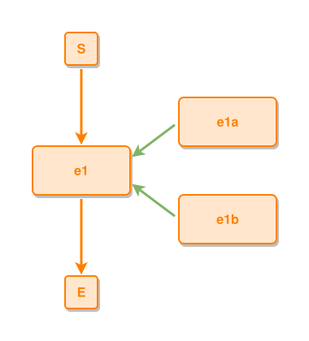

- Event 'e1' contains sub-events: 'e1a' and 'e1b' (requires 1 or more sub-events for this layout).
- All three events belong to the same subgraph.
- Single 'S' connects to 'e1' (the containing event is the start).
- Single 'E' connects from 'e1' (S --> e1 --> E in the left column).
- **Sub-events 'e1a' and 'e1b' are NOT connected to 'S' or 'E'.**
  - Rationale: Sub-events are parts of their parent event, not independent timeline events
  - Implementation filters sub-events from boundary connections in two passes:
    - First pass: components without LeadsTo edges
    - Second pass: components with LeadsTo edges
  - A sub-event is identified by having a PartOf edge pointing to its parent event
  - The `partofChildren` map tracks parent→children relationships
- The part of edges are rendered with the "partof" style.
- 'e1' is placed in the left vertical spine: S --> e1 --> E.
- 'e1a' and 'e1b' form a second vertical column to the right of 'e1'.
- 'e1a' and 'e1b' are vertically stacked (not side-by-side horizontally).
- Vertical gap from 'S' bottom edge to 'e1' top edge is 100px (e1 recentres between its stacked children).
- Horizontal gap between 'e1' and the second column is 60px.
- Sub-events 'e1a' and 'e1b' are centered vertically around 'e1' center (group center aligns with parent center).
- Vertical gap from 'e1a' bottom edge to 'e1b' top edge is 60px.
- Vertical gap from 'e1' bottom edge to 'E' top edge is 100px.
- 'E' is positioned in the left column below 'e1'.
- Layout structure:
  - Row 1: 'S' (above e1, left column)
  - Rows 2-3: 'e1' (left column), 'e1a' then 'e1b' (right column, stacked vertically)
  - Row 4: 'E' (centered below)

```ipmdev-layout-rule
@scope local
#e1 is vertically-centered-between #e1a,#e1b
#e1a is right-of #e1 with gap=60
#e1b is below #e1a with gap=60
all #e1a,#e1b have same center-x
all #S,#e1,#E have same center-x
```

### event contains sub-events with mixed connections

```ipmt
e1 ::e --> e2 ::e --> e3 ::e
e2 <--::P-- e2a ::e, e2b ::e
e2a --> e2b
```
<!-- ipm-svg id=1d0 hash=9dc4c211 -->
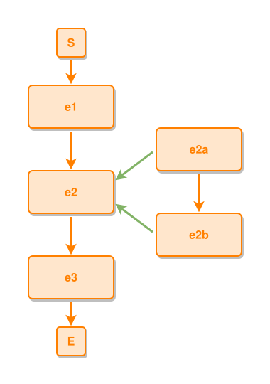

When a main event in the temporal flow contains sub-events:
- **Spine 1**: e1 → e2 → e3 (main temporal flow with leads-to)
- **Spine 2**: e2a, e2b (contained by e2, connected by leads-to to each other)
- **e2 remains on spine 1 (same X column) because it's part of the main leads-to chain.**
- **Y-centering rule (post-shift):** every event that owns PartOf children — *including* one on the main leads-to chain — is re-centered vertically to the geometric center of its children's bounding box. This happens *after* the shift passes have spread the children downward to clear their own sub-events, so the parent tracks where the children actually landed instead of where they were initially placed.
  - Applies to standalone parents and chain parents alike. A chain parent's leads-to predecessors/successors define its Y *window* (it can't overlap them) but the recenter stays inside that window because the shift passes have already pushed the descendants below the predecessor and pulled them above the successor.
  - Only Y moves; X stays in the parent's column.
  - Aux nodes anchored directly at the parent (things/concepts attached via partof) move with the parent so the visual association is preserved.
  - Shared fan-in aux targets (a concept anchored at many events) are *not* dragged along — they belong to no individual parent.
- e2a and e2b form spine 2 because they're connected to e2 only via contains (not leads-to).
- Sub-events e2a and e2b are positioned adjacent to e2's vertical position.
- Single 'S' → e1, single 'E' from e3.
- Sub-events NOT connected to 'S' or 'E'.

```ipmdev-layout-rule
@scope local
#e2 is vertically-centered-between #e2a,#e2b
#e2a is right-of #e2 with gap=60
all #e2a,#e2b have same center-x
all #S,#e1,#e2,#e3,#E have same center-x
```

### event contains connected sub-events and sub-sub-events

```ipmt
e1 ::e <--::P-- e1a ::e, e1b ::e
e1 --> e2 ::e --> e3 ::e
e3 <--::P-- e3a ::e, e3b ::e, e3c ::e
e3c <--::P-- e3b1 ::e
e1a --> e1b
e3b --> e3c
```
<!-- ipm-svg id=1e0 hash=32421400 -->
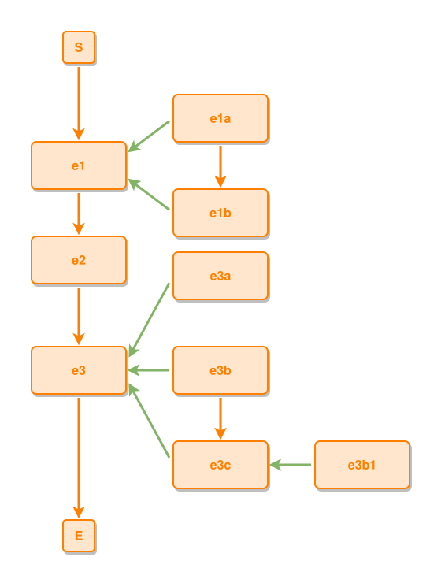

Multi-spine layout for complex containment hierarchies:
- **Spine 1 (leftmost)**: Main event flow connected by leads-to edges: e1 → e2 → e3
- **Spine 2 (middle)**: Sub-events contained by main events: e1a, e1b (from e1) and e3a, e3b, e3c (from e3)
- **Spine 3 (rightmost)**: Sub-sub-events: e3b1 (contained by e3c)

Spine construction rules:
- Events connected by `leads-to` edges stay on the same spine (main temporal flow).
- Events connected ONLY by `contains` edges (no leads-to between them) form a separate spine to the right.
- Each containment level creates its own vertical spine, offset horizontally from its parent spine.
- Sub-events within the same spine may have leads-to connections (e.g., e1a → e1b, e3b → e3c).
- All events on the same spine are vertically aligned (same X coordinate).

```ipmdev-layout-rule
@scope local
all #e1,#e2,#e3 have same center-x
all #e1a,#e1b,#e3a,#e3b,#e3c have same center-x
#e1a is right-of #e1 with gap=60
#e3b1 is right-of #e3c with gap=60
all #e3c,#e3b1 have same y
```
- Horizontal gap between adjacent spines is 60px (measured from right edge of left spine to left edge of right spine).
- Vertical positioning within each spine follows the 60px base event spacing, which grows where an event recentres onto its children.
- Single 'S' connects to the first event in spine 1 (e1).
- Single 'E' connects from the last event in spine 1 (e3).
- Sub-events are NOT connected to 'S' or 'E'.

Layout structure:
- Column 1: S, e1, e2, e3, E (main spine)
- Column 2: e1a, e1b (below e1), e3a, e3b, e3c (below e3)
- Column 3: e3b1 (aligned with e3c)

Vertical positioning rules for sub-events:
- Sub-events are positioned relative to their containing parent event, not based on global topological level.
- The child column is CENTERED on its parent: after the shift passes settle,
  every composite owner is re-centered to the geometric center of its
  children's bounding box (a single-child layer instead ROW-ALIGNS with its
  lone child — chains read as one horizontal line; see the layered-composites
  group below). The recenter is clamped to the parent's leads-to window and
  excludes span-dweller/riser aux from the bbox.
- Sub-events in one column stack vertically with standard 60px gaps.
- Sub-events from different parents (e1a/e1b vs e3a/e3b/e3c) do NOT share Y coordinates.
- Each parent's sub-events form their own vertical group positioned near that parent.

### a fork inside a sub-structure spreads its branches on one row

```ipmt
e1-parent ::e
a ::e --::P--> e1-parent
b ::e --::P--> e1-parent
c ::e --::P--> e1-parent
a --> b
a --> c
```
<!-- ipm-svg id=1e4 hash=3e69e033 -->
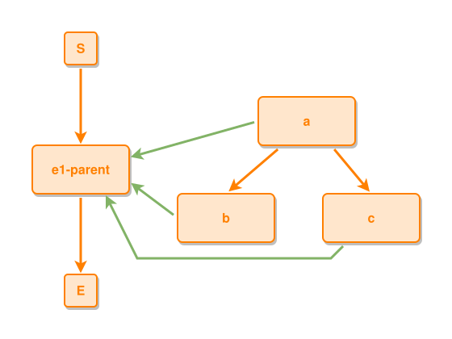

The sub-structure is a SKELETON recursively (v7P3): rank rows over the
siblings' own leads-to. A chain is the degenerate one-column case; a
FORK spreads its branches side by side on ONE row — never stacked as if
they were sequential — and the fork parent CENTRES over its branches'
midpoint (v7P3: forks spread symmetrically). Every sub still connects
to the composite on the horizontal; the later row-mate's part-of goes
UNDER the row — out of c's bottom, along a lane centred in the FREE gap
below (room-aware, v7P8: half the free room, at most one clearance),
and up into the composite's bottom. With the lane centred this route
crosses NOTHING; it beats the above-the-row dogleg, which would pay
the 1.5 sub-grid crossing over a→b (the dogleg remains the fallback
where the under-lane is blocked). Border-hugging is out either way: an
edge must DEPART its port through the side's outward normal at a
readable angle, so the degenerate zero-height "vertical" along three
borders is no candidate at all.

```ipmdev-layout-rule
@scope local
each edge has max-bends=0 except #c,#e1-parent
edge #c,#e1-parent has max-bends=2
edge #c,#e1-parent has source-side=bottom
edge #c,#e1-parent has target-side=bottom
all #b,#c have same y
#c is right-of #b with gap=60
#a is horizontally-centered-between #b,#c
#b is below #a with gap=60
edge #a,#b has visibility=visible
edge #a,#c has visibility=visible
```

### a sub-grid return lane centres in the free row gap

```ipmt
e1-parent ::e
a ::e --::P--> e1-parent
b ::e --::P--> e1-parent
c ::e --::P--> e1-parent
d ::e --::P--> e1-parent
a --> b
a --> c
b --> d
c --> d
```
<!-- ipm-svg id=1e5 hash=cdb91491 -->
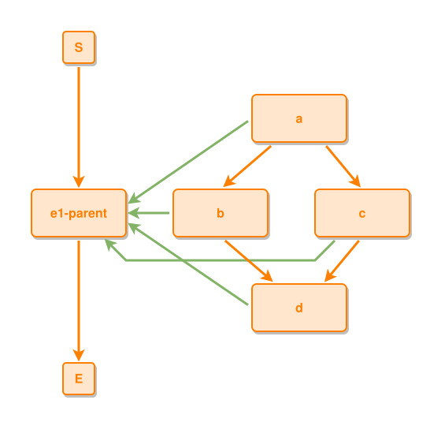

A full diamond (fork AND join) inside the composite. The later
row-mate's return (c→e1-parent) goes under its row as usual — but the lane
is ROOM-AWARE (v7P8): it centres in the FREE gap
between c's row and d's row (half the free room, at most one clearance)
instead of hanging a fixed clearance below, which ran too close to the
join's incoming arrows, and it climbs OUT and back IN on 45° hops —
border to lane, the same diagonal the tie bypass uses (the square
stubs "can be diagonal — that would look nicer").
The lane still crosses the b→d fork
link mid-flight — the 1.5 sub-grid price, cheaper than any hit.

```ipmdev-layout-rule
@scope local
all #b,#c have same y
#a is horizontally-centered-between #b,#c
all #a,#d have same center-x
each edge has max-bends=0 except #c,#e1-parent
edge #c,#e1-parent has max-bends=2
edge #c,#e1-parent has source-side=bottom
edge #c,#e1-parent has target-side=bottom
```

### a sub-structure diamond forks and rejoins

```ipmt
e1-parent ::e
a ::e --::P--> e1-parent
b ::e --::P--> e1-parent
c ::e --::P--> e1-parent
d ::e --::P--> e1-parent
a --> b
a --> c
b --> d
c --> d
```
<!-- ipm-svg id=1e6 hash=cdb91491 -->


Fork AND join: 'b' and 'c' share the branch row, 'd' rejoins one row
below — the same rank arithmetic the top-level skeleton uses, one level
in. The join lands back on the grid's axis. A diamond grid is CLOSED on
every flank, so the second branch's part-of into the composite must
cross a fan whichever way it runs — it takes the least-crossing lane
around the row (v7P9's least-bad; structural edges never hide).

```ipmdev-layout-rule
@scope local
each edge has max-bends=0 except #c,#e1-parent
edge #c,#e1-parent has max-bends=2
all #b,#c have same y
#c is right-of #b with gap=60
#a is horizontally-centered-between #b,#c
all #a,#d have same center-x
#b is below #a with gap=60
#d is below #b with gap=60
edge #a,#b has visibility=visible
edge #a,#c has visibility=visible
edge #b,#d has visibility=visible
edge #c,#d has visibility=visible
```

### sub-event phases fork inside the composite

```ipmt
e1 ::e
tA --> e1
e1a ::e --::P--> e1
e1b ::e --::P--> e1
e1c ::e --::P--> e1
e1d ::e --::P--> e1
e1a --> e1b
e1b --> e1c
e1b --> e1d
e1a1 ::e --::P--> e1a
e1a2 ::e --::P--> e1a
e1a1 --> e1a2
```
<!-- ipm-svg id=1e7 hash=b56d3cc7 -->
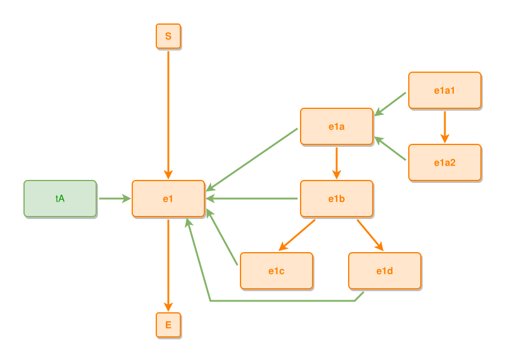

Four sub-event phases part-of one composite event, 'e1b' forking into
the two terminal phases — which share their row — and 'e1a' nesting its
own two-step sub-chain one level deeper. Every phase keeps its
horizontal part-of into the composite; the flow reads top-to-bottom
through the grid. A later row-mate's part-of goes AROUND its row (under
it, two bends) — hugging the row-mate's border would read as touching
(v7P8).

```ipmdev-layout-rule
@scope local
each edge has max-bends=0 except #e1d,#e1
edge #e1d,#e1 has max-bends=2
all #e1c,#e1d have same y
#e1d is right-of #e1c with gap=60
#e1b is horizontally-centered-between #e1c,#e1d
all #e1a,#e1b have same center-x
#e1b is below #e1a with gap=60
#e1c is below #e1b with gap=60
#e1a1 is right-of #e1a with gap=60
all #e1a1,#e1a2 have same center-x
#e1a2 is below #e1a1 with gap=60
#tA is left-of #e1 with gap=60
edge #e1b,#e1c has visibility=visible
edge #e1b,#e1d has visibility=visible
```

### a leads-to out of a sub-event runs down under it

```ipmt
e1 ::e
e1a ::e --::P--> e1
e1a --> e2 ::e
e2 --> e3 ::e
```
<!-- ipm-svg id=1e8 hash=ea6f7b7b -->
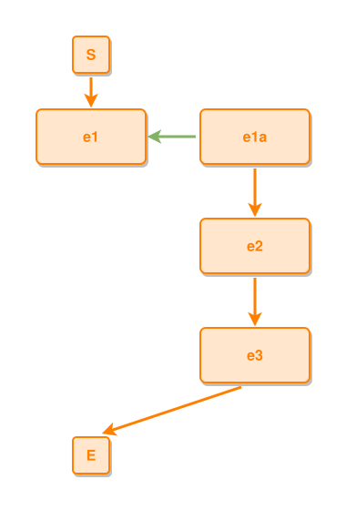

'e1a' is part-of 'e1' and leads to 'e2', which is not a member of anything.
The leads-to points DOWN (v7P3): 'e2' ranks below the composite and takes
the sub-event's COLUMN, so 'e1a' → 'e2' is one vertical line, and 'e3'
follows in the same lane. Before this, only leads-to between top-level
events ranked: 'e2' had no predecessor, was drawn as a start (S onto it) on
the composite's row, and its leads-to was a slant — in the zoom canvas the
lifted edge was a U under both boxes (kubernetes: sidecar container →
separation of concerns). S stays on 'e1' — the one start; E caps the
timeline on the S axis (asymmetric terminals centre the boundaries), so
'e3' → E may slant.

```ipmdev-layout-rule
@scope local
#e1a is right-of #e1 with gap=60
all #e1a,#e2,#e3 have same center-x
#e2 is below #e1a with gap=60
#e3 is below #e2 with gap=60
edge #e1a,#e2 is vertical
edge #e2,#e3 is vertical
edge #e1a,#e2 has visibility=visible
all #S,#e1 have same center-x
#S is above #e1 with gap=40
#E is below #e3 with gap=60
```

### a leads-to into a sub-event lanes the composite under the predecessor

```ipmt
prep ::e --> chop ::e
chop --::P--> cook ::e
cook --> serve ::e
```
<!-- ipm-svg id=1f8 hash=d4299763 -->
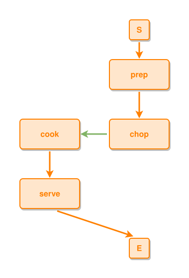

'prep' leads to 'chop', a part of 'cook'; 'cook' leads to 'serve'. One story,
one column of time: 'cook' ranks below 'prep' (the leads-to into its member
counts for the composite), and it is laned so that 'chop' — the member the
edge enters — sits under 'prep': 'prep' → 'chop' is vertical, 'cook' one
column to the LEFT of that lane, 'serve' under 'cook'. Before this, 'prep'
had no top-level successor and got its own S and E beside 'cook'.

```ipmdev-layout-rule
@scope local
all #prep,#chop have same center-x
#chop is below #prep with gap=20
edge #prep,#chop is vertical
#chop is right-of #cook with gap=60
all #cook,#serve have same center-x
#serve is below #cook with gap=60
edge #cook,#serve is vertical
all #S,#prep have same center-x
#S is above #prep with gap=40
#E is below #serve with gap=60
```

### a shared part keeps its band and ties its second anchor

```ipmt
P ::e
p1 ::e --::P--> P
p2 ::e --::P--> P
p3 ::e --::P--> P
p1 --> p2 --> p3
p1 --> cX ::c
tS ::t --> p1, p2
```
<!-- ipm-svg id=1e9 hash=43e0e656 -->
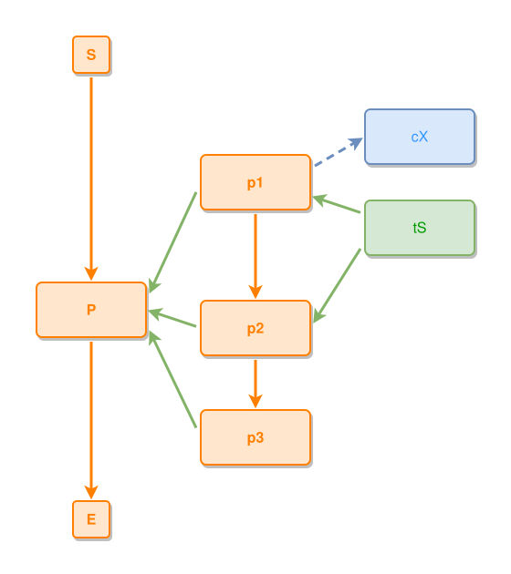

'tS' is part of BOTH p1 and p2. It does NOT hover centred between them:
a shared thing is placed by its FIRST anchor's band like any other member
and its further connectors DRAW as ties (anchor-and-tie, v7P1/P7:
part-of never repositions anything against the flow). The band orders by
PULL (v7P4): tS's tie
points DOWNSTREAM to p2, so tS takes the band's LOWER end, nearest it —
cX on top, tS below — and the tie drops to p2 without crossing the
p1→cX edge. The band's middle stays on p1's centre.

```ipmdev-layout-rule
@scope local
all #cX,#tS have same center-x
#tS is below #cX with gap=40
#tS is right-of #p1 with gap=60
#p1 is vertically-centered-between #cX,#tS
edge #tS,#p2 has visibility=visible
edge #tS,#p2 does not cross edge #p1,#cX
```

## Layered composites with aux

Dedicated cases for **part-of event layers with things and concepts attached
at the different layers**. The governing principle: **grow vertical space to
save horizontal space and avoid edge crossings** — aux connected only to
layer N stacks beside that layer (the lone exclusive concept half-tucks just
below its event), aux connected to several layers rises above the rows it
spans (or takes the free diagonal grid cell when that spot is occupied), and
vertical room grows elastically only between the rows that actually collide.

### one concept on the inner layer

```ipmt
e1-mid ::e --::P--> e2-outer ::e
e3-deep ::e --::P--> e1-mid
e1-mid --> c1-note ::c
```
<!-- ipm-svg id=1ei hash=36d3ab65 -->
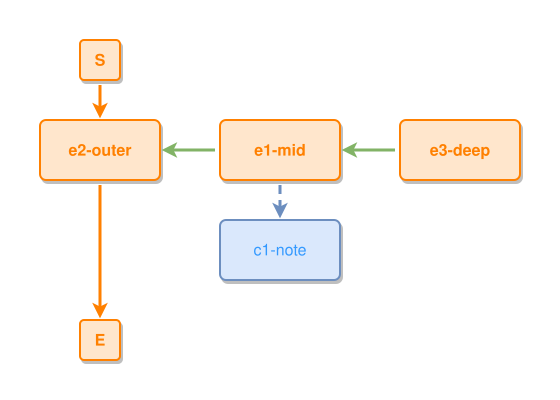

'e1-mid' is layer 2 (right of the spine) and owns layer 3 ('e3-deep'). A
composite's sub-event column OWNS its right side (v7P3: part-of indents
right) and its left ROW hosts the parent's part-of corridor (v7P6:
reserved) — so the concept DROPS BELOW, centred on its owner:
the shortest possible edge, both corridors clear, and E
still CAPS the timeline below it (v7P3). Layer 3 keeps one standard gap
from layer 2.

```ipmdev-layout-rule
@scope local
all #e2-outer,#e1-mid,#e3-deep have same y
all #c1-note,#e1-mid have same center-x
#c1-note is below #e1-mid with gap=40
#e3-deep is right-of #e1-mid with gap=60
node #c1-note does not straddle edge #e3-deep,#e1-mid
node #c1-note does not straddle edge #e1-mid,#e2-outer
#E is below #c1-note with gap=40
```

### two concepts on the inner layer

```ipmt
e1-mid ::e --::P--> e2-outer ::e
e3-deep ::e --::P--> e1-mid
e1-mid --> c1-noteA ::c
e1-mid --> c2-noteB ::c
```
<!-- ipm-svg id=1er hash=a216e155 -->
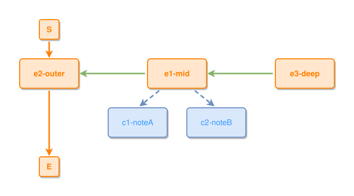

Several concepts of one composite owner are ONE GENERATION: they drop
BELOW the owner as a ROW (both row sides are part-of corridors, v7P6),
side by side and centred on it — the same horizontal line, like any
same-layer siblings (v7P4). Each connector is a short straight from the
owner's bottom fan; a column here would read as layers and force the
lower connector around its sibling.

```ipmdev-layout-rule
@scope local
each edge has max-bends=0
all #e2-outer,#e1-mid,#e3-deep have same y
#e3-deep is right-of #c2-noteB with gap=60
all #c1-noteA,#c2-noteB have same y
#c1-noteA is below #e1-mid with gap=40
#c1-noteA is left-of #c2-noteB with gap=40
#e1-mid is horizontally-centered-between #c1-noteA,#c2-noteB
```

### an inner event's thing fan keeps its sole concept below

```ipmt
e1 ::e
e1a ::e --::P--> e1
w1 ::t, w2 ::t --> e1a
e1a --> c1-note ::c
```
<!-- ipm-svg id=1et hash=7fb8c94f -->
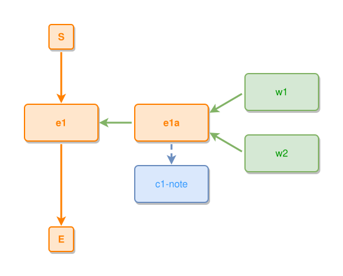

An inner event whose forced side already hosts a part-of THING-FAN (two or
more things) does NOT stack its single expressed concept into that band —
stacked with the fan the concept reads as one more part-of member.
The band holds the THINGS alone, centred on the event; the
SOLE leaf concept drops BELOW the event, x-centred, at the stack rhythm —
the same below-drop every other sole concept takes (v7P4).

```ipmdev-layout-rule
@scope local
all #w1,#w2 have same center-x
#w1 is right-of #e1a with gap=60
#w2 is below #w1 with gap=40
#e1a is vertically-centered-between #w1,#w2
all #e1a,#c1-note have same center-x
#c1-note is below #e1a with gap=40
```

### a stack member's own concept steps outward, under the shared one

```ipmt
tA ::t --> cX ::c
tB ::t --> cX
tB --> cY ::c
e1 ::e --> e2 ::e
e2 --> cZ ::c
tA --> e1
tB --> e1
tB --> e2
t1-shared ::t --> e1
t1-shared --> e2
```
<!-- ipm-svg id=1eu hash=0ee53695 -->
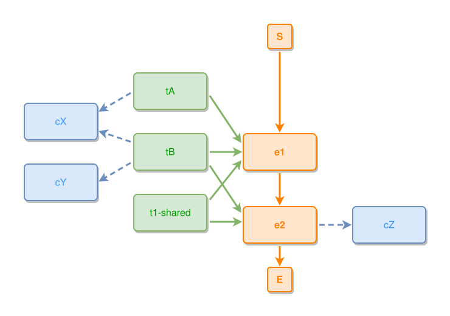

'tA', 'tB' and 't1-shared' stack in e1's thing band; 'cX'
(expressed by the adjacent pair) brackets them one column outward. A
sole LEAF concept normally drops straight below its expresser — but
'tB' sits in a STACK, and the spot below is 't1-shared', a sibling:
collision-stepping 'cY' past the stack would read as one more
thing in the column. It joins the concept COLUMN instead (v7P4:
cY belongs below cX), stacking at the
column's rhythm directly under 'cX' and FOLLOWING it when the
bracket recentres — landing SYMMETRIC to 'cX' about their
shared owner 'tB' (both are tB's concepts, so they mirror about
it).

```ipmdev-layout-rule
@scope local
all #tA,#tB,#t1-shared have same center-x
all #cX,#cY have same center-x
#cY is below #cX with gap=40
#tB is vertically-centered-between #cX,#cY
edge #tB,#cY has visibility=visible
```

### a concept at every layer

```ipmt
l2 ::e --::P--> l1 ::e
l3 ::e --::P--> l2
l4 ::e --::P--> l3
l5 ::e --::P--> l4
l1 --> c1 ::c
l2 --> c2 ::c
l3 --> c3 ::c
l4 --> c4 ::c
l5 --> c5 ::c
```
<!-- ipm-svg id=1ev hash=2126db11 -->
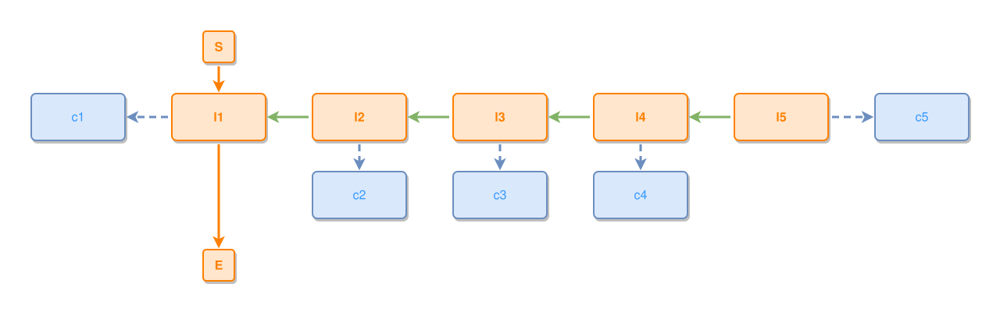

None of these layers is a fork (each has exactly one child), so **all five
events share one horizontal line** — vertical stacking is what forks are for.
Every layer keeps its own concept beside itself: the spine composite's
concept sits on the row to its left; each INNER composite's concept DROPS
BELOW, centred on its owner (both row sides are part-of
corridors, v7P6), giving a readable below-row rhythm; the innermost leaf
layer's concept sits on its outer (right) side. Every layer keeps one
standard gap from its neighbour column, and E still caps the whole
timeline (v7P3).

```ipmdev-layout-rule
@scope local
all #l1,#l2,#l3,#l4,#l5 have same y
#c1 is left-of #l1 with gap=60
all #c2,#l2 have same center-x
#c2 is below #l2 with gap=40
all #c3,#l3 have same center-x
#c3 is below #l3 with gap=40
all #c4,#l4 have same center-x
#c4 is below #l4 with gap=40
#c5 is right-of #l5 with gap=60
all #l5,#c5 have same y
node #c2 does not straddle edge #l3,#l2
node #c3 does not straddle edge #l4,#l3
node #c4 does not straddle edge #l5,#l4
node #c2 does not straddle edge #l2,#l1
node #c3 does not straddle edge #l3,#l2
node #c4 does not straddle edge #l4,#l3
```

### forks at two layers with aux everywhere

A top event whose THREE
children fork vertically, the middle child forking again into three
grandchildren, with things and concepts attached at every layer. Forks stack
vertically in their column; the fork-owning middle child half-tucks its lone
concept; things spanning two layers anchor on their deepest layer's row
(v7P7), their shallower connectors drawing as ties.

```ipmt
e1 ::e --> e2 ::e --> e3 ::e
e1, e2, e3 --::P--> e0 ::e
tA ::t --> e1
tB ::t --> e3

e2a ::e --::P--> e2
e2b ::e --::P--> e2
e2c ::e --::P--> e2
e2a --> e2b --> e2c
e2 --> cS ::c

tP ::t --> e0, cH ::c
tA --> e2a
tB --> e2c
```
<!-- ipm-svg id=1ex hash=73ba9673 -->
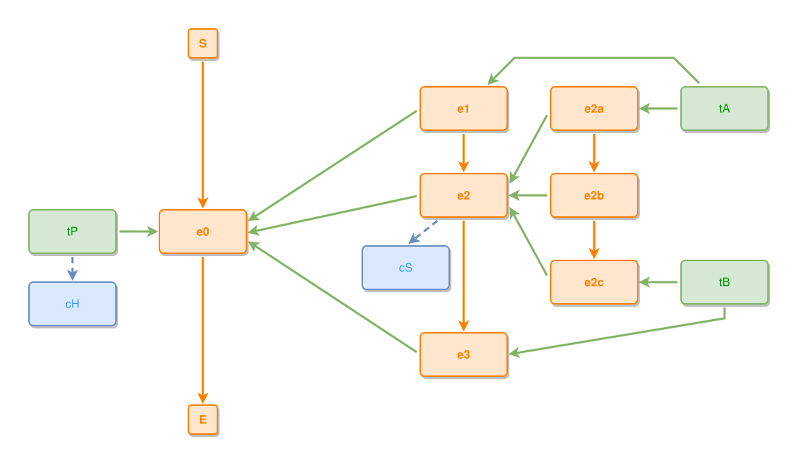

The third layer (e2a..e2c) costs only HORIZONTAL space: the sub-events
stack in their own column right of their parents' rows, each on its
anchor row, and the parent sits centred on its fork (v7P3/P6). The
layer-spanning things anchor at their DEEPEST layer (v7P7): 'tA' sits on
e2a's row outward of the sub-column, 'tB' mirrors on e2c's — each a
straight connector. Their first-layer connectors DEMOTE to ties that
bypass the whole block on the travel axis (v7P9): tA→e1 runs the lane
ABOVE the top row, tB→e3 the lane BELOW the bottom one — around the fan,
never through it. The concepts keep their bands: 'cS' TUCKS
under e2 in the wedge beside the flow corridor — the e2→e3 row gap
GROWS one step so the e3→e0 fan line passes a full visible gap below
the wedge (v7P8 §4 demand: a stranded leaf posts row growth and the
layout re-solves once — add vertical space, place
the node closer) — and 'cH', tP's sole leaf
concept, drops directly BELOW it, centred — the closest spot. As e2's
SOLE band member, cS takes no side port: nothing shares the border, so
its connector follows the dominant travel axis — out of e2's bottom
onto cS's top, one clean diagonal (v7P9), crossing nothing.

```ipmdev-layout-rule
@scope local
each edge has max-bends=0 except #tA,#e1 #tB,#e3
edge #tA,#e1 has max-bends=2
edge #tB,#e3 has max-bends=2
edge #tA,#e1 has visibility=visible
edge #tB,#e3 has visibility=visible
all #e1,#e2,#e3 have same center-x
all #e2a,#e2b,#e2c have same center-x
#e2 is below #e1 with gap=60
all #e2,#e2b have same y
#e0 is vertically-centered-between #e1,#e3
#e2 is vertically-centered-between #e2a,#e2c
all #tA,#e2a,#e1 have same y
all #tB,#e2c have same y
#tA is right-of #e2a with gap=60
#tB is right-of #e2c with gap=60
#cS is below #e2 with gap=40
edge #e2,#cS does not cross edge #e3,#e0
edge #e3,#e0 does not cross edge #tP,#e0
#tP is left-of #e0 with gap=60
all #cH,#tP have same center-x
#cH is below #tP with gap=40
node #cS does not straddle edge #e2a,#e2
```

### thing connected to two layers

```ipmt
e1-mid ::e --::P--> e2-outer ::e
e3-deep ::e --::P--> e1-mid
t1-span ::t --> e2-outer
t1-span --> e1-mid
e1-mid --> c1-note ::c
```
<!-- ipm-svg id=1ey hash=ce834b66 -->
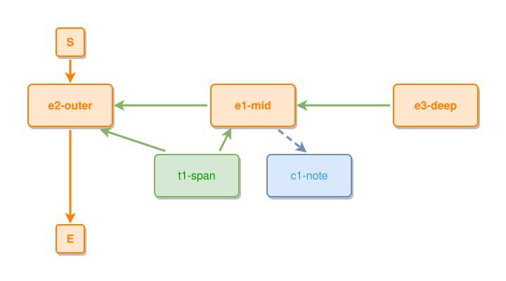

't1-span' participates in BOTH layer 1 and layer 2. It does NOT rise centred
above the layers: a shared thing anchors at its DEEPEST user (v7P7) — 'e1-mid'
— and its 'e2-outer' connector DEMOTES to a short drawn tie (anchor-and-tie,
v7P1/P7). Both edges leave t1-span's TOP: same-kind edges from one node
share ONE exit side — the user wrote one relation, and anchor-vs-tie is
the engine's internal coin ("aim for symmetry — use one side for the
same edge type and direction"). e1-mid's below band is
ONE GENERATION (v7P4): 't1-span' and the
exclusive concept 'c1-note' share the row under e1-mid — things first, concepts
last — each on a short straight connector from e1-mid's bottom; E caps the
timeline under the row.

```ipmdev-layout-rule
@scope local
each edge has max-bends=0
all #e2-outer,#e1-mid,#e3-deep have same y
all #t1-span,#c1-note have same y
#t1-span is below #e1-mid with gap=40
#t1-span is left-of #c1-note with gap=40
#e1-mid is horizontally-centered-between #t1-span,#c1-note
edge #t1-span,#e2-outer has visibility=visible
edge #t1-span,#e1-mid has visibility=visible
edge #t1-span,#e2-outer has source-side=top
edge #t1-span,#e1-mid has source-side=top
edge #t1-span,#e2-outer has target-side=bottom
edge #t1-span,#e1-mid has target-side=bottom
#S is above #e2-outer with gap=40
#E is below #t1-span with gap=40
```

### thing connected to three layers

```ipmt
m2 ::e --::P--> m1 ::e
m3 ::e --::P--> m2
m4 ::e --::P--> m3
tW ::t --> m1
tW --> m2
tW --> m3
```
<!-- ipm-svg id=1ez hash=7df2cfaa -->
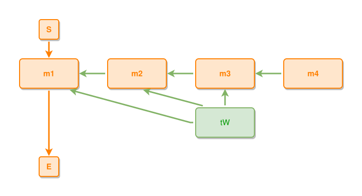

The same anchor-and-tie holds for ANY number of anchors: 'tW' anchors its
DEEPEST layer (v7P7) — 'm3' — hanging below it with a straight connector
up; the ties to the shallower layers fan by approach angle from tW's side
(the nearest straight, the farthest — to m1 — taking a one-bend leg;
v7P9 — the steeper line takes the slot nearer its heading, so the fan
never crosses itself). No bypasses, no
hovering over the layers.

```ipmdev-layout-rule
@scope local
each edge has max-bends=0 except #tW,#m1
edge #tW,#m1 has max-bends=1
all #m1,#m2,#m3,#m4 have same y
all #tW,#m3 have same center-x
#tW is below #m3 with gap=40
edge #tW,#m1 has visibility=visible
edge #tW,#m2 has target-side=bottom
edge #tW,#m3 has target-side=bottom
edge #tW,#m2 has visibility=visible
#S is above #m1 with gap=40
#E is below #tW with gap=40
```

### a band member's ties fan from its facing side

```ipmt
e1 ::e
  --> e2 ::e
  --> e3 ::e

tP --> e1, e2, e3
```
<!-- ipm-svg id=1fz hash=377a4a24 -->
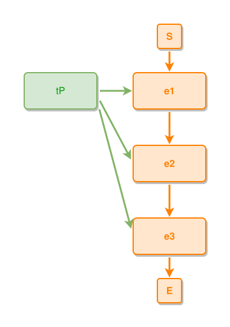

`tP` is part-of every event of one chain: it anchors at `e1` (its first
declared user, all three equally deep — v7P7) and sits ON e1's row in the
left band, meeting e1 on the horizontal through its facing side. Its two
ties down the chain leave that SAME side and land on e2's and e3's facing
sides — v7P9 "use one side for the same edge type and direction", the
band reading. They used to unify on the VERTICAL side instead (the rule
'thing connected to two layers' still shows for a node with no on-row
edge): the second and third ties dropped off tP's bottom onto the events'
top corners while the first left its side (Patrick, part-of every step:
"if he is connected via his left side at the top-most connection, the
other two should prefer the left side too"). Each join holds inside the
150° cap — border gaps, and under 5:1 by centres, tall boxes lie the other
way — on a clean trial straight, with at most two such arrivals per side;
a steeper or third tie keeps its vertical exit. The exits spread in
approach order down the side, the on-row edge on the midline.

```ipmdev-layout-rule
@scope local
each edge has max-bends=0
all #tP,#e1 have same y
#tP is left-of #e1 with gap=60
edge #tP,#e1 has source-side=right
edge #tP,#e2 has source-side=right
edge #tP,#e3 has source-side=right
edge #tP,#e1 has target-side=left
edge #tP,#e2 has target-side=left
edge #tP,#e3 has target-side=left
edge #tP,#e1 has source-position=0.5
edge #tP,#e1 does not cross edge #tP,#e2
edge #tP,#e2 does not cross edge #tP,#e3
edge #tP,#e1 does not cross edge #tP,#e3
```

### declaration order does not decide where a chain-spanning thing sits

The same graph as the previous case with the users declared in the OTHER
order: `tP --> e3, e2, e1`. It anchors at `e1` all the same. v7P7 breaks
depth ties by declaration order — but among users that FLOW orders (all
three on one leads-to chain), the upstream one wins first, and declaration
order decides only between users flow does not order (parallel branches,
separate chains). Time reads down (v7P3): a thing that is part of every
event of a story, anchored at its LAST event, reads as arriving at the end;
at the first it reads as present throughout, which is what the source says.
It used to anchor at `e3` because `e3` was declared first, and this section
existed to test the port fan going UP the chain; that fan is the previous
case's mirror and needs no separate example, so the case now pins the
election instead. The ports fan exactly as in the previous case: all three
leave `tP`'s facing side in approach order down it, the on-row edge on the
midline, and land on the events' facing sides.

```ipmt
e1 ::e
  --> e2 ::e
  --> e3 ::e

tP --> e3, e2, e1
```
<!-- ipm-svg id=1gz hash=1277ceb4 -->
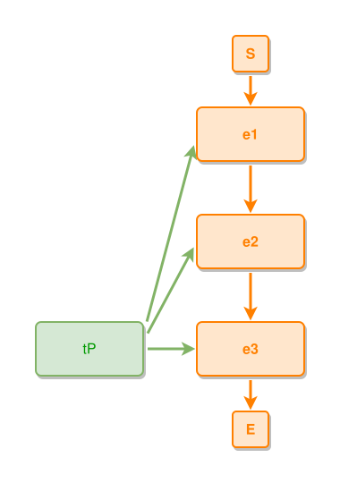

```ipmdev-layout-rule
@scope local
each edge has max-bends=0
#tP is left-of #e1 with gap=60
all #tP,#e1 have same y
edge #tP,#e1 has source-side=right
edge #tP,#e2 has source-side=right
edge #tP,#e3 has source-side=right
edge #tP,#e1 has target-side=left
edge #tP,#e2 has target-side=left
edge #tP,#e3 has target-side=left
edge #tP,#e1 has source-position=0.5
edge #tP,#e3 has source-position=0.75
edge #tP,#e1 does not cross edge #tP,#e2
edge #tP,#e2 does not cross edge #tP,#e3
edge #tP,#e1 does not cross edge #tP,#e3
```

## Things

### one thing

```ipmt
t1
```
<!-- ipm-svg id=1f0 hash=628b49d9 -->
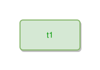

Visual rules:
- Thing 't1' is light green.
- Font color is dark green.
- Node has a thin dark green border.

Layout rules:
- Base size of 't1' is 120x60 px (same as event node base size).
- There are no 'S' and 'E' implicit nodes for things.

```ipmdev-layout-rule
@scope local
each type=thing has size=120x60
```

### one thing with long text

```ipmt
This thing is very important and has a long description text. It can be so so very very so long.
```
<!-- ipm-svg id=1g0 hash=e8703b73 -->


Layout rules:
- Things can have long text too.
- Thing with long description text should grow vertically to fit text (similar to events).

```ipmdev-layout-rule
@scope local
each type=thing text-len>72 has height>=140
```

### two things connected

```ipmt
t1pA --> t1
```
<!-- ipm-svg id=1h0 hash=b8ef4ff5 -->
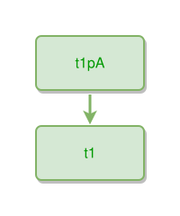

Visual rules:
- Thing 't1pA' is part of 't1'.
- Arrow leads from 't1pA' to 't1' and is straight solid dark green.

Layout rules:
- Nodes share one vertical centre line — a clean column, like the event spine.
- The part 't1pA' sits directly **above** its whole 't1' (part on top, whole below).
- Vertical gap from t1pA bottom edge to t1 top edge is 40px.

```ipmdev-layout-rule
@scope local
#t1pA is above #t1 with gap=40
all #t1pA,#t1 have same center-x
```

### five things connected

```ipmt
t1-aaaa --> t1-aaa --> t1-aa --> t1-a --> t1
```
<!-- ipm-svg id=1i0 hash=10faff4c -->
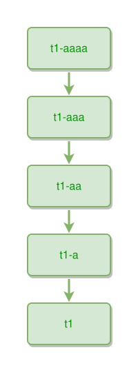

Layout rules:
- 't1' (outermost whole) is at the bottom of the column.
- 't1-aaaa' (deepest part) is at the top.
- All nodes are connected via part-of edges and stack as **one vertical column**
  on a shared centre line — deepest part on top, outermost whole at the bottom,
  each part directly above its whole with a 40px gap.

```ipmdev-layout-rule
@scope local
edge #t1-aaaa,#t1-aaa has type=partof
edge #t1-aaa,#t1-aa has type=partof
edge #t1-aa,#t1-a has type=partof
edge #t1-a,#t1 has type=partof
#t1-a is above #t1 with gap=40
all #t1-a,#t1 have same center-x
#t1-aa is above #t1-a with gap=40
all #t1-aa,#t1-a have same center-x
#t1-aaa is above #t1-aa with gap=40
all #t1-aaa,#t1-aa have same center-x
#t1-aaaa is above #t1-aaa with gap=40
all #t1-aaaa,#t1-aaa have same center-x
```

### thing hierarchy diamond pattern

```ipmt
tA --> tB
tA --> tC
tB --> tD
tC --> tD
```
<!-- ipm-svg id=1j0 hash=910e1693 -->
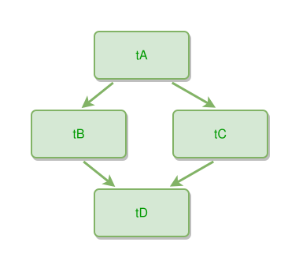

Layout rules:
- 'tA' is the root at the top row.
- 'tB' and 'tC' are siblings on the same middle row (fork of tA).
- 'tD' is the join node at the bottom row, centered below tA on the tA–tD spine.
- 'tB' and 'tC' share the same Y coordinate.

```ipmdev-layout-rule
@scope local
all #tB,#tC have same y
#tD is below #tB with gap=40
#tA is above #tB with gap=40
all #tA,#tD have same center-x
```

### thing hierarchy multiple roots

```ipmt
tV --> tX
tW --> tX
tX --> tY
```
<!-- ipm-svg id=1k0 hash=75f247cd -->
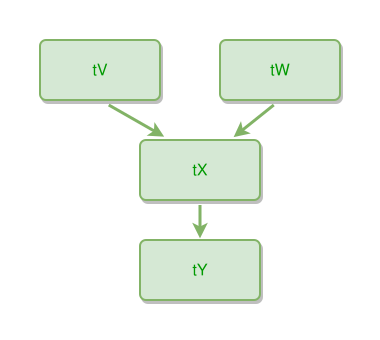

Layout rules:
- 'tV' and 'tW' are both roots with no incoming edges, placed on the same top row.
- 'tX' is the join of tV and tW, on the middle row.
- 'tY' is at the bottom row.
- 'tV' and 'tW' share the same Y coordinate.

```ipmdev-layout-rule
@scope local
all #tV,#tW have same y
#tX is below #tV with gap=40
#tY is below #tX with gap=40
```

### thing hierarchy sibling near-to clustering

```ipmt
tRoot --> tB
tRoot --> tC
tRoot --> tD
tB --- tD
```
<!-- ipm-svg id=1l0 hash=c69a0dde -->
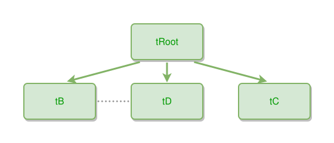

Layout rules:
- All three children 'tB', 'tC', 'tD' are siblings on the same row.
- 'tB' and 'tD' are connected by a near-to edge; they are clustered adjacent to each other.
- 'tC' (the non-near-to sibling) is placed away from the tB/tD cluster.
- All children share the same Y coordinate.
- The fork from 'tRoot' lands as a **fan on the children's top borders** — the
  outer members too, even though their edges reach further sideways than down.
  Landing on a child's side would cut the diagonal across the near-to link that
  runs along the children's row.
- The near-to edge between the same-row pair stays a straight horizontal line,
  and no part-of edge crosses it.

```ipmdev-layout-rule
@scope local
all #tB,#tC,#tD have same y
edge #tRoot,#tB has target-side=top
edge #tRoot,#tC has target-side=top
edge #tRoot,#tD has target-side=top
edge #tB,#tD is horizontal
edge #tRoot,#tB does not cross edge #tB,#tD
edge #tRoot,#tC does not cross edge #tB,#tD
#tD is right-of #tB with gap=60
#tC is right-of #tD with gap=60
```

### thing parts keep their own concepts above the join

```ipmt
tA, tB, tC --> tD
tA --> cX ::c
tB --> cY ::c
tC --> cZ ::c
```
<!-- ipm-svg id=1l9 hash=82e26f16 -->
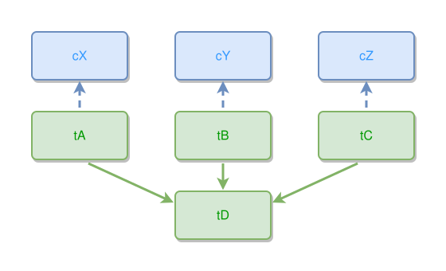

Three thing parts join into one whole, and each part expresses its OWN
concept. Those concepts
are AUX of their things, not hierarchy children: an EXCLUSIVE sole-parent
LEAF concept whose parent keeps a real hierarchy child (here the join whole)
is lifted out of the levels and rides as a SATELLITE, x-centred directly
ABOVE its top-row thing with a short vertical expresses edge. Left in the
levels, the three concepts piled into the join whole's row and the fan-in
centering plus the overlap resolver staggered the parts diagonally. Shared
concepts (≥2 parents), concepts with children, and things whose children are
ONLY leaf concepts (the plain expresses fan, "concept collision detection")
keep the level layout.

```ipmdev-layout-rule
@scope local
all #cX,#cY,#cZ have same y
all #tA,#tB,#tC have same y
all #tA,#cX have same center-x
all #tB,#cY have same center-x
all #tC,#cZ have same center-x
#cX is above #tA with gap=40
#tD is below #tB with gap=40
all #tB,#tD have same center-x
edge #tB,#tD is vertical
```

### a thing hierarchy and its concepts join the event chain

```ipmt
e1 ::e --> e2 ::e
tA ::t --> e1
tD ::t --> e2
tB ::t --> tA
tC ::t --> tA
tD --> cX ::c
cY ::c --> cX
```
<!-- ipm-svg id=1lb hash=fdd0fea8 -->
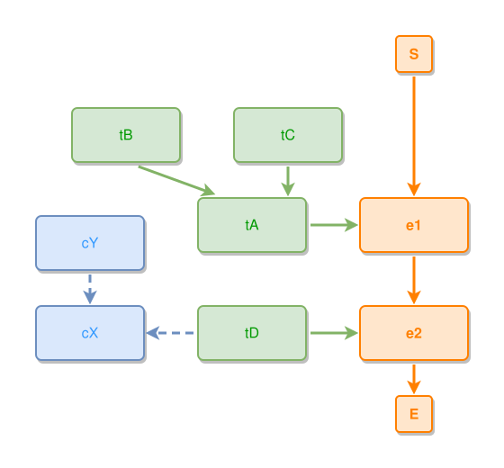

The integration of the three kinds around one chain: 'tA' participates
in e1 and fully OWNS its two parts, which share ONE generation row above
it (v7P4: tB and tC are equal siblings — a tower would read as a
chain); both connectors are short straights. 'tD'
participates in e2 and expresses 'cX' — but 'cX' is NOT tD's exclusive
subtree ('cY' anchors it, v7P7), so the cX/cY pair is its own EVENT-LESS
tile tied to tD. An event-less tile is satellite CONTENT, not a separate
story: tied by a placing-kind relation it HUGS at the attached-column
gap (60) on tD's row, its tie one short straight — the full component
gap held it too far ("distance of tD and cX seem too wide"). Every
kind keeps its band.

```ipmdev-layout-rule
@scope local
each edge has max-bends=0
all #tA,#e1 have same y
all #tD,#e2 have same y
#tA is left-of #e1 with gap=60
#tD is left-of #e2 with gap=60
all #tB,#tC have same y
#tB is left-of #tC with gap=60
#tC is above #tA with gap=40
#cX is left-of #tD with gap=60
all #cX,#tD have same y
all #cX,#cY have same center-x
#cY is above #cX with gap=40
edge #tD,#cX has visibility=visible
edge #cY,#cX has visibility=visible
```

### a part of two wholes stays on the root row

```ipmt
tA --> tB
tB --> tC
tD, tE --> tF
tA --> tF
tG, tH, tI --> cX ::c
tD, tE --> cX
```
<!-- ipm-svg id=1ld hash=f2601a99 -->
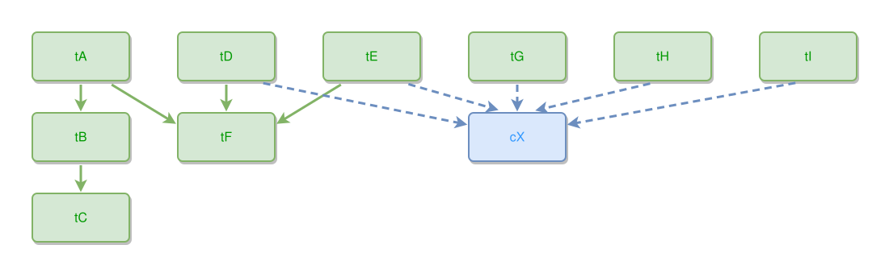

'tA' is a part of TWO wholes ('tB' and 'tF'), so
the child-barycentre centering pulls it toward their midpoint — straight into
'tD', its root-row neighbour. The row centering is solved as ONE 1D
separation problem (`SolveSeparations`): every root centres as far toward its
barycentre as the row's min gaps allow, simultaneously, so 'tA'
stops beside 'tD' and STAYS ON THE ROOT ROW (without the row-level solve
it is shoved 60px above its siblings — the leftover overlap resolved
vertically by the overlap resolver instead of horizontally within the row).

```ipmdev-layout-rule
@scope local
all #tA,#tD,#tE,#tG,#tH,#tI have same y
all #tB,#tF,#cX have same y
all #tB,#tC have same center-x
#tC is below #tB with gap=40
#tD is right-of #tA with gap=60
```

### concept fan-in keeps the chain gap below its parents

```ipmt
tA ::t --> cA ::c --> cRoot ::c
tB ::t --> cB ::c --> cRoot
```
<!-- ipm-svg id=1li hash=bbd026c4 -->
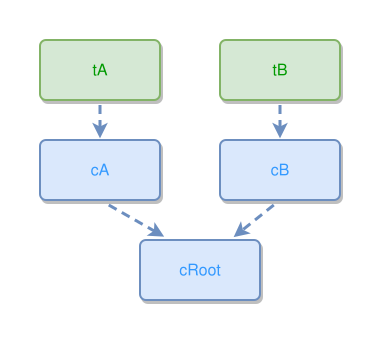

Two concept chains merging into one root: 'cRoot' centers horizontally
between its parents AND keeps the full standalone chain gap below them — the
by-children centering used to slide it under a parent with only the 10px
overlap floor left — a corner-kiss between the merging chains.

```ipmdev-layout-rule
@scope local
#cRoot is horizontally-centered-between #cA,#cB
#cRoot is below #cA with gap=40
all #cA,#cB have same y
```

## Event - Thing connections

### thing part of event

```ipmt
tA --> e1 ::e
```
<!-- ipm-svg id=1m0 hash=59a7de16 -->
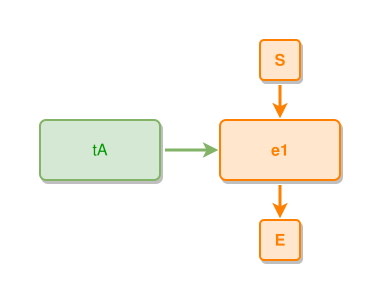

Visual rules:
- Thing 'tA' is green.
- Arrow from thing to event is green (PartOf relation: thing is part of / hosted by the event).

Layout rules:
- Thing sits on the event's THING side — the **left** band (v7 canon: things
  left, concepts right; the spec states the grammar for one side and mirrors
  it), on the same row (not above it).
- Same vertical centre as e1 (`have same y`).
- Horizontal gap from tA right edge to e1 left edge is 60px.

```ipmdev-layout-rule
@scope local
#tA is left-of #e1 with gap=60
all #tA,#e1 have same y
```

### multiple things part of event

```ipmt
tA --> e1 ::e
tB --> e1
```
<!-- ipm-svg id=1mi hash=1aa57408 -->
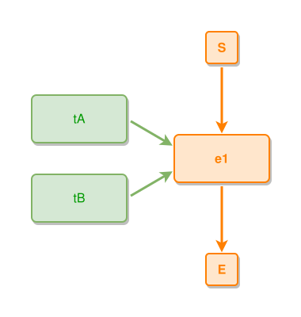

Multiple things part-of one event form ONE left-band stack on a shared
centre line, the band's middle exactly on the event's centre (v7P4).


```ipmdev-layout-rule
@scope local
#tA is left-of #e1 with gap=60
#tB is left-of #e1 with gap=60
all #tA,#tB have same center-x
#tB is below #tA with gap=40
#e1 is vertically-centered-between #tA,#tB
```

### things part of an inner event stack in one centred column

```ipmt
e1 ::e
e1a ::e --::P--> e1
w1 ::t, w2 ::t, w3 ::t --> e1a
```
<!-- ipm-svg id=1mr hash=f2b7489d -->
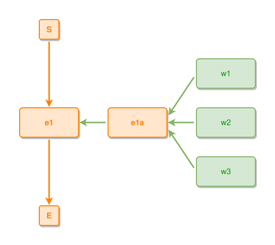

The two-side balance of an on-spine event (see "thing side placement balancing"
below) does not apply here. An INNER event (`e1a` is
part-of `e1`, so it sits right of the spine) forces all its aux outward to the
free side, and its part-of thing-fan becomes ONE column: same centre-x, even
`ThingVGap` gaps, and the band's middle exactly on the event's centre — the
middle thing shares the event's row (the participating things read as one
symmetric fan). A rejected
group-re-gap trial used to leak its global re-gap into the band
(40/80/40 gaps, band off-centre); the whole-component snapshot keeps a
no-op trial a true no-op.

```ipmdev-layout-rule
@scope local
all #w1,#w2,#w3 have same center-x
#w1 is right-of #e1a with gap=60
#w2 is below #w1 with gap=40
#w3 is below #w2 with gap=40
#e1a is vertically-centered-between #w1,#w3
all #e1a,#w2 have same y
```

### thing created by event

```ipmt
tA --"created-by"--> e1 ::e
```
<!-- ipm-svg id=1n0 hash=f6a41aae -->


> Node names are selected by `#name`, which can't contain spaces — rule ids
> are single tokens.

Visual rules:
- Thing 'tA' is green.
- Arrow from thing to event is green (PartOf relation: thing is created by / result of the event).

Layout rules:
- The edge is `thing --::P--> event` (a tPe connector like any part-of), so
  the thing takes the THING side — the left band — on the event's row; the
  "created-by" label changes the reading, not the grammar (v7P4).
- Horizontal gap from thing right edge to event left edge is 60px.

```ipmdev-layout-rule
@scope local
all #tA,#e1 have same y
#tA is left-of #e1 with gap=60
```

### multiple things created by event

```ipmt
tA --"created-by"--> e1 ::e
tB --"created-by"--> e1
```
<!-- ipm-svg id=1ni hash=4c818127 -->


Multiple created-by things stack in the left band exactly like part-of
things — one centre-line column, the band middle on the event's centre
(v7P4).

```ipmdev-layout-rule
@scope local
#tA is left-of #e1 with gap=60
#tB is left-of #e1 with gap=60
all #tA,#tB have same center-x
#tB is below #tA with gap=40
#e1 is vertically-centered-between #tA,#tB
```

### things part-of a spine stack in the left band

When several things are part-of events on one event spine, they do NOT split
left/right for balance — v7 keeps every part-of thing on the THING side (the
left band; "things left, concepts right" is the band canon). Each thing sits
in the left band of the event or thing it is part-of; a "created-by" label
reads as an ordinary part-of edge and changes nothing about the side.

```ipmt
A --> J ::e
I ::e --> J
K ::e --> I
C --> D --> K
L --::P--> I
```
<!-- ipm-svg id=1o0 hash=3b07683c -->
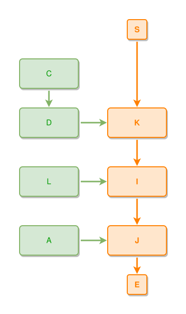

The event spine runs `K → I → J` (topological order). Each thing takes the left
band of what it is part-of: `D` under `K` (with `C`, part-of `D`, stacking
above it as a thing hierarchy), `L` beside `I`, `A` beside `J`. All four things
sit LEFT of the spine — none is split to the right.

## Concepts

### one concept

```ipmt
c-X ::c
```
<!-- ipm-svg id=1p0 hash=cdba4288 -->
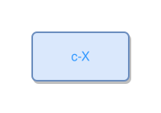

Visual rules:
- Concept 'c-X' is light blue.
- Font color is dark blue.
- Node has a thin dark blue border.

Layout rules:
- Base size of 'c-X' is 120x60 px (same as event node base size).

```ipmdev-layout-rule
@scope local
each type=concept has size=120x60
```

### two concepts connected

```ipmt
c-X ::c --> c-Y ::c
```
<!-- ipm-svg id=1q0 hash=8ebf2fd9 -->
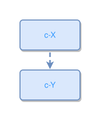

Visual rules:
- 'c-X' expresses concept 'c-Y'.
- Arrow leads from 'c-X' to 'c-Y' and is dashed light blue with solid arrow head.
- For default edge from (0,0) to (20,40) there should be 3 to 5 dashes.

Layout rules:
- Nodes share one vertical centre line — a clean column.
- 'c-X' sits directly **above** 'c-Y'.
- Vertical gap from c-X bottom edge to c-Y top edge is 40px.

```ipmdev-layout-rule
@scope local
#c-Y is below #c-X with gap=40
all #c-X,#c-Y have same center-x
```

### concept hierarchy diamond pattern

```ipmt
c-Root ::c --> c-Left ::c
c-Root --> c-Right ::c
c-Left --> c-Join ::c
c-Right --> c-Join
```
<!-- ipm-svg id=1r0 hash=78cdefdd -->
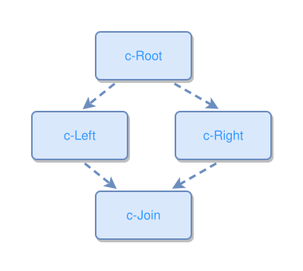

Layout rules:
- 'c-Root' is the single root at the top row.
- 'c-Left' and 'c-Right' are siblings on the same middle row (fork of c-Root).
- 'c-Join' is the join node at the bottom row, centered below c-Root on the spine.
- 'c-Left' and 'c-Right' share the same Y coordinate.

```ipmdev-layout-rule
@scope local
all #c-Left,#c-Right have same y
#c-Join is below #c-Left with gap=40
#c-Root is above #c-Left with gap=40
all #c-Root,#c-Join have same center-x
```

### concept hierarchy multiple roots

```ipmt
c-V ::c --> c-X ::c
c-W ::c --> c-X
c-X --> c-Y ::c
```
<!-- ipm-svg id=1s0 hash=33f2bd7c -->
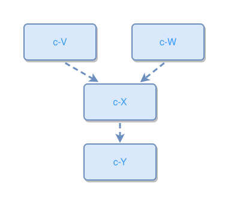

Layout rules:
- 'c-V' and 'c-W' are both roots with no incoming edges, placed on the same top row.
- 'c-X' is the join node on the middle row.
- 'c-Y' is at the bottom row.
- 'c-V' and 'c-W' share the same Y coordinate.

```ipmdev-layout-rule
@scope local
all #c-V,#c-W have same y
#c-X is below #c-V with gap=40
#c-Y is below #c-X with gap=40
```

### tall concept in one column does not inflate another

```ipmt
c1-root ::c --> cA ::c
c1-root --> cB ::c
cA --> A deliberately very long concept label that wraps onto many many lines and becomes very tall indeed for testing row lift behaviour here tl::a ::c
cB --> cSmall ::c
cSmall --> cLeaf ::c
```
<!-- ipm-svg id=1si hash=a50a478a -->
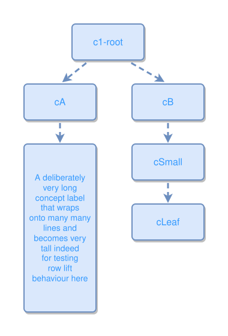

A standalone hierarchy reserves row heights per column, not per row: the tall
wrapped concept under 'cA' must not push 'cLeaf' (in the unrelated 'cB' column)
further from its own parent — each column keeps its own chain gaps.

```ipmdev-layout-rule
@scope local
each type=concept text-len>72 has height>=140
#tl is below #cA with gap=40
#cLeaf is below #cSmall with gap=40
all #cB,#cSmall,#cLeaf have same center-x
```

### concept near to concept

```ipmt
c-X ::c --- c-Y ::c
```
<!-- ipm-svg id=1t0 hash=7dbe2a73 -->
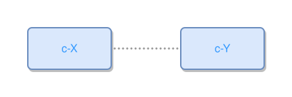

Visual rules:
- Edge between 'c-X' and 'c-Y' is dotted grey.
- There are no arrows on the edge.

Layout rules:
- 'c-X' is near to concept 'c-Y' and 'c-Y' is near to 'c-X'.
- Nodes are horizontally aligned.
- Horizontal gap from c-X right edge to c-Y left edge is 100px — the
  near-to stand-off (`NearGap`): an event-less tile tied only by near-to
  keeps the same adjacency rhythm as v7P5's in-component satellites
  (the full component gap is for event components).

```ipmdev-layout-rule
@scope local
all #c-X,#c-Y have same y
#c-Y is right-of #c-X with gap=100
```

### thing near to thing

```ipmt
tA --- tB
```
<!-- ipm-svg id=1u0 hash=3fbc9a37 -->
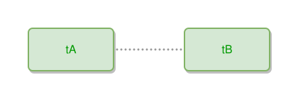

Visual rules:
- Similar to concept near to concept.
- Edge between 'tA' and 'tB' is dotted grey with no arrows.

Layout rules:
- 'tA' is near to thing 'tB' and 'tB' is near to 'tA'.
- Nodes are horizontally aligned.
- Horizontal gap from tA right edge to tB left edge is 100px — the
  near-to stand-off (`NearGap`), exactly like concept near-to concept.

```ipmdev-layout-rule
@scope local
all #tA,#tB have same y
#tB is right-of #tA with gap=100
```

### event near to event

```ipmt
e1 ::e --- e2 ::e
```
<!-- ipm-svg id=1v0 hash=51e8a120 -->
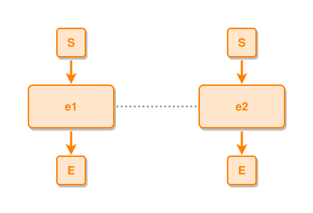

Visual rules:
- Edge between 'e1' and 'e2' is dotted grey with no arrows.

Layout rules:
- 'e1' is near to event 'e2' and 'e2' is near to 'e1'.
- Events connected only by near-to edges (without leads-to edges) still get implicit 'S' and 'E' boundary nodes.
- When events are connected only by near-to edges and have no other edge types (no edges to things, concepts, or other events), they are placed horizontally side-by-side.
- Near-to edge between horizontally placed events is horizontal.
- Near-to does NOT merge flow components: each event keeps its own S/E
  boundary pair, and the two single-event components sit side by side with
  the standard component gap (GraphGap, 120px).
- If any event has other edge types (e.g., connected to a thing), events are placed vertically.

```ipmdev-layout-rule
@scope local
all #e1,#e2 have same y
edge #e1,#e2 has type=nearto
#e2 is right-of #e1 with gap=120
edge #e1,#e2 is horizontal
```


## Near-to component placement

### near-to sibling components stack in one column

```ipmt
e1 ::e --> e2 ::e
t1-anchor --> e1
g1a ::t --> g1b ::t
g2a ::t --> g2b ::t
g1a --- t1-anchor
g2a --- t1-anchor
```
<!-- ipm-svg id=1vi hash=04e79d84 -->
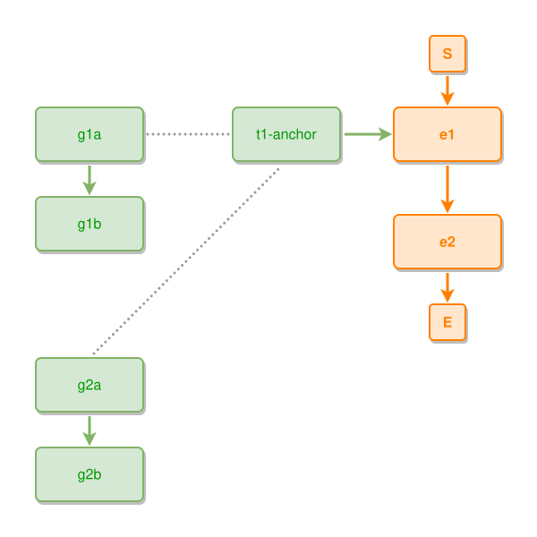

Several components that near-to link to the SAME anchor node are a sibling
group: the ANCHOR picks the side (v7P2 — 't1-anchor' sits left of the events,
so both pairs go LEFT), and the siblings STACK there in ONE COLUMN —
the near-to stand-off (100) from the anchor, one full component gap
between the sibling tiles themselves — never spread to the
empty opposite flank, which would drag
a tie across the hub and the events column. Inside each component the
part-of pair lays out as a vertical generation (v7P4: the part above its
whole); the ties draw straight into the anchor (`max-bends=0`), the nearer
one horizontal, the farther a longer diagonal.

```ipmdev-layout-rule
@scope local
each edge has max-bends=0
all #g1a,#g1b,#g2a,#g2b have same center-x
#g1b is below #g1a with gap=40
#g2b is below #g2a with gap=40
#g2a is below #g1b with gap=120
#g1a is left-of #t1-anchor with gap=100
edge #g1a,#t1-anchor has visibility=visible
edge #g2a,#t1-anchor has visibility=visible
```

### near-to satellite hoists to the left of its anchor

```ipmt
e1 ::e --> e2 ::e
tL ::t --> e1
tR ::t --> e1
t1-sat1 ::t --> t2-sat2 ::t
t1-sat1 --- tL
```
<!-- ipm-svg id=1vr hash=191b628f -->
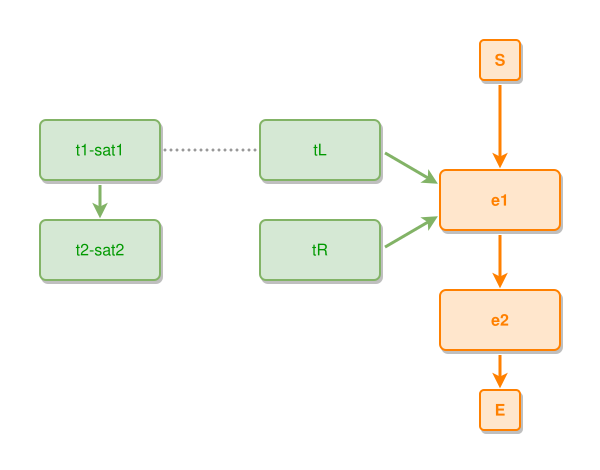

'tL' and 'tR' stack in the event's LEFT band (things left, concepts right —
the v7 band canon) with 'e1' centred on the pair. The standalone component 't1-sat1'→'t2-sat2' near-to links
to 'tL' — the ANCHOR picks the side (v7P2), so the whole satellite
component hoists to the LEFT of the event component instead of being
appended on the right, where its near-to edge would have to cross the S–E
spine. The pair lays out as a vertical generation (v7P4), 't1-sat1' on its
anchor's row. The near-to tie itself DRAWS IN FULL: it is what explains
why the satellite sits here, and its route is a clean straight horizontal
into 'tL', crossing nothing — length alone never stubs a cross-component
tie that passes the clean-route checks.

```ipmdev-layout-rule
@scope local
each edge has max-bends=0
#e1 is vertically-centered-between #tL,#tR
#tR is below #tL with gap=40
#tL is left-of #e1 with gap=60
all #t1-sat1,#t2-sat2 have same center-x
#t2-sat2 is below #t1-sat1 with gap=40
all #t1-sat1,#tL have same y
#t1-sat1 is left-of #tL with gap=100
edge #t1-sat1,#tL is horizontal
edge #t1-sat1,#tL has visibility=visible
edge #t1-sat1,#tL does not cross edge #S,#e1
```

## Not connected nodes

### not connected events

```ipmt
e1 ::e
e2 ::e
e3 ::e
```
<!-- ipm-svg id=1w0 hash=34951d1d -->
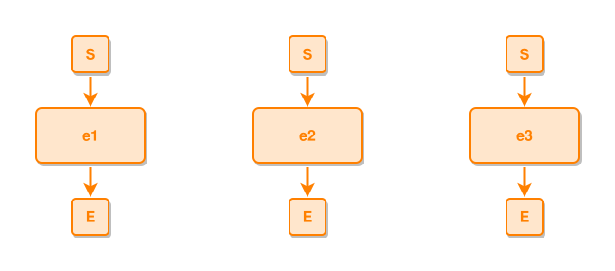

Layout rules:
- Three events 'e1', 'e2', 'e3' are orange in separate vertical lines.
- Each vertical line has implicit 'S' and 'E' events.
- Horizontal gap between disconnected graph components is 120px (measured from rightmost node of one component to leftmost node of the next component).
- All subgraphs are aligned at the top - the top edge of each subgraph's first node starts at the same Y coordinate.

```ipmdev-layout-rule
@scope local
each type=event has size=120x60
#e2 is right-of #e1 with gap=120
#e3 is right-of #e2 with gap=120
all #e1,#e2,#e3 have same y
```

### not connected things

```ipmt
A --> B
C <-- D
E --> F
```
<!-- ipm-svg id=1x0 hash=a83412cb -->
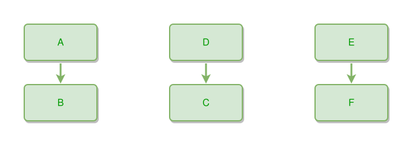

Layout rules:
- Things not connected to events are positioned at the top margin of the layout.
- Free thing center Y = marginY + defaultCellH/2 (= 40 + 30 = 70px), placing top edge at marginY.
- This ensures standalone thing graphs appear at the very top, separate from event graphs below.
- Multiple disconnected thing groups follow standard horizontal gap rules (120px between components).
- Within a connected pair the part sits directly above its whole on a shared
  centre line (e.g. 'A' above 'B'), the same vertical-column rule as elsewhere.

```ipmdev-layout-rule
@scope local
edge #A,#B has type=partof
edge #D,#C has type=partof
edge #E,#F has type=partof
#B is below #A with gap=40
all #A,#B have same center-x
#D is above #C with gap=40
all #D,#C have same center-x
#E is above #F with gap=40
all #E,#F have same center-x
```

### not connected many events

```ipmt
e1a ::e --> e1b ::e --> e1c ::e
e2a ::e --> e2b ::e --> e2c ::e --> e2d ::e
e3a ::e --> e3b ::e --> e3c ::e --> e3d ::e --> e3e ::e
```
<!-- ipm-svg id=1y0 hash=9d15f74d -->
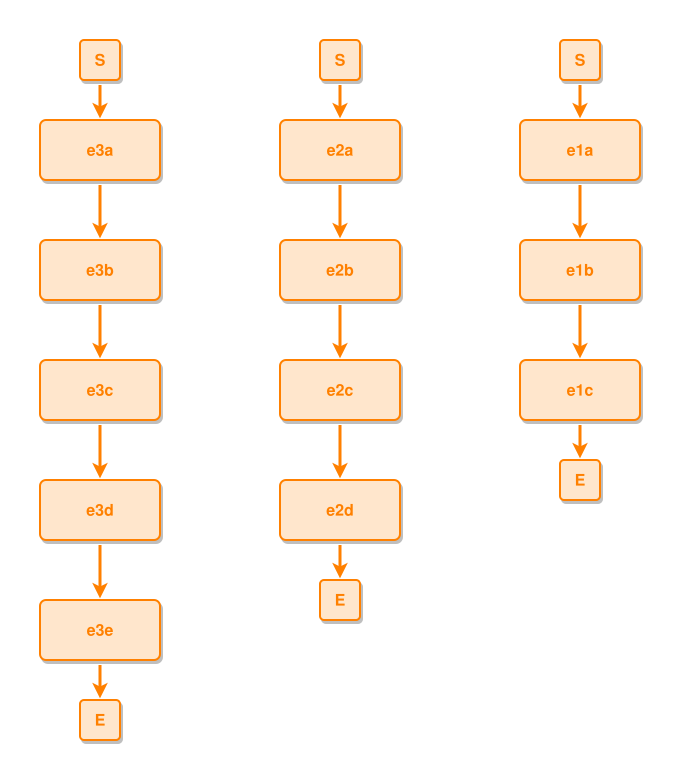

Layout rules:
- Three vertical lines of events.
- Each line has its own 'S' and 'E' boundary pair, centered on its line. (All
  boundary nodes share the labels 'S'/'E', so the per-line pairs are not
  id-addressable from rules; the event lines carry the assertions.)

```ipmdev-layout-rule
@scope local
all #e1a,#e1b,#e1c have same center-x
all #e2a,#e2b,#e2c,#e2d have same center-x
all #e3a,#e3b,#e3c,#e3d,#e3e have same center-x
```

### start events with side aux stay one gap apart

```ipmt
e1 ::e
e2 ::e
e3 ::e
e1 --> e3
e2 --> e3
e1 --::X--> cX ::c
e3 --::X--> cY ::c
e3 <--::P-- tA ::t
```
<!-- ipm-svg id=1y9 hash=ee1b6e62 -->
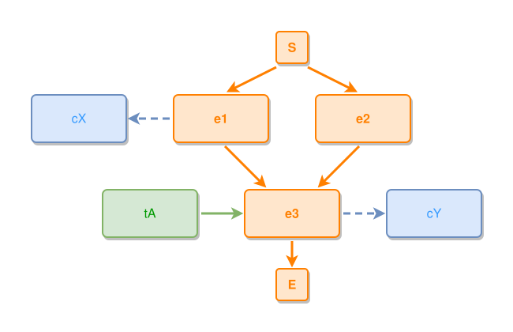

Two start events joining at one target, the left one carrying an exclusive
concept. The first (position-less) side assignment used to flip e1's lone
concept to the RIGHT and the row reserved a full unused column between the
starts — the final spine-aware pass places the concept on the LEFT where it
belongs. The row prediction now redirects EXCLUSIVE roots to each member's
outward side (shared roots keep their assigned-side reservations), so the
starts sit one standard gap apart and the join centers under them.

```ipmdev-layout-rule
@scope local
all #e1,#e2 have same y
#e2 is right-of #e1 with gap=60
#e3 is horizontally-centered-between #e1,#e2
#cX is left-of #e1 with gap=60
```

### an uneven end fan turns early and E keeps a fan gap

```ipmt
s ::e --> x ::e
s --> y ::e
s --> z ::e
y --> y2 ::e
```
<!-- ipm-svg id=1z9 hash=c0667cf9 -->
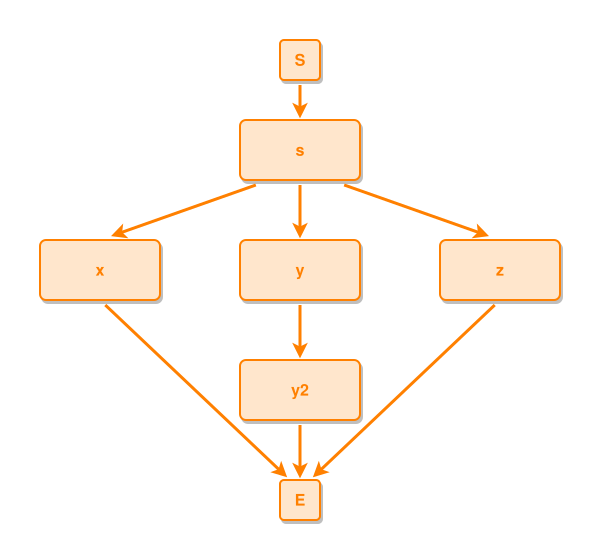

The middle branch runs one event deeper, so the end events (`x`, `y2`, `z`)
sit on DIFFERENT rows — an UNEVEN end fan. Two behaviours make its join read
like the fork fan above it, mirrored:

- **E keeps a fan gap below the deepest terminal.** `y2`'s own dx to E is 0,
  so alone it would pin E one thin `BoundaryGap` under itself, cramping the
  converging diagonals. E also clears the DEEPEST terminal by the fan's
  widest need — the 150° cap's `dx / tan 75°`, gridded up (v7P3/P8); an
  even fan is unchanged (the widest member's own need already equals it).
- **The outer terminals turn EARLY.** `x → E` and `z → E` bend once just
  below their source and run a single long diagonal into E — mirroring how
  the fork fan angles immediately out of `s` — instead of dropping their
  whole lane, dipping under E's row and climbing back at a shallow angle.
  The turn-early candidate only wins when its diagonal keeps a genuine gap
  off every box; a terminal whose obstacle hugs it (b2 → E in "asymmetric
  terminals…") keeps the drop-then-cut column shape.

```ipmdev-layout-rule
@scope local
all #x,#y,#z have same y
#E is below #y2 with gap=60
edge #y2,#E is vertical
each edge has max-bends=0 except #x,#E #z,#E
edge #x,#E has max-bends=1
edge #z,#E has max-bends=1
edge #x,#E has min-corner-angle=110
edge #z,#E has min-corner-angle=110
edge #x,#E does not cross edge #y,#y2
edge #z,#E does not cross edge #y,#y2
```

### a wide start fan grows its vertical gap

```ipmt
e1 ::e --> j ::e
e2 ::e --> j
e3 ::e --> j
e4 ::e --> j
e5 ::e --> j
```
<!-- ipm-svg id=1ya hash=123424bc -->
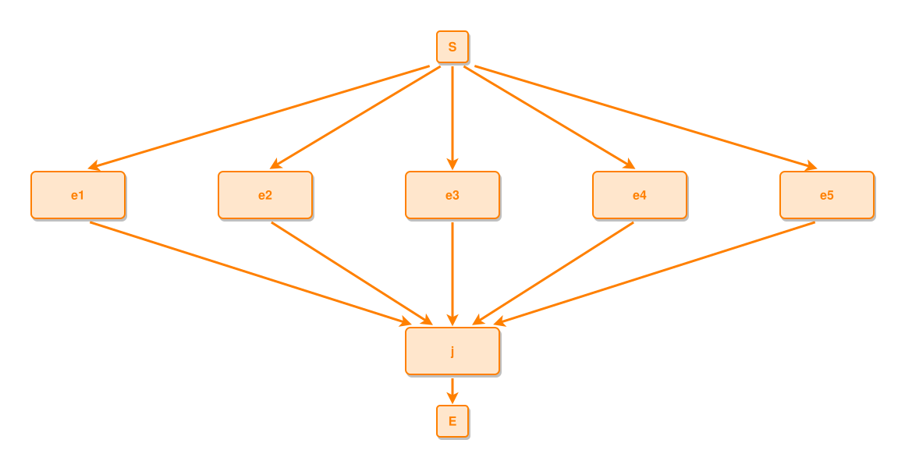

Five start events join at 'j', so the implicit 'S' fans DOWN to all five —
spread wide across the row. The boundary lifts until the fan edges reach a
readable angle instead of a clutch of near-horizontal lines ("grow the
vertical gap so all the edges fit nicely"). The START fan
is capped at 150° (MaxFanAngleDeg: dy ≥ dx / tan 75°, gridded) so the square
'S' marker sits relatively close above the row (a smaller S→events gap).

The join 'j' caps its fan-IN at the SAME 150° (unified with the
boundary cap), so 'j' drops below the row by the same gap that 'S'
lifts above it: the diamond reads as symmetric halves — S→e3 and e3→j are the
same length (user: "should be the same; the one fan-angle cap used for both").
The whole subtree below 'j' follows it down.

```ipmdev-layout-rule
@scope local
all #e1,#e2,#e3,#e4,#e5 have same y
#S is horizontally-centered-between #e1,#e5
edge #S,#e1 has min-slope=0.25
edge #S,#e5 has min-slope=0.25
edge #e1,#j has min-slope=0.25
edge #e5,#j has min-slope=0.25
all #j,#S,#E have same center-x
```

### wide forks breathe — sibling gaps grow with the fan

```ipmt
e1-hub ::e --> w1 ::e, w2 ::e, w3 ::e, w4 ::e
```
<!-- ipm-svg id=1yb hash=d448eb0c -->
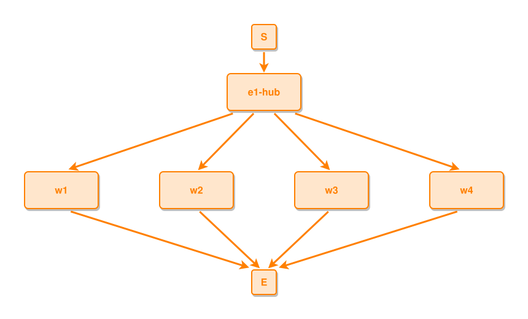

A fork's siblings keep the standard gap when there are two of them, but a
WIDER fan needs more air between the boxes — the fan edges enter at ever
shallower angles and tight siblings read as one clump ("if there is
much more we should probably increase that even
more"; general for any one-to-many fan, not only S). The gap grows
+20px per member beyond two: two siblings 60, three 80, four 100.

```ipmdev-layout-rule
@scope local
all #w1,#w2,#w3,#w4 have same y
#w2 is right-of #w1 with gap=100
#w3 is right-of #w2 with gap=100
#w4 is right-of #w3 with gap=100
#e1-hub is horizontally-centered-between #w1,#w4
```

### same-side entries keep their approach order

```ipmt
e1::a a first event with a long label ::e --> e2::a a second mid event ::e --> e3::a a third event with the longest label ::e
tA, tB --> e1
tC::a the first band thing --> e1
tD --> e2
tE::a a last band item --> e3
tB, tD --> e3
tD --- tC
tC --> tF
tD --> tG::a the second whole
```
<!-- ipm-svg id=1zb hash=4ba5392f -->
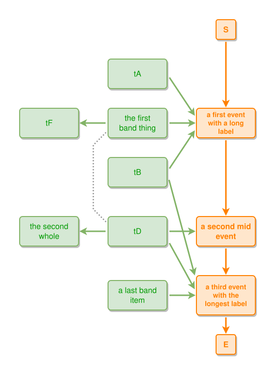

Three part-of edges reach 'e3' from its left: the band member
('tE', straight) and two ties from the column above
('tB', 'tD') — both draw as SLID
BEELINES (v7P9): zero bends, no lane detour, each a clean diagonal
into the border. Entries at ONE border keep the sources'
ORDER (v7P9): the higher source enters higher —
tB (topmost) at the top slot, tD next, the band member on
the midline — so no two arrivals swap and cross in front of the
border. The top slot sits at the beeline's cleared landing (0.15, one
notch off the lane era's even third 0.17 — the order and the corner
stand-off are the ratified content, the exact notch follows the
clearing slide). The MIDDLE arrival sits at the OPTICAL middle, not
the numeric one (to the human eye the middle arrival belongs a
bit lower): arrivals space by their visible HEAD SPANS — a steep
line's arrowhead occupies a run of the border, the horizontal one's
almost none — so tD's tip drops until the CLEAR gaps between
neighbouring heads match; when lanes ARE needed, their ends still
spread evenly between the fixed anchors.

```ipmdev-layout-rule
@scope local
each edge has max-bends=0 except #tC,#e1 #tD,#tC
edge #tD,#tC has max-bends=2
edge #tB,#e3 has target-side=left
edge #tB,#e3 has target-position=0.15
edge #tD,#e3 has target-side=left
edge #tD,#e3 has target-position=0.4306861128788711
edge #tE,#e3 has target-side=left
edge #tE,#e3 has target-position=0.50
edge #tB,#e3 does not cross edge #tD,#e3
```

### a stranded leaf concept comes back to its owner

```ipmt
e1 ::e
tA --> e1
tB, tC, tD --> e1a ::e --::P--> e1
tA --- tB

e1b ::e --::P--> e1
tE, tF --> e1b
tD --> e1b
tD --> cX ::c
e1c ::e --::P--> e1
tG, tF --> e1c
tA --- tF

tH, tB --> e1d ::e --::P--> e1
e1d --> e1a
tH, tF --> e1e ::e --::P--> e1
e1e --> e1b --> e1c
```
<!-- ipm-svg id=20b hash=43a4bc86 -->
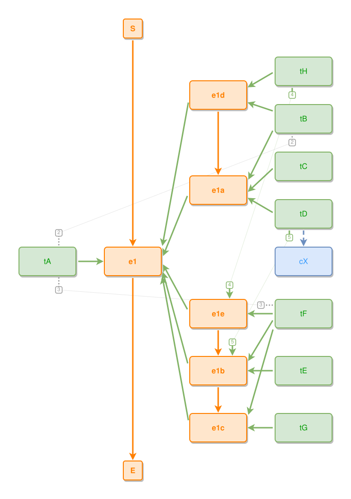

No aux node strays from what it is connected to ("there is no reason
to move it somewhere far away"; "leaf nodes should never move so far
away"): the sub-grid's row gaps GROW for the
rows' band hangs (v7P8 — a packed column gets one more pitch instead of
cascading its last member to the bottom), so every thing sits at its
anchor's band — 'tH' and 'tB' stacked right beside 'e1d' ('tB' is part of
'e1a' and 'e1d', and 'e1d' leads to 'e1a', so v7P7's flow tiebreak anchors
it at the upstream one; a two-member band centres its stack on the row,
so neither sits exactly on it) — and
'cX', tD's sole leaf concept, takes its natural spot directly BELOW its
owner. The relocation rescue (below-centred, below-outward, beside;
never a spot that READS AS somebody else's member) remains the backstop
for genuinely packed columns; the sweep guards the class ("reads as
paired").

```ipmdev-layout-rule
@scope local
each edge has max-bends=0 except #tA,#tB #tD,#e1b #tH,#e1e #tF,#e1e
edge #tA,#tB has max-bends=2
edge #tD,#e1b has max-bends=2
edge #tH,#e1e has max-bends=2
edge #tF,#e1e has max-bends=2
edge #tD,#cX has max-bends=0
edge #tD,#cX has visibility=visible
edge #tD,#cX has source-side=bottom
edge #tD,#cX has target-side=top
all #tD,#cX have same center-x
#cX is below #tD with gap=40
#tB is below #tH with gap=40
edge #tH,#e1d has max-bends=0
#tH is right-of #e1d with gap=60
```

### a far tie draws long; the concept stays beside its anchor

```ipmt
e1 ::e --> e2 ::e --> e3 ::e --> e4 ::e --> e5 ::e --> e6 ::e --> e7 ::e --> e8 ::e
e1 --::X--> c1-far ::c
e8 --::X--> c1-far
```
<!-- ipm-svg id=1yc hash=9bbf0c06 -->
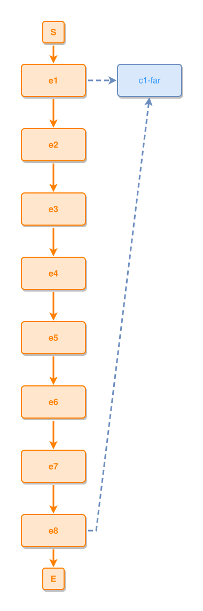

'c1-far' is expressed by the chain's first AND last event, seven rows
apart. It ANCHORS to its first user (e1) and STAYS beside it: the
structural anchor edge outranks the demoted tie (the kind hierarchy),
so the anchor edge is the short straight and the TIE pays the distance
("far is connected to e1, so it should be next to e1 — then go
diagonal to e8"; this replaces the pull-to-the-second-user
reading). The pull-slide survives only within ANCHOR REACH
— one row pitch — where it can align a shared node with both users
(see the deep-shared concept case in layout-alg-ext.md). The long tie
is a HOP-DIAGONAL: a straight would graze the spine near e8 and a
border-hugging exit fails the minimum-angle rule, so it leaves
e8's right, hops ONE grid step clear of the
spine, and runs a single beeline into c1-far's BOTTOM — one bend, the
minimal escape. VISIBILITY stays a separate, obstruction-only question: both
edges route clean, so both draw in full.

```ipmdev-layout-rule
@scope local
each edge has max-bends=0 except #e8,#c1-far
edge #e8,#c1-far has max-bends=1
edge #e8,#c1-far has source-side=right
edge #e8,#c1-far has target-side=bottom
edge #e8,#c1-far has target-position=0.50
all #e1,#c1-far have same y
#c1-far is right-of #e1 with gap=60
edge #e1,#c1-far has visibility=visible
edge #e8,#c1-far has visibility=visible
node #e6 does not straddle edge #e8,#c1-far
node #e7 does not straddle edge #e8,#c1-far
```

### a far-shared concept anchors to its first usage

```ipmt
e1 ::e --> e2 ::e --> e3 ::e --> e4 ::e
tA ::t --> e1
tB ::t --> e4
tA --::X--> c1-shared ::c
tB --::X--> c1-shared
```
<!-- ipm-svg id=1zc hash=8ec6cf70 -->
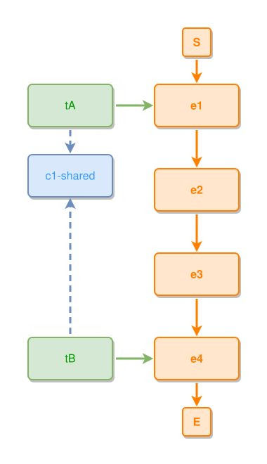

'c1-shared' is expressed by two things whose events sit THREE rows apart.
Centering it between them would park it hovering far from both; it
anchors to its FIRST usage — tA, earliest in leads-to/time order — and
sits DIRECTLY BELOW it, the closest spot (shared concepts drop below
like any sole leaf; the diagonal rail survives only
when the second user is within one flow step, where the short pull can
align the concept with both users — see the deep-shared ext case). The
structural anchor edge outranks the demoted tie, so the anchor edge is
the short straight and the TIE pays the distance (replaces the
slide-to-the-second-user reading). Both edges draw as clean
straights — the vertical drop from tA and one long unbroken line up
from tB.

```ipmdev-layout-rule
@scope local
each edge has max-bends=0
edge #tA,#c1-shared has source-side=bottom
edge #tA,#c1-shared has target-side=top
edge #tB,#c1-shared has source-side=top
edge #tB,#c1-shared has target-side=bottom
edge #tA,#c1-shared has visibility=visible
edge #tB,#c1-shared has visibility=visible
edge #tA,#c1-shared is vertical
```

### component constellation places tied components around the hub

```ipmt
a1 ::e --> a2 ::e
b1 ::e --> b2 ::e
c1 ::e --> c2 ::e
a1 --::X--> b1
a2 --::X--> c1
```
<!-- ipm-svg id=1yd hash=d0ae8f09 -->
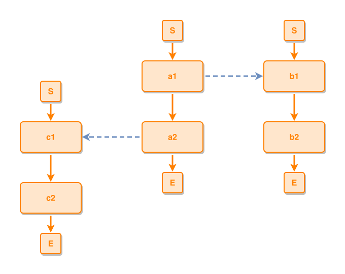

Three components tied by cross-component eXe edges. The most-connected
component is the HUB (A: two ties); the tied components take flanks by
the v7P2 priority — fewest tie crossings, then the 16:9 valve, then the
side nearest the tie's anchor. B (tied at a1) takes the right flank on
a1's row; C (tied at a2) takes the LEFT flank at a2's height — each tie
draws as ONE straight horizontal at its anchor's row, cutting nothing.

```ipmdev-layout-rule
@scope local
all #a1,#b1 have same y
#a1 is left-of #b1 with gap=120
all #c1,#a2,#b2 have same y
#c1 is left-of #a2 with gap=120
edge #a1,#b1 has max-bends=0
edge #a2,#c1 has max-bends=0
edge #a2,#c1 has source-side=left
edge #a2,#c1 has target-side=right
```

### tied components ring the hub on every side (onion)

```ipmt
a1 ::e --> a2 ::e
b1 ::e --> b2 ::e
c1 ::e --> c2 ::e
d1 ::e --> d2 ::e
e1 ::e --> e2 ::e
f1 ::e --> f2 ::e
a1 --::X--> b1
a2 --::X--> b2
a1 --::X--> c1
a2 --::X--> d1
a1 --::X--> e1
a2 --::X--> f1
```
<!-- ipm-svg id=1yf hash=a6c206c9 -->
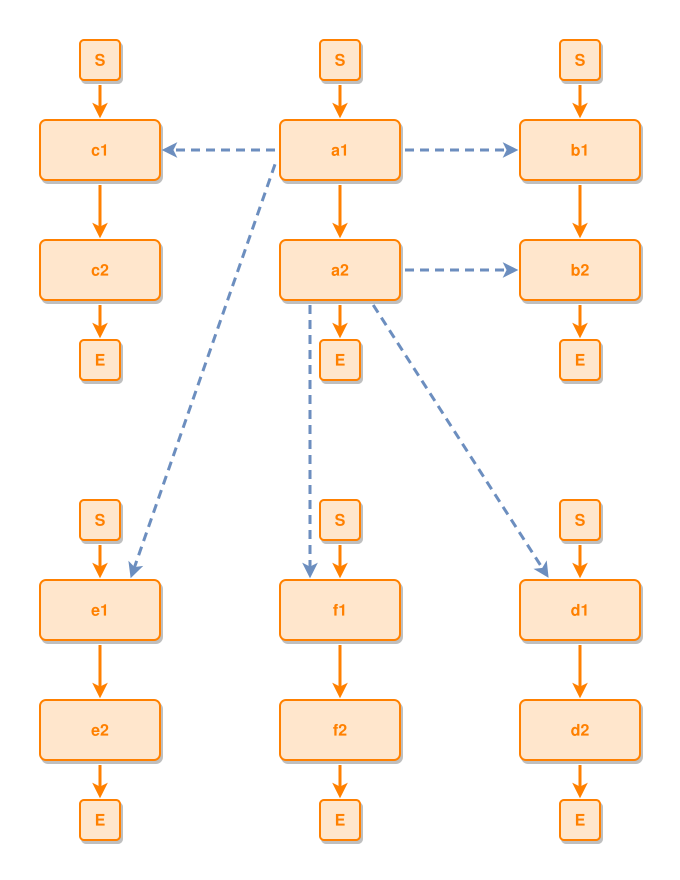

The hub A has five tied components. They tile a GRID around it — two rows
of three columns — instead
of a compass ring or a deep pile: row one is C, A, B (the two row-mates tied
at a1, one straight horizontal each), row two is E, F, D below them. The
components above never sit ABOVE the hub: the top flank competes with the
S cap and reads as a predecessor, so it only wins on strictly fewer tie
crossings (v7P2/P3, time reads down). A small S/E boundary box on a tie's
centre line does not veto a flank — the router slides the straight beside
it (v7P9 slid straights).

Row-two ties: D reaches its anchor a2 with a clean diagonal, F sits directly
below a2 and draws straight down its shared column;
E's tie to a1 takes the INTER-COLUMN descent (draw it, don't hide
it): out of a1's left side, down the corridor between the
c-column and the a-column, into e1's top — at most one bend, crossing only
c's row tie under the kind budget.

```ipmdev-layout-rule
@scope local
all #c1,#a1,#b1 have same y
#c1 is left-of #a1 with gap=120
#a1 is left-of #b1 with gap=120
all #e1,#f1,#d1 have same y
#e1 is left-of #f1 with gap=120
#f1 is left-of #d1 with gap=120
all #a1,#a2,#f1,#f2 have same center-x
#f1 is below #a2 with gap=280
edge #a1,#b1 has max-bends=0
edge #a1,#c1 has max-bends=0
edge #a2,#d1 has max-bends=0
edge #a2,#f1 has max-bends=0
each edge has max-bends=0 except #a1,#e1
edge #a1,#e1 has visibility=visible
edge #a1,#e1 has max-bends=1
edge #a1,#e1 has source-side=left
edge #a1,#e1 has target-side=top
edge #e1,#e2 is vertical
edge #a1,#a2 is vertical
```

### single-node ties ring their core graph

```ipmt
a1 ::e --> a2 ::e --> a3 ::e
t1 ::e
t2 ::e
t3 ::e
a1 --::X--> t1
a3 --::X--> t2
a2 --::X--> t3
```
<!-- ipm-svg id=1yg hash=db411e43 -->
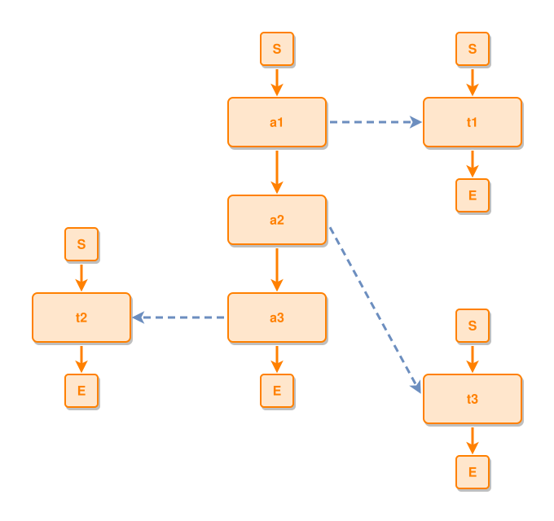

't1', 't2', 't3' are SINGLE-NODE components, each tied to the multi-node 'a'
chain by a cross-component expresses edge. They are not big enough to be a
hub, but they must not fall to a trailing line either — a lone component tied
to a graph rings that graph (the onion pattern:
small components ring the graph they connect to). The
'a' chain is the core; each tie takes its anchor's flank by the v7P2
priority: t1 right of a1, t2 left of a3 on a3's row, t3 stacked under t1 on
the right column — t1's and t2's ties draw straight horizontal at their
anchor's row, while a2→t3 draws a clean diagonal down to the stacked t3.

```ipmdev-layout-rule
@scope local
all #a1,#a2,#a3 have same center-x
all #a1,#t1 have same y
#a1 is left-of #t1 with gap=120
all #t2,#a3 have same y
#t2 is left-of #a3 with gap=120
all #t1,#t3 have same center-x
#t3 is below #t1 with gap=280
```

### a satellite wraps its own rows, not the whole flank

```ipmt
tA --> tB
tC, tA --> e1 ::e
tD --> e1
e1 --> cX ::c
tD --- tE
tF --- tA
tG --> tA
tH --> tA
tG --> cY ::c
```
<!-- ipm-svg id=1zg hash=8e023cff -->
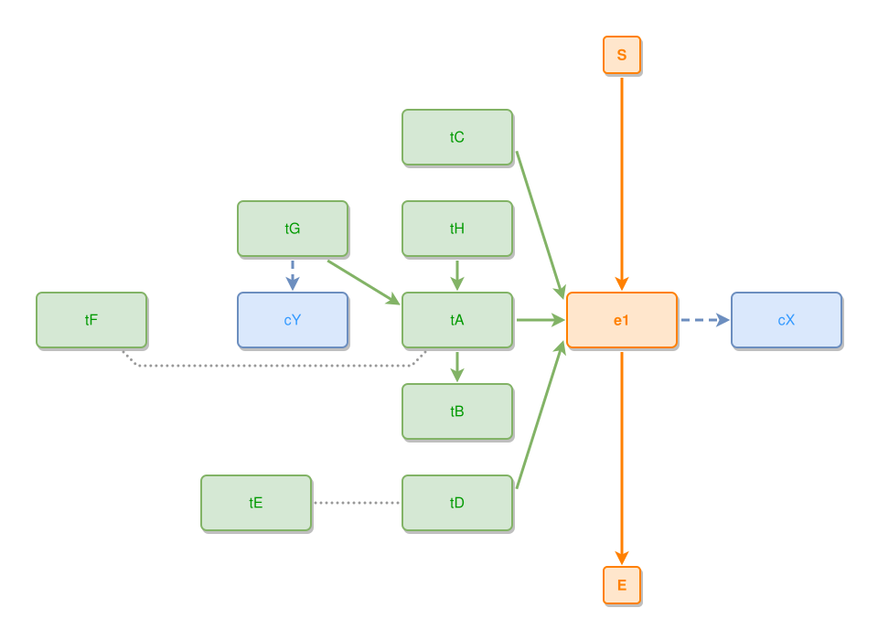

Two near-to satellites join e1's left band: 'tF' beside
'tA' and 'tE' beside 'tD'.
'tA' fully OWNS its hierarchy ('tG', 'tH', the
'tB' whole, tG's concept 'cY'), so it
renders as LAYERED GENERATIONS around the root (v7P4:
the foldable unit) — parts above, the whole below, 'cY' at
generation distance one on the root's row. The onion stand-off measures
the OUTERMOST box on the satellite's OWN rows — not the whole flank
(v7P5: "nearto(s) are too far away"): 'tE'
sits one near-to gap from its partner — riding with it when
the floor steps the partner down (v7P5: right next to it) — and 'tF'
one near-to gap past the row's outermost member, 'cY'.

```ipmdev-layout-rule
@scope local
each edge has max-bends=0 except #tF,#tA #tG,#tA #tH,#tA #tC,#e1
edge #tF,#tA has max-bends=2
edge #tC,#e1 has max-bends=1
edge #tG,#tA has max-bends=2
edge #tH,#tA has max-bends=2
edge #tF,#tA has visibility=visible
all #tA,#tF,#cY have same y
#tB is below #tA with gap=40
#tF is left-of #cY with gap=100
all #tD,#tE have same y
#tE is left-of #tD with gap=100
edge #tD,#tE has visibility=visible
```

### a near-to concept stays beside its anchor, not ringed

```ipmt
c1-leaf ::c --> c2-mid ::c --> c3-root ::c
c2-mid ::c --- cX ::c
```
<!-- ipm-svg id=1yh hash=cab6c6d7 -->
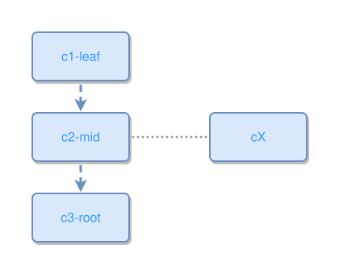

The onion rings only single-node EVENT graphs. A lone CONCEPT or THING tied
by near-to — 'cX' beside 'c2-mid' — is an aux/near-to satellite placed
beside ITS OWN anchor, not pulled to a ring around the whole core
(the satellite must stay by its anchor, not dangle below
the taxonomy). So 'cX' sits on 'c2-mid's row, to the right, at the NEAR-TO
stand-off of 100 — visibly more than an attached column's 60, because
near-to is adjacency, not attachment ("more than the
partof/express gap"); the expresses chain c1-leaf→c2-mid→c3-root keeps its vertical
column.

```ipmdev-layout-rule
@scope local
all #c1-leaf,#c2-mid,#c3-root have same center-x
all #c2-mid,#cX have same y
#cX is right-of #c2-mid with gap=100
```

## Unresolved nodes

### unresolved node lays out as its primary candidate

```ipmt
e1 ::e --> e2 ::e
u1 ::?te --> e1
```
<!-- ipm-svg id=1yi hash=c2e0e14b -->
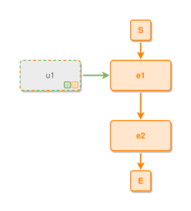

A node whose kind is undecided (`::?te` — candidates most-likely-first) keeps
the `unresolved` type in the output (the renderer shows the grey style with
candidate swatches), but PLACEMENT treats it as its primary candidate: `::?te`
lays out exactly like a thing — here in the THINGS band on the left (the
things-left canon), on its anchor event's row.

```ipmdev-layout-rule
@scope local
each type=unresolved has size=120x60
#u1 is left-of #e1 with gap=60
all #e1,#u1 have same y
```

### undecided borders weight the primary candidate

```ipmt
etc ::?etc
tce ::?tce
cet ::?cet
et ::?et
tc ::?tc
ce ::?ce
```
<!-- ipm-svg id=1yr hash=0d4ccd4a -->
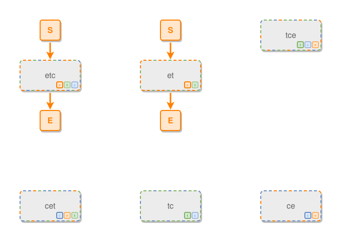

A reference of undecided (`::?…`) nodes as standalone (unconnected) nodes, each
keeping the grey `unresolved` fill and text but drawing a DASHED border that
WEIGHTS the primary (first-listed) candidate: that kind takes two adjacent
dashes per period and every other candidate one. Reordering the letters changes
which color dominates — `::?etc` → orange orange green blue (event primary),
`::?tce` → green green blue orange (thing primary), `::?cet` → blue blue orange
green (concept primary); the two-candidate forms behave the same — `::?et` →
orange orange green, `::?tc` → green green blue, `::?ce` → blue blue orange. The
candidate kinds also appear as small swatches in the bottom-right corner,
primary leftmost. PLACEMENT follows the primary too, so the event-primary nodes
(`etc`, `et`) gain Start/End boundary rings while the thing- and concept-primary
nodes stand alone.

## Other rules

### Concept collision detection

When a source expresses several concepts, they do NOT overlap and do NOT stack
vertically — they fan into one generation ROW below the source (v7P4: concepts
descend), evenly spread and centred under it.

Example:
```ipmt
tSource --> c-X ::c, c-Y ::c, c-Z ::c
```
<!-- ipm-svg id=1z0 hash=bc269dba -->
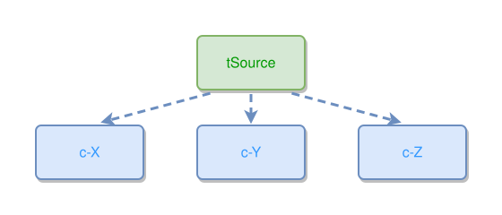
- The three concepts share one row below `tSource` (same y), fanning
  left-to-right with the row centred on the source.

### Thing collision detection

When several things are targets of the same source (e.g. `B, C <-- A`), they do
NOT overlap and do NOT stack vertically — sibling things of one source share a
ROW below it, side by side.

Example:
```ipmt
B, C <-- A
```
<!-- ipm-svg id=200 hash=0f3fe06a -->
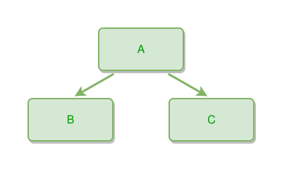
- `B` and `C` sit on one row below `A` (same y), side by side.

### Thing-to-concept spacing

A concept and its expresser sit at the standard 60px column gap (v7P8's
minimal-distance table) — the same gap used between columns everywhere; there is
no smaller concept-specific gap. When one concept is expressed by TWO users it
centres BELOW them, its two incoming edges spreading to the quarter ports of its
top border (shown here).

Example:
```ipmt
A --> cX ::c
cX <-- B
```
<!-- ipm-svg id=210 hash=f94d545c -->
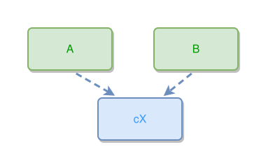
- The shared concept centres below its two users.
- The PAIR of arrivals spreads at the QUARTERS of cX's top —
  1/4 … 1/2 … 1/4, arrows flush on the border (thirds would bunch
  the two arrows toward the middle).

```ipmdev-layout-rule
@scope local
#cX is horizontally-centered-between #A,#B
edge #A,#cX has target-side=top
edge #A,#cX has target-position=0.25
edge #B,#cX has target-side=top
edge #B,#cX has target-position=0.75
edge #A,#cX has max-bends=0
edge #B,#cX has max-bends=0
```

### Node label rendering

Rules for node label display in the rendered SVG:
- Node displays only the node name (title).
- Alias is stored in layout JSON for reference but NOT rendered visually.
- This keeps the visual output clean while preserving alias data for tooling.

## Recent layout behaviours

Fitness cases for behaviours added recently to the engine. Each is also guarded by
a Go unit test; these additionally pin the behaviour against real fixtures.

### long event widens and stays centered

```ipmt
e1-short ::e --::L--> A target event with a deliberately long label that wraps onto many many lines so that the aspect ratio rule grows its width to two hundred and forty pixels and we can verify the short source event still shares the same vertical center line as this widened target ::e
```
<!-- ipm-svg id=220 hash=20c70feb -->
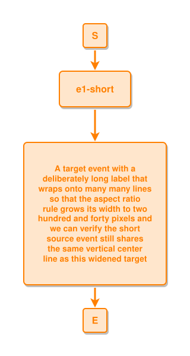

The target's height would exceed three times the base width, so the aspect-ratio
width rule grows its width to 240px while the short source stays 120px. Both events
still share the same vertical center line (centering is by the column line, not the
left edge).

```ipmdev-layout-rule
@scope local
each type=event text-len>=190 has width>=240
each type=event text-len<190 has width=120
each $a(type=event) ~L~ $b(type=event) has $a,$b same center-x
```

### S and E boundaries connect on their bottom and top

```ipmt
e1 ::e --::X--> c1-shared ::c
e2 ::e --::X--> c1-shared
e3 ::e --::X--> c1-shared
e4 ::e --::X--> c1-shared
```
<!-- ipm-svg id=230 hash=659320b4 -->
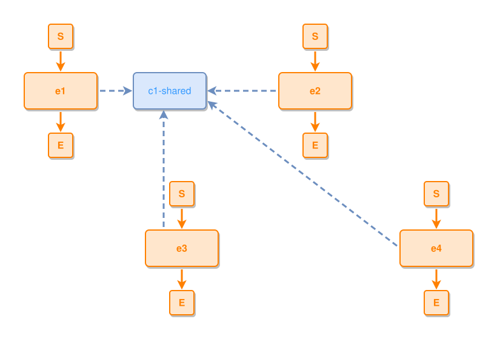

Four parallel events express one shared concept. Under the ANCHOR-AND-TIE
membership rule (v7P1) the shared concept does NOT merge them into
one process: it anchors to its FIRST user's component (e1), the other three
expresses edges become cross-component ties, and each event keeps its OWN
timeline — four S/E pairs. Every S edge leaves S's bottom border and every E
edge enters E's top border. A shared node assigned to ONE primary component
is fine: the tied components take flanks by the v7P2
grid — e2 on the row beside 'c1-shared', e4 and e3 on the second row.

The two row ties (e1 and e2, one on each side of 'c1-shared') connect with a
single straight **horizontal** line on the row's midline — aligned
neighbours must not meet at tilted, spread ports. 'e3' — first-declared,
so it takes the inner bottom slot since tiles stand off boxes, not
bounding boxes — connects with ONE VERTICAL line: the
straight slides within the boxes' x-overlap to pass beside e3's own S
boundary (v7P9 slid straights: "can be a vertical
line"). 'e4' reaches c1-shared's RIGHT side with a single clean diagonal that
does not cross e3's vertical — a graced crossing at the shared node is
CHEAPER avoided than taken (the 0.25 nudge), so the two arrivals take
different borders: e3 the bottom, e4 the right.

```ipmdev-layout-rule
@scope local
edge #S,#e1 has source-side=bottom
edge #S,#e3 has source-side=bottom
edge #e3,#E has target-side=top
each type=event has min-gap-to-others>=10
edge #e1,#c1-shared is horizontal
edge #e2,#c1-shared is horizontal
each edge has max-bends=0
edge #e3,#c1-shared is vertical
edge #e3,#c1-shared has source-side=top
edge #e3,#c1-shared has target-side=bottom
edge #e4,#c1-shared has source-side=left
edge #e4,#c1-shared has target-side=right
edge #e4,#c1-shared does not cross edge #e3,#c1-shared
```

### a two-concept fan mirrors exactly about its parent

```ipmt
tA --> cX ::c --> cY ::c, cZ ::c
```
<!-- ipm-svg id=239 hash=15e29317 -->
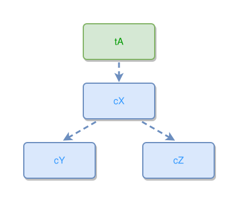

A pair of sole leaf concepts sits one box-plus-gap apart — an ODD
number of grid steps — so a uniform grid snap would leave the pair's
midpoint half a step off the parent's centre ("are
they really precisely symmetric?"). PAIR PARITY (v7P8) spreads the
pair one grid step (gaps only grow): the two children mirror EXACTLY
about their grid-aligned parent.

```ipmdev-layout-rule
@scope local
all #cY,#cZ have same y
#cY is left-of #cZ with gap=80
```

### a standalone shared-concept diamond centres symmetrically

Two things (`tL`, `tR`) each express a shared concept `cS` plus one exclusive
concept (`cL`, `cR`); `cL`/`cR` both express the shared `cB`. The shared
concepts `cS` and `cB` land on the CENTRE axis between the two things, each
thing fanning evenly to its exclusive concept (outside) and the shared one
(centre) — a symmetric diamond, no edge grazing a sibling's corner. A
node stays anchored over its EXCLUSIVE child even when it also has a shared
child, as long as that exclusive child keeps it off its co-parent's column. The shared
targets' arrivals run VERY FLAT — 3:1 or flatter — and a corner TIP
floats off the rounded outline, so the fix is FLUSH SIDE landings
("corner … or left/right side"): each arrival meets
its near border's upper quarter, head flat on the line of the box —
`cS` and `cB` alike (flatness is the trigger, not flanking: a
near-horizontal line onto a top border reads wrong however open the
border is, while a steeper V-fork keeps its 1/4 … 1/2 … 1/4 slots).

```ipmt
tL --> cS ::c, cL ::c
tR --> cS, cR ::c
cL ::c, cR ::c --> cB ::c
```
<!-- ipm-svg id=23i hash=474f4d0c -->
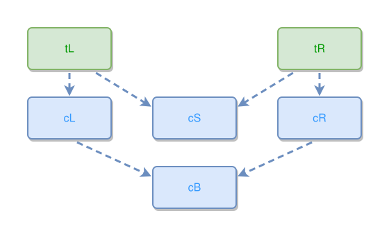

```ipmdev-layout-rule
@scope local
all #cS,#cB have same center-x
#cS is horizontally-centered-between #tL,#tR
#cL is left-of #cS with gap=60
#cR is right-of #cS with gap=60
edge #tL,#cS has target-side=left
edge #tL,#cS has target-position=0.25
edge #tR,#cS has target-side=right
edge #tR,#cS has target-position=0.25
edge #cL,#cB has target-side=left
edge #cL,#cB has target-position=0.25
edge #cR,#cB has target-side=right
edge #cR,#cB has target-position=0.25
```

### shared thing anchors to its deepest composite

```ipmt
e1 ::e --::L--> e2 ::e --::L--> e3 ::e
e2a ::e --::P--> e2
e2b ::e --::P--> e2
e2a --::L--> e2b
tA ::t --> e1
tA --> e2a
```
<!-- ipm-svg id=240 hash=62a4263d -->
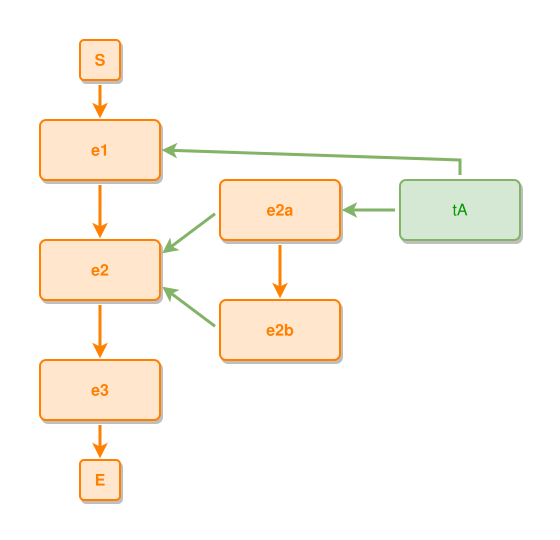

The thing 'tA' is part-of both the outer event 'e1' and the inner composite
child 'e2a'. The DEEPEST user anchors it (v7P7): 'tA' sits on e2a's row, in the
band right of 'e2a' — a single short straight connector — and never hovers
centred between its anchors. The 'e1' connector DEMOTES to a drawn tie
(anchor-and-tie, v7P1/P7) that routes AROUND the sub-column: up out of tA's
top and along e1's row height into e1's right side, one bend, crossing
nothing — placing tA on the spine's left would instead drag its 'e2a' tie
straight through the e1→e2 corridor.

```ipmdev-layout-rule
@scope local
each edge has max-bends=0 except #tA,#e1
edge #tA,#e1 has max-bends=1
edge #tA,#e1 has visibility=visible
edge #tA,#e1 has target-side=right
edge #tA,#e2a has visibility=visible
all #tA,#e2a have same y
#tA is right-of #e2a with gap=60
node #e2a does not straddle edge #tA,#e1
node #e2b does not straddle edge #tA,#e2a
```

### near-to peers in a column: neighbours link, spanning ties hide

```ipmt
e1a ::e
e1b ::e
e1c ::e
e1 ::e
e1a --::P--> e1
e1b --::P--> e1
e1c --::P--> e1
e1a --- e1b
e1b --- e1c
e1a --- e1c
```
<!-- ipm-svg id=250 hash=ebabca8d -->
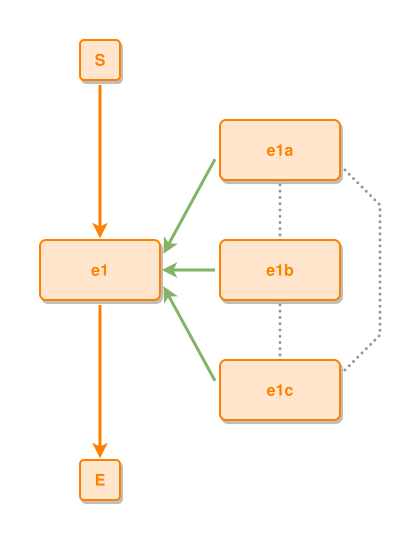

Three peer sub-events are part-of one composite, so they stack in a
column to the composite's right, and are pairwise NearTo (`---`) — "parallel, no
order".

A near-to between two events sharing a column connects on the FACING sides — the
upper event's BOTTOM to the lower event's TOP — as a clean centered vertical in
the gap between them, NOT a port on a side border. CENTERED is literal
(the e1a --- e1b link belongs on the midline): the
spread once co-slotted the neighbour link with the spanning tie at the
quarters, and when the spanning tie left for its flank bypass the
survivor kept the abandoned quarter — slots now re-derive from the
FINAL side membership, so the sole surviving link takes the midline. ADJACENT neighbours get that
straight link. A near-to whose endpoints have a THIRD peer event BETWEEN them in
the column cannot be drawn as that clean vertical (it would graze the peer), so
it takes the FLANK BYPASS shape on whichever side is CLEAR (vertically
aligned nodes connect "from the side border in an angle, then a
vertical line, then the same angle back in"): here `e1a --- e1c`
leaves e1a's RIGHT border at 45°, runs a vertical lane at x380 — a
`nearToBendClearance` gap off e1b, well clear of the part-of edges
hugging the column's left toward the composite — and re-enters e1c's
right border at the same angle. Using the SIDE borders leaves the bottom/top
borders entirely to the centered neighbour links, so the spanning tie never
shares their ports. The bypass is taken only when it routes
cleanly — no box cut, at most one crossing of a visible edge — reusing the
same un-hide pass that recovers any over-eager stub. When NO side is clear —
e.g. several spanning ties of a denser clique would pile up and cross each
other — the tie falls back to HIDDEN (stubbed): the loose relation stays
discoverable as a stub while the visible links read the peers as one group
(a four-peer clique's spanning ties would
otherwise stack into one dotted strip on the shared border).

```ipmdev-layout-rule
@scope local
all #e1a,#e1b,#e1c have same center-x
#e1 is left-of #e1a with gap=60
edge #e1a,#e1b is vertical
edge #e1a,#e1b has visibility=visible
edge #e1a,#e1b has source-position=0.5
edge #e1a,#e1b has target-position=0.5
edge #e1b,#e1c is vertical
edge #e1b,#e1c has visibility=visible
edge #e1b,#e1c has source-position=0.5
edge #e1b,#e1c has target-position=0.5
each edge has max-bends=0 except #e1a,#e1c
edge #e1a,#e1c has visibility=visible
edge #e1a,#e1c has source-side=right
edge #e1a,#e1c has source-position=0.75
edge #e1a,#e1c has target-side=right
edge #e1a,#e1c has target-position=0.25
edge #e1a,#e1c has max-bends=2
```

### near-to peers in a row: neighbours link, the spanning tie dips below

```ipmt
tRoot --> tB, tC, tD, tE
tB --- tC
tC --- tD
tD --- tE
tB --- tE
```
<!-- ipm-svg id=25i hash=da3b00b5 -->
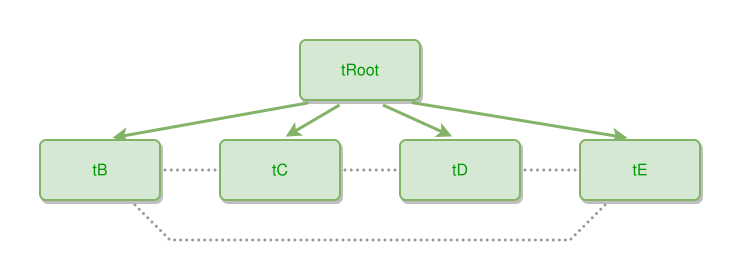

The ROW mirror of the column case above ("the similar can be
used also for horizontally aligned nodes"). Four sibling things share a row
under their parent; ADJACENT neighbours link as straight facing-side lines.
The SPANNING tie `tB --- tE` (two peers between, ~420px — past the stub
length threshold) takes the transposed FLANK BYPASS: out of tB's BOTTOM
border at 45°, a horizontal lane just below the row — the leaf row has
nothing beneath it, so the bottom flank is clear — and back in at the same
angle on tE's bottom border. The top flank would cross the parent's part-of
fan, so the crossing-aware flank choice picks the bottom. When NO flank is
clear (an event row whose middle siblings carry flow edges above and below),
the spanning tie falls back to a numbered stub, exactly like the column case.

```ipmdev-layout-rule
@scope local
all #tB,#tC,#tD,#tE have same y
edge #tB,#tC is horizontal
edge #tB,#tC has visibility=visible
edge #tC,#tD is horizontal
edge #tC,#tD has visibility=visible
edge #tD,#tE is horizontal
edge #tD,#tE has visibility=visible
each edge has max-bends=0 except #tB,#tE
edge #tB,#tE has max-bends=2
edge #tB,#tE has visibility=visible
edge #tB,#tE has source-side=bottom
edge #tB,#tE has source-position=0.75
edge #tB,#tE has target-side=bottom
edge #tB,#tE has target-position=0.25
```

### a diagonal near-to connects the facing sides

```ipmt
e1 ::e
tA, tB --> e1
tC, tD, tE --> e1a ::e --::P--> e1
tA --- tC
```
<!-- ipm-svg id=25r hash=5b8840e1 -->
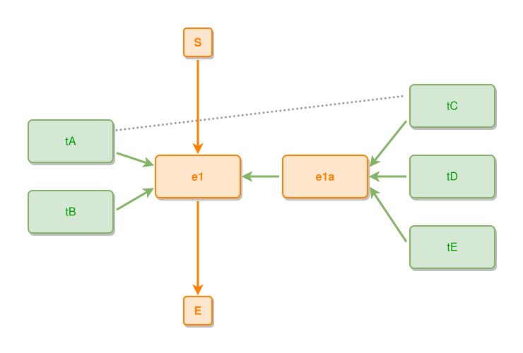

The flank bypass of the two cases above needs SUBSTANTIAL alignment — the
boxes' overlap must cover at least half the narrower box. 'tA' and
'tC' overlap by only a sliver (they sit on different events'
aux columns at slightly different heights), so they are a DIAGONAL pair, not
an aligned one: the tie connects the FACING sides —
tA's right, tC's LEFT — as one straight diagonal,
instead of being arced clear over the whole diagram from a clear flank the
way a truly row-aligned pair would bypass.

```ipmdev-layout-rule
@scope local
edge #tA,#tC has visibility=visible
edge #tA,#tC has source-side=right
edge #tA,#tC has target-side=left
```

### a wide expresses fan orders its sides and lands on the row's tops

```ipmt
tA --> cA ::c
tA --> cB ::c
tA --> cC ::c
tA --> cD ::c
tA --> cE ::c
tA --> cF ::c
tA --> cG ::c
tA --> cH ::c
tA --> cI ::c
```
<!-- ipm-svg id=260 hash=5beadce0 -->
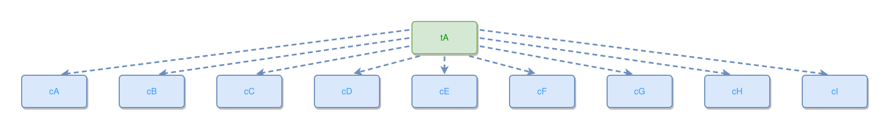

A thing that expresses many concepts lays the concepts out in a
ROW below it and fans the edges out. Every edge meets its concept on the
concept's TOP — the border facing the hub — even the outermost members far to
the side, never diving onto a concept's left/right side. On each side of the hub
the ports are ordered so the FARTHEST-out concept takes the TOP slot and the
nearest the bottom — the only order whose straight edges do not cross. Here
cA/cB/cC land left (cA leftmost → top slot, cC nearest → bottom slot),
cG/cH/cI land right (cI rightmost → top, cG nearest → bottom), and
cD/cE/cF run straight down the bottom. An edge spills to the flank when it
reaches at least twice as far sideways as down and the fan is wide (five
or more members).

Without this the fan put the nearest target on the top port and crossed its
siblings, and the outer members met the node on its side instead of its top.

```ipmdev-layout-rule
@scope local
edge #tA,#cA has target-side=top
edge #tA,#cC has target-side=top
edge #tA,#cE has target-side=top
edge #tA,#cG has target-side=top
edge #tA,#cI has target-side=top
edge #tA,#cA has source-side=left
edge #tA,#cA has source-position=0.25
edge #tA,#cC has source-side=left
edge #tA,#cC has source-position=0.75
edge #tA,#cI has source-side=right
edge #tA,#cI has source-position=0.25
edge #tA,#cG has source-side=right
edge #tA,#cG has source-position=0.75
```
