# Layout principles

The nine principles (v7P1–v7P9) the layout engine (`gl:pkg/layout7`)
implements — every stage, rule and constant in the engine cites one of
them. Each principle gives a plain statement, one simple example of what
it covers, and one of what it deliberately does NOT cover (owned by
another principle). The fixture catalogue
(`gl:docs/dev/layout-gen/layout-alg.md`,
`gl:docs/dev/layout-gen/layout-alg-ext.md`) executes these principles as
rules; the engine's map and status live in
`gl:docs/dev/layout-gen/layout7-engine.md`. Detail sections at the end:
the 11-combination coverage map, the solving algorithm, and the design
pattern behind tie-breaks.

## Terms and shortcuts

- **eLe, ePe, eXe, eNe, tPe, tPt, tNt, eXc, tXc, cXc, cNc** — the 11 legal
  edge combinations, spelled source-kind + edge-kind + target-kind: `tPe` =
  thing --P(part-of)--> event, `eXc` = event --X(expresses)--> concept, `tNt`
  = thing --- thing near-to. See the coverage map at the end of this doc.
- **skeleton** — the events plus their leads-to/part-of edges; the part of
  the diagram that places first and never yields (v7P3).
- **aux** — everything that is not skeleton: things and concepts (and their
  tPt/tXc/cXc structures) hanging off events. Short for "auxiliary".
- **band** — the aux attached to an event's flank on its row: things on the
  LEFT, concepts on the RIGHT (the "band canon"). A **band stack** is the
  vertical column of members within one band.
- **placing relation** — an edge that gives a node its position (leads-to,
  part-of, expresses-to-non-event). Opposite: a **tie** — an edge that
  places nothing (near-to anywhere, expresses between events) and only
  draws, orders, or glues.
- **anchor / anchored** — the node (usually an event) whose placing relation
  determines where an aux node lives; `A ::t --> e1 ::e` makes e1 A's
  anchor. A node with no placing relation is **unanchored** and can be
  placed by a tie instead (v7P5).
- **primary anchor** — when a node has SEVERAL placing relations, the one
  that wins placement (the deepest/part-most user, v7P7); the rest become
  ties (**anchor-and-tie**, v7P1).
- **endpoint** — one of the two nodes an edge connects; "both endpoints
  anchored" describes the edge by its nodes' situations.
- **sibling set** — nodes sharing one parent/whole (`A --> B1, B2, B3`) or
  one target (`S1, S2, S3 --> A`); the unit that ordering rules act on.
- **affinity** — an inferred "belongs next to each other" between siblings
  that share a FURTHER connection (`B1, B3 --> C` makes B1/B3 affine); the
  clustering signal of v7P4's subgroup ordering and v7P3's fork order.
- **bracket geometry** — the shape where a shared node sits beside an
  ADJACENT pair, centred on the pair's midpoint one step outward, visually
  "bracketing" them (the `w1, w2 --> marker` picture).
- **connector** — tPe or eXc: the relations that attach an aux structure to
  the skeleton (v7P4).
- **generation / depth** — distance from the anchor inside an attached aux
  structure; each generation takes the next column outward (`e1 | t1 |
  c1 | c2`).
- **group / super-node** — a sub-graph that renders as one unit and is
  treated as a bigger box by the outer layout (v7P4; the Algorithm
  section below).
- **glue** — a tie between two COMPONENTS; places the component as a whole
  (v7P2), never its insides.
- **hoist / ring (onion)** — component-glue placements: a tied component
  pulled beside its anchor (hoist) or several tied components arranged on
  all four sides of a central one (ring/onion); distinct from v7P5's
  outermost onion LAYER, which is inside the component.
- **stub / chip** — the rendering of a hidden edge: two short numbered
  stumps at the endpoints instead of a full line; the fallback when an edge
  cannot be drawn cleanly.
- **flank bypass** — the detour shape for a blocked tie between aligned
  nodes: out of the border at 45°, straight along a lane on the clear
  flank, back in at the same angle.
- **fan-in / fan-out** — several edges converging into one node / diverging
  from one node; a **fan** is the resulting bundle.

## v7P1 — components separate along event structure

**Statement.** Before anything is placed, the diagram splits into
components — and components are defined by EVENT structure. Two events
share a component when connected through `leads-to` or `part-of` (directly
or transitively). A thing or concept joins the component of the event
structure that ANCHORS it — its first placing connection (part-of into an
event, expresses from an event/its aux tree). A thing/concept reachable
from TWO event structures does NOT merge them: it belongs to one component
(the DEEPEST / part-most user's — declaration order breaks depth ties;
v7P7) and its remaining edges become cross-component ties. Relations
that place nothing — `near-to` anywhere, `expresses` BETWEEN events — never
affect membership. Every component with events gets its own S and E; a
pure thing/concept structure with no events at all forms its own component
by its placing connectivity, without S/E.

**Covers:**

```ipmt
e1 ::e --> e2 ::e
A ::t --> e1
e3 ::e --> e4 ::e
```
<!-- ipm-svg id=100 hash=b4ab4afd -->
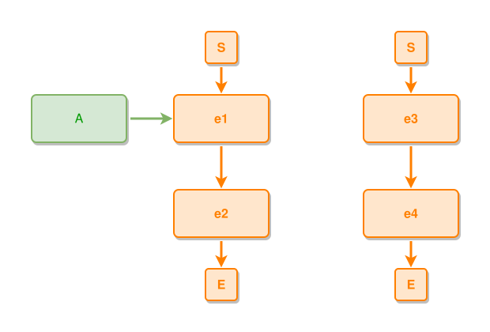

Two components: `{S, e1, e2, A, E}` and `{S, e3, e4, E}`. `A` joins e1's
component through its part-of (a placing relation); the two event chains
share nothing, so they separate.

**Does not cover:**

```ipmt
e1 ::e --> e2 ::e
A ::t --> e1
e3 ::e --> e4 ::e
B ::t --> e3
A --- B
e2 --::X--> e4
e1 --- e3
A, B --> cX ::c
e2, e4 --> cY ::c
C --> e2, e4
```
<!-- ipm-svg id=110 hash=cd8e0906 -->
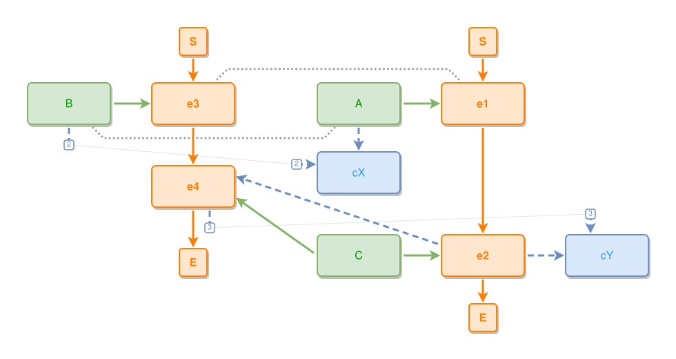

Still TWO components. None of the cross-links merges the two event chains:

- `A --- B` and `e1 --- e3` — near-to places nothing, anywhere;
- `e2 --::X--> e4` — expresses BETWEEN events places nothing;
- `A, B --> cX` and `e2, e4 --> cY` — the SHARED concepts do not fuse the
  chains either: each concept anchors in ONE component (its users are at
  EQUAL depth here, so declaration breaks the tie — cX with A's, cY with
  e2's) and the edge from the other component becomes a cross-component
  tie;
- `C --> e2, e4` — even a shared THING, part-of an event in EACH chain,
  anchors-and-ties the same way: C belongs to e2's component (equal
  depth, first declared wins) and `C → e4` becomes a cross-component tie.

So v7P1 gives `{S, e1, e2, A, cX, cY, C, E}` and `{S, e3, e4, B, E}`. What
v7P1 does NOT decide here: where the second component goes and what the
ties do to its position (v7P2), how a shared aux node behaves INSIDE its
component (v7P7), and everything else inside each component.

## v7P2 — the most central component first, tied components around it

**Statement.** Components are placed in order of CENTRALITY, sorted by:

1. number of CROSS-COMPONENT connections (the ties of v7P1's "does not
   cover" — near-to, expresses between events, the tie ends of shared aux),
   descending;
2. number of declared nodes, descending;
3. number of declared edges, descending;
4. number of events, descending;
5. original (declaration) order.

(The synthesized S/E and their edges never count — they are the same for
every event component.) The most central component is placed first and owns
the canvas centre. Every component tied to an already-placed one is placed
AROUND it, next to the node its tie anchors to — the stand-off measured
against the placed comps' BOXES on the tile's own rows, never a
whole-flank bounding box (v7P5's satellite rule at component scale;
measured against the bounding box, cX/cY stand three pitches off tD
because a row far above owns the flank's min-x). The stand-off VALUE
follows what the
tile IS: an event component keeps the full component gap (a separate
story), but an EVENT-LESS tile is satellite content — tied by a
placing-kind relation it HUGS at the attached-column gap, tied only by
near-to it keeps the near-to stand-off, the same adjacency rhythm as
v7P5's in-component satellites (the full gap reads tD—cX as too far
apart). Placement then chooses on the flank chosen by
the PRIORITY: fewer tie crossings first (the tie's straight tested
against the hub's boxes — a small S/E BOUNDARY box on the centre line
does not veto a flank, since the router slides the straight beside it,
v7P9), then closer to 16:9, then the side nearest the anchor — every
flank is evaluated, and the TOP flank wins only on strictly FEWER
crossings, never on aspect alone: a tied component above the hub
competes with the S cap and reads as a predecessor (time reads down,
v7P3) — a five-tie hub fills two ROWS of three, not a compass ring.
Components tied to the SAME node
STACK on the winning side in one column, one component gap apart, while
stacking stays crossing-free and the canvas tolerates it — and when the
stacked tiles are PURE thing/concept structures, the stack CENTRES on
the anchor like a band stack on its event row, so two near-to
structures mirror symmetrically about their anchor instead of one at
the row and one dangling below; event tiles keep the
one-directional stack, their S→E verticality is a timeline; once it
degenerates, the next clean flank opens — four components tied to one
concept RING it rather than pile into a tall column. Components with no tie follow in the same order,
after the placed group, packed by the COUNT LADDER (a rectangle
canvas by default): columns start at THREE and rows and
columns then grow alternately — 3×1 up to three tiles, 3×2 up to six,
4×2 up to eight, 4×3 up to twelve, 5×3, 5×4 … — evenly filled rows in
reading order, the placed tied group counting as one row-1 tile;
never a per-tile greedy wrap, which would split eight equal tiles 3+5
where the ladder says 4+4.

The CANVAS caps the arrangement: the diagram aims to fill a 16:9
rectangle, so a tied component may take a NON-IDEAL side when the ideal
one would make the diagram too big — and ALL tied components may line up
on ONE side when that avoids more crossings than the ring would. When the
goals conflict, the priority is: fewer tie CROSSINGS first, then closer
to 16:9, then the ideal side. A side hosting several tied components
orders them by the same rules — no tie crossings first, then centrality
order.

**Covers:**

```ipmt
a1 ::e --> a2 ::e
b1 ::e --> b2 ::e
c1 ::e
a1 --::X--> c1
b1 --::X--> c1
```
<!-- ipm-svg id=120 hash=83969c98 -->
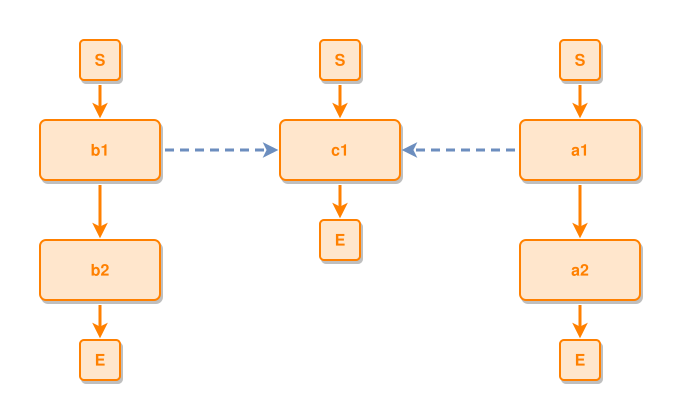

`c1` has TWO cross-component connections; the a and b chains have one each.
So `c1` is the most CENTRAL — it places first and takes the centre, even
though it is the smallest component (one event) — and a and b ring it,
each next to its tie's anchor. Node/edge/event counts only break the tie
when connection counts are equal (a before b here only by declaration
order at every equal step).

**Covers (sides):**

```ipmt
a1 ::e --> a2 ::e
b1 ::e
c1 ::e
a1 --::X--> b1
a2 --::X--> c1
```
<!-- ipm-svg id=130 hash=37549acf -->
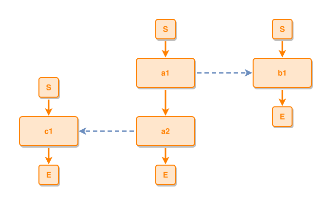

The a chain is the most central (two connections); b and c take its LEFT
and RIGHT — a third and fourth tied component would take ABOVE and BELOW.
Each sits at the height of its tie's anchor (b beside `a1`, c beside
`a2`), and the left/right assignment is the one where `a1 → b1` and
`a2 → c1` do not cross each other.

**Does not cover:** the gaps and alignment of the tiles (spacing, v7P8).
Everything inside each component belongs to later principles.

## v7P3 — the event skeleton: leads-to runs down, part-of indents right, forks spread symmetrically

**Statement.** Inside a component, EVENTS place first and alone — things and
concepts come later and NEVER move or reorder them: leads-to outranks
part-of, and part-of outranks everything auxiliary. A `leads-to` edge
points DOWN: the predecessor sits above the successor and the edge wants
to be one vertical line. The vertical rhythm is PER LANE: every event sits
one gap below its own predecessors' bottoms — a tall member in one branch
never inflates a sibling branch's gap — and fork siblings share their row.
S and E CAP the component's timeline as its OUTERMOST elements: S above
everything, E below everything, aux included. A `part-of` sub-event nests
one step to the RIGHT of its composite (the sub GRID owns that side),
the grid's middle on the composite's centre — and the sub-structure is a
SKELETON recursively: rank rows over the siblings' own `leads-to`, so a
chain is the degenerate one-column case, a FORK spreads its branches
side by side on one row, and a join rejoins below. Rows left-align on
the grid's axis and grow rightward, keeping the composite's part-of
corridor clean. Flow units without leads-to between them stack
vertically in chain+node-ID order. Time reads top-to-bottom,
containment reads left-to-right.
These two relations fully determine the relative event layout; an
`expresses` or `near-to` between events places nothing here (membership:
v7P1) — it only draws.

Forks and joins follow from the same two relations (this whole principle
is `eLe`/`ePe` business). A fork's successors share one ROW below their
predecessor, in declaration order — except branches that later JOIN into
one event cluster ADJACENT (sibling affinity at skeleton scale; a cluster
sorts by its first-declared member), so the join can centre under its real
predecessors. Each branch owns a vertical LANE: it grows downward inside
it, uneven depths and all, and claims horizontal room for its whole
subtree. SYMMETRY caps it: a join centres the way a fork centres — under the
MIDDLE predecessor lane (odd count), the middle pair's midpoint (even) —
never the mean, which per-pair fan growth skews off the corridor axis
(the S→s→m→j→E spine is ONE line); a fork parent
centres over its row, S stays on the
start event rather than chasing an uneven fan, and a wide fan grows in
BOTH axes — gaps widen and the row drops, keeping the fan angle readable.
(The fixtures "uneven sibling branches keep their vertical lanes",
"start boundary stays on the start event over an uneven fan" and "fork
merge fork keeps a vertical spine" in
`gl:docs/dev/layout-gen/layout-alg.md` show the lane and symmetry
rules.)

**Covers:**

```ipmt
e1 ::e --> e2 ::e
e2b ::e --::P--> e2
e2a ::e --::P--> e2
e2a --> e2b
e2c ::e --::P--> e2
```
<!-- ipm-svg id=140 hash=ecf14ae7 -->
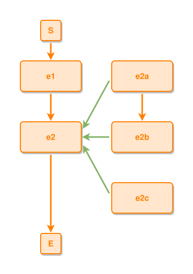

`e1` sits above `e2`, their edge one vertical line, S above and E below.
The sub-events take the column one step right of `e2`. The declared
`e2a --> e2b` orders its pair: `e2a` above `e2b`, adjacent, their edge a
short vertical — even though `e2b` was declared first. The order of the
chain `e2a+e2b` versus the unordered `e2c` is defined by the input graph's
node ID order (already sorted/normalized): the chain's smallest ID (`e2b`)
precedes `e2c`, so the chain stacks first and `e2c` follows below it. (The
IPMV2.7 warnings about `e2c`'s undeclared order vs the chain are the normal
partial-order state — the column must still lay out sensibly.)

**Covers (fork order):**

```ipmt
s ::e --> x ::e
s --> y ::e
s --> z ::e
x --> j ::e
z --> j
```
<!-- ipm-svg id=150 hash=4eb37dec -->
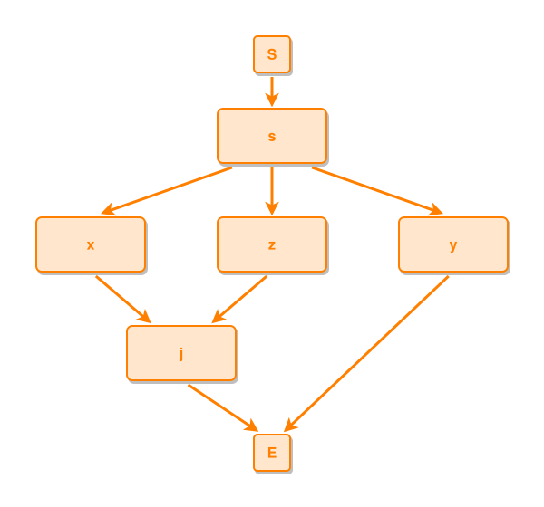

`x` and `z` join into `j`, `y` does not — so the row is `x, z, y`: the
joining pair clusters adjacent (led by its first-declared member `x`), `j`
centres under the `x`+`z` lanes, and `y` drops straight toward E with no
crossing. In plain declaration order (`x, y, z`) `j` would land under `y`
— an event that is NOT its predecessor — forcing `x → j` to cross and
`y → E` to bend around `j`.

**Does not cover:**

```ipmt
s ::e --> x1 ::e
s --> x2 ::e
s --> x3 ::e
s --> x4 ::e
s --> x5 ::e
s --> x6 ::e
```
<!-- ipm-svg id=160 hash=24d07bbb -->
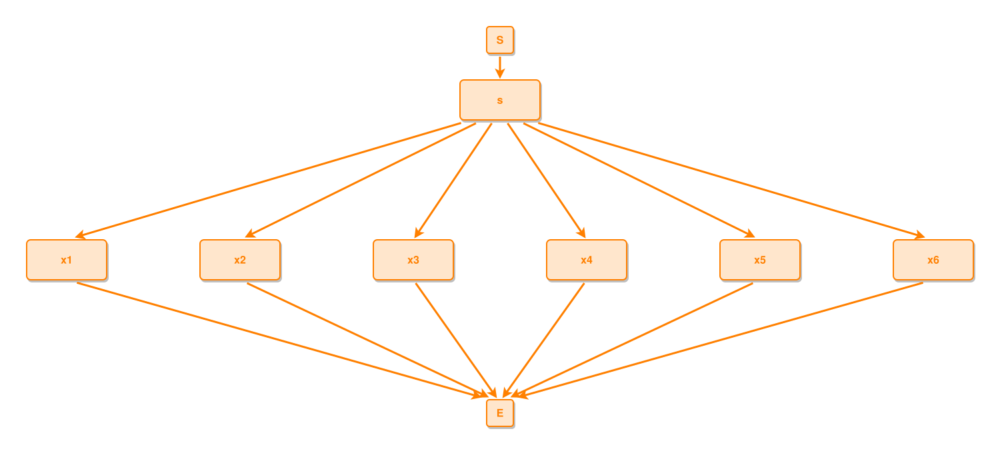

A wide fan widens its gaps and drops its row — v7P3 says so, but by HOW
MUCH (the pitch, the fan-angle cap) is spacing business (v7P8), and the
exact path the outer leaf-to-E edges take around the canvas is routing
business (v7P9). Also not covered: everything about things and concepts
around the skeleton (v7P4).

## v7P4 — aux attaches in groups: on the event's row, wholes outward, parts above, concepts down

**Statement.** Things and concepts reach the skeleton only through the two
CONNECTORS — `tPe` (thing part-of event) and `eXc` (event expresses
concept). An aux structure held together by its internal relations (`tPt`,
`tXc`, `cXc`) is a GROUP: it renders as one unit, keeps its internal shape,
and moves only as a whole — the outer no-overlap resolution included: a
member colliding with a foreign box steps down together with its
placement DESCENDANTS, so a chain member carries everything it places, a
leaf carries nothing, and a link never shears out of its group's diagonal
(per-node stepping tore
the chain when a foreign band shared one member's column; whole-structure
stepping dragged band members off their anchor rows for a mere leaf
collision). A band-stack member carries its stack SUFFIX the same way —
the stack yields space as one line instead of leapfrogging member past
member (leapfrogging sank a member past its whole band), and
when a root grows an exclusive subtree, its stack siblings re-stack
CLEAR of the tree's vertical span — prefix up, suffix down, the
tree-owning root pinned to its row. The tree's FOOTPRINT is exclusive
across BANDS too (an aux hierarchy renders as ONE unit so it can
fold/unfold later):
after solving, every member snaps back to its planned offset from the
root (the rigid foldable body), and any foreign aux box left inside
the tree's bounding box moves OUTWARD past the nearer flank — an
interleaved stranger (a foreign node in the tree's right
flank) dissolves the unit's very boundary. FOREIGN is literal: a box
of the tree root's OWN anchor event is family — the frame its root
hangs off, its satellite mates, their concepts — and keeps the band
grammar; only another band's members are strangers. And the move
never PAYS: it needs strict overlap (a margin clip is not
interleaving), a destination free of boxes, and — v7P6, absolute —
a destination clear of every FLOW CORRIDOR, the vertical column
through each event's centre where S, the chain and E draw their
pinned line; when neither flank qualifies the intruder stays put. And when a connector-attached root fully OWNS a real
HIERARCHY — the closure over its structural tPt/tXc/cXc edges touches no
event and nothing outside itself, and some member places another member —
that subtree renders as LAYERED GENERATIONS off the root, exactly as a
separate pure component would (the subtree is the zoom
canvas's FOLDABLE UNIT — a click on the root folds it, so it must read
as one hierarchy): expresses descends, part-of ascends, siblings share
their generation row, parents centre over children best-effort, the
root keeps its band spot, and the tree shifts aside as one unit rather
than park a row in the anchor event's flow corridor (v7P6). A flat fan
qualifies too — two direct parts of one thing are one generation and
share one row; a tower reads as a chain. A subtree
another event touches and a member anchored elsewhere stay in the band
grammar below. A group anchors through its PART-MOST connected
member — the most elementary thing that directly participates in an event —
and that member sits ON the anchor event's ROW; the group's other event
connectors draw as plain edges (anchor-and-tie, v7P1 at group scale — no
exceptions: a member part-of several events keeps its first anchor's band
and ties the rest; nothing hovers between anchors, and part-of never
repositions the skeleton). Inside the group, the ARROW's direction
is the canvas direction (stated for the spine's right side; the left side
mirrors horizontally):

- the whole of an outgoing `tPt` goes OUTWARD on the row (`A --> B`: A left
  of B);
- INCOMING parts stack ABOVE their whole (`C --> A`: C above A);
- concepts (`tXc`, `cXc`) step DOWN-AND-OUTWARD, so a concept chain reads
  as one diagonal line; an incoming expresser joins that line from
  above on the spine side. A thing's SOLE concept child skips the
  diagonal and drops directly BELOW it, centred — the closest spot
  (corner-to-corner reads distant) — SHARED concepts included, their far
  ties drawing long from the anchor spot; a shared concept keeps the
  diagonal rail only while its second user sits within ONE flow step,
  where the short pull aligns it with both users. An
  exclusive concept chain stacks as the one-column tree, the 2-link
  chain included;
- siblings of one generation and one arrow direction never split — they
  stack as one line (a column above, a stack outward, a diagonal down).

And the group's SUBGROUP ORDERING: within a group, THINGS place first and
CONCEPTS last (the aux echo of the events→things→concepts layering) —
except a thing FAN (two or more) plus a SOLE leaf concept, which never
share the band: stacked with the fan the concept reads as one more
part-of member, so it drops BELOW the event, x-centred at the stack
rhythm, and the band centres on the fan alone. The
below-drop yields when the spot below is a SIBLING's — a stack
member's own leaf concept takes the down-and-outward diagonal into the
concept column instead of stepping past the stack and reading as one
more stack member. And a leaf NEVER strands: when
the no-overlap floors (or the band's offset spot itself) leave a sole
leaf concept more than a row pitch below its owner, it relocates to the
nearest free spot around the owner — below-centred, below-outward,
beside, each family SLIDING laterally in grid steps before the next is
tried — a one-edge leaf has no reason to end up far away (the
offset-column strand and the slide). A
rescue spot must clear the SKELETON's port lines and the flow corridor,
not only the boxes — the rescue never parks a leaf ON the line the
floors stepped it off of; when every slid spot is swept, the demand
loop grows the row gap instead (v7P8 §4). A
sibling stack orders by AFFINITY: siblings sharing a further connection (a
common node they both point at) cluster ADJACENT, so the shared node can
bracket the pair; clusters and loose siblings then follow declaration order
(a cluster sorts by its first-declared member). The same force ORIENTS the
stack: a member whose further connection points DOWNSTREAM takes the
stack's lower end, upstream the upper end — sit nearest your further
connection, so its tie leaves the stack without crossing a sibling's
edge. The pull acts at short DISTANCE too: a node whose single
demoted tie reaches a partner may SLIDE along its band column to the
closest approach — but never beyond ANCHOR REACH (one row pitch): the
structural anchor edge outranks the demoted tie, so the node stays
beside its anchor and the TIE pays the distance as one long clean line
("far is connected to e1, so it should be next to e1 — then go
diagonal to e8"; this replaces the slide-to-the-
second-user reading — the slide survives only where it aligns a shared
node with both users, one row up). The anchor still owns the COLUMN
(v7P7 — no hovering between anchors); a pull that cannot REACH (the
partner still more than a row gap away at the best slide) pays nothing
and the node keeps its stack spot — a small twitch toward a far tie
breaks the band's symmetry for nothing. The slide CARRIES the slid
node's own dependents — an aux neighbour whose every edge touches it,
its outward whole say, rides along instead of stretching its tie across
the vacated rows. Generation rows never slide
(their row IS structure), and every clearance holds along the way.
One case overrides closest approach entirely: when the anchor's user
and the tie partner are PEERS in one stack column and the node hangs a
layer out, the node reads as their shared CHILD — a join — and a join
CENTRES between its parents (v7P3), equal gaps and mirror diagonals.
Which parent won the anchor election is a declaration-order coin flip
there (v7P7), and symmetry must not depend on it (`color` sits
symmetric between `black` and `white`). The centring is
symmetric-or-nothing: blocked short of the midpoint, the node keeps its
stack spot rather than parking off-centre. And a join child a full row
pitch clear of BOTH parents TUCKS to half a node width off their
column: nothing lies between them, so a full column of horizontal
separation buys nothing — the join edges steepen toward the
hierarchy's vertical read and the canvas narrows ("half of the node
width would be fine"); a TIGHT join keeps its full
pitch.

Two placements complete the grammar. A COMPOSITE mirrors its aux to the
LEFT flank (its sub-event column owns the right, v7P3); when the
composite is itself a sub-event, its left row hosts the parent's part-of
corridor too (v7P6) — then its band drops straight BELOW it as ONE
GENERATION: a ROW centred on the owner, things first, concepts last,
each on its own short connector from the owner's bottom fan (a column
would read as layers and push the lower connectors around the upper
boxes; the diagonal returns only when the composite flows downward and
below is a flow corridor). And a PURE
structure (a component with no events, v7P1) lays out as LAYERED
GENERATIONS, the aux echo of the skeleton: part-of ascends — a part one
row above its whole — expresses descends, siblings sit side by side in
their generation, every member centres on its connections — but a JOIN
(a member with several parents) centres under them without pulling any
parent off its own chain, the skeleton's S-stays-on-the-start rule at
aux scale (a shared join used to kink a part-of
chain) — and a diamond renders as a diamond. Generation follows the RELATION, demoted or not;
the per-lane rhythm of v7P3 applies (a tall member never inflates a
sibling's lane). One exception LIFTS out of the levels: an EXCLUSIVE
sole-parent LEAF concept whose parent keeps a real hierarchy child
below is that parent's aux, not a generation member — it rides
x-centred directly ABOVE its thing on a short vertical (left in the
levels, such concepts pile into the join whole's row). Shared concepts,
concepts with children, and parents whose children are ONLY leaf
concepts keep the level layout.

**Covers:**

```ipmt
e1 ::e --> e2 ::e
w ::t --> e1
p ::t --> w
p --> e2
p --> cX ::c
q ::t --> p
```
<!-- ipm-svg id=170 hash=a35efb07 -->
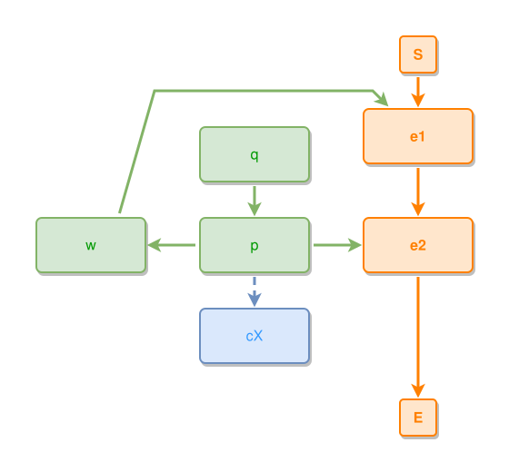

One group `{w, p, cX, q}`. Its members with event connectors are `w` (to
e1) and `p` (to e2); `p` is the part-most of the two (`p` is a part of
`w`), so the group anchors THROUGH `p` TO `e2` and sits on e2's row:
`e2 | p | w` — the whole `w` outward, `q` (an incoming part of `p`) ABOVE
`p`, `cX` below-right of `p`, and `w → e1` drawn as a plain edge up to e1.
Placement order inside the group: things first (`w`, `q`), then concepts
(`cX`).

**Covers (sibling ordering):**

```ipmt
A --> e1 ::e
A --> B1, B2, B3
B1, B3 --> cS ::c
```
<!-- ipm-svg id=180 hash=eca65b15 -->
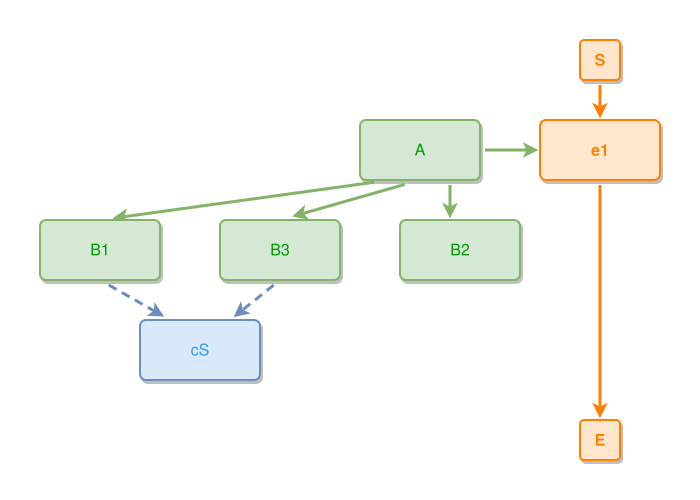

`A` fully owns this hierarchy, so it renders as layered generations:
`B1, B2, B3` share the generation row below `A`, and the AFFINITY rule
orders the row: `B1` and `B3` share `cS`, so they cluster adjacent —
`B1, B3, B2` — and `cS` centres under the pair. The cluster leads because
its first-declared member (`B1`) precedes the loose `B2`. (In a stack —
a flat fan's band, a generation column — the same affinity rule orders
the stack members instead.)

**Does not cover:**

```ipmt
A --> e1 ::e
A --> B1, B2
B1 --- B2
```
<!-- ipm-svg id=190 hash=b8563d4f -->
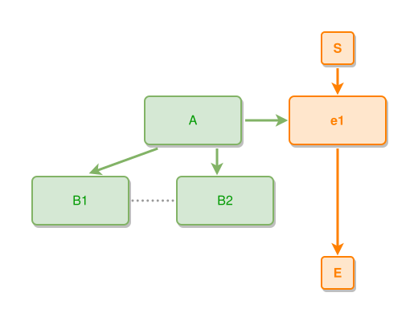

The `B1 --- B2` near-to is a same-kind TIE (`tNt`), not a placing relation:
whether it pulls the siblings adjacent, orders them, or only draws, is the
tie principle's business (v7P5 — which orders them adjacent). Also not
covered: spacing values (v7P8), and how the drawn non-anchor edges route
around boxes (v7P9).

## v7P5 — same-kind ties: draw, order, or wrap as the outermost layer

**Statement.** The same-kind ties — `tNt` (thing near-to thing) and `cNc`
(concept near-to concept) — are the LEAST important edges: they never
build structure. What a tie does depends on its endpoints. Between two
nodes each placed by their OWN connections, the tie only DRAWS — except
between same-anchor SIBLINGS, where it pulls the pair ADJACENT in their
stack (a tie is a declared affinity, feeding v7P4's ordering). A node
whose ONLY connection is a tie — no `part-of`, no `expresses` — is placed
BY the tie: it joins its partner's component as the OUTERMOST onion
layer, wrapping the placed skeleton-and-aux from outside, right next to
its partner — outermost measured on the satellite's OWN ROWS, not the
whole flank: it steps past only the boxes its stack would actually
meet, staying one near-to stand-off from the row's outermost member
(measuring the whole side pushes a satellite three columns from its
partner). Which flank: when the partner sits in a
pure layered grid, the side test compares the partner's centre against
the GRID's midline, not the frame node's — the frame is just an aux
member, and a satellite sent INTO the grid crosses the descent
corridors (`human` placed between the taxonomy
columns had its tie cross an expresses edge). That layer belongs to the component — other
components begin only beyond it. Ties BETWEEN components are v7P1's glue and v7P2's
placement hints; they never move nodes inside a component.

**Covers:**

```ipmt
e1 ::e --> e2 ::e
A ::t --> e1
A --- B ::t
```
<!-- ipm-svg id=1a0 hash=38d06a71 -->
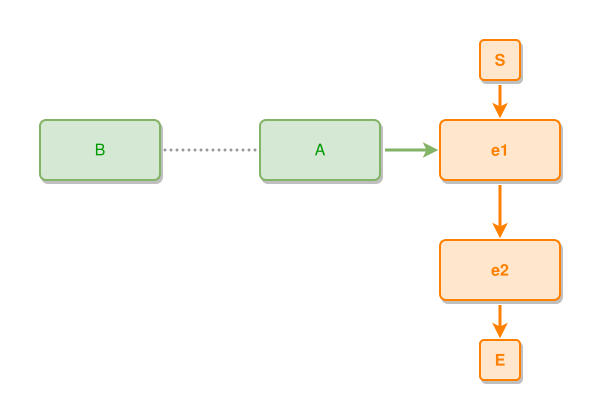

`B` has no placing relation — only the tie to `A`. The tie places it: `B`
sits in e1-component's outermost layer, directly beside `A`, the tie a
short straight line. `B` is NOT a component of its own — a second
component would be placed outside `B`, not between `B` and `A`.

**Covers (sibling ordering):**

```ipmt
A --> e1 ::e
A --> B1, B2, B3
B1 --- B3
```
<!-- ipm-svg id=1b0 hash=2146b759 -->
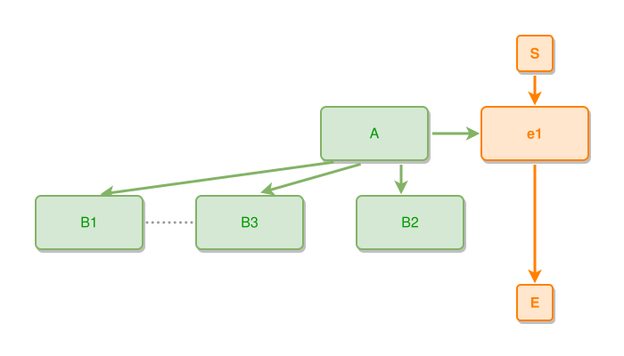

`B1`, `B2`, `B3` are all placed by their part-of into `A`; the tie
`B1 --- B3` does not re-place anyone — but it ORDERS the stack: `B1` and
`B3` cluster adjacent (`B1, B3, B2`), exactly as a shared further
connection would in v7P4, and the tie draws as a short line between
neighbours. (This answers v7P4's does-not-cover.)

**Does not cover:**

```ipmt
e1 ::e --> e2 ::e
A ::t --> e1
A --- B ::t
A --- C ::t
A --- D ::t
```
<!-- ipm-svg id=1c0 hash=27481fb6 -->
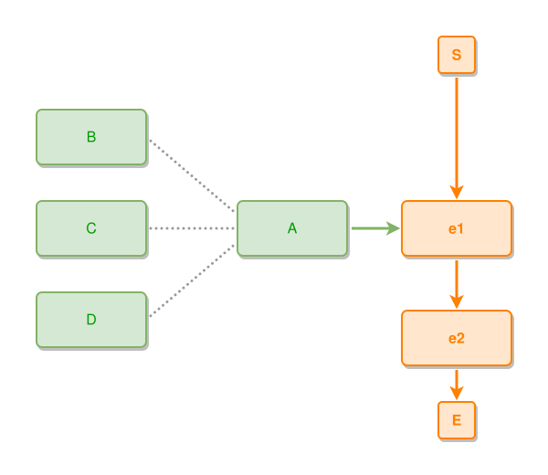

All of `B`, `C`, `D` land in the outermost layer near `A` — but their
order around `A`, which of them sits on which side, and how far the layer
stands off the component are left open (side/order detail and spacing —
v7P8). How a long tie ROUTES around the component it wraps is routing
business (v7P9).

## v7P6 — the flow corridor: the skeleton never yields, space does

**Statement.** An event's downward flow corridor is RESERVED: a thing or
concept never parks in it, and a flow edge never bends around aux — the
aux box moves, or its own edge hides, before the skeleton deforms. But
"moves" never means "moves away from its anchor": when an anchor is
surrounded by corridors (a middle fork branch), the structure GROWS to
host the aux beside its anchor — the gap on the side that needs room
opens, while the skeleton's spine axis holds (the fork parent and the
join stay on it). This holds for GROUPS of any size; there is no eviction
threshold. Only the 16:9 canvas
budget (v7P2) can refuse growth — and then edges hide or the group
compacts, but the aux still stays beside its anchor.

**Covers:**

```ipmt
s ::e --> x ::e
s --> m ::e
s --> z ::e
x --> j ::e
m --> j
z --> j
A ::t --> m
```
<!-- ipm-svg id=1d0 hash=bdd04099 -->
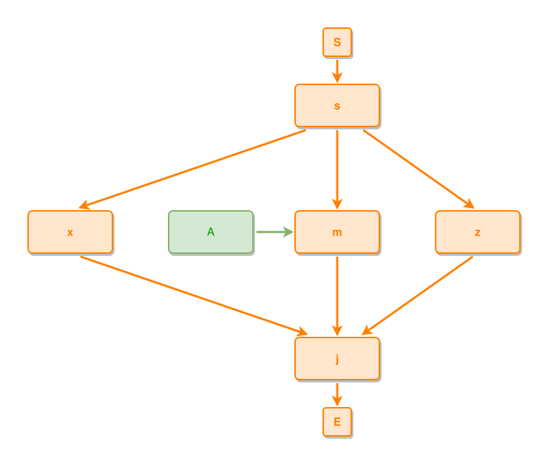

`A` is part-of the MIDDLE branch `m` — both its natural side spots are
flow corridors (`x → j` and `z → j`). The fan grows to host it: `A` sits
beside `m` on the branch row, the `x`–`m` gap opening to make room while
the `m`–`z` gap keeps the fan's breathe pitch. `m` stays on the fork
parent's axis and `j` stays on that same spine axis, and every flow edge
stays straight.

**Does not cover:** how much the gaps grow — the values and the growth
mechanics are spacing business (v7P8); how the aux edges route through
the grown space is routing business (v7P9).

## v7P7 — shared nodes anchor at their deepest user

**Statement.** A node with SEVERAL placing relations is placed by ONE of
them: the DEEPEST / part-most user wins — one rule for things and
concepts alike, so whole-part chains stay intact as one shape (v7P4's
part-most group anchor is this same rule at group scale). A thing that
directly participates in an event keeps that participation: its DEEPEST
event connector anchors it, and deeper THING-users cannot pull it off
its events. Depth between EVENTS is their part-of nesting — a
sub-sub-event outranks its ancestors as a user, exactly as a part
outranks its whole. Declaration order only breaks depth ties. The remaining placing
relations become drawn ties — the node never hovers among its anchors;
the one residual centring is v7P4's BRACKET, where a shared fan-in child
of an ADJACENT stack pair sits one step outward on the pair's midpoint.
Cross-component edges never pull (v7P1).

**Covers:**

```ipmt
e1 ::e --> e2 ::e
W1 ::t --> e1
V ::t --> e2
W2 ::t --> V
T ::t --> W1
T --> W2
```
<!-- ipm-svg id=1e0 hash=52772761 -->
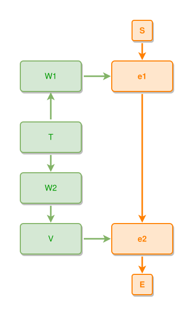

`T` is part-of both `W1` (depth 1: directly on e1) and `W2` (depth 2:
part of `V`, which is part of e2). The deeper user wins: `T` anchors to
`W2` and stacks above it (an incoming part, v7P4), keeping the chain
`e2 | V | W2 | T` one connected shape; `T → W1` draws as a tie.

**Does not cover:** whether and how the `T → W1` tie DRAWS (routing and
hide priority, v7P9); nodes with NO placing relation at all (v7P5's
tie-only onion layer).

## v7P8 — spacing: gaps are minimums, growth is symmetric, the grid is exact

**Statement.** All the NUMBERS the other principles defer live here. Gap
constants are MINIMUMS: a base grid that every "next to"/"below" in
v7P1–P7 resolves to; gaps may only GROW, never shrink. Growth is LOCAL
and PER GAP: a sub-grid's row gap grows for what hangs BELOW one row and
rises ABOVE the next (a packed band column gets one more pitch instead
of cascading its last member to the bottom, which strands 'user'
below six foreign things), and each fork gap fits exactly the
two subtrees it separates —
a corridor hanging off one branch never mirrors onto the far flank —
while the CORRIDOR child keeps the fork parent's axis (v7P6). Wide fans
BREATHE: a one-to-many fan's sibling gap grows one grid step per member
beyond two (60/80/100…) — this holds for forks and for the virtual root
fork of a component's start row alike — and every fan (fork out, join
in, S down, E up) keeps its flattest edge inside the SAME 150° cap by
growing the vertical gap (dy ≥ dx / tan 75°, gridded).
Tall/wide nodes push their own row and column apart, tied tiles keep
their stand-off (v7P2), the onion layer its distance (v7P5), aux hosting
grows its orbit (v7P6), and edges get their room (v7P9) — always mirrored
at the symmetric counterparts, never spilling into unrelated gaps. A row
resolves as ONE separation problem: members give way SIDEWAYS, never
vertically. And clearances bind EDGES too: there is a VISIBLE GAP —
half a grid step — between any drawn line and any box it does not
connect to, S and E and stub chips included; an arrowhead or a parallel
run closer than that reads as touching. An ARROWHEAD LANDING demands
MORE from through-traffic: a lane passing an S/E corridor keeps 1.5×
the grid step from the flow arrow's landing (a head reads bigger than
a line) and one full gap from the boundary — when the corridor is too
tight, the boundary edge LENGTHENS and the layout re-solves once (the
first slice of the demand loop, §4 below: the P—Q lane must not hug
the S→s arrowhead). A third slice serves stub CHIPS: a
chip whose chosen flank faces the node's own S/E cap with less than
the chip's full form of room (reach + badge + visible gap) posts the
same boundary demand — the corridor lengthens rather than the chip
squeezing beside the cap's arrow ("make e4 → E a bit
longer due to chip 3"). The demand loop's SECOND slice serves
stranded leaves: a sole leaf concept parked more than a row pitch below
its expresser — every near-anchor wedge swept by a successor's part-of
diagonal — posts a ROW-GAP demand below its owner; the successor's row
drops until the diagonal passes a full visible gap under the wedge
beside the flow corridor, and the re-solve's rescue lands the leaf next
to its owner (add vertical space and place the node
CLOSER, to avoid edges crossing). An edge ARRIVING at the corridor's own event
is not through-traffic — it shares the border via port spread. The
same clearance binds NODE-side landings: a lane's middle segment
running parallel to a border that hosts arrowheads shifts AWAY until
the heads have their 1.5× gap, room and crossings permitting
(a lane once ran beside the arrows landing on a neighbouring
node). The same eye-logic binds BOXES:
two UNRELATED boxes (no edge, no shared partner) must not sit
side-adjacent at band rhythm — aligned within one gap they read as
members of one group (the sweep's "reads as paired"
guard ratchets the class). Placement keeps aux boxes clear
of the skeleton's port lines, routing scores a graze as half a crossing
— a fan edge's brief skim past boxes tied to its own endpoints is
exempt (detouring a nine-branch fan reads worse than the skim), a
ROW-MATE's border never is — and lanes are ROOM-AWARE: every lane (a
tie's bypass and a blocked structural's alike) CENTRES in its flank's
free room (half the room, capped at one clearance) — a fixed or
quarter stand-off ran too close to the next row's arrows and hugged
the S cap's arrowhead. A FLUSH run — zero gap to a
border — is prohibitive on its own, like hugging S or E, and it PIERCES
the fan-sibling exemption (a line through a box's corner reads as
touching no matter the kinship): a candidate
that keeps the visible gap wins even when it must cross at a
distance. Grid parity is part of exactness: a node's two sole leaf
children sit an ODD number of grid steps apart, so the pair spreads
ONE grid step to mirror exactly about its grid-aligned parent (gaps
only grow: "are they really precisely symmetric?"). Arrivals space by their VISIBLE HEAD SPANS, not their tips
("to human eye the arrow should be a bit lower to look like
being in the middle"): a steep line's arrowhead occupies a run of the
border — one arrowhead length projected along it — a perpendicular
line's almost none. Middle arrivals equalize the CLEAR gaps between
neighbouring spans; unanchored extremes compact INWARD to one visible
gap (never toward their corner); flow ports and axis-aligned straights
pin the system, and every move is hit-guarded. Exits have no heads and
never move for optics. Entries at one border keep their APPROACH order: each lane end's slot
request steps off the corner extreme by its rank among the side's
arrivals — ranked by the APPROACH's position along the side's axis,
which for a BENT route is its LAST BEND, not the source's centre (the
approach IS the last leg; sorting by the source put a horizontally-
arriving lane under a diagonal it then crossed) —
so the higher source enters higher and no two arrivals swap;
the ends then SPREAD EVENLY between the fixed anchors (straight and
flow ports) and the border — the middle arrival sits in the centre of
its neighbours, and a side's SOLE lane keeps its quarter
slot; a slot that would push the lane's last segment THROUGH a
box the claimed route clears is refused — spacing never buys a
through-node. And covering is enforced AFTER the
spread and lane passes: a tie still lying on another drawn line HIDES —
the outlet when no lane has room (twin flank lanes on one x); the
longer tie hides, the last visible connection never does. A stub chip budgets for its
NUMBER BADGE: line, badge and the visible gap all fit the flank's free
room, or the chip takes another side (half-the-gap sizing parked the
badge exactly on the neighbour's border), and against
drawn lines the chip zone wears an extra half grid step so a landing
arrowhead never slides under the badge. Stub chips order along their border by the
PARTNER's direction — the
chip whose hidden partner lies further left sits further left, so the
phantom lines never cross. The defaults — grid
step 20, clearance 40, row/column gap 60, near-to stand-off 100,
component gap 120, standard
node 120×60, the 150° fan-angle cap — are each a multiple of the
grid step, so the solver works in grid units and snapping is exact by
construction (see the Algorithm section below).

**Minimal distances at a glance** (one table, one
minimal example each; every value is a MINIMUM — growth only adds):

| distance | px | between |
|---|---|---|
| grid step | 20 | every coordinate and constant snaps to it |
| visible gap | 10 | any drawn line and any box it does not connect to |
| arrowhead clearance | 30 | a through-lane and a flow arrowhead's landing (1.5× the grid step) |
| stack gap | 40 | siblings inside one aux stack; S/E to their event |
| column gap | 60 | attached columns: band member ↔ its event, concept ↔ its expresser — and an EVENT-LESS tile tied by a placing relation ↔ its hub node (tD—cX) |
| row gap | 60 | adjacent event rows (grows for hangs, fan caps, demands) |
| near-to stand-off | 100 | near-to adjacency, in-component satellites and event-less near-to tiles alike (adjacency, not attachment) |
| component gap | 120 | event components; tile ↔ tile on a shared flank |

The attached-column rhythm on one minimal graph:

```ipmt
e1 ::e
tD ::t --> e1
tD --> cX ::c
```
<!-- ipm-svg id=1ei hash=6f7ad46d -->
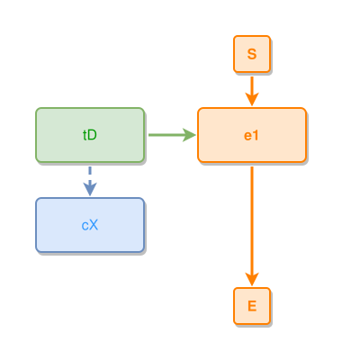

near-to adjacency:

```ipmt
tA ::t --- tB ::t
```
<!-- ipm-svg id=1er hash=b91f4e93 -->
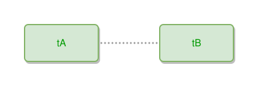

and the component gap, two event stories side by side:

```ipmt
a1 ::e --> a2 ::e
b1 ::e --> b2 ::e
a1 --- b1
```
<!-- ipm-svg id=1ev hash=53f12b34 -->
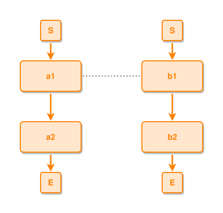


**Covers:**

```ipmt
w ::e --> y1 ::e
w --> y2 ::e
w --> y3 ::e
w --> y4 ::e
w --> y5 ::e
w --> y6 ::e
```
<!-- ipm-svg id=1f0 hash=008dd88f -->
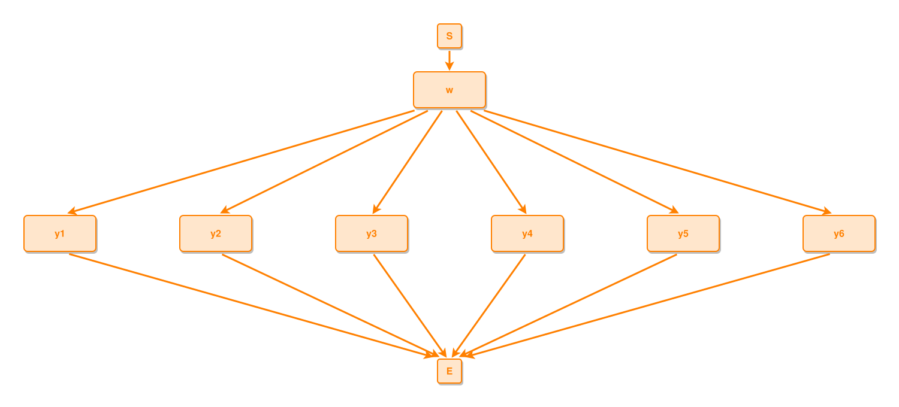

A six-branch fan cannot keep the base pitch AND a readable fan angle from
`w`, so it grows in BOTH axes: all six gaps widen to ONE larger pitch
(never just the crowded one) and the whole row drops until the outermost
edges respect the fan-angle cap; `w`, S and E stay centred on the row's
midpoint, and every value lands on the grid.

**Does not cover:** where the edges actually run through the grown space,
and which edge's demand triggers growth — routing business (v7P9).

## v7P9 — edge routing: clean, kind-aware, or a stub

**Statement.** Edges never cross ARROWS (an arrowhead's landing stays
clear), avoid nodes, and cross at most ONE other edge — or TWO edges of
DIFFERENT colors (kinds), where two same-kind lines would tangle. A
boundary fan's blocked straight (an end reaching E, a start leaving S)
turns as EARLY as strict clearances allow — the shortest lane run and
the steepest diagonal, nearest the 45° ideal; only when no early turn
clears does it run its full lane and converge just before the boundary
(without the early turn, e3→E sweeps flat under c6). The
FLOW corridor is special (v7P6): a HIERARCHY tie (part-of/expresses)
never cuts it — slicing the timeline to reach a cheaper lane reads as
breaking the story, and such a tie stubs instead. Only a NEAR-TO
association may cross a flow edge, under the kind budget — with one
exception: a sub-grid's own RETURN edge (the structural ePe back to
its composite) may cross the grid's INTERNAL fork links at 1.5, under
the prohibitive cut but above every clean alternative — the sub-grid
is dense and the return sometimes has nowhere else; the protected
corridor is the main timeline, not a composite's inner links.
Anything worse falls back to
HIDDEN (stub), and the hide priority follows the kind hierarchy: the
less structural kind hides first — near-to before expresses before
part-of, and leads-to NEVER hides (v7P6). Within one kind, geometry
breaks the tie: the longer, more-bent edge hides. A tie whose path runs
past 1.5× its direct distance pays the excess as crossing cost — past
about 2.5× it STUBS rather than loop around the diagram. Edges MEETING at a
shared node do not count as a full crossing NEAR that node — fork lines
necessarily brush at their box — but the brush is not FREE either: it
costs a quarter crossing, so an equal candidate that avoids it wins
(two arrivals need not cross). The same pair crossing
farther out (beyond one clearance) is a real tangle and counts in full.
A tie between boxes that OVERLAP on one axis may SLIDE its straight
within the overlap — both ports move together — reading as ONE
vertical (or horizontal) line that passes beside whatever sits on the
centre line, a lower component's own S boundary included. Candidates
are tried in preference order and the first under budget wins — except
a FREE candidate anywhere in the list, which beats any priced one
UNLESS it exits AWAY from its partner: trading a graced brush at the
shared source for a C-loop out of the far side reads worse
("directly, no bending"). Two guards override
everything: a node's LAST visible connection never hides, and a shared
node's anchor edge always draws.

Every candidate must DEPART its ports at a READABLE angle: the first
segment leaves through the source side's outward normal, the last
arrives through the target's, and at both ends the normal component is
at least the tangential over tan 75° (the 150°-cap ratio) — a
zero-height "vertical" exiting a top port sideways, or a seven-row
diagonal grazing into a side border at a few degrees, is no candidate
at all; such an edge turns once and meets the top/bottom CENTRE
head-on instead (minimum acceptable angle). The same
ratio gates the band-horizontal port rule itself. A blocked
structural's resolution prefers, in order: the alternate-axis
straight, then ALIGNED-overlap SLID straights (axis-overlapping boxes
connect with ONE slid vertical/horizontal leaving the facing border,
centre-out — the same shape ties use), then MIXED one-bend doglegs
(out of the top/bottom on the side toward the partner, then
horizontally in — "a bit above first"), then
the two-bend side and row lanes — which climb OUT and dive back IN on
45° border-to-lane hops, structural and tie bypass alike (the
square stubs "can be diagonal — that would look
nicer"). A dogleg LEG is at least an ARROWHEAD
long (one grid step) — ties and structurals alike: a micro-drop reads
as a horizontal line lying on the border beside the flow arrow
(a tie landed via a 12px stub swept over the flow
landing; a zero-leg side dogleg hugged a node's
corner instead of leaving the bottom). Diagonally separated components add
the INTER-COLUMN descent: out of the source's facing side, down a
clear lane ANYWHERE in the horizontal gap (tried centre-out), into the
target's facing side — a clear descent beats detouring around the far
flank (tH leaves its facing border). A lane's
port on a side with NO other edge takes the QUARTER slot, not the
corner extreme — corner nesting is for sides that ties share.

PORTS face the partner, by these rules:

- the EVENT hierarchy meets its event on the HORIZONTAL: ePe always,
  and structural band connectors (tPe into the event, eXc out of it)
  too — a deep band's fan then SPREADS over the event's whole border at
  equal gaps instead of crowding one centre port. The spread serves a
  FAN: an event with a SOLE band member has nothing to crowd, so when
  vertical travel dominates the edge follows the dominant axis instead
  — wide boxes make the drawn line far steeper than the centre-delta
  cap sees, and a steep side landing hugs the target's corner
  (swapT's only concept sat below-left at 74° into the right
  border; it lands on the TOP). Aux GENERATIONS read
  DOWN: a placing edge between things/concepts on different rows takes
  vertical ports, landing on the row's tops — given a REAL vertical run
  of at least one grid step between the facing borders; boxes that touch
  would make the "vertical" a horizontal line lying ON both borders, and
  fall through to the dominant axis (tD→cX hidden by
  the box borders). For everything else the
  dominant axis picks the side, VERTICAL winning ties — an
  exactly-diagonal edge leaves the bottom and lands on the top CENTRE;
  an arrow never lands corner-ish on a side — and never ON a corner
  point either: a tip at the mathematical corner FLOATS off the
  rounded outline ("it looks weird"). A shallow
  (sub-45°) OUTERMOST arrival instead lands FLUSH: when its target is
  row-flanked on the approach side (a neighbour within the near-to
  stand-off), the tip moves to that SIDE border's quarter — head flat
  on the box ("corner … or left/right side" — the side won); an open
  border keeps its slots, and the CONVERTED segment must itself still
  run shallow — a pre-conversion segment can be shallow while the new
  one turns near-vertical (declarative/configuration
  keep symmetric top landings instead). A single arrival tries both
  mirror directions. Never out of a WIDE fan (three or more
  same-rel children land uniformly on their tops — the ratified
  sibling-cluster look), and a side landing never pays: hit, new
  crossing, graze, a taken side, or broken approach order all revert;
- same-kind edges from one AUX node share ONE exit side — the user
  wrote one relation, and anchor-vs-tie is the engine's internal coin
  (v7P7). A BAND MEMBER's side is its FACING side: an aux node that sits
  ON THE ROW of an event it connects to meets that event on the
  horizontal, and its other same-rel ties to events in the same
  horizontal direction join that side and land on the events' facing
  sides — not off its bottom onto their top corners (Patrick, part-of
  every step from the right flank: "if he is connected via his left side
  at the top-most connection, the other two should prefer the left side
  too"); the near tie that already faces is held there too, so a
  farther sibling left vertical never drags it away. Otherwise, when a
  node's same-rel edges toward the same vertical direction split between
  vertical and horizontal exits, the horizontal ones join the vertical
  side (span's two part-ofs both leave the top). Either join only with a
  clean trial: the box gap must keep the line inside the 150° cap
  (border gaps — wide boxes lie; and tall boxes lie the other way, so
  the centre delta stays under five times the horizontal gap too), the
  joined straight must not hit, graze or cut a flow corridor (the
  late-branch tB kept its stub), and the receiving side must have room —
  a side takes at most TWO band arrivals, the on-row one and one more,
  a third would stack its head on a neighbour's (three chain events
  expressing one concept: the far one still lands on its bottom); a
  member whose line would fall flat — or too steep for the side — keeps
  its own exit: symmetry never grows the canvas, and a band join is a
  preference, not a force. The premise itself needs the on-row straight
  to be CLEAN: an on-row edge that must lane around its event's own aux
  (controllers → its loop) shares no side;
- an edge never runs ALONG a border it touches: a detour's ports face
  its FIRST segment (a horizontal-first dogleg leaves the side's centre,
  not the top border) — the sibling of the no-corner rule;
- several edges sharing a border SPREAD around the PINNED port — never
  all from one point, never at corners — in APPROACH ORDER on both sides
  of it: every end before the pinned one in the order sits below the
  midline, every end after it above, each at least one slot step away,
  so a fan never folds back across the pinned line (a band member's ties
  UP the chain sort before its on-row edge; nudging the displaced middle
  end one step DOWN put it under the horizontal though its partner lay
  above, and the straights crossed at the exit) — and slots RE-DERIVE from the
  FINAL side membership after routing: when a co-slotted edge leaves
  for a flank lane, the survivor re-centres instead of keeping an
  abandoned quarter (s1—s2); a PAIR takes the QUARTERS
  (1/4 … 1/2 … 1/4 — thirds bunch two arrows
  toward the middle) — and the slots follow the
  APPROACH ANGLE: the fan leaving a side orders by where each partner
  lies (the steeper line takes the slot nearer its heading), so
  neighbouring lines never swap even when two partners share a row. A
  lone leads-to on the side owns the centre (its straight corridor);
  with no flow edge, a lone ALIGNED partner (same row for left/right
  sides, same column for top/bottom) takes the midline instead. Spread
  slots sit on the edge's TRAVEL side of the pinned port — about
  half-way to the border — so a detouring tie never crosses the very
  corridor it just left. When slots still collide, STRAIGHT lines claim
  first (a rigid line tilts when its port moves; a bended route absorbs
  the shift in its first leg, the bend following its port). LANE ties
  sharing a flank NEST like onion rings around their corners: the
  nearest tie takes the INNER lane (lanes hug the content one
  separation out and later lanes step OUTWARD only) and the slot at
  its travel EXTREME; farther ties claim next, bumping AGAINST travel
  and swinging wider — so the 45° climbs never cut a neighbour's lane
  run, even when three bypasses meet beside one box;
- ALIGNED neighbours connect with ONE straight line: a tie between
  column-sharing boxes coordinates both its ports onto one x (mirrored
  for rows), yielding a true vertical/horizontal even when spreads
  pushed the sides apart — but this ranks BELOW the re-derive above,
  and the coordination reads the slots it finds rather than checking
  they are still real. An alignment resting on an ABANDONED slot is
  not an alignment: when the co-slotted edge has left and BOTH ends
  can re-centre together, they do, and the pair draws the honest
  centre-to-centre diagonal instead of a straight bought by pushing
  both ports off the centres. Two joins that differ only in DIRECTION
  (one reaching down, its twin reaching up) must render the same way;
  a manufactured straight on one arm and centre ports on the other is
  the defect this ordering exists to prevent. Note the coordination is
  also narrower than this clause reads: it moves only the TARGET onto
  the source's existing slot, so a stale source slot propagates rather
  than being reconciled;
- parallel segments never COVER each other: overlapping same-orientation
  segments keep at least half a grid step apart — several times the
  stroke width. Only FLOW corridors hold their line; every aux edge,
  structural or tie, shifts aside — and when a gap cannot host another
  lane the layout grows per v7P8. A blocked structural straight
  resolves COST-AWARE: the ALTERNATE-AXIS straight and both side-lane
  doglegs compete on crossings against the other structural lines —
  never just "first that clears the boxes"; a band-fan edge whose
  vertical take would cut a sibling usually enters the side clean, and
  a tie that would spear a fan goes around it.

A blocked tie tries the HOP-DIAGONAL first: one MINIMAL axis-aligned
hop out of the source — just past whatever blocks the straight, in grid
steps, smallest first — then a single beeline to the target port
("go horizontal only a bit to be far away of e7 and then
diagonal; minimal gaps to avoid without increasing the number of
bends"). Same bend count as a dogleg, but the long segment heads AT the
target; the beeline still meets its border inside the 150° cap. After
the plain hops come SLID BEELINES ("one crossing ...
is fine. better than this two bends and edge around"): for boxes in a
true diagonal quadrant, plain straights between SLID ports on the
facing sides — zero bends, tried centre-out with each port's
SPREAD-ASSIGNED slot leading its pose list (the approach-order
discipline owns the positions; the beeline slides off the ratified
slot only to clear), both ports inside their side's 150° cap, true
outward exit and inward landing. A slid beeline may pay a BUDGETED
crossing: crossing one same-kind edge on a direct shape reads better
than detouring around on two bends. When
the centre-aimed beeline cannot clear, LEANED variants follow — ranked
BETWEEN the doglegs and the flank lanes: the target port leans toward
the source (within the spread range) and the source port takes the
travel side (a diagonal exiting above a row-mate's tie and diving
across it would swap the departures); a leaned beeline qualifies only
FREE — it is an aesthetic upgrade over the tidy shapes, never worth a
crossing — and never overrides a pick priced by CROSSINGS (budgeted
currency); it MAY rescue a GRAZING pick, whose visible-gap violation
outranks any lean (e2→e4 sat on cX's corner while a
clean leaned diagonal existed). A clean-free pick is never overridden
at all; the free-beats-priced rule rescues priced or away-exiting
picks — and a rescue never ADDS more than one bend over the pick it
replaces (ties and structurals alike): a free two-bend detour never
beats a budgeted crossing on a zero-bend diagonal,
while a free one-bend toward-exit dogleg still rescues a priced
straight. Only
then a blocked edge DETOURS along a flank bypass — on any of the four flanks:
out of the facing side's centre, a SHORT 45° hop (border to lane, never
longer than one clearance), straight along a lane beside both endpoints
— lanes hug the content, inside S and E — and back in at the target's
facing side. And when an edge needs room, the layout GROWS per v7P8:
space is added between the two nodes the edge passes between, mirrored
at their symmetric counterparts, even where the extra space looks
unneeded.

**Covers:**

```ipmt
s ::e --> x ::e
s --> m ::e
s --> z ::e
P ::t --> x
Q ::t --> z
P --- Q
```
<!-- ipm-svg id=1g0 hash=cd732253 -->
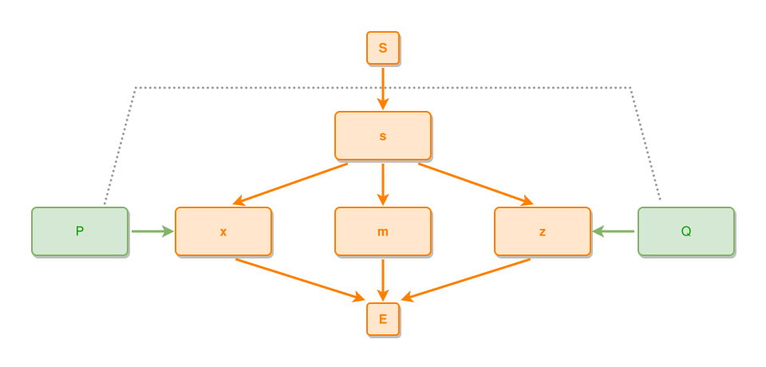

`P` and `Q` sit on the fan's outer flanks; their tie must traverse the
fan. A route crossing ONE flow edge (near-to × leads-to — different
kinds) is acceptable; a route that would cross TWO flow edges or spear
`m`'s box is not — then the tie is the one that hides (the least
structural kind), never the flow, and both stubs stay clear of box
corners.

**Does not cover:** the stub's visual design (numbering, chip shape) is
the renderer's business; the growth values its demands trigger are
v7P8's.

## Coverage map — the 11 edge combinations

Every legal combination (see `gl:../ipm-intro/README.md`) and the
principle that owns it:

| combination | reading | owned by |
|---|---|---|
| eLe | event leads-to event | v7P3 skeleton; corridor v7P6; never hides (v7P9) |
| ePe | sub-event part-of composite | v7P3 (column one step right) |
| eXe | expresses between events | places nothing (v7P1); draws per v7P9 |
| eNe | near-to between events | places nothing (v7P1); component glue (v7P2) |
| tPe | thing part-of event | connector — attaches aux (v7P4) |
| tPt | thing part-of thing | group-internal shape (v7P4) |
| tXc | thing expresses concept | group-internal shape (v7P4) |
| eXc | event expresses concept | connector — attaches aux (v7P4) |
| cXc | concept expresses concept | group-internal shape (v7P4) |
| tNt | thing near-to thing | tie — draw/order/wrap (v7P5) |
| cNc | concept near-to concept | tie — draw/order/wrap (v7P5) |

Shared endpoints of any placing kind anchor once per v7P7; all numbers
per v7P8; all drawing per v7P9.

## Algorithm — groups and relative rules, positions last

The engine (`gl:pkg/layout7`) derives the layout from GROUPS and RELATIVE
rules; absolute positions are the LAST step. The stage-by-stage map of
the implementation is `gl:docs/dev/layout-gen/layout7-engine.md`; the
architecture it follows:

**Stage 1 — grouping.** Decide which nodes render TOGETHER as one unit
(v7P4's groups, v7P5's onion layer, near-to clusters). Each group has its
own INTERNAL rules — symmetry, alignment, stacking order — solved within
the group; collapses to a SUPER-NODE (its bounding box) for the outer
level, external edges re-attached to the box; and moves or grows only AS
A UNIT — outer adjustments may move or stretch a group but never break
its internal rules. Groups nest: component → groups → nodes.

**Stage 2 — rules with weights.** Each principle EMITS relative rules
instead of computing positions; the principle order IS the weight order
(v7P3 skeleton ~1000, v7P4 connectors ~200, alignment just below,
aesthetics lowest). Example:

    e1 vertically under S              weight 1000   (skeleton, v7P3)
    A and B right of e1                weight  200   (connector, v7P4)
    A and B on the same vertical line  weight  199   (group alignment)

Two classes: HARD rules (no overlap, minimum gaps, separation order —
constraints, never violated) and SOFT rules (alignment, centring,
symmetry, proximity — weighted preferences, satisfied best-effort).

**Stage 3 — solve.** Per axis as 1D systems (X and Y mostly decouple; the
in-repo `SolveSeparations` VPSC solver is exactly this: desired positions
+ weights + hard separations → minimal weighted displacement). Group
internals first (small systems), then the outer system over super-nodes.

**Stage 4 — absolute positions.** Only after the relative system is
satisfied: expand groups, assign coordinates, normalise the origin, route
edges (v7P9) on top.

**Solving spacing (v7P8) inside this model.** Five pieces:

1. A pairwise `gap(A, B)` function feeds every hard separation
   `pos(B) − pos(A) ≥ gap(A, B)`: base grid + kind modifiers (lane,
   tile, layer stand-offs) + content modifiers (over-size nodes).
   "Minimums that only grow" is literally the `≥`.
2. ONE shared gap variable per symmetry ORBIT (a fan's gaps, a mirrored
   pair, a ring's stand-offs): growth mirrors automatically because
   unequal gaps inside an orbit are unrepresentable — v7P6/P9's
   symmetric growth for free.
3. Predictable growth is CLOSED-FORM, before the first solve: fan drop
   `= max(baseDrop, halfSpan / tan(maxAngle))`; over-size nodes
   distribute their excess up front.
4. Edge-room growth is a monotone DEMAND loop: solve → route (v7P9) →
   each edge that cannot meet the discipline posts "+1 lane between this
   pair" onto the pair's orbit variable → re-solve. Demands only
   increase, so no oscillation; the 16:9 budget (v7P2) is the
   terminating valve — an edge whose room would blow the budget goes
   HIDDEN instead of growing the layout.
5. Solve in INTEGER GRID UNITS (all constants are grid multiples):
   snapping is free and exact, and can never violate a minimum.

Why this architecture: each principle is a RULE GENERATOR with a weight
band, so a bad layout names the violated rule; and because positions are
derived once from the satisfied system, no step can overwrite another's
placement — that class of fray is impossible by construction.

## Design pattern

The pattern that settles every open detail, and should settle the next
one before a new special case is invented: structural/semantic rules beat
declaration and geometry heuristics; ONE uniform mechanism beats
kind-splits and tuning thresholds; aux stays with its anchor and SPACE
yields; symmetry is preserved by construction (orbit variables); the
16:9 canvas budget is the single global valve; the kind hierarchy
L > P > X > N governs membership (v7P1), layer order (v7P5) and
visibility (v7P9) alike.
