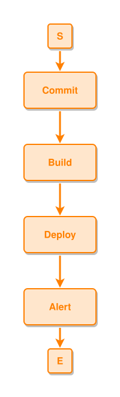
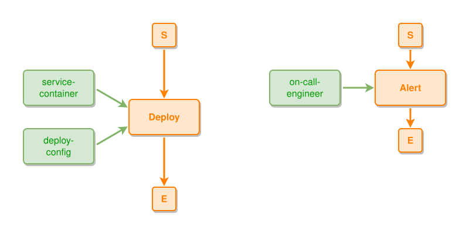
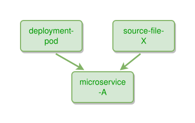
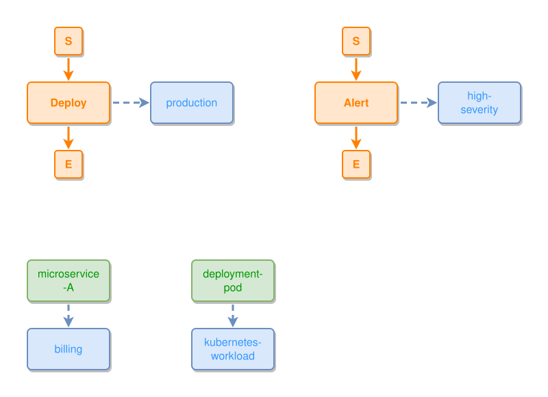
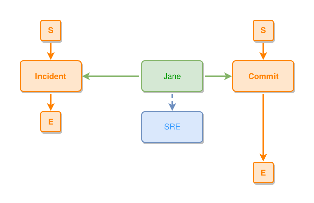
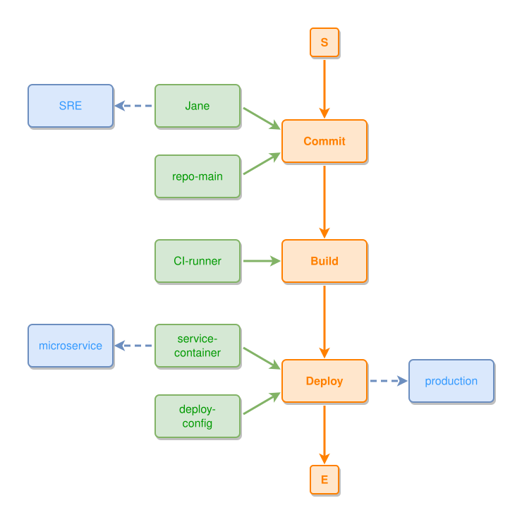
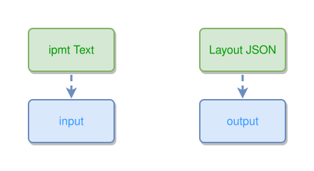
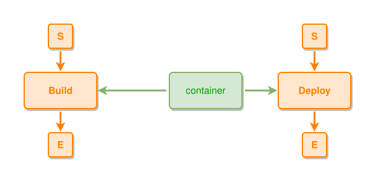

**Using Semantic Spacetime (Gamma(3,4)) for AI Agents in Software Engineering**

References:
- [ipmt format specification](ipmt-spec.md) — syntax for writing ipmt diagrams
- [Semantic Spacetime γ(3,4)](sst-gamma34.md) — theory, transition tables, and examples

---

### Purpose
This document provides guidance for implementing the Gamma(3,4) Semantic Spacetime (SST) model in AI assistants designed for software engineering tasks. It is intended for use in tools like GitHub Copilot, coding agents, or observability assistants to help model software process behavior, system hierarchies, and collaborative flows.

---

### 1. Core Modeling Concepts in SST

- **Node Types**:
  - `event` (**e**, `::e`): A transient activity, such as a commit, build, deploy, test run, API call.
  - `thing` (**t**, `::t` or default): A persistent object or component, such as a service, container, file, repo, or engineer.
  - `concept` (**c**, `::c`): An abstract tag or classification, e.g., "microservice", "bug", "CI pipeline", "state=green".

- **Edge Types** (Gamma(3,4)) and ipmt syntax:

  | Relation | SST | ipmt syntax | ipmt explicit | Visual |
  |----------|-----|-------------|---------------|--------|
  | Leads-To | e→e | `e1 ::e --> e2 ::e` | `--::L-->` | orange solid arrow |
  | Part-Of (Contains) | t→e, t→t, e→e | `container --> deploy ::e` | `--::P-->` | green solid arrow |
  | Expresses | e→e, e→c, t→c, c→c | `deploy ::e --> production ::c` | `--::X-->` | blue dashed arrow |
  | Near-To | same↔same | `eA ::e --- eB ::e` | `--::N--` | gray dotted, no arrows |

  Note: In ipmt, `-->` infers the SST relation from node types. See the
  [ipmt spec link-type table](ipmt-spec.md#arrow-symbols-glossary) for the full 11-entry mapping.

---

### 2. Modeling Software Systems and Processes

#### Process Flow (LeadsTo)
Use event→event chains for temporal/causal flow:

```ipmt
Commit ::e --> Build ::e --> Deploy ::e --> Alert ::e
```
<!-- ipm-svg id=100 hash=8d3b41f0 -->


#### Events Contain Participants (Part-Of)
Events are regions in spacetime that contain things. In ipmt the
arrow goes from the participant to the event (`thing --> event ::e`,
read as part-of / -C). A plain `event --> thing` arrow is **rejected** —
the parser errors with `invalid edge direction: part-of is thing → event,
not event → thing; flip the arrow` (it is no longer silently auto-inverted).
Always write the `thing --> event` form; if you prefer to name the event first,
use the REVERSE-arrow form `event ::e <-- thing`, which yields the identical
PartOf edge. A future lenient `draft` mode may accept the reverse
`event --> thing` form and rewrite it for you, but the strict ipmt parser
does not. See [ipm-modeling-tips.md](ipm-modeling-tips.md) §A.2 and
[ipmt-spec.md](ipmt-spec.md#arrow-symbols-glossary) row 5.

```ipmt
service-container --> Deploy ::e
deploy-config --> Deploy
on-call-engineer --> Alert ::e
```
<!-- ipm-svg id=110 hash=6d33bae6 -->


Here `Deploy` and `Alert` are events; `service-container`, `deploy-config`, `on-call-engineer` are things (default type).
The `-->` from thing to event is inferred as Part-Of (-C); the event "contains" the thing read from the event's perspective.

#### Component Hierarchy (Part-Of)
Model static structure using thing→thing Part-Of edges (child first):

```ipmt
deployment-pod --> microservice-A
source-file-X --> microservice-A
```
<!-- ipm-svg id=120 hash=42d5d6ca -->


Thing→thing `-->` is inferred as Part-Of (-C). The arrow goes from the contained sub-thing to its container.

#### Semantic Classification (Expresses)
Tag things and events with concepts:

```ipmt
microservice-A --> billing ::c
deployment-pod --> kubernetes-workload ::c
Deploy ::e --> production ::c
Alert ::e --> high-severity ::c
```
<!-- ipm-svg id=130 hash=6f2c4c02 -->


Any `-->` to a concept (`::c`) is inferred as Expresses.

#### Code + People Interaction
```ipmt
# Engineer participates in events (thing --> event, part-of)
Jane --> Commit ::e
Jane --> Incident ::e

# Engineer classified by role
Jane --> SRE ::c
```
<!-- ipm-svg id=140 hash=0e60ecaa -->


#### Combined Example
```ipmt
# Process flow
Commit ::e --> Build ::e --> Deploy ::e

# Participants (thing --> event, part-of)
Jane, repo-main --> Commit
CI-runner --> Build
service-container, deploy-config --> Deploy

# Semantic tags
Jane --> SRE ::c
Deploy --> production ::c
service-container --> microservice ::c
```
<!-- ipm-svg id=150 hash=9ec8e97e -->


---

### 3. Best Practices for AI Assistants

#### Direction conventions
- Use `thing --> event` for participation (part-of, -C). The arrow
  goes from the participant to the event. ipmt does not have an
  event-to-thing arrow form; see
  [ipmt-spec.md](ipmt-spec.md#arrow-symbols-glossary) row 5.
- Use `child-thing --> parent-thing` for structural containment
  (part-of, -C). Arrow goes from contained sub-thing to container.
- Use `event --> event` for causal/temporal flow (LeadsTo, +L).
- Use `thing/event --> concept` for classification (Expresses, +E)
  — read as "the concept expresses this thing/event" (passive); the
  arrow direction is fixed by ipmt-spec row 6/9/10.
- Use `---` only between same-type nodes for similarity (NearTo, N).

#### Modeling guidance
- Build the event chain first — it's the process backbone.
- Add things as participants of events via `thing --> event ::e`.
- Add concepts as semantic tags on events and things.
- Allow transitive inference for LeadsTo, but include direct `e1 --> eN` edges if shortcuts are meaningful.
- Represent process variants as alternate paths in the same event graph.
- Represent configuration or labels via Expresses on things or events.
- Represent **binary relations between things** (X owns Y,
  X uses Y, X is located in Y when Y is itself a thing) as an
  event that contains both participants — not as an Expresses
  arrow between two things, which ipmt does not have a form for
  anyway. See Burgess, *On the Representation of Events, Things,
  and Concepts in Multimodal SST Graphical Reasoning* §2.1 for
  the ownership case worked through.
- Use aliases (`id::a`) for frequently referenced nodes to keep diagrams readable.
- Use comments (`#`) to organize sections of a diagram.

#### Shared hierarchies across diagrams
When a set of diagrams describes the same system (e.g. the meta-ipm diagrams for ipm-tools),
establish shared things and concepts that recur across diagrams:

- **User → Human**: `User --> Human ::c` — the human actor classified by concept.
- **Repo containment**: `cmd tools --> ipm-tools repo`, `cmd-dev tools --> ipm-tools repo` — tools are part of the repo.
- **Shared data artifacts**: Use the same names for data flowing between diagrams (e.g. `IpmGraph`, `Layout JSON`).
- **Input/output classification**: Attach `input ::c` or `output ::c` to data things to mark their role:

```ipmt
ipmt Text --> input ::c
Layout JSON --> output ::c
```
<!-- ipm-svg id=160 hash=a35bbe6f -->


This makes data flow direction explicit in every diagram. (The fence must sit at
column 0: an indented fence would make its lines CONTINUATION lines of one
statement — see [ipmt-spec.md](ipmt-spec.md#line-continuation).)

This keeps the graph coherent across multiple related diagrams — a future `ipm-collection` tool
can validate cross-diagram consistency.

#### No duplicate edge between the same nodes
The parser rejects the exact same edge — same source, target, AND SST relation type — written
twice. In addition, the four base relations (LeadsTo, PartOf, Expresses, NearTo) are mutually
exclusive per pair: two *different* SST relations between the same node pair are now rejected by
**both** the parser **and** `ipm-validate` (IPMV1.2). The parser errors with `conflicting SST
relations ... mutually exclusive per pair`, and the validator (and the publish gate) flag the
same condition, so keep a single relation per pair.

`ipm-validate` does not only re-check the parser's output — it also validates graphs that come
from **other sources**, e.g. an `IpmGraph` supplied directly as graph JSON input that never went
through the ipmt parser. That is why rules like the mutual-exclusivity check live in *both* the
parser and the validator: the parser catches them in ipmt text, and the validator catches them in
graphs built some other way.

Invalid — the same edge written twice (parse error):
```
tA --> tB
tA --> tB
```

Invalid — two different relations between the same pair (parse error **and** `ipm-validate` IPMV1.2):
```
tA --> tB
tA --- tB
```

When a thing participates in multiple events, each thing→event edge is a separate pair
and therefore valid:
```ipmt
container --> Deploy ::e
container --> Build ::e
```
<!-- ipm-svg id=170 hash=e0884591 -->


See [ipmt spec: Duplicate pair relation](ipmt-spec.md#duplicate-pair-relation) for the full rule.

#### ipmt syntax tips
- Node type is inferred as `thing` by default — only mark events (`::e`) and concepts (`::c`).
- Use commas for fan-out: `container, config, logs --> Deploy ::e` (participants
  point AT the event — the reverse would be the rejected `event --> thing`).
- Chain arrows for sequences: `e1 ::e --> e2 ::e --> e3 ::e`.
- Identifiers: prefer hyphens over underscores as a style convention (`my-service` over `my_service`). Both are permitted by the spec (identifiers match `[A-Za-z][A-Za-z0-9_-]*`); this is a preference, not a parser rule.

---

### 4. AI Skill Use Cases

- **Process summarization:** Identify common sequences (e.g. tests that always follow builds).
- **Debugging flow tracing:** Given an alert, walk backward using LeadsTo to root cause events.
- **Ownership graphs:** Map things contained by events and things expressing concepts to build collaboration views.
- **Knowledge extraction:** Tag commits, PRs, or components with Expresses and NearTo to cluster patterns.

---

This model enables AI tools to reason structurally, semantically, and causally across the full software lifecycle. Embedding γ(3,4) relations in graphs allows agents to explain, trace, and interact with development knowledge in a rigorous and extendable way.

For the full ipmt syntax, see [ipmt-spec.md](ipmt-spec.md).
For the SST theory and transition tables, see [sst-gamma34.md](sst-gamma34.md).
For the structural and semantic rules `ipm-validate` enforces beyond
parser-level syntax (containment-DAG, direction conformance, modeling
antipatterns), see
[ipm-validator-rules.md](ipm-validator-rules.md).
