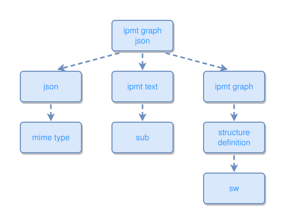

## ipmt-graph JSON

```ipmt
ipmt graph json ::c
  --> json ::c
    --> mime type ::c

ipmt graph json
  --> ipmt text  ::c
    --> sub  ::c

ipmt graph json
  --> ipmt graph  ::c
    --> structure definition ::c
      --> sw ::c
```
<!-- ipm-svg id=100 hash=d4b21a02 -->

