# Other ipmt examples

## Multiline
```ipmt
c-X ::c --::N-->
  c-Y ::c
```
<!-- ipm-svg id=100 hash=69a9f00e -->
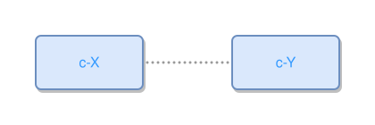

## Multiline with comma expansion
```ipmt
e1 --> c-X ::c,
  c-Y ::c,
  c-Z ::c
```
<!-- ipm-svg id=110 hash=b1451ce0 -->
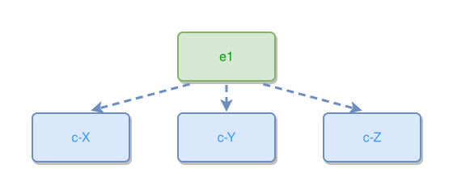

## Tooltip with newline
```ipmt
e1 ::e --"e1 leads to\n  e2 over time"--> e2 ::e
```
<!-- ipm-svg id=120 hash=97365c39 -->
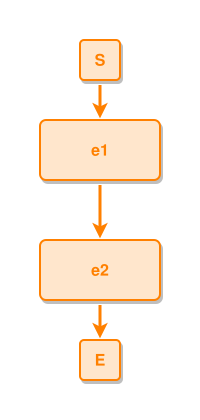


## Additional fixtures

### links-explicit-l

```ipmt
e1 ::e --::L--> e2 ::e
```
<!-- ipm-svg id=130 hash=88412a1b -->


### links-reverse-comma

```ipmt
B, C <-- A
```
<!-- ipm-svg id=140 hash=0f3fe06a -->
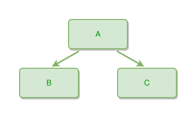

### links-explicit-n-multiline

```ipmt
c-X ::c --::N-->
  c-Y ::c
```
<!-- ipm-svg id=150 hash=69a9f00e -->


### nodes-alias

```ipmt
Event 1 ::e E1::a
Thing A ::t TA::a
```
<!-- ipm-svg id=160 hash=e00d1be4 -->
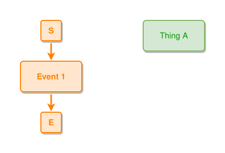

### links-edge-tooltip

```ipmt
e1 ::e --"e1 leads to e2"--> e2 ::e
```
<!-- ipm-svg id=170 hash=e5f13db9 -->


### links-edge-tooltip-multiline

```ipmt
e1 ::e --"e1 leads to\n  e2 over time"--> e2 ::e
```
<!-- ipm-svg id=180 hash=97365c39 -->


### links-explicit-e-multiline

```ipmt
tA ::t --::X-->
  c-X ::c
```
<!-- ipm-svg id=190 hash=d08d9207 -->
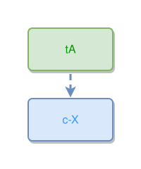

### links-explicit-e

```ipmt
cA ::c --::X--> cB ::c
```
<!-- ipm-svg id=1a0 hash=cde92d2e -->
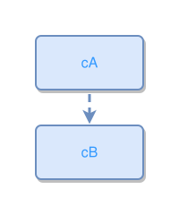

### links-chained-multiline

```ipmt
tA --> tAp1
  --> tAp1sX
```
<!-- ipm-svg id=1b0 hash=5ed0ae81 -->
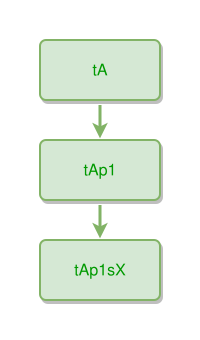

### links-many-edges

```ipmt
A --> B
A --> C
A --> D
```
<!-- ipm-svg id=1c0 hash=7b6265d8 -->
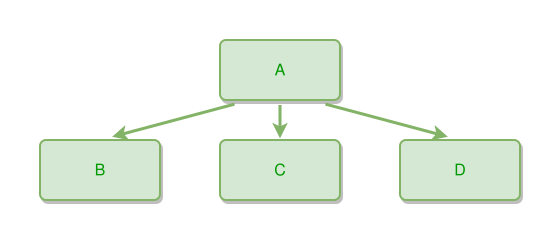

### links-reverse-arrow

```ipmt
e1 <-- tB
```
<!-- ipm-svg id=1d0 hash=af255152 -->
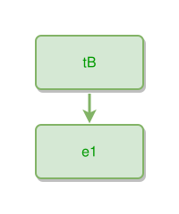

### nodes-alias-before

```ipmt
EA::a Event A ::e
Agent 2 --> EA
```
<!-- ipm-svg id=1e0 hash=06ed013b -->
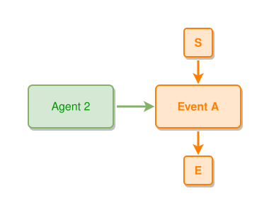

### links-undirected

```ipmt
A --- B
```
<!-- ipm-svg id=1f0 hash=e2fa6153 -->
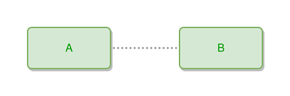

### links-self-loop

```ipmt
A --> A
```
<!-- ipm-svg id=1g0 hash=3ec3d8a7 -->
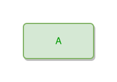

### links-edge-tooltip-comma

```ipmt
cA ::c --"cA described by cB and cC"--> cB ::c, cC ::c
```
<!-- ipm-svg id=1h0 hash=99df1178 -->
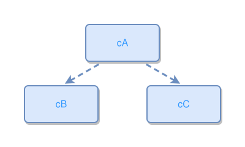

### links-compact-arrows

```ipmt
A-->B--"text"-->C
F<--G
H --- I
```
<!-- ipm-svg id=1i0 hash=0092ce5d -->
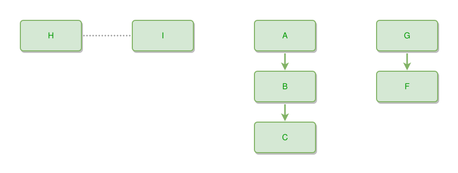

### links-explicit-e-comma

```ipmt
tA ::t --::X--> c-X ::c, c-Y ::c
```
<!-- ipm-svg id=1j0 hash=3a1e9c26 -->
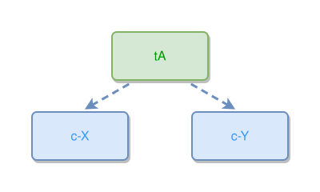

### minimal

```ipmt
Agent 1 --> Event A ::e EA::a
Agent 2 --> EA
Artifact X --> EA
```
<!-- ipm-svg id=1k0 hash=75235f62 -->
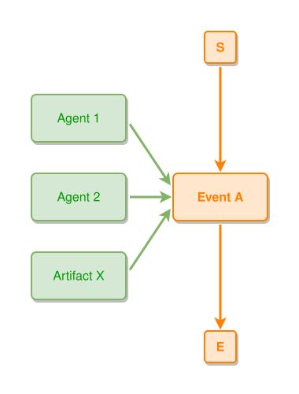

### links-explicit-n

```ipmt
tB --::N--> tC
```
<!-- ipm-svg id=1l0 hash=a217f673 -->
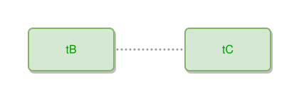

### links-chained

```ipmt
A --> B --> C
```
<!-- ipm-svg id=1m0 hash=1c2e4177 -->
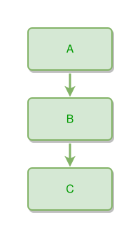

### links-explicit-p-comma

```ipmt
tAp1 ::t, tAp2 ::t --::P--> tA ::t
```
<!-- ipm-svg id=1n0 hash=5c8d03f0 -->
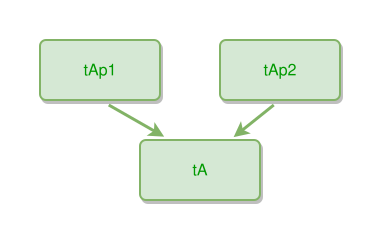

### nodes-long-name

```ipmt
Thing A part 1.
```
<!-- ipm-svg id=1o0 hash=8340996b -->
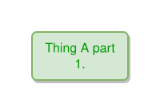

### nodes-tooltip-escaped

```ipmt
Thing A ::t "Line 1 with \"quote\" and \\ backslash.\nLine 2 after newline." ::tip
```
<!-- ipm-svg id=1p0 hash=5c1b9dc4 -->
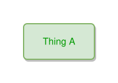

### links-explicit-l-comma

```ipmt
e1 ::e --::L--> e2 ::e, e3 ::e
```
<!-- ipm-svg id=1q0 hash=800ed73c -->
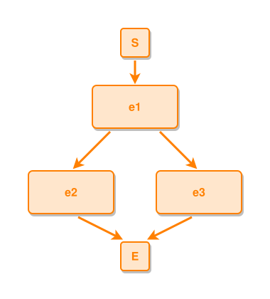

### links-explicit-p-multiline

```ipmt
tAp1 ::t --::P-->
  tA ::t
```
<!-- ipm-svg id=1r0 hash=2cf83e1f -->
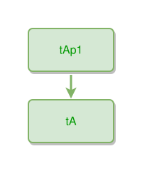

### links-explicit-l-multiline

```ipmt
e1 ::e --::L-->
  e2 ::e
```
<!-- ipm-svg id=1s0 hash=25626773 -->


### links-edge-tooltip-escaped

```ipmt
n1 --"line with a \"quote\" and a \\ backslash"--> n2
```
<!-- ipm-svg id=1t0 hash=3518d8fc -->
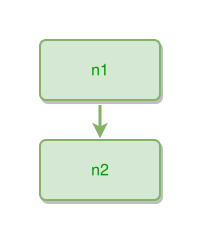

### links-inline-hash

```ipmt
Agent #1 --> Event #1 ::e
```
<!-- ipm-svg id=1u0 hash=48ffa113 -->
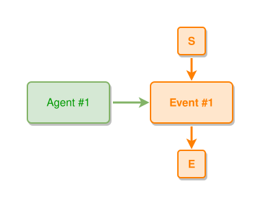

### complex 1

```ipmt
e1 ::e --> e2 ::e --> e3 ::e
tA, tB, tC, tD, tE --> e2
e2 --> c1 ::c, c2 ::c, c3 ::c, c4 ::c, c5 ::c, c6 ::c, c7 ::c, c8 ::c
t1, t2 --> e1
tz, ty --> e3
tA --> tA2 --> tA3
tz --> tz2 --> tz3 --> tz4
```
<!-- ipm-svg id=1v0 hash=16df0e7e -->
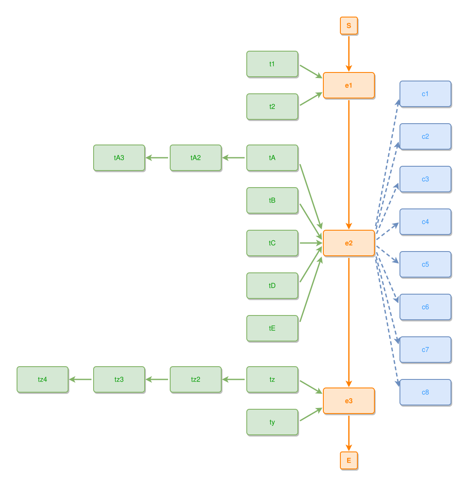

### complex 2

```ipmt
e1 ::e --> e2 ::e --> e3 ::e
tA --> e2

tB --> e2
tB --> Cr ::c --> Cs ::c --> Ct ::c
```
<!-- ipm-svg id=1w0 hash=f81eb212 -->
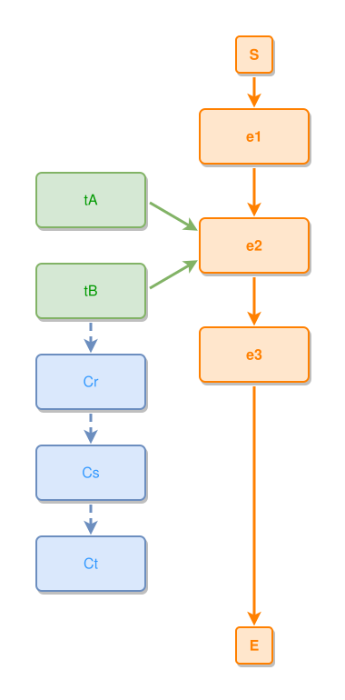


### complex 3

```ipmt
e1 ::e --> e2 ::e --> e3 ::e

e1a ::e, e1b ::e --::P--> e1 ::e
e1a --> e1b

e3a ::e, e3b ::e, e3c ::e --::P--> e3
e3b --> e3c
e3c1 ::e --::P--> e3c
```
<!-- ipm-svg id=1x0 hash=8b956731 -->
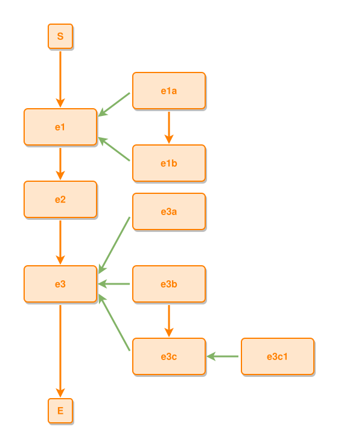
