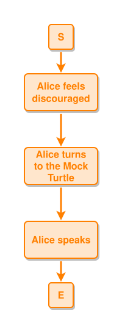
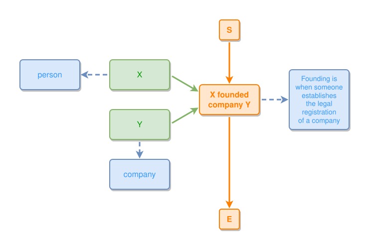
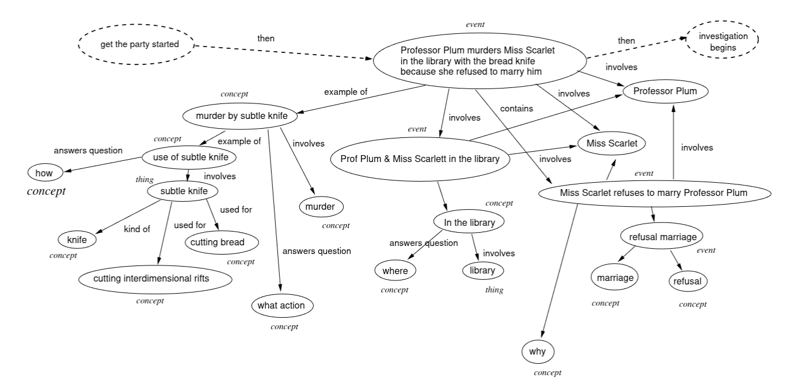
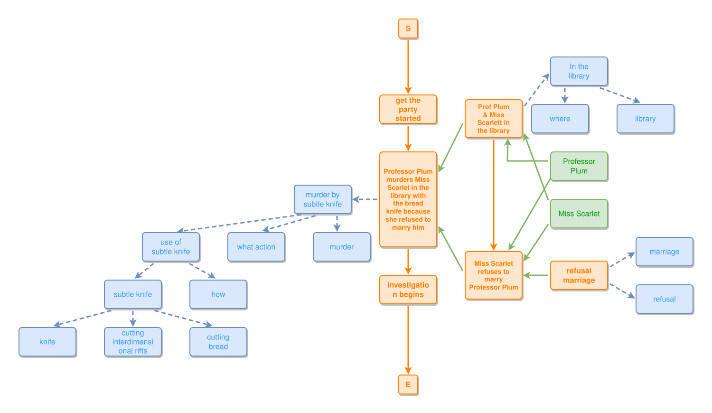
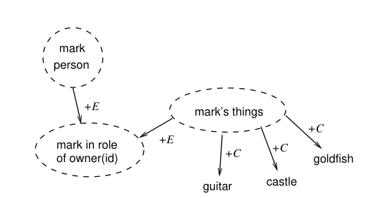
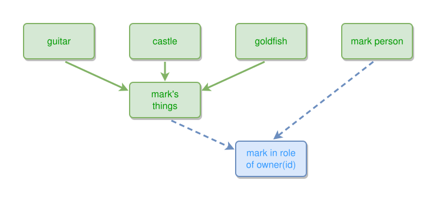

# Example

Various examples I found in [Mark Burgess](https://markburgess.org/) work.

## Mark's 25-08-24 medium post

Designing Nodes and Arrows in Knowledge Graphs with Semantic Spacetime, Mark Burgess, 2025, Aug 24, [mark-burgess-oslo-mb.medium.com](https://mark-burgess-oslo-mb.medium.com/designing-nodes-and-arrows-in-knowledge-graphs-with-semantic-spacetime-0992b9cae595)

```ipmt
# Alice's story
Alice feels discouraged ::e e1::a
Alice turns to the Mock Turtle ::e e2::a
Alice speaks ::e e3::a

e1 --> e2 --> e3
```
<!-- ipm-svg id=100 hash=03ec3dda -->


```ipmt
# Company founding
X --> X founded company Y ::e fe::a
Y --> fe
X --> person ::c
Y --> company ::c
fe --> Founding is when someone establishes the legal registration of a company ::c
```
<!-- ipm-svg id=110 hash=861c98d1 -->


## Murder Mystery, June 2025



Source: Figure 2 of Agent Semantics, Semantic Spacetime, and Graphical Reasoning ([researchgate.net link](https://www.researchgate.net/publication/392507642)) paper by Mark Burgess.

```ipmt
get the party started ::e
  --then--> murder-e::a Professor Plum murders Miss Scarlet in the library with the bread knife because she refused to marry him ::e
  --then--> investigation begins ::e


# fix: subtle knife ::t -> ::c
murder-e --"example of"--> murder-sk::a murder by subtle knife ::c
  --"example of"--> use-sk::a use of subtle knife ::c
  --"involves"--> sk::a subtle knife ::c
  --"kind of"--> knife ::c

murder-sk --"answers question"--> what action ::c
murder-sk --"involves"--> murder ::c
use-sk --"answers question"--> how ::c
sk --"used for"--> cutting interdimensional rifts ::c
sk --"used for"--> cutting bread ::c

murder-e <--::P involves-- library-ppms::a Prof Plum & Miss Scarlett in the library ::e
  --> In the library ::c
  --"answers question"--> where ::c

# fix: library ::t -> ::c
In the library --"involves"--> library ::c

murder-e <--::P contains-- refusal-mspp::a Miss Scarlet refuses to marry Professor Plum ::e
  <--::P-- refusal marriage ::e
  --> marriage ::c
refusal marriage --> refusal ::c

# fix: add leads-to
library-ppms --> refusal-mspp

# change: change involves/contains to part-of
# change: hide explicit Professor Plum --> skip murder-e
# change: hide explicit Miss Scarlet --> skip murder-e
Professor Plum --> library-ppms
Professor Plum --> refusal-mspp
Miss Scarlet --> library-ppms
Miss Scarlet --> refusal-mspp
```
<!-- ipm-svg id=120 hash=8954d74f -->



## Ownership, June 2025



Source: Figure 3 of  Agent Semantics, Semantic Spacetime, and Graphical Reasoning ([researchgate.net link](https://www.researchgate.net/publication/392507642)) paper by Mark Burgess.

```ipmt
guitar, castle, goldfish --> mark's things
mark's things --> mark in role of owner(id) ::c <-- mark person
```
<!-- ipm-svg id=130 hash=3c3c19fb -->

