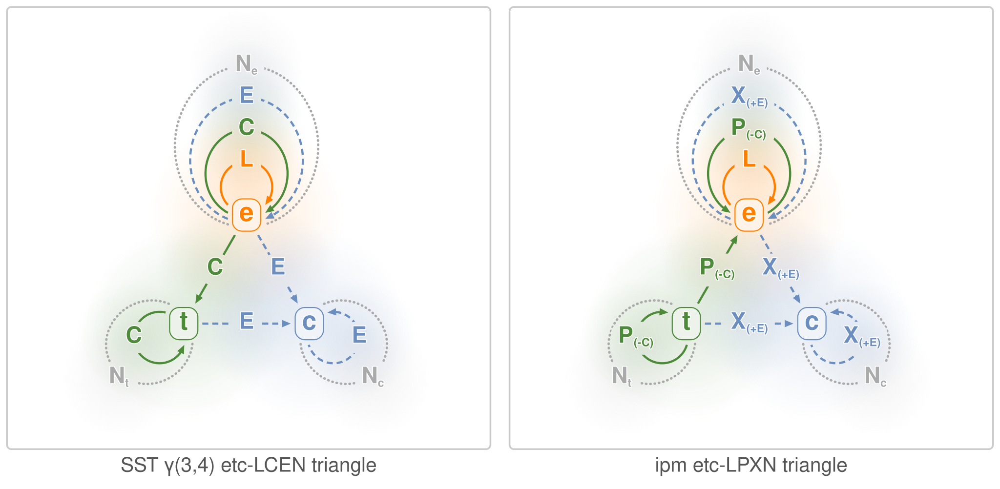

# ipm and Semantic Spacetime gamma(3,4)
## Introduction

The SST approach attempts to base different meanings on a model that uses three kinds of *graph nodes* and four kinds of links. This is called the γ(3,4) (also written gamma(3,4)) representation, with three kinds of agent and four kinds of relation.

Gamma(3,4) provides a skeleton for process representations in space and time that can be renamed any number of times for specific scenarios, while still capturing universal meaning.
— [Designing Nodes and Arrows in Knowledge Graphs with Semantic Spacetime](https://mark-burgess-oslo-mb.medium.com/designing-nodes-and-arrows-in-knowledge-graphs-with-semantic-spacetime-0992b9cae595) by [Mark Burgess](https://markburgess.org/)

Other references:
- [Agent Semantics, Semantic Spacetime, and Graphical Reasoning](https://arxiv.org/abs/2506.07756), June 13, 2025, arxiv.org
- [Knowledge Management series](https://mark-burgess-oslo-mb.medium.com/list/knowledge-management-da2834a25b99) by Mark Burgess
- Book: [Smart Spacetime: How information challenges our ideas about space, time, and process](https://markburgess.org/smartspacetime.html) by Mark Burgess

## Where to start

The [Infinite Process Modeling (infinite.pm)](https://infinite.pm) project is an ongoing effort experimenting with Semantic Spacetime’s γ(3,4) graph model, [infinite canvas tools](https://infinitecanvas.tools/), and related concepts, with the goal of bringing them into practical use in the software engineering domain. The text representation **ipmt** (pronounced “ipm text”) is one of the ipm sub-projects.

**New to ipm? Start with [infinite.pm/intro](https://infinite.pm/intro/)** —
the node and edge kinds, a build-it-up example, and the full table of
allowed edges all live there. This document covers what the introduction
does not: how ipm's dialect maps onto Burgess's original Semantic
Spacetime formulation.

One SST insight worth carrying into every model: some events happen so
slowly that we can treat them as persistent things in a model of a much
faster process. Events provide the contextual container (time and place);
things provide stable context inside them; concepts classify meaning.

## SST relations in ipm terms

### Allowed translations

In SST's own vocabulary (C = CONTAINS, L = LEADS-TO, E = EXPRESSES,
N = NEAR), with `+`/`-` marking the relation's forward and reverse
readings:

| S\T |        e       |    t   |    c   |
|:---:|:--------------:|:------:|:------:|
|**e**| ±L, ±C, ±E, Nₑ |   +C   |   +E   |
|**t**|       -C       | ±C, Nₜ |   +E   |
|**c**|       -E       |   -E   | ±E, N_c |

**Legend:**
- S — source (rows/down)
- T — target (columns/right)
- e = event (orange)
- t = thing (green)
- c = concept (blue)
- Nₑ, Nₜ, N_c = NEAR relations (gray dotted, no arrow)
- C = CONTAINS (green, one arrow)
- L = LEADS-TO (orange, one arrow)
- E = EXPRESSES (blue dashed, one arrow)

### Transitions visually

Visually, it looks like this (see the left diagram).

On the right is the same diagram with ipm modifications:
- “expressed by,” marked as **E**, is renamed to **X**
- “contains” (C) is replaced by “part of” (P), with the opposite direction

The `X` (`+E`) edge `thing --> concept` admits two natural English
glosses for the same arrow:
- *active:* "thing expresses concept" (Burgess article 10:
  "X expresses property Y, or Y is a property of X")
- *passive:* "thing is expressed by concept" — the IPM
  convention this section labels with "expressed by"

Both readings describe the same edge with the same arrow
direction; the verb voice is interpretive. The tables below use
the active voice for forward arrows and the passive voice for
reverse arrows, which gives a clean per-direction reading. For
modelling intuition, the passive reading suits cases where the
concept names a *type* (Phone, Server, Person) and the thing is
its instance.

### Transitions in detail

**ipmt** (Infinite Process Modeling Text) syntax and its mapping to SST transitions:

| ipmt Syntax      | Transition   | Relation                                                        |
|:----------------:|:-------------|-----------------------------------------------------------------|
| `e1 ::e --> e2 ::e`      |  e1 (+L) e2  | An event (e1) can lead to another event (e2)                    |
| `e1p ::e --::P--> e1 ::e`|  e1p (-C) e1 | An event (e1p) can be part of (contained by) another event (e1) |
| `e1 ::e --::X--> e2 ::e` |  e1 (+E) e2  | An event (e1) can express another event (e2)                    |
| `tA --> e1 ::e`      |  tA (-C) e1  | A thing (tA) can be part of (contained by) an event (e1)        |
| `e1 ::e --> cX ::c`      |  e1 (+E) cX  | An event (e1) can express a property or concept (cX)            |
| `tAp --> tA`     |  tAp (-C) tA | A thing (tAp) can be part of (contained by) another thing (tA)  |
| `tA --> cX ::c`      |  tA (+E) cX  | A thing (tA) can express a concept (cX) as an attribute         |
| `cX ::c --> cY ::c`      |  cX (+E) cY  | A concept (cX) can have the properties of another concept (cY)    |

| ipmt Syntax      | Transition   | Relation                                                        |
|:----------------:|:-------------|-----------------------------------------------------------------|
| `e2 ::e <-- e1 ::e`      |  e2 (-L) e1  | An event (e2) can follow another event (e1)                     |
| `e1 ::e <--::P-- e1p ::e`|  e1 (+C) e1p | An event (e1) can contain another event (e1p)                   |
| `e2 ::e <--::X-- e1 ::e` |  e2 (-E) e1  | An event (e2) can be expressed by another event (e1)            |
| `e1 ::e <-- tA`      |  e1 (+C) tA  | An event (e1) as a region of spacetime can contain a thing (tA) |
| `cX ::c <-- e1 ::e`      |  cX (-E) e1  | A concept (cX) can be an attribute of an event (e1)             |
| `tA <-- tAp`     |  tA (+C) tAp | A thing (tA) can contain another thing (tAp)                    |
| `cX ::c <-- tA`      |  cX (-E) tA  | A concept (cX) can be an attribute expressed by a thing (tA)      |
| `cY ::c <-- cX ::c`      |  cY (-E) cX  | A concept (cY) can be a property of another concept (cX)      |

| ipmt Syntax  | Transition   | Relation                                                              |
|:------------:|:------------:|-----------------------------------------------------------------------|
| `e1 ::e --- e2 ::e` | e1 (Nₑ) e2 | An event (e1) can be similar to another event (e2) by any criterion   |
| `tA --- tB`  |  tA (Nₜ) tB  | A thing (tA) can be close to or like another thing (tB)               |
| `cX ::c --- cY ::c` | cX (N_c) cY | A concept (cX) can be similar to another concept (cY)                 |
