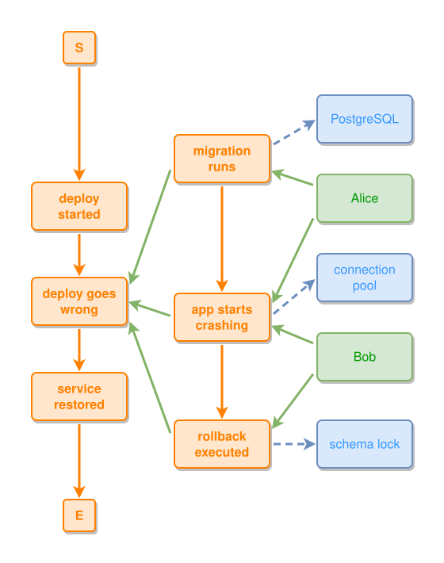

<!-- AUTO-GENERATED FILE - DO NOT EDIT -->
<!-- Generated by: gen-test-md -->
<!-- Command: go run ./cmd-dev/gen-test-md -->

# deploy-incident

> **⚠️ Warning:** This file is auto-generated. Manual changes will be lost when tests are regenerated.

**Source:** gl:examples/deploy-incident.ipmt#L1-L34 | [examples/deploy-incident.ipmt](../../../examples/deploy-incident.ipmt#L1)

## ipmt Content

```ipmt
# Real-world example: a production deployment incident.
#
# Main timeline:
#   deploy started → deploy goes wrong → service restored
#
# "deploy goes wrong" is a composite event containing sub-events:
#   migration runs → app starts crashing → rollback executed
#
# Things: people involved (Alice the DBA, Bob the SRE)
# Concepts: technical artifacts (PostgreSQL, schema lock, connection pool)

deploy started ::e
  --then--> deploy-e::a deploy goes wrong ::e
  --then--> service restored ::e

deploy-e <--::P contains-- migration-e::a migration runs ::e
  --> PostgreSQL ::c

deploy-e <--::P contains-- crash-e::a app starts crashing ::e
  --> connection pool ::c

deploy-e <--::P contains-- rollback-e::a rollback executed ::e
  --> schema lock ::c

# Order of sub-events inside the composite event.
migration-e --> crash-e --> rollback-e

Alice ::t
Bob ::t

Alice --> migration-e, crash-e
Bob --> crash-e, rollback-e
```

## Generated Files

- [deploy-incident.ipmt](deploy-incident.ipmt) - ipmt input
- [deploy-incident.json](deploy-incident.json) - Parsed structure
- [deploy-incident.layout.json](deploy-incident.layout.json) - Layout coordinates
- [deploy-incident.ipm.svg](deploy-incident.ipm.svg) - Rendered diagram

## Rendered Diagram



This test case was automatically generated from the specification document.

The ipmt code block was extracted using [sync-test-cases](../../../docs/dev/testing.md) and saved to [deploy-incident.ipmt](deploy-incident.ipmt), then parsed into the [JSON structure](deploy-incident.json) and laid out into [layout coordinates](deploy-incident.layout.json). The [SVG diagram](deploy-incident.ipm.svg) was rendered using [ipmsvg-gen](../../../docs/ipmsvg-gen.md).
