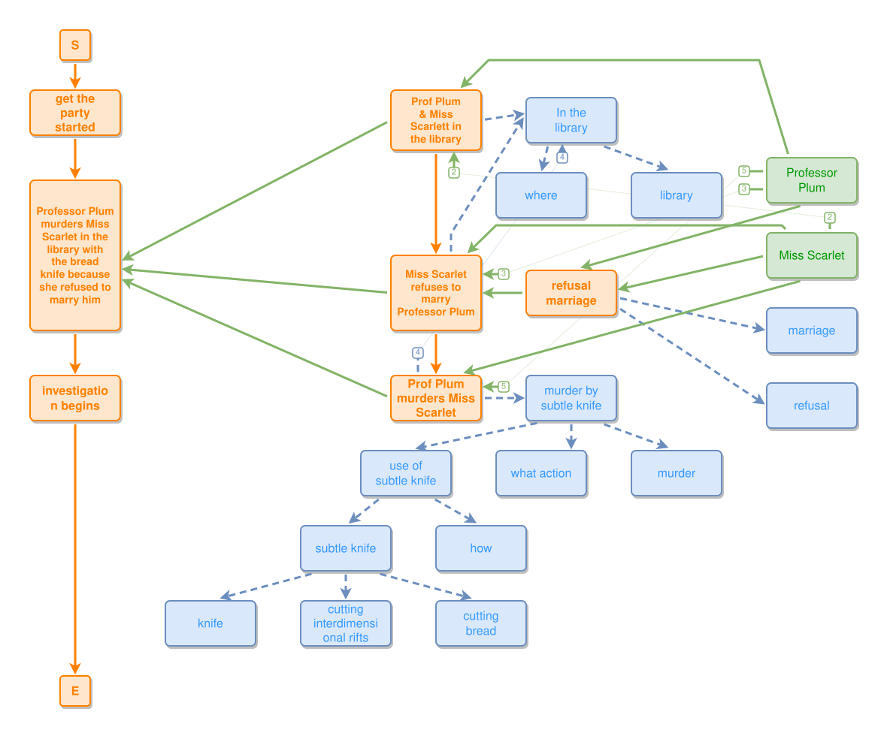

<!-- AUTO-GENERATED FILE - DO NOT EDIT -->
<!-- Generated by: gen-test-md -->
<!-- Command: go run ./cmd-dev/gen-test-md -->

# murder-full

> **⚠️ Warning:** This file is auto-generated. Manual changes will be lost when tests are regenerated.

**Source:** gl:examples/murder-full.ipmt#L1-L37 | [examples/murder-full.ipmt](../../../examples/murder-full.ipmt#L1)

## ipmt Content

```ipmt
get the party started ::e
  --then--> murder-e::a ::e Professor Plum murders Miss Scarlet in the library with the bread knife because she refused to marry him
  --then--> investigation begins ::e

murder-e <--::P involves-- library-ppms::a ::e Prof Plum & Miss Scarlett in the library 
  --> In the library ::c
  --"answers question"--> where ::c

# fix: library ::t -> ::c
In the library --"involves"--> library ::c

murder-e <--::P contains-- refusal-mspp::a ::e Miss Scarlet refuses to marry Professor Plum 
  <--::P-- refusal-m::a ::e refusal marriage 
  --> marriage ::c
refusal-m --> refusal ::c
refusal-mspp --> In the library

murder-e <--::P contains-- ppmms::a ::e Prof Plum murders Miss Scarlet 
  --> In the library

ppmms --"example of"--> murder-sk::a ::c murder by subtle knife 
  --"example of"--> use-sk::a ::c use of subtle knife
  --"involves"--> sk::a ::c subtle knife
  --"kind of"--> knife ::c

murder-sk --"answers question"--> what action ::c
murder-sk --"involves"--> murder ::c
use-sk --"answers question"--> how ::c
sk --"used for"--> cutting interdimensional rifts ::c
sk --"used for"--> cutting bread ::c

# fix: add leads-to
library-ppms --> refusal-mspp --> ppmms

Professor Plum --> library-ppms, refusal-mspp, refusal-m, ppmms
Miss Scarlet --> library-ppms, refusal-mspp, refusal-m, ppmms
```

## Generated Files

- [murder-full.ipmt](murder-full.ipmt) - ipmt input
- [murder-full.json](murder-full.json) - Parsed structure
- [murder-full.layout.json](murder-full.layout.json) - Layout coordinates
- [murder-full.ipm.svg](murder-full.ipm.svg) - Rendered diagram

## Rendered Diagram



This test case was automatically generated from the specification document.

The ipmt code block was extracted using [sync-test-cases](../../../docs/dev/testing.md) and saved to [murder-full.ipmt](murder-full.ipmt), then parsed into the [JSON structure](murder-full.json) and laid out into [layout coordinates](murder-full.layout.json). The [SVG diagram](murder-full.ipm.svg) was rendered using [ipmsvg-gen](../../../docs/ipmsvg-gen.md).
