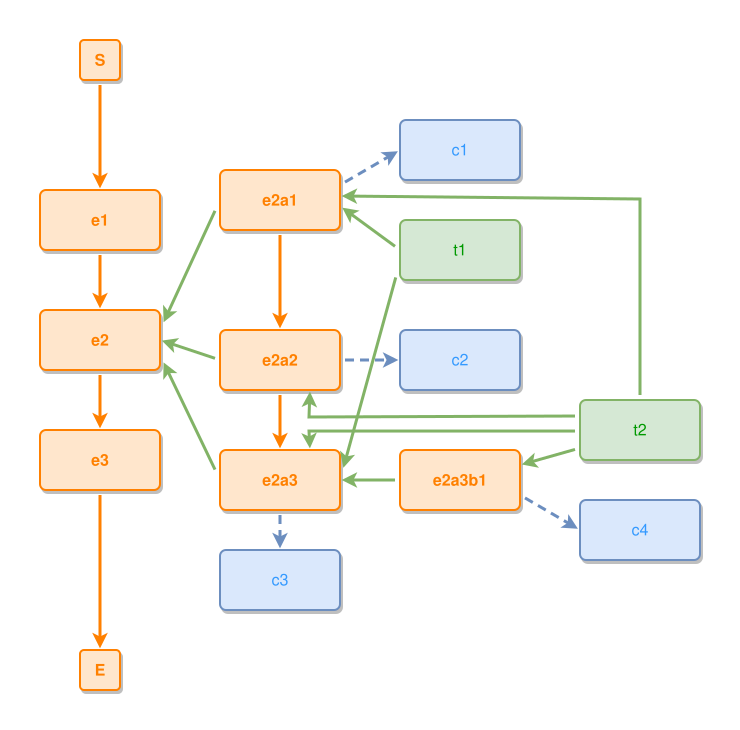

<!-- AUTO-GENERATED FILE - DO NOT EDIT -->
<!-- Generated by: gen-test-md -->
<!-- Command: go run ./cmd-dev/gen-test-md -->

# murder-simple

> **⚠️ Warning:** This file is auto-generated. Manual changes will be lost when tests are regenerated.

**Source:** gl:examples/murder-simple.ipmt#L1-L35 | [examples/murder-simple.ipmt](../../../examples/murder-simple.ipmt#L1)

## ipmt Content

```ipmt
# Simplified zoom example based on the murder scenario.
#
# Naming is intentionally abstract:
# - main events: e1, e2, e3
# - sub-events of e2: e2a1, e2a2, e2a3
# - deeper sub-event example: e2a3b1
# - things: t1, t2
# - concepts: c1, c2, c3, c4

e1 ::e
  --then--> e2 ::e
  --then--> e3 ::e

e2 <--::P contains-- e2a1 ::e
  --> c1 ::c

e2 <--::P contains-- e2a2 ::e
  --> c2 ::c

e2 <--::P contains-- e2a3 ::e
  --> c3 ::c

e2a3 <--::P contains-- e2a3b1 ::e
e2a3b1 --> c4 ::c

# Visible inner event order inside e2.
e2a1 --> e2a2 --> e2a3

t1 ::t
t2 ::t

t1 --> e2a1, e2a3
t2 --> e2a1, e2a2, e2a3, e2a3b1
```

## Generated Files

- [murder-simple.ipmt](murder-simple.ipmt) - ipmt input
- [murder-simple.json](murder-simple.json) - Parsed structure
- [murder-simple.layout.json](murder-simple.layout.json) - Layout coordinates
- [murder-simple.ipm.svg](murder-simple.ipm.svg) - Rendered diagram

## Rendered Diagram



This test case was automatically generated from the specification document.

The ipmt code block was extracted using [sync-test-cases](../../../docs/dev/testing.md) and saved to [murder-simple.ipmt](murder-simple.ipmt), then parsed into the [JSON structure](murder-simple.json) and laid out into [layout coordinates](murder-simple.layout.json). The [SVG diagram](murder-simple.ipm.svg) was rendered using [ipmsvg-gen](../../../docs/ipmsvg-gen.md).
