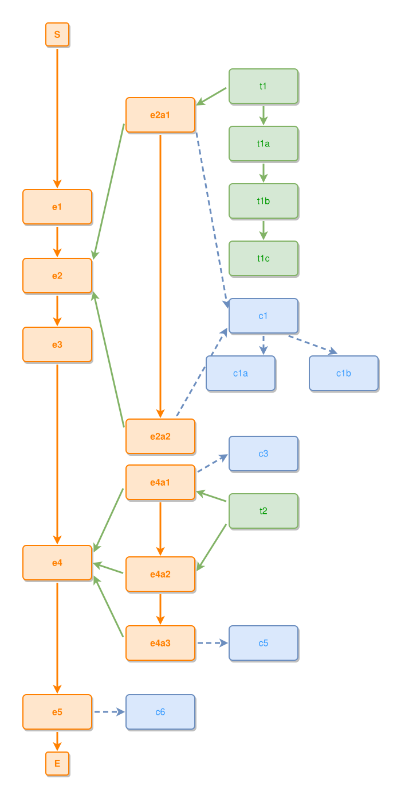

<!-- AUTO-GENERATED FILE - DO NOT EDIT -->
<!-- Generated by: gen-test-md -->
<!-- Command: go run ./cmd-dev/gen-test-md -->

# two-containers

> **⚠️ Warning:** This file is auto-generated. Manual changes will be lost when tests are regenerated.

**Source:** gl:examples/two-containers.ipmt#L1-L55 | [examples/two-containers.ipmt](../../../examples/two-containers.ipmt#L1)

## ipmt Content

```ipmt
# Two-containers example.
#
# Two independent composite events (e2, e4), each holding a different
# group of children. Demonstrates that clicking inside e2 and clicking
# inside e4 lead to DIFFERENT level3 states.
#
# Sequence: e1 → [e2] → e3 → [e4] → e5
#
# e2 children: e2a1 (→ t1), e2a2; both → c1 (full coverage → c1 attaches to e2 shell)
# e4 children: e4a1 (→ c3), e4a2, e4a3 (→ c5); only e4a1,e4a2 → t2
#   (partial coverage → t2 stays connected to individual events, not the shell)
#
# Thing hierarchy: t1 → t1a → t1b → t1c  (3 levels deep)
# Concept hierarchy: c1 → c1a, c1b  (one concept with two sub-concepts)

e1 ::e
  --then--> e2 ::e
  --then--> e3 ::e
  --then--> e4 ::e
  --then--> e5 ::e

e2 <--::P contains-- e2a1 ::e
t1 ::t --> e2a1

e2 <--::P contains-- e2a2 ::e
e2a1, e2a2 --> c1 ::c

e2a1 --> e2a2

# Thing hierarchy: t1 → t1a → t1b → t1c
t1 --> t1a ::t
t1a --> t1b ::t
t1b --> t1c ::t

# Concept hierarchy: c1 has two sub-concepts
c1 --> c1a ::c
c1 --> c1b ::c

e4 <--::P contains-- e4a1 ::e
e4a1 --> c3 ::c

e4 <--::P contains-- e4a2 ::e

e4 <--::P contains-- e4a3 ::e
e4a3 --> c5 ::c

t2 ::t --> e4a1, e4a2

e4a1 --> e4a2 --> e4a3

# e5 is a plain leaf event — it has a concept but no children,
# so it gets no level2/level3 and is not clickable in zoomIn.
e5 --> c6 ::c
```

## Generated Files

- [two-containers.ipmt](two-containers.ipmt) - ipmt input
- [two-containers.json](two-containers.json) - Parsed structure
- [two-containers.layout.json](two-containers.layout.json) - Layout coordinates
- [two-containers.ipm.svg](two-containers.ipm.svg) - Rendered diagram

## Rendered Diagram



This test case was automatically generated from the specification document.

The ipmt code block was extracted using [sync-test-cases](../../../docs/dev/testing.md) and saved to [two-containers.ipmt](two-containers.ipmt), then parsed into the [JSON structure](two-containers.json) and laid out into [layout coordinates](two-containers.layout.json). The [SVG diagram](two-containers.ipm.svg) was rendered using [ipmsvg-gen](../../../docs/ipmsvg-gen.md).
