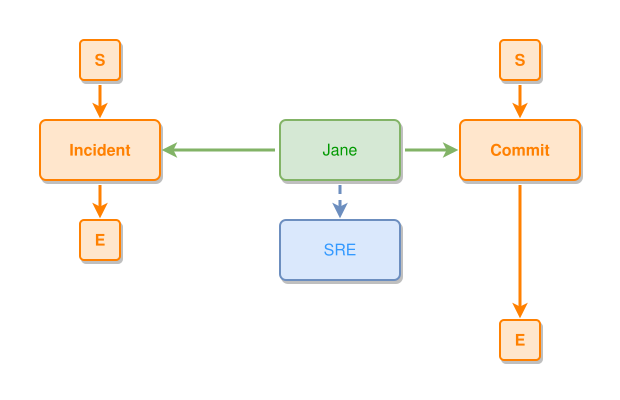

<!-- AUTO-GENERATED FILE - DO NOT EDIT -->
<!-- Generated by: gen-test-md -->
<!-- Command: go run ./cmd-dev/gen-test-md -->

# code-people-interaction

> **⚠️ Warning:** This file is auto-generated. Manual changes will be lost when tests are regenerated.

**Source:** gl:docs/how-to-model.md#L98-L104 | [docs/how-to-model.md](../../../docs/how-to-model.md#code-people-interaction)

## ipmt Content

```ipmt
# Engineer participates in events (thing --> event, part-of)
Jane --> Commit ::e
Jane --> Incident ::e

# Engineer classified by role
Jane --> SRE ::c
```

## Generated Files

- [code-people-interaction.ipmt](code-people-interaction.ipmt) - ipmt input
- [code-people-interaction.json](code-people-interaction.json) - Parsed structure
- [code-people-interaction.layout.json](code-people-interaction.layout.json) - Layout coordinates
- [code-people-interaction.ipm.svg](code-people-interaction.ipm.svg) - Rendered diagram

## Rendered Diagram



This test case was automatically generated from the specification document.

The ipmt code block was extracted using [sync-test-cases](../../../docs/dev/testing.md) and saved to [code-people-interaction.ipmt](code-people-interaction.ipmt), then parsed into the [JSON structure](code-people-interaction.json) and laid out into [layout coordinates](code-people-interaction.layout.json). The [SVG diagram](code-people-interaction.ipm.svg) was rendered using [ipmsvg-gen](../../../docs/ipmsvg-gen.md).
