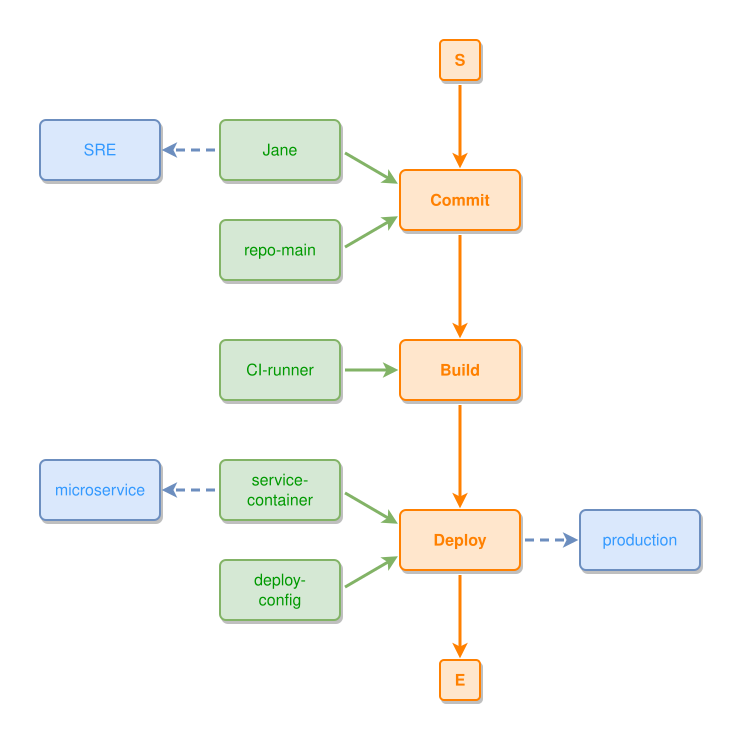

<!-- AUTO-GENERATED FILE - DO NOT EDIT -->
<!-- Generated by: gen-test-md -->
<!-- Command: go run ./cmd-dev/gen-test-md -->

# combined-example

> **⚠️ Warning:** This file is auto-generated. Manual changes will be lost when tests are regenerated.

**Source:** gl:docs/how-to-model.md#L110-L122 | [docs/how-to-model.md](../../../docs/how-to-model.md#combined-example)

## ipmt Content

```ipmt
# Process flow
Commit ::e --> Build ::e --> Deploy ::e

# Participants (thing --> event, part-of)
Jane, repo-main --> Commit
CI-runner --> Build
service-container, deploy-config --> Deploy

# Semantic tags
Jane --> SRE ::c
Deploy --> production ::c
service-container --> microservice ::c
```

## Generated Files

- [combined-example.ipmt](combined-example.ipmt) - ipmt input
- [combined-example.json](combined-example.json) - Parsed structure
- [combined-example.layout.json](combined-example.layout.json) - Layout coordinates
- [combined-example.ipm.svg](combined-example.ipm.svg) - Rendered diagram

## Rendered Diagram



This test case was automatically generated from the specification document.

The ipmt code block was extracted using [sync-test-cases](../../../docs/dev/testing.md) and saved to [combined-example.ipmt](combined-example.ipmt), then parsed into the [JSON structure](combined-example.json) and laid out into [layout coordinates](combined-example.layout.json). The [SVG diagram](combined-example.ipm.svg) was rendered using [ipmsvg-gen](../../../docs/ipmsvg-gen.md).
