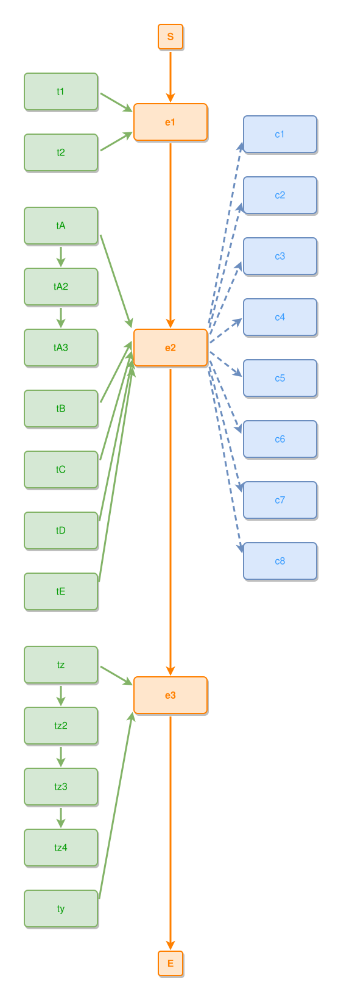

<!-- AUTO-GENERATED FILE - DO NOT EDIT -->
<!-- Generated by: gen-test-md -->
<!-- Command: go run ./cmd-dev/gen-test-md -->

# complex-1

> **⚠️ Warning:** This file is auto-generated. Manual changes will be lost when tests are regenerated.

**Source:** gl:docs/ipmt-ex/ipmt-examples.md#L270-L277 | [docs/ipmt-ex/ipmt-examples.md](../../../docs/ipmt-ex/ipmt-examples.md#complex-1)

## ipmt Content

```ipmt
e1 ::e --> e2 ::e --> e3 ::e
tA, tB, tC, tD, tE --> e2
e2 --> c1 ::c, c2 ::c, c3 ::c, c4 ::c, c5 ::c, c6 ::c, c7 ::c, c8 ::c
t1, t2 --> e1
tz, ty --> e3
tA --> tA2 --> tA3
tz --> tz2 --> tz3 --> tz4
```

## Generated Files

- [complex-1.ipmt](complex-1.ipmt) - ipmt input
- [complex-1.json](complex-1.json) - Parsed structure
- [complex-1.layout.json](complex-1.layout.json) - Layout coordinates
- [complex-1.ipm.svg](complex-1.ipm.svg) - Rendered diagram

## Rendered Diagram



This test case was automatically generated from the specification document.

The ipmt code block was extracted using [sync-test-cases](../../../docs/dev/testing.md) and saved to [complex-1.ipmt](complex-1.ipmt), then parsed into the [JSON structure](complex-1.json) and laid out into [layout coordinates](complex-1.layout.json). The [SVG diagram](complex-1.ipm.svg) was rendered using [ipmsvg-gen](../../../docs/ipmsvg-gen.md).
