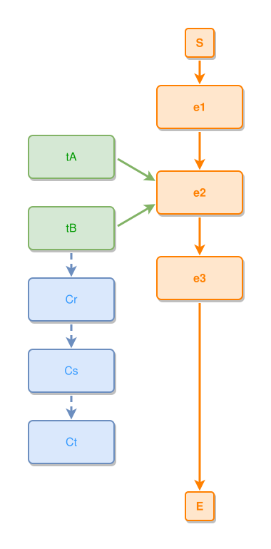

<!-- AUTO-GENERATED FILE - DO NOT EDIT -->
<!-- Generated by: gen-test-md -->
<!-- Command: go run ./cmd-dev/gen-test-md -->

# complex-2

> **⚠️ Warning:** This file is auto-generated. Manual changes will be lost when tests are regenerated.

**Source:** gl:docs/ipmt-ex/ipmt-examples.md#L284-L289 | [docs/ipmt-ex/ipmt-examples.md](../../../docs/ipmt-ex/ipmt-examples.md#complex-2)

## ipmt Content

```ipmt
e1 ::e --> e2 ::e --> e3 ::e
tA --> e2

tB --> e2
tB --> Cr ::c --> Cs ::c --> Ct ::c
```

## Generated Files

- [complex-2.ipmt](complex-2.ipmt) - ipmt input
- [complex-2.json](complex-2.json) - Parsed structure
- [complex-2.layout.json](complex-2.layout.json) - Layout coordinates
- [complex-2.ipm.svg](complex-2.ipm.svg) - Rendered diagram

## Rendered Diagram



This test case was automatically generated from the specification document.

The ipmt code block was extracted using [sync-test-cases](../../../docs/dev/testing.md) and saved to [complex-2.ipmt](complex-2.ipmt), then parsed into the [JSON structure](complex-2.json) and laid out into [layout coordinates](complex-2.layout.json). The [SVG diagram](complex-2.ipm.svg) was rendered using [ipmsvg-gen](../../../docs/ipmsvg-gen.md).
