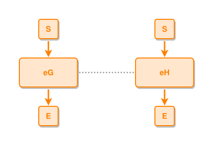

<!-- AUTO-GENERATED FILE - DO NOT EDIT -->
<!-- Generated by: gen-test-md -->
<!-- Command: go run ./cmd-dev/gen-test-md -->

# event-to-event-near-to

> **⚠️ Warning:** This file is auto-generated. Manual changes will be lost when tests are regenerated.

**Source:** gl:docs/ipmt-spec-ex.md#L71-L72 | [docs/ipmt-spec-ex.md](../../../docs/ipmt-spec-ex.md#event-to-event-near-to)

## ipmt Content

```ipmt
eG ::e --- eH ::e
```

## Generated Files

- [event-to-event-near-to.ipmt](event-to-event-near-to.ipmt) - ipmt input
- [event-to-event-near-to.json](event-to-event-near-to.json) - Parsed structure
- [event-to-event-near-to.layout.json](event-to-event-near-to.layout.json) - Layout coordinates
- [event-to-event-near-to.ipm.svg](event-to-event-near-to.ipm.svg) - Rendered diagram

## Rendered Diagram



This test case was automatically generated from the specification document.

The ipmt code block was extracted using [sync-test-cases](../../../docs/dev/testing.md) and saved to [event-to-event-near-to.ipmt](event-to-event-near-to.ipmt), then parsed into the [JSON structure](event-to-event-near-to.json) and laid out into [layout coordinates](event-to-event-near-to.layout.json). The [SVG diagram](event-to-event-near-to.ipm.svg) was rendered using [ipmsvg-gen](../../../docs/ipmsvg-gen.md).
