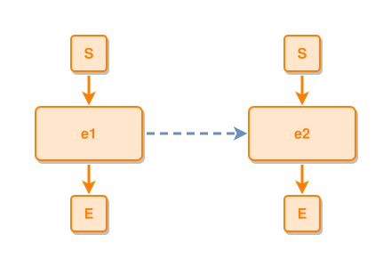

<!-- AUTO-GENERATED FILE - DO NOT EDIT -->
<!-- Generated by: gen-test-md -->
<!-- Command: go run ./cmd-dev/gen-test-md -->

# events-02

> **⚠️ Warning:** This file is auto-generated. Manual changes will be lost when tests are regenerated.

**Source:** gl:docs/ipmt-spec-ex.md#L145-L146 | [docs/ipmt-spec-ex.md](../../../docs/ipmt-spec-ex.md#events)

## ipmt Content

```ipmt
e1 ::e --::X--> e2 ::e
```

## Generated Files

- [events-02.ipmt](events-02.ipmt) - ipmt input
- [events-02.json](events-02.json) - Parsed structure
- [events-02.layout.json](events-02.layout.json) - Layout coordinates
- [events-02.ipm.svg](events-02.ipm.svg) - Rendered diagram

## Rendered Diagram



This test case was automatically generated from the specification document.

The ipmt code block was extracted using [sync-test-cases](../../../docs/dev/testing.md) and saved to [events-02.ipmt](events-02.ipmt), then parsed into the [JSON structure](events-02.json) and laid out into [layout coordinates](events-02.layout.json). The [SVG diagram](events-02.ipm.svg) was rendered using [ipmsvg-gen](../../../docs/ipmsvg-gen.md).
