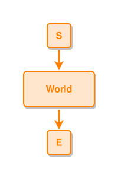

<!-- AUTO-GENERATED FILE - DO NOT EDIT -->
<!-- Generated by: gen-test-md -->
<!-- Command: go run ./cmd-dev/gen-test-md -->

# hello

> **⚠️ Warning:** This file is auto-generated. Manual changes will be lost when tests are regenerated.

**Source:** gl:docs/md-embed.md#L37-L38 | [docs/md-embed.md](../../../docs/md-embed.md#hello)

## ipmt Content

```ipmt
World ::e
```

## Generated Files

- [hello.ipmt](hello.ipmt) - ipmt input
- [hello.json](hello.json) - Parsed structure
- [hello.layout.json](hello.layout.json) - Layout coordinates
- [hello.ipm.svg](hello.ipm.svg) - Rendered diagram

## Rendered Diagram



This test case was automatically generated from the specification document.

The ipmt code block was extracted using [sync-test-cases](../../../docs/dev/testing.md) and saved to [hello.ipmt](hello.ipmt), then parsed into the [JSON structure](hello.json) and laid out into [layout coordinates](hello.layout.json). The [SVG diagram](hello.ipm.svg) was rendered using [ipmsvg-gen](../../../docs/ipmsvg-gen.md).
