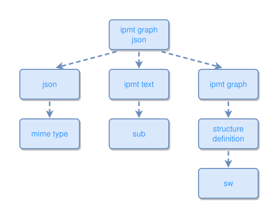

<!-- AUTO-GENERATED FILE - DO NOT EDIT -->
<!-- Generated by: gen-test-md -->
<!-- Command: go run ./cmd-dev/gen-test-md -->

# ipmt-graph-json

> **⚠️ Warning:** This file is auto-generated. Manual changes will be lost when tests are regenerated.

**Source:** gl:docs/ipm/ipm-parser-output.md#L4-L16 | [docs/ipm/ipm-parser-output.md](../../../docs/ipm/ipm-parser-output.md#ipmt-graph-json)

## ipmt Content

```ipmt
ipmt graph json ::c
  --> json ::c
    --> mime type ::c

ipmt graph json
  --> ipmt text  ::c
    --> sub  ::c

ipmt graph json
  --> ipmt graph  ::c
    --> structure definition ::c
      --> sw ::c
```

## Generated Files

- [ipmt-graph-json.ipmt](ipmt-graph-json.ipmt) - ipmt input
- [ipmt-graph-json.json](ipmt-graph-json.json) - Parsed structure
- [ipmt-graph-json.layout.json](ipmt-graph-json.layout.json) - Layout coordinates
- [ipmt-graph-json.ipm.svg](ipmt-graph-json.ipm.svg) - Rendered diagram

## Rendered Diagram



This test case was automatically generated from the specification document.

The ipmt code block was extracted using [sync-test-cases](../../../docs/dev/testing.md) and saved to [ipmt-graph-json.ipmt](ipmt-graph-json.ipmt), then parsed into the [JSON structure](ipmt-graph-json.json) and laid out into [layout coordinates](ipmt-graph-json.layout.json). The [SVG diagram](ipmt-graph-json.ipm.svg) was rendered using [ipmsvg-gen](../../../docs/ipmsvg-gen.md).
