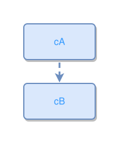

<!-- AUTO-GENERATED FILE - DO NOT EDIT -->
<!-- Generated by: gen-test-md -->
<!-- Command: go run ./cmd-dev/gen-test-md -->

# links-explicit-e

> **⚠️ Warning:** This file is auto-generated. Manual changes will be lost when tests are regenerated.

**Source:** gl:docs/ipmt-ex/ipmt-examples.md#L92-L93 | [docs/ipmt-ex/ipmt-examples.md](../../../docs/ipmt-ex/ipmt-examples.md#links-explicit-e)

## ipmt Content

```ipmt
cA ::c --::X--> cB ::c
```

## Generated Files

- [links-explicit-e.ipmt](links-explicit-e.ipmt) - ipmt input
- [links-explicit-e.json](links-explicit-e.json) - Parsed structure
- [links-explicit-e.layout.json](links-explicit-e.layout.json) - Layout coordinates
- [links-explicit-e.ipm.svg](links-explicit-e.ipm.svg) - Rendered diagram

## Rendered Diagram



This test case was automatically generated from the specification document.

The ipmt code block was extracted using [sync-test-cases](../../../docs/dev/testing.md) and saved to [links-explicit-e.ipmt](links-explicit-e.ipmt), then parsed into the [JSON structure](links-explicit-e.json) and laid out into [layout coordinates](links-explicit-e.layout.json). The [SVG diagram](links-explicit-e.ipm.svg) was rendered using [ipmsvg-gen](../../../docs/ipmsvg-gen.md).
