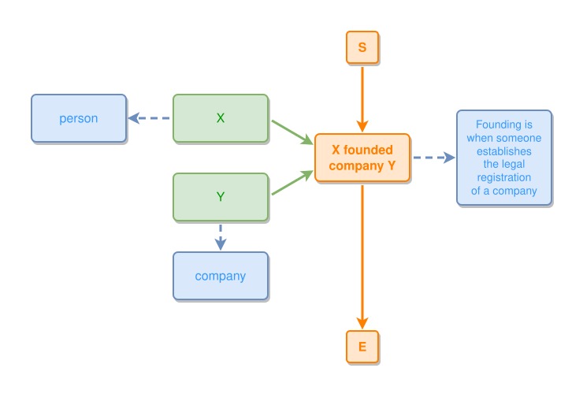

<!-- AUTO-GENERATED FILE - DO NOT EDIT -->
<!-- Generated by: gen-test-md -->
<!-- Command: go run ./cmd-dev/gen-test-md -->

# marks-25-08-24-medium-post-02

> **⚠️ Warning:** This file is auto-generated. Manual changes will be lost when tests are regenerated.

**Source:** gl:docs/ipmt-ex/mark-ex/examples.md#L21-L27 | [docs/ipmt-ex/mark-ex/examples.md](../../../docs/ipmt-ex/mark-ex/examples.md#marks-25-08-24-medium-post)

## ipmt Content

```ipmt
# Company founding
X --> X founded company Y ::e fe::a
Y --> fe
X --> person ::c
Y --> company ::c
fe --> Founding is when someone establishes the legal registration of a company ::c
```

## Generated Files

- [marks-25-08-24-medium-post-02.ipmt](marks-25-08-24-medium-post-02.ipmt) - ipmt input
- [marks-25-08-24-medium-post-02.json](marks-25-08-24-medium-post-02.json) - Parsed structure
- [marks-25-08-24-medium-post-02.layout.json](marks-25-08-24-medium-post-02.layout.json) - Layout coordinates
- [marks-25-08-24-medium-post-02.ipm.svg](marks-25-08-24-medium-post-02.ipm.svg) - Rendered diagram

## Rendered Diagram



This test case was automatically generated from the specification document.

The ipmt code block was extracted using [sync-test-cases](../../../docs/dev/testing.md) and saved to [marks-25-08-24-medium-post-02.ipmt](marks-25-08-24-medium-post-02.ipmt), then parsed into the [JSON structure](marks-25-08-24-medium-post-02.json) and laid out into [layout coordinates](marks-25-08-24-medium-post-02.layout.json). The [SVG diagram](marks-25-08-24-medium-post-02.ipm.svg) was rendered using [ipmsvg-gen](../../../docs/ipmsvg-gen.md).
