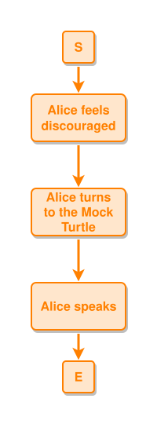

<!-- AUTO-GENERATED FILE - DO NOT EDIT -->
<!-- Generated by: gen-test-md -->
<!-- Command: go run ./cmd-dev/gen-test-md -->

# marks-25-08-24-medium-post

> **⚠️ Warning:** This file is auto-generated. Manual changes will be lost when tests are regenerated.

**Source:** gl:docs/ipmt-ex/mark-ex/examples.md#L10-L16 | [docs/ipmt-ex/mark-ex/examples.md](../../../docs/ipmt-ex/mark-ex/examples.md#marks-25-08-24-medium-post)

## ipmt Content

```ipmt
# Alice's story
Alice feels discouraged ::e e1::a
Alice turns to the Mock Turtle ::e e2::a
Alice speaks ::e e3::a

e1 --> e2 --> e3
```

## Generated Files

- [marks-25-08-24-medium-post.ipmt](marks-25-08-24-medium-post.ipmt) - ipmt input
- [marks-25-08-24-medium-post.json](marks-25-08-24-medium-post.json) - Parsed structure
- [marks-25-08-24-medium-post.layout.json](marks-25-08-24-medium-post.layout.json) - Layout coordinates
- [marks-25-08-24-medium-post.ipm.svg](marks-25-08-24-medium-post.ipm.svg) - Rendered diagram

## Rendered Diagram



This test case was automatically generated from the specification document.

The ipmt code block was extracted using [sync-test-cases](../../../docs/dev/testing.md) and saved to [marks-25-08-24-medium-post.ipmt](marks-25-08-24-medium-post.ipmt), then parsed into the [JSON structure](marks-25-08-24-medium-post.json) and laid out into [layout coordinates](marks-25-08-24-medium-post.layout.json). The [SVG diagram](marks-25-08-24-medium-post.ipm.svg) was rendered using [ipmsvg-gen](../../../docs/ipmsvg-gen.md).
