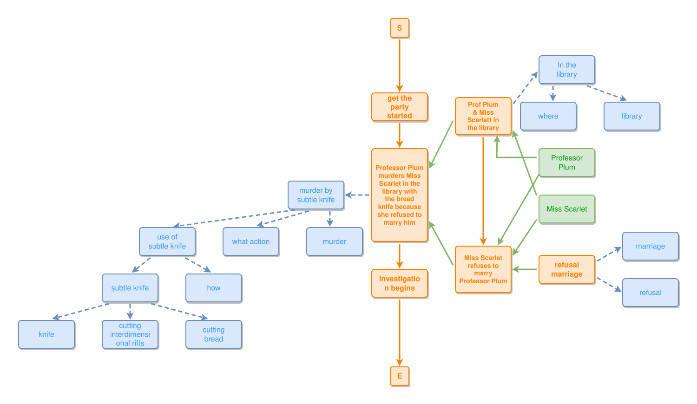

<!-- AUTO-GENERATED FILE - DO NOT EDIT -->
<!-- Generated by: gen-test-md -->
<!-- Command: go run ./cmd-dev/gen-test-md -->

# murder-mystery-june-2025

> **⚠️ Warning:** This file is auto-generated. Manual changes will be lost when tests are regenerated.

**Source:** gl:docs/ipmt-ex/mark-ex/examples.md#L38-L77 | [docs/ipmt-ex/mark-ex/examples.md](../../../docs/ipmt-ex/mark-ex/examples.md#murder-mystery-june-2025)

## ipmt Content

```ipmt
get the party started ::e
  --then--> murder-e::a Professor Plum murders Miss Scarlet in the library with the bread knife because she refused to marry him ::e
  --then--> investigation begins ::e


# fix: subtle knife ::t -> ::c
murder-e --"example of"--> murder-sk::a murder by subtle knife ::c
  --"example of"--> use-sk::a use of subtle knife ::c
  --"involves"--> sk::a subtle knife ::c
  --"kind of"--> knife ::c

murder-sk --"answers question"--> what action ::c
murder-sk --"involves"--> murder ::c
use-sk --"answers question"--> how ::c
sk --"used for"--> cutting interdimensional rifts ::c
sk --"used for"--> cutting bread ::c

murder-e <--::P involves-- library-ppms::a Prof Plum & Miss Scarlett in the library ::e
  --> In the library ::c
  --"answers question"--> where ::c

# fix: library ::t -> ::c
In the library --"involves"--> library ::c

murder-e <--::P contains-- refusal-mspp::a Miss Scarlet refuses to marry Professor Plum ::e
  <--::P-- refusal marriage ::e
  --> marriage ::c
refusal marriage --> refusal ::c

# fix: add leads-to
library-ppms --> refusal-mspp

# change: change involves/contains to part-of
# change: hide explicit Professor Plum --> skip murder-e
# change: hide explicit Miss Scarlet --> skip murder-e
Professor Plum --> library-ppms
Professor Plum --> refusal-mspp
Miss Scarlet --> library-ppms
Miss Scarlet --> refusal-mspp
```

## Generated Files

- [murder-mystery-june-2025.ipmt](murder-mystery-june-2025.ipmt) - ipmt input
- [murder-mystery-june-2025.json](murder-mystery-june-2025.json) - Parsed structure
- [murder-mystery-june-2025.layout.json](murder-mystery-june-2025.layout.json) - Layout coordinates
- [murder-mystery-june-2025.ipm.svg](murder-mystery-june-2025.ipm.svg) - Rendered diagram

## Rendered Diagram



This test case was automatically generated from the specification document.

The ipmt code block was extracted using [sync-test-cases](../../../docs/dev/testing.md) and saved to [murder-mystery-june-2025.ipmt](murder-mystery-june-2025.ipmt), then parsed into the [JSON structure](murder-mystery-june-2025.json) and laid out into [layout coordinates](murder-mystery-june-2025.layout.json). The [SVG diagram](murder-mystery-june-2025.ipm.svg) was rendered using [ipmsvg-gen](../../../docs/ipmsvg-gen.md).
