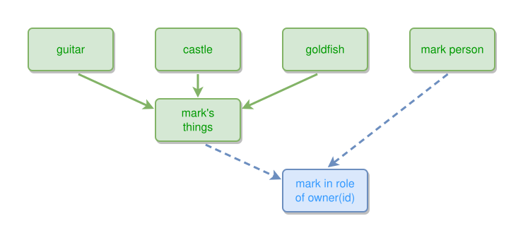

<!-- AUTO-GENERATED FILE - DO NOT EDIT -->
<!-- Generated by: gen-test-md -->
<!-- Command: go run ./cmd-dev/gen-test-md -->

# ownership-june-2025

> **⚠️ Warning:** This file is auto-generated. Manual changes will be lost when tests are regenerated.

**Source:** gl:docs/ipmt-ex/mark-ex/examples.md#L89-L91 | [docs/ipmt-ex/mark-ex/examples.md](../../../docs/ipmt-ex/mark-ex/examples.md#ownership-june-2025)

## ipmt Content

```ipmt
guitar, castle, goldfish --> mark's things
mark's things --> mark in role of owner(id) ::c <-- mark person
```

## Generated Files

- [ownership-june-2025.ipmt](ownership-june-2025.ipmt) - ipmt input
- [ownership-june-2025.json](ownership-june-2025.json) - Parsed structure
- [ownership-june-2025.layout.json](ownership-june-2025.layout.json) - Layout coordinates
- [ownership-june-2025.ipm.svg](ownership-june-2025.ipm.svg) - Rendered diagram

## Rendered Diagram



This test case was automatically generated from the specification document.

The ipmt code block was extracted using [sync-test-cases](../../../docs/dev/testing.md) and saved to [ownership-june-2025.ipmt](ownership-june-2025.ipmt), then parsed into the [JSON structure](ownership-june-2025.json) and laid out into [layout coordinates](ownership-june-2025.layout.json). The [SVG diagram](ownership-june-2025.ipm.svg) was rendered using [ipmsvg-gen](../../../docs/ipmsvg-gen.md).
