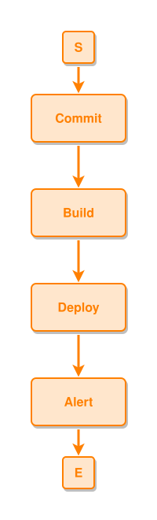

<!-- AUTO-GENERATED FILE - DO NOT EDIT -->
<!-- Generated by: gen-test-md -->
<!-- Command: go run ./cmd-dev/gen-test-md -->

# process-flow-leadsto

> **⚠️ Warning:** This file is auto-generated. Manual changes will be lost when tests are regenerated.

**Source:** gl:docs/how-to-model.md#L41-L42 | [docs/how-to-model.md](../../../docs/how-to-model.md#process-flow-leadsto)

## ipmt Content

```ipmt
Commit ::e --> Build ::e --> Deploy ::e --> Alert ::e
```

## Generated Files

- [process-flow-leadsto.ipmt](process-flow-leadsto.ipmt) - ipmt input
- [process-flow-leadsto.json](process-flow-leadsto.json) - Parsed structure
- [process-flow-leadsto.layout.json](process-flow-leadsto.layout.json) - Layout coordinates
- [process-flow-leadsto.ipm.svg](process-flow-leadsto.ipm.svg) - Rendered diagram

## Rendered Diagram



This test case was automatically generated from the specification document.

The ipmt code block was extracted using [sync-test-cases](../../../docs/dev/testing.md) and saved to [process-flow-leadsto.ipmt](process-flow-leadsto.ipmt), then parsed into the [JSON structure](process-flow-leadsto.json) and laid out into [layout coordinates](process-flow-leadsto.layout.json). The [SVG diagram](process-flow-leadsto.ipm.svg) was rendered using [ipmsvg-gen](../../../docs/ipmsvg-gen.md).
