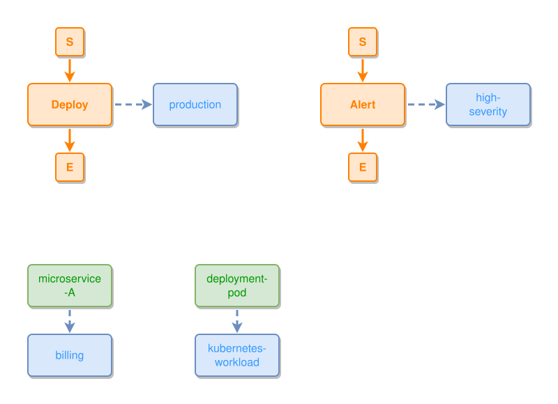

<!-- AUTO-GENERATED FILE - DO NOT EDIT -->
<!-- Generated by: gen-test-md -->
<!-- Command: go run ./cmd-dev/gen-test-md -->

# semantic-classification-expresses

> **⚠️ Warning:** This file is auto-generated. Manual changes will be lost when tests are regenerated.

**Source:** gl:docs/how-to-model.md#L86-L90 | [docs/how-to-model.md](../../../docs/how-to-model.md#semantic-classification-expresses)

## ipmt Content

```ipmt
microservice-A --> billing ::c
deployment-pod --> kubernetes-workload ::c
Deploy ::e --> production ::c
Alert ::e --> high-severity ::c
```

## Generated Files

- [semantic-classification-expresses.ipmt](semantic-classification-expresses.ipmt) - ipmt input
- [semantic-classification-expresses.json](semantic-classification-expresses.json) - Parsed structure
- [semantic-classification-expresses.layout.json](semantic-classification-expresses.layout.json) - Layout coordinates
- [semantic-classification-expresses.ipm.svg](semantic-classification-expresses.ipm.svg) - Rendered diagram

## Rendered Diagram



This test case was automatically generated from the specification document.

The ipmt code block was extracted using [sync-test-cases](../../../docs/dev/testing.md) and saved to [semantic-classification-expresses.ipmt](semantic-classification-expresses.ipmt), then parsed into the [JSON structure](semantic-classification-expresses.json) and laid out into [layout coordinates](semantic-classification-expresses.layout.json). The [SVG diagram](semantic-classification-expresses.ipm.svg) was rendered using [ipmsvg-gen](../../../docs/ipmsvg-gen.md).
