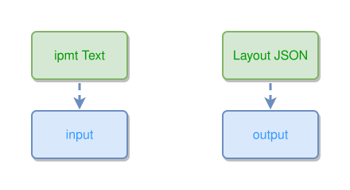

<!-- AUTO-GENERATED FILE - DO NOT EDIT -->
<!-- Generated by: gen-test-md -->
<!-- Command: go run ./cmd-dev/gen-test-md -->

# shared-hierarchies-across-diagrams

> **⚠️ Warning:** This file is auto-generated. Manual changes will be lost when tests are regenerated.

**Source:** gl:docs/how-to-model.md#L170-L172 | [docs/how-to-model.md](../../../docs/how-to-model.md#shared-hierarchies-across-diagrams)

## ipmt Content

```ipmt
ipmt Text --> input ::c
Layout JSON --> output ::c
```

## Generated Files

- [shared-hierarchies-across-diagrams.ipmt](shared-hierarchies-across-diagrams.ipmt) - ipmt input
- [shared-hierarchies-across-diagrams.json](shared-hierarchies-across-diagrams.json) - Parsed structure
- [shared-hierarchies-across-diagrams.layout.json](shared-hierarchies-across-diagrams.layout.json) - Layout coordinates
- [shared-hierarchies-across-diagrams.ipm.svg](shared-hierarchies-across-diagrams.ipm.svg) - Rendered diagram

## Rendered Diagram



This test case was automatically generated from the specification document.

The ipmt code block was extracted using [sync-test-cases](../../../docs/dev/testing.md) and saved to [shared-hierarchies-across-diagrams.ipmt](shared-hierarchies-across-diagrams.ipmt), then parsed into the [JSON structure](shared-hierarchies-across-diagrams.json) and laid out into [layout coordinates](shared-hierarchies-across-diagrams.layout.json). The [SVG diagram](shared-hierarchies-across-diagrams.ipm.svg) was rendered using [ipmsvg-gen](../../../docs/ipmsvg-gen.md).
