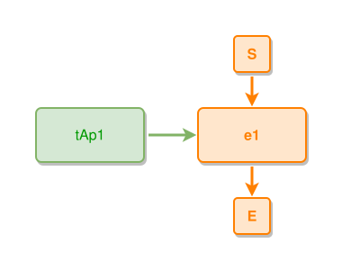

<!-- AUTO-GENERATED FILE - DO NOT EDIT -->
<!-- Generated by: gen-test-md -->
<!-- Command: go run ./cmd-dev/gen-test-md -->

# thing-to-event

> **⚠️ Warning:** This file is auto-generated. Manual changes will be lost when tests are regenerated.

**Source:** gl:docs/ipmt-spec-ex.md#L16-L17 | [docs/ipmt-spec-ex.md](../../../docs/ipmt-spec-ex.md#thing-to-event)

## ipmt Content

```ipmt
tAp1 --> e1 ::e
```

## Generated Files

- [thing-to-event.ipmt](thing-to-event.ipmt) - ipmt input
- [thing-to-event.json](thing-to-event.json) - Parsed structure
- [thing-to-event.layout.json](thing-to-event.layout.json) - Layout coordinates
- [thing-to-event.ipm.svg](thing-to-event.ipm.svg) - Rendered diagram

## Rendered Diagram



This test case was automatically generated from the specification document.

The ipmt code block was extracted using [sync-test-cases](../../../docs/dev/testing.md) and saved to [thing-to-event.ipmt](thing-to-event.ipmt), then parsed into the [JSON structure](thing-to-event.json) and laid out into [layout coordinates](thing-to-event.layout.json). The [SVG diagram](thing-to-event.ipm.svg) was rendered using [ipmsvg-gen](../../../docs/ipmsvg-gen.md).
