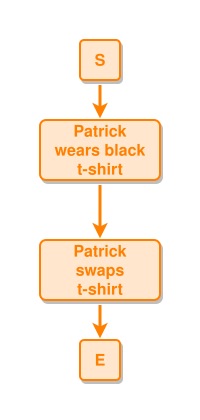

<!-- AUTO-GENERATED FILE - DO NOT EDIT -->
<!-- Generated by: gen-test-md -->
<!-- Command: go run ./cmd-dev/gen-test-md -->

# visible-ipmt-fence-in-the-md

> **⚠️ Warning:** This file is auto-generated. Manual changes will be lost when tests are regenerated.

**Source:** gl:docs/md-embed.md#L130-L132 | [docs/md-embed.md](../../../docs/md-embed.md#visible-ipmt-fence-in-the-.md)

## ipmt Content

```ipmt
Patrick wears black t-shirt ::e
  --> Patrick swaps t-shirt ::e
```

## Generated Files

- [visible-ipmt-fence-in-the-md.ipmt](visible-ipmt-fence-in-the-md.ipmt) - ipmt input
- [visible-ipmt-fence-in-the-md.json](visible-ipmt-fence-in-the-md.json) - Parsed structure
- [visible-ipmt-fence-in-the-md.layout.json](visible-ipmt-fence-in-the-md.layout.json) - Layout coordinates
- [visible-ipmt-fence-in-the-md.ipm.svg](visible-ipmt-fence-in-the-md.ipm.svg) - Rendered diagram

## Rendered Diagram



This test case was automatically generated from the specification document.

The ipmt code block was extracted using [sync-test-cases](../../../docs/dev/testing.md) and saved to [visible-ipmt-fence-in-the-md.ipmt](visible-ipmt-fence-in-the-md.ipmt), then parsed into the [JSON structure](visible-ipmt-fence-in-the-md.json) and laid out into [layout coordinates](visible-ipmt-fence-in-the-md.layout.json). The [SVG diagram](visible-ipmt-fence-in-the-md.ipm.svg) was rendered using [ipmsvg-gen](../../../docs/ipmsvg-gen.md).
