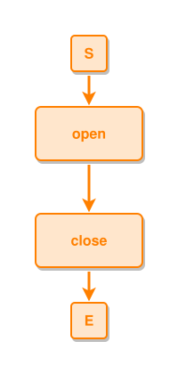

<!-- AUTO-GENERATED FILE - DO NOT EDIT -->
<!-- Generated by: gen-test-md -->
<!-- Command: go run ./cmd-dev/gen-test-md -->

# bracket-labels

> **⚠️ Warning:** This file is auto-generated. Manual changes will be lost when tests are regenerated.

**Source:** gl:docs/ipmt-spec.md#L82-L83 | [docs/ipmt-spec.md](../../../docs/ipmt-spec.md#bracket-labels)

## ipmt Content

```ipmt
open [the long label of the first event] ::e --> close [the second one] ::e
```

## Generated Files

- [bracket-labels.ipmt](bracket-labels.ipmt) - ipmt input
- [bracket-labels.json](bracket-labels.json) - Parsed structure
- [bracket-labels.layout.json](bracket-labels.layout.json) - Layout coordinates
- [bracket-labels.ipm.svg](bracket-labels.ipm.svg) - Rendered diagram

## Rendered Diagram



This test case was automatically generated from the specification document.

The ipmt code block was extracted using [sync-test-cases](../../../docs/dev/testing.md) and saved to [bracket-labels.ipmt](bracket-labels.ipmt), then parsed into the [JSON structure](bracket-labels.json) and laid out into [layout coordinates](bracket-labels.layout.json). The [SVG diagram](bracket-labels.ipm.svg) was rendered using [ipmsvg-gen](../../../docs/ipmsvg-gen.md).
