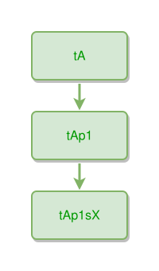

<!-- AUTO-GENERATED FILE - DO NOT EDIT -->
<!-- Generated by: gen-test-md -->
<!-- Command: go run ./cmd-dev/gen-test-md -->

# chaining-arrows

> **⚠️ Warning:** This file is auto-generated. Manual changes will be lost when tests are regenerated.

**Source:** gl:docs/ipmt-spec.md#L350-L351 | [docs/ipmt-spec.md](../../../docs/ipmt-spec.md#chaining-arrows)

## ipmt Content

```ipmt
tA --> tAp1 --> tAp1sX
```

## Generated Files

- [chaining-arrows.ipmt](chaining-arrows.ipmt) - ipmt input
- [chaining-arrows.json](chaining-arrows.json) - Parsed structure
- [chaining-arrows.layout.json](chaining-arrows.layout.json) - Layout coordinates
- [chaining-arrows.ipm.svg](chaining-arrows.ipm.svg) - Rendered diagram

## Rendered Diagram



This test case was automatically generated from the specification document.

The ipmt code block was extracted using [sync-test-cases](../../../docs/dev/testing.md) and saved to [chaining-arrows.ipmt](chaining-arrows.ipmt), then parsed into the [JSON structure](chaining-arrows.json) and laid out into [layout coordinates](chaining-arrows.layout.json). The [SVG diagram](chaining-arrows.ipm.svg) was rendered using [ipmsvg-gen](../../../docs/ipmsvg-gen.md).
