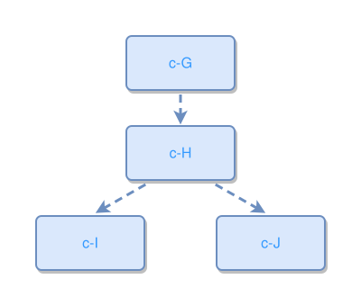

<!-- AUTO-GENERATED FILE - DO NOT EDIT -->
<!-- Generated by: gen-test-md -->
<!-- Command: go run ./cmd-dev/gen-test-md -->

# comma-separated-with-more-arrows-on-one-line-04

> **⚠️ Warning:** This file is auto-generated. Manual changes will be lost when tests are regenerated.

**Source:** gl:docs/ipmt-spec.md#L523-L526 | [docs/ipmt-spec.md](../../../docs/ipmt-spec.md#comma-separated-with-more-arrows-on-one-line)

## ipmt Content

```ipmt
c-G ::c --> c-H ::c
c-H ::c --> c-I ::c
c-H ::c --> c-J ::c
```

## Generated Files

- [comma-separated-with-more-arrows-on-one-line-04.ipmt](comma-separated-with-more-arrows-on-one-line-04.ipmt) - ipmt input
- [comma-separated-with-more-arrows-on-one-line-04.json](comma-separated-with-more-arrows-on-one-line-04.json) - Parsed structure
- [comma-separated-with-more-arrows-on-one-line-04.layout.json](comma-separated-with-more-arrows-on-one-line-04.layout.json) - Layout coordinates
- [comma-separated-with-more-arrows-on-one-line-04.ipm.svg](comma-separated-with-more-arrows-on-one-line-04.ipm.svg) - Rendered diagram

## Rendered Diagram



This test case was automatically generated from the specification document.

The ipmt code block was extracted using [sync-test-cases](../../../docs/dev/testing.md) and saved to [comma-separated-with-more-arrows-on-one-line-04.ipmt](comma-separated-with-more-arrows-on-one-line-04.ipmt), then parsed into the [JSON structure](comma-separated-with-more-arrows-on-one-line-04.json) and laid out into [layout coordinates](comma-separated-with-more-arrows-on-one-line-04.layout.json). The [SVG diagram](comma-separated-with-more-arrows-on-one-line-04.ipm.svg) was rendered using [ipmsvg-gen](../../../docs/ipmsvg-gen.md).
