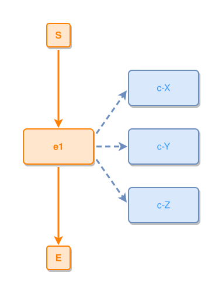

<!-- AUTO-GENERATED FILE - DO NOT EDIT -->
<!-- Generated by: gen-test-md -->
<!-- Command: go run ./cmd-dev/gen-test-md -->

# comma-separator-02

> **⚠️ Warning:** This file is auto-generated. Manual changes will be lost when tests are regenerated.

**Source:** gl:docs/ipmt-spec.md#L482-L488 | [docs/ipmt-spec.md](../../../docs/ipmt-spec.md#comma-separator)

## ipmt Content

```ipmt
c-X ::c
c-Y ::c
c-Z ::c
e1 ::e --> c-X
e1 ::e --> c-Y
e1 ::e --> c-Z
```

## Generated Files

- [comma-separator-02.ipmt](comma-separator-02.ipmt) - ipmt input
- [comma-separator-02.json](comma-separator-02.json) - Parsed structure
- [comma-separator-02.layout.json](comma-separator-02.layout.json) - Layout coordinates
- [comma-separator-02.ipm.svg](comma-separator-02.ipm.svg) - Rendered diagram

## Rendered Diagram



This test case was automatically generated from the specification document.

The ipmt code block was extracted using [sync-test-cases](../../../docs/dev/testing.md) and saved to [comma-separator-02.ipmt](comma-separator-02.ipmt), then parsed into the [JSON structure](comma-separator-02.json) and laid out into [layout coordinates](comma-separator-02.layout.json). The [SVG diagram](comma-separator-02.ipm.svg) was rendered using [ipmsvg-gen](../../../docs/ipmsvg-gen.md).
