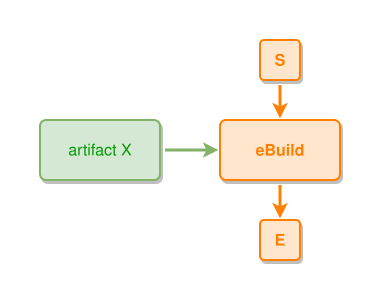

<!-- AUTO-GENERATED FILE - DO NOT EDIT -->
<!-- Generated by: gen-test-md -->
<!-- Command: go run ./cmd-dev/gen-test-md -->

# edge-tooltip-05

> **⚠️ Warning:** This file is auto-generated. Manual changes will be lost when tests are regenerated.

**Source:** gl:docs/ipmt-spec.md#L317-L318 | [docs/ipmt-spec.md](../../../docs/ipmt-spec.md#edge-tooltip)

## ipmt Content

```ipmt
artifact X --created-by--> eBuild ::e
```

## Generated Files

- [edge-tooltip-05.ipmt](edge-tooltip-05.ipmt) - ipmt input
- [edge-tooltip-05.json](edge-tooltip-05.json) - Parsed structure
- [edge-tooltip-05.layout.json](edge-tooltip-05.layout.json) - Layout coordinates
- [edge-tooltip-05.ipm.svg](edge-tooltip-05.ipm.svg) - Rendered diagram

## Rendered Diagram



This test case was automatically generated from the specification document.

The ipmt code block was extracted using [sync-test-cases](../../../docs/dev/testing.md) and saved to [edge-tooltip-05.ipmt](edge-tooltip-05.ipmt), then parsed into the [JSON structure](edge-tooltip-05.json) and laid out into [layout coordinates](edge-tooltip-05.layout.json). The [SVG diagram](edge-tooltip-05.ipm.svg) was rendered using [ipmsvg-gen](../../../docs/ipmsvg-gen.md).
