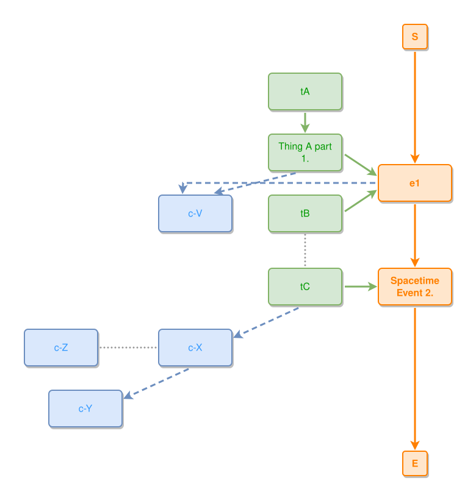

<!-- AUTO-GENERATED FILE - DO NOT EDIT -->
<!-- Generated by: gen-test-md -->
<!-- Command: go run ./cmd-dev/gen-test-md -->

# example-hokus1-diagram

> **⚠️ Warning:** This file is auto-generated. Manual changes will be lost when tests are regenerated.

**Source:** gl:docs/ipmt-spec.md#L9-L17 | [docs/ipmt-spec.md](../../../docs/ipmt-spec.md#example-hokus1-diagram)

## ipmt Content

```ipmt
e1 ::e --> e2::a Spacetime Event 2. ::e
tA --> tAp1::a Thing A part 1. --> e1
tB --> e1
e2 <-- tC
tB --- tC
e1, tAp1 --> c-V ::c
tC --> c-X ::c --> c-Y ::c
c-Z ::c --- c-X
```

## Generated Files

- [example-hokus1-diagram.ipmt](example-hokus1-diagram.ipmt) - ipmt input
- [example-hokus1-diagram.json](example-hokus1-diagram.json) - Parsed structure
- [example-hokus1-diagram.layout.json](example-hokus1-diagram.layout.json) - Layout coordinates
- [example-hokus1-diagram.ipm.svg](example-hokus1-diagram.ipm.svg) - Rendered diagram

## Rendered Diagram



This test case was automatically generated from the specification document.

The ipmt code block was extracted using [sync-test-cases](../../../docs/dev/testing.md) and saved to [example-hokus1-diagram.ipmt](example-hokus1-diagram.ipmt), then parsed into the [JSON structure](example-hokus1-diagram.json) and laid out into [layout coordinates](example-hokus1-diagram.layout.json). The [SVG diagram](example-hokus1-diagram.ipm.svg) was rendered using [ipmsvg-gen](../../../docs/ipmsvg-gen.md).
