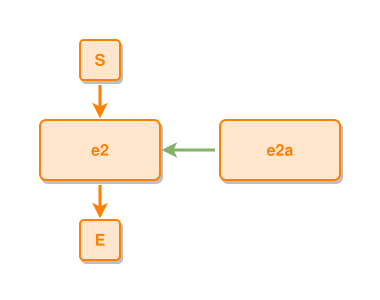

<!-- AUTO-GENERATED FILE - DO NOT EDIT -->
<!-- Generated by: gen-test-md -->
<!-- Command: go run ./cmd-dev/gen-test-md -->

# explicit-arrow-with-tooltip-02

> **⚠️ Warning:** This file is auto-generated. Manual changes will be lost when tests are regenerated.

**Source:** gl:docs/ipmt-spec.md#L315-L316 | [docs/ipmt-spec.md](../../../docs/ipmt-spec.md#explicit-arrow-with-tooltip)

## ipmt Content

```ipmt
e2a ::e --::P contains--> e2 ::e
```

## Generated Files

- [explicit-arrow-with-tooltip-02.ipmt](explicit-arrow-with-tooltip-02.ipmt) - ipmt input
- [explicit-arrow-with-tooltip-02.json](explicit-arrow-with-tooltip-02.json) - Parsed structure
- [explicit-arrow-with-tooltip-02.layout.json](explicit-arrow-with-tooltip-02.layout.json) - Layout coordinates
- [explicit-arrow-with-tooltip-02.ipm.svg](explicit-arrow-with-tooltip-02.ipm.svg) - Rendered diagram

## Rendered Diagram



This test case was automatically generated from the specification document.

The ipmt code block was extracted using [sync-test-cases](../../../docs/dev/testing.md) and saved to [explicit-arrow-with-tooltip-02.ipmt](explicit-arrow-with-tooltip-02.ipmt), then parsed into the [JSON structure](explicit-arrow-with-tooltip-02.json) and laid out into [layout coordinates](explicit-arrow-with-tooltip-02.layout.json). The [SVG diagram](explicit-arrow-with-tooltip-02.ipm.svg) was rendered using [ipmsvg-gen](../../../docs/ipmsvg-gen.md).
