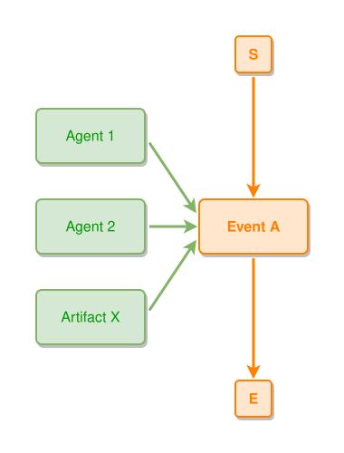

<!-- AUTO-GENERATED FILE - DO NOT EDIT -->
<!-- Generated by: gen-test-md -->
<!-- Command: go run ./cmd-dev/gen-test-md -->

# minimal-example

> **⚠️ Warning:** This file is auto-generated. Manual changes will be lost when tests are regenerated.

**Source:** gl:docs/ipmt-spec.md#L684-L687 | [docs/ipmt-spec.md](../../../docs/ipmt-spec.md#minimal-example)

## ipmt Content

```ipmt
Agent 1 --> EA::a Event A ::e
Agent 2 --> EA
Artifact X --> EA
```

## Generated Files

- [minimal-example.ipmt](minimal-example.ipmt) - ipmt input
- [minimal-example.json](minimal-example.json) - Parsed structure
- [minimal-example.layout.json](minimal-example.layout.json) - Layout coordinates
- [minimal-example.ipm.svg](minimal-example.ipm.svg) - Rendered diagram

## Rendered Diagram



This test case was automatically generated from the specification document.

The ipmt code block was extracted using [sync-test-cases](../../../docs/dev/testing.md) and saved to [minimal-example.ipmt](minimal-example.ipmt), then parsed into the [JSON structure](minimal-example.json) and laid out into [layout coordinates](minimal-example.layout.json). The [SVG diagram](minimal-example.ipm.svg) was rendered using [ipmsvg-gen](../../../docs/ipmsvg-gen.md).
