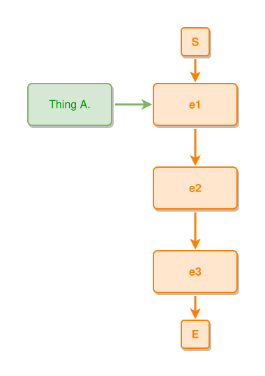

<!-- AUTO-GENERATED FILE - DO NOT EDIT -->
<!-- Generated by: gen-test-md -->
<!-- Command: go run ./cmd-dev/gen-test-md -->

# newlines-03

> **⚠️ Warning:** This file is auto-generated. Manual changes will be lost when tests are regenerated.

**Source:** gl:docs/ipmt-spec.md#L449-L450 | [docs/ipmt-spec.md](../../../docs/ipmt-spec.md#newlines)

## ipmt Content

```ipmt
a::a Thing A. ::t "line 1\nline 2" ::tip --> e1 ::e --> e2 ::e --> e3 ::e
```

## Generated Files

- [newlines-03.ipmt](newlines-03.ipmt) - ipmt input
- [newlines-03.json](newlines-03.json) - Parsed structure
- [newlines-03.layout.json](newlines-03.layout.json) - Layout coordinates
- [newlines-03.ipm.svg](newlines-03.ipm.svg) - Rendered diagram

## Rendered Diagram



This test case was automatically generated from the specification document.

The ipmt code block was extracted using [sync-test-cases](../../../docs/dev/testing.md) and saved to [newlines-03.ipmt](newlines-03.ipmt), then parsed into the [JSON structure](newlines-03.json) and laid out into [layout coordinates](newlines-03.layout.json). The [SVG diagram](newlines-03.ipm.svg) was rendered using [ipmsvg-gen](../../../docs/ipmsvg-gen.md).
