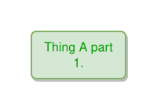

<!-- AUTO-GENERATED FILE - DO NOT EDIT -->
<!-- Generated by: gen-test-md -->
<!-- Command: go run ./cmd-dev/gen-test-md -->

# newlines-outside-double-quotes

> **⚠️ Warning:** This file is auto-generated. Manual changes will be lost when tests are regenerated.

**Source:** gl:docs/ipmt-spec.md#L456-L459 | [docs/ipmt-spec.md](../../../docs/ipmt-spec.md#newlines-outside-double-quotes)

## ipmt Content

```ipmt
Thing A
  part 1. ::t "line 1
  line 2" ::tip
```

## Generated Files

- [newlines-outside-double-quotes.ipmt](newlines-outside-double-quotes.ipmt) - ipmt input
- [newlines-outside-double-quotes.json](newlines-outside-double-quotes.json) - Parsed structure
- [newlines-outside-double-quotes.layout.json](newlines-outside-double-quotes.layout.json) - Layout coordinates
- [newlines-outside-double-quotes.ipm.svg](newlines-outside-double-quotes.ipm.svg) - Rendered diagram

## Rendered Diagram



This test case was automatically generated from the specification document.

The ipmt code block was extracted using [sync-test-cases](../../../docs/dev/testing.md) and saved to [newlines-outside-double-quotes.ipmt](newlines-outside-double-quotes.ipmt), then parsed into the [JSON structure](newlines-outside-double-quotes.json) and laid out into [layout coordinates](newlines-outside-double-quotes.layout.json). The [SVG diagram](newlines-outside-double-quotes.ipm.svg) was rendered using [ipmsvg-gen](../../../docs/ipmsvg-gen.md).
