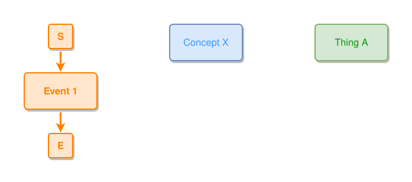

<!-- AUTO-GENERATED FILE - DO NOT EDIT -->
<!-- Generated by: gen-test-md -->
<!-- Command: go run ./cmd-dev/gen-test-md -->

# node-type

> **⚠️ Warning:** This file is auto-generated. Manual changes will be lost when tests are regenerated.

**Source:** gl:docs/ipmt-spec.md#L136-L139 | [docs/ipmt-spec.md](../../../docs/ipmt-spec.md#node-type)

## ipmt Content

```ipmt
Event 1 ::e
Concept X ::c
Thing A ::t
```

## Generated Files

- [node-type.ipmt](node-type.ipmt) - ipmt input
- [node-type.json](node-type.json) - Parsed structure
- [node-type.layout.json](node-type.layout.json) - Layout coordinates
- [node-type.ipm.svg](node-type.ipm.svg) - Rendered diagram

## Rendered Diagram



This test case was automatically generated from the specification document.

The ipmt code block was extracted using [sync-test-cases](../../../docs/dev/testing.md) and saved to [node-type.ipmt](node-type.ipmt), then parsed into the [JSON structure](node-type.json) and laid out into [layout coordinates](node-type.layout.json). The [SVG diagram](node-type.ipm.svg) was rendered using [ipmsvg-gen](../../../docs/ipmsvg-gen.md).
