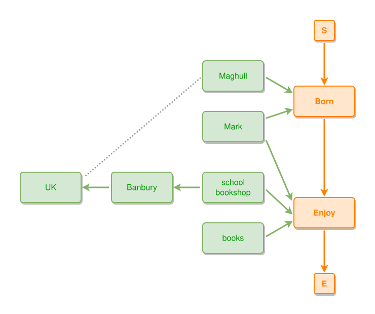

<!-- AUTO-GENERATED FILE - DO NOT EDIT -->
<!-- Generated by: gen-test-md -->
<!-- Command: go run ./cmd-dev/gen-test-md -->

# rich-example

> **⚠️ Warning:** This file is auto-generated. Manual changes will be lost when tests are regenerated.

**Source:** gl:docs/ipmt-spec.md#L691-L698 | [docs/ipmt-spec.md](../../../docs/ipmt-spec.md#rich-example)

## ipmt Content

```ipmt
Maghull --"Maghull is near UK"-- UK
Maghull --"Town where Mark was born"--> BR::a Born ::e
Mark --> BR
Mark --> Enjoy ::e
BR --> Enjoy
SB::a school bookshop, books --> Enjoy
SB --> Banbury --> UK
```

## Generated Files

- [rich-example.ipmt](rich-example.ipmt) - ipmt input
- [rich-example.json](rich-example.json) - Parsed structure
- [rich-example.layout.json](rich-example.layout.json) - Layout coordinates
- [rich-example.ipm.svg](rich-example.ipm.svg) - Rendered diagram

## Rendered Diagram



This test case was automatically generated from the specification document.

The ipmt code block was extracted using [sync-test-cases](../../../docs/dev/testing.md) and saved to [rich-example.ipmt](rich-example.ipmt), then parsed into the [JSON structure](rich-example.json) and laid out into [layout coordinates](rich-example.layout.json). The [SVG diagram](rich-example.ipm.svg) was rendered using [ipmsvg-gen](../../../docs/ipmsvg-gen.md).
