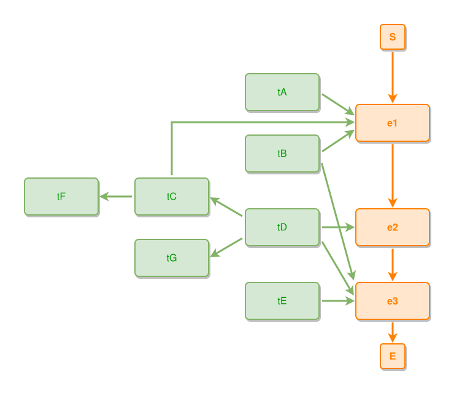

<!-- AUTO-GENERATED FILE - DO NOT EDIT -->
<!-- Generated by: gen-test-md -->
<!-- Command: go run ./cmd-dev/gen-test-md -->

# a-bent-ties-approach-follows-its-last-leg

> **⚠️ Warning:** This file is auto-generated. Manual changes will be lost when tests are regenerated.

**Source:** gl:docs/dev/layout-gen/layout-alg-ext.md#L1094-L1103 | [docs/dev/layout-gen/layout-alg-ext.md](../../docs/dev/layout-gen/layout-alg-ext.md#a-bent-ties-approach-follows-its-last-leg)

## ipmt Content

```ipmt
e1 ::e --> e2 ::e --> e3 ::e
tA, tB --> e1
tC --> e1
tD --> e2
tE --> e3
tB, tD --> e3
tD --> tC
tC --> tF
tD --> tG
```

## Generated Files

- [a-bent-ties-approach-follows-its-last-leg.ipmt](a-bent-ties-approach-follows-its-last-leg.ipmt) - ipmt input
- [a-bent-ties-approach-follows-its-last-leg.json](a-bent-ties-approach-follows-its-last-leg.json) - Parsed structure
- [a-bent-ties-approach-follows-its-last-leg.layout.json](a-bent-ties-approach-follows-its-last-leg.layout.json) - Layout coordinates
- [a-bent-ties-approach-follows-its-last-leg.ipm.svg](a-bent-ties-approach-follows-its-last-leg.ipm.svg) - Rendered diagram

## Rendered Diagram



This test case was automatically generated from the specification document.

The ipmt code block was extracted using [sync-test-cases](../../docs/dev/testing.md) and saved to [a-bent-ties-approach-follows-its-last-leg.ipmt](a-bent-ties-approach-follows-its-last-leg.ipmt), then parsed into the [JSON structure](a-bent-ties-approach-follows-its-last-leg.json) and laid out into [layout coordinates](a-bent-ties-approach-follows-its-last-leg.layout.json). The [SVG diagram](a-bent-ties-approach-follows-its-last-leg.ipm.svg) was rendered using [ipmsvg-gen](../../docs/ipmsvg-gen.md).
