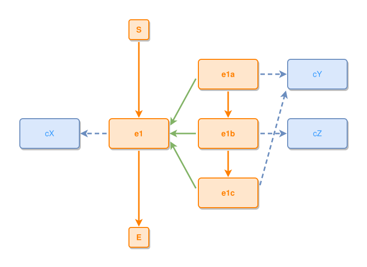

<!-- AUTO-GENERATED FILE - DO NOT EDIT -->
<!-- Generated by: gen-test-md -->
<!-- Command: go run ./cmd-dev/gen-test-md -->

# a-budgeted-crossing-beats-a-two-bend-detour

> **⚠️ Warning:** This file is auto-generated. Manual changes will be lost when tests are regenerated.

**Source:** gl:docs/dev/layout-gen/layout-alg-ext.md#L995-L1009 | [docs/dev/layout-gen/layout-alg-ext.md](../../docs/dev/layout-gen/layout-alg-ext.md#a-budgeted-crossing-beats-a-two-bend-detour)

## ipmt Content

```ipmt
e1 ::e
e1 --> cX ::c

e1a ::e
  --> e1b ::e
  --> e1c ::e

e1a --::P--> e1
e1b --::P--> e1
e1c --::P--> e1

e1a --> cY ::c
e1c --> cY ::c
e1b --> cZ ::c
```

## Generated Files

- [a-budgeted-crossing-beats-a-two-bend-detour.ipmt](a-budgeted-crossing-beats-a-two-bend-detour.ipmt) - ipmt input
- [a-budgeted-crossing-beats-a-two-bend-detour.json](a-budgeted-crossing-beats-a-two-bend-detour.json) - Parsed structure
- [a-budgeted-crossing-beats-a-two-bend-detour.layout.json](a-budgeted-crossing-beats-a-two-bend-detour.layout.json) - Layout coordinates
- [a-budgeted-crossing-beats-a-two-bend-detour.ipm.svg](a-budgeted-crossing-beats-a-two-bend-detour.ipm.svg) - Rendered diagram

## Rendered Diagram



This test case was automatically generated from the specification document.

The ipmt code block was extracted using [sync-test-cases](../../docs/dev/testing.md) and saved to [a-budgeted-crossing-beats-a-two-bend-detour.ipmt](a-budgeted-crossing-beats-a-two-bend-detour.ipmt), then parsed into the [JSON structure](a-budgeted-crossing-beats-a-two-bend-detour.json) and laid out into [layout coordinates](a-budgeted-crossing-beats-a-two-bend-detour.layout.json). The [SVG diagram](a-budgeted-crossing-beats-a-two-bend-detour.ipm.svg) was rendered using [ipmsvg-gen](../../docs/ipmsvg-gen.md).
