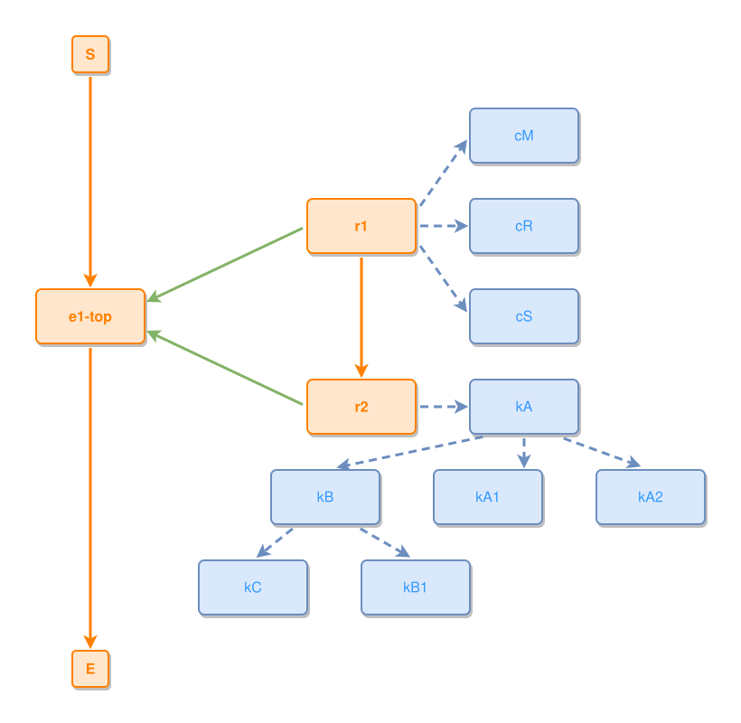

<!-- AUTO-GENERATED FILE - DO NOT EDIT -->
<!-- Generated by: gen-test-md -->
<!-- Command: go run ./cmd-dev/gen-test-md -->

# a-deep-concept-fan-survives-a-foreign-bands-column

> **⚠️ Warning:** This file is auto-generated. Manual changes will be lost when tests are regenerated.

**Source:** gl:docs/dev/layout-gen/layout-alg-ext.md#L758-L771 | [docs/dev/layout-gen/layout-alg-ext.md](../../docs/dev/layout-gen/layout-alg-ext.md#a-deep-concept-fan-survives-a-foreign-bands-column)

## ipmt Content

```ipmt
e1-top ::e
r1 ::e --::P--> e1-top
r2 ::e --::P--> e1-top
r1 --> r2
r1 --> cM ::c
r1 --> cR ::c
r1 --> cS ::c
r2 --> kA ::c
kA --> kB ::c
kA --> kA1 ::c
kA --> kA2 ::c
kB --> kC ::c
kB --> kB1 ::c
```

## Generated Files

- [a-deep-concept-fan-survives-a-foreign-bands-column.ipmt](a-deep-concept-fan-survives-a-foreign-bands-column.ipmt) - ipmt input
- [a-deep-concept-fan-survives-a-foreign-bands-column.json](a-deep-concept-fan-survives-a-foreign-bands-column.json) - Parsed structure
- [a-deep-concept-fan-survives-a-foreign-bands-column.layout.json](a-deep-concept-fan-survives-a-foreign-bands-column.layout.json) - Layout coordinates
- [a-deep-concept-fan-survives-a-foreign-bands-column.ipm.svg](a-deep-concept-fan-survives-a-foreign-bands-column.ipm.svg) - Rendered diagram

## Rendered Diagram



This test case was automatically generated from the specification document.

The ipmt code block was extracted using [sync-test-cases](../../docs/dev/testing.md) and saved to [a-deep-concept-fan-survives-a-foreign-bands-column.ipmt](a-deep-concept-fan-survives-a-foreign-bands-column.ipmt), then parsed into the [JSON structure](a-deep-concept-fan-survives-a-foreign-bands-column.json) and laid out into [layout coordinates](a-deep-concept-fan-survives-a-foreign-bands-column.layout.json). The [SVG diagram](a-deep-concept-fan-survives-a-foreign-bands-column.ipm.svg) was rendered using [ipmsvg-gen](../../docs/ipmsvg-gen.md).
