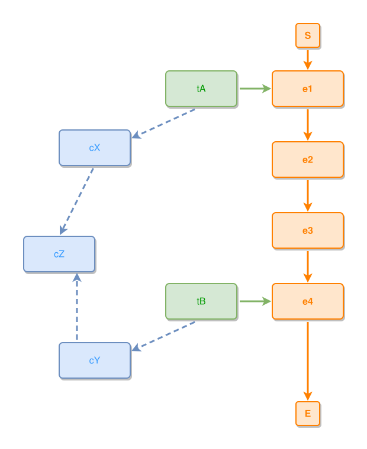

<!-- AUTO-GENERATED FILE - DO NOT EDIT -->
<!-- Generated by: gen-test-md -->
<!-- Command: go run ./cmd-dev/gen-test-md -->

# a-far-join-child-tucks-to-the-parents-column

> **⚠️ Warning:** This file is auto-generated. Manual changes will be lost when tests are regenerated.

**Source:** gl:docs/dev/layout-gen/layout-alg-ext.md#L1098-L1105 | [docs/dev/layout-gen/layout-alg-ext.md](../../docs/dev/layout-gen/layout-alg-ext.md#a-far-join-child-tucks-to-the-parents-column)

## ipmt Content

```ipmt
e1 ::e --> e2 ::e --> e3 ::e --> e4 ::e
tA --> e1
tB --> e4
tA --> cX ::c
tB --> cY ::c
cX --> cZ ::c
cY --> cZ ::c
```

## Generated Files

- [a-far-join-child-tucks-to-the-parents-column.ipmt](a-far-join-child-tucks-to-the-parents-column.ipmt) - ipmt input
- [a-far-join-child-tucks-to-the-parents-column.json](a-far-join-child-tucks-to-the-parents-column.json) - Parsed structure
- [a-far-join-child-tucks-to-the-parents-column.layout.json](a-far-join-child-tucks-to-the-parents-column.layout.json) - Layout coordinates
- [a-far-join-child-tucks-to-the-parents-column.ipm.svg](a-far-join-child-tucks-to-the-parents-column.ipm.svg) - Rendered diagram

## Rendered Diagram



This test case was automatically generated from the specification document.

The ipmt code block was extracted using [sync-test-cases](../../docs/dev/testing.md) and saved to [a-far-join-child-tucks-to-the-parents-column.ipmt](a-far-join-child-tucks-to-the-parents-column.ipmt), then parsed into the [JSON structure](a-far-join-child-tucks-to-the-parents-column.json) and laid out into [layout coordinates](a-far-join-child-tucks-to-the-parents-column.layout.json). The [SVG diagram](a-far-join-child-tucks-to-the-parents-column.ipm.svg) was rendered using [ipmsvg-gen](../../docs/ipmsvg-gen.md).
