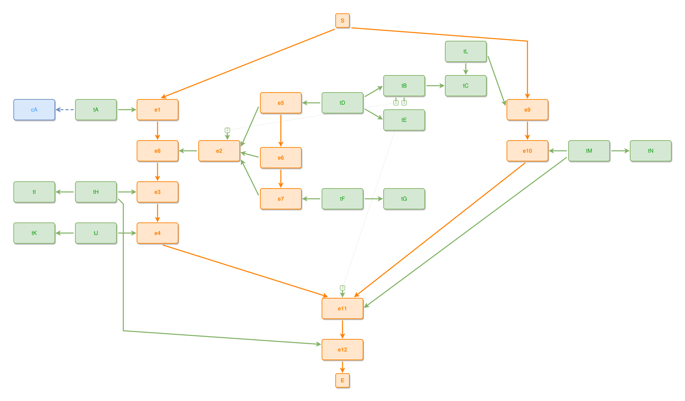

<!-- AUTO-GENERATED FILE - DO NOT EDIT -->
<!-- Generated by: gen-test-md -->
<!-- Command: go run ./cmd-dev/gen-test-md -->

# a-late-side-branch-merge-keeps-its-join-edge-short

> **⚠️ Warning:** This file is auto-generated. Manual changes will be lost when tests are regenerated.

**Source:** gl:docs/dev/layout-gen/layout-alg-ext.md#L330-L365 | [docs/dev/layout-gen/layout-alg-ext.md](../../docs/dev/layout-gen/layout-alg-ext.md#a-late-side-branch-merge-keeps-its-join-edge-short)

## ipmt Content

```ipmt
e1 ::e
  --> e8 ::e
  --> e3 ::e
  --> e4 ::e

e5 ::e
  --> e6 ::e
  --> e7 ::e

e5 ::e,
  e6 ::e,
  e7 ::e
  --::P--> e2 ::e

e2
  --::P--> e8 ::e

e1 <-- tA --> cA ::c
e2 <-- tB --> tC
e5 <-- tD --> tB, tE
e7 <-- tF --> tG
e3 <-- tH --> tI
e4 ::e <-- tJ --> tK

e9 ::e
  --> e10 ::e

e9 <-- tL --> tC
e10 <-- tM --> tN

e4, e10
  --> e11 ::e <-- tM, tB

e11
  --> e12 ::e <-- tH
```

## Generated Files

- [a-late-side-branch-merge-keeps-its-join-edge-short.ipmt](a-late-side-branch-merge-keeps-its-join-edge-short.ipmt) - ipmt input
- [a-late-side-branch-merge-keeps-its-join-edge-short.json](a-late-side-branch-merge-keeps-its-join-edge-short.json) - Parsed structure
- [a-late-side-branch-merge-keeps-its-join-edge-short.layout.json](a-late-side-branch-merge-keeps-its-join-edge-short.layout.json) - Layout coordinates
- [a-late-side-branch-merge-keeps-its-join-edge-short.ipm.svg](a-late-side-branch-merge-keeps-its-join-edge-short.ipm.svg) - Rendered diagram

## Rendered Diagram



This test case was automatically generated from the specification document.

The ipmt code block was extracted using [sync-test-cases](../../docs/dev/testing.md) and saved to [a-late-side-branch-merge-keeps-its-join-edge-short.ipmt](a-late-side-branch-merge-keeps-its-join-edge-short.ipmt), then parsed into the [JSON structure](a-late-side-branch-merge-keeps-its-join-edge-short.json) and laid out into [layout coordinates](a-late-side-branch-merge-keeps-its-join-edge-short.layout.json). The [SVG diagram](a-late-side-branch-merge-keeps-its-join-edge-short.ipm.svg) was rendered using [ipmsvg-gen](../../docs/ipmsvg-gen.md).
