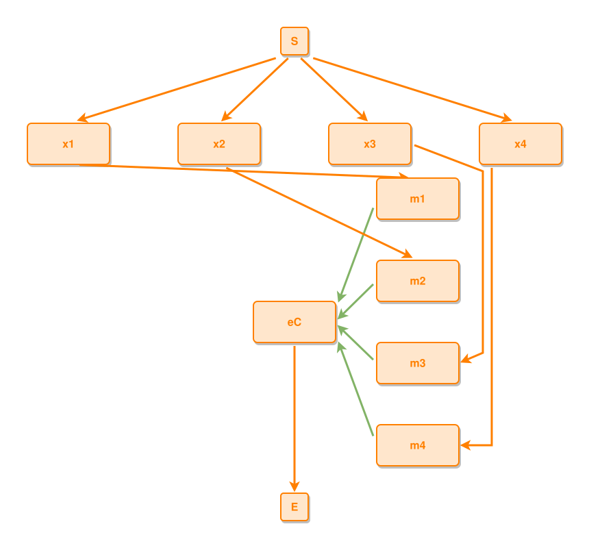

<!-- AUTO-GENERATED FILE - DO NOT EDIT -->
<!-- Generated by: gen-test-md -->
<!-- Command: go run ./cmd-dev/gen-test-md -->

# a-leads-to-into-a-sub-grid-member-bends-around-the-members-above

> **⚠️ Warning:** This file is auto-generated. Manual changes will be lost when tests are regenerated.

**Source:** gl:docs/dev/layout-gen/layout-alg-ext.md#L1353-L1358 | [docs/dev/layout-gen/layout-alg-ext.md](../../docs/dev/layout-gen/layout-alg-ext.md#a-leads-to-into-a-sub-grid-member-bends-around-the-members-above)

## ipmt Content

```ipmt
m1 ::e, m2 ::e, m3 ::e, m4 ::e --::P--> eC ::e
x1 ::e --> m1
x2 ::e --> m2
x3 ::e --> m3
x4 ::e --> m4
```

## Generated Files

- [a-leads-to-into-a-sub-grid-member-bends-around-the-members-above.ipmt](a-leads-to-into-a-sub-grid-member-bends-around-the-members-above.ipmt) - ipmt input
- [a-leads-to-into-a-sub-grid-member-bends-around-the-members-above.json](a-leads-to-into-a-sub-grid-member-bends-around-the-members-above.json) - Parsed structure
- [a-leads-to-into-a-sub-grid-member-bends-around-the-members-above.layout.json](a-leads-to-into-a-sub-grid-member-bends-around-the-members-above.layout.json) - Layout coordinates
- [a-leads-to-into-a-sub-grid-member-bends-around-the-members-above.ipm.svg](a-leads-to-into-a-sub-grid-member-bends-around-the-members-above.ipm.svg) - Rendered diagram

## Rendered Diagram



This test case was automatically generated from the specification document.

The ipmt code block was extracted using [sync-test-cases](../../docs/dev/testing.md) and saved to [a-leads-to-into-a-sub-grid-member-bends-around-the-members-above.ipmt](a-leads-to-into-a-sub-grid-member-bends-around-the-members-above.ipmt), then parsed into the [JSON structure](a-leads-to-into-a-sub-grid-member-bends-around-the-members-above.json) and laid out into [layout coordinates](a-leads-to-into-a-sub-grid-member-bends-around-the-members-above.layout.json). The [SVG diagram](a-leads-to-into-a-sub-grid-member-bends-around-the-members-above.ipm.svg) was rendered using [ipmsvg-gen](../../docs/ipmsvg-gen.md).
