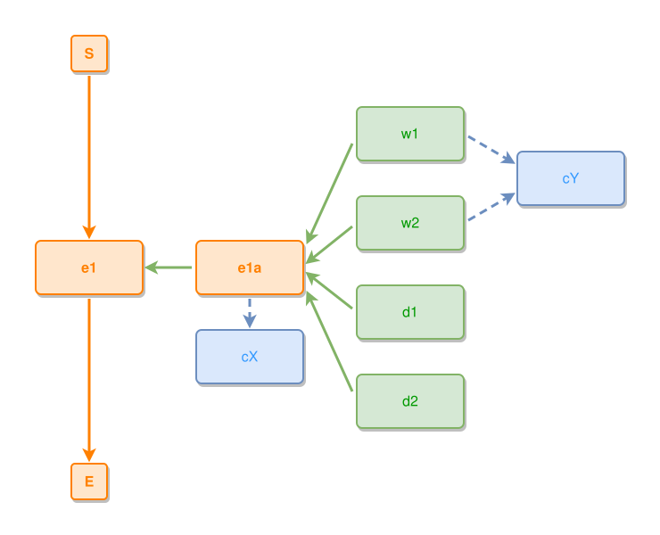

<!-- AUTO-GENERATED FILE - DO NOT EDIT -->
<!-- Generated by: gen-test-md -->
<!-- Command: go run ./cmd-dev/gen-test-md -->

# a-part-of-thing-fan-centres-on-its-event-and-the-sole-concept-drops-below

> **⚠️ Warning:** This file is auto-generated. Manual changes will be lost when tests are regenerated.

**Source:** gl:docs/dev/layout-gen/layout-alg-ext.md#L450-L458 | [docs/dev/layout-gen/layout-alg-ext.md](../../docs/dev/layout-gen/layout-alg-ext.md#a-part-of-thing-fan-centres-on-its-event-and-the-sole-concept-drops-below)

## ipmt Content

```ipmt
e1 ::e
e1a ::e --::P--> e1
e1a --> cX ::c

w1 ::t, w2 ::t --> e1a
w1, w2 --> cY ::c

d1 ::t, d2 ::t --> e1a
```

## Generated Files

- [a-part-of-thing-fan-centres-on-its-event-and-the-sole-concept-drops-below.ipmt](a-part-of-thing-fan-centres-on-its-event-and-the-sole-concept-drops-below.ipmt) - ipmt input
- [a-part-of-thing-fan-centres-on-its-event-and-the-sole-concept-drops-below.json](a-part-of-thing-fan-centres-on-its-event-and-the-sole-concept-drops-below.json) - Parsed structure
- [a-part-of-thing-fan-centres-on-its-event-and-the-sole-concept-drops-below.layout.json](a-part-of-thing-fan-centres-on-its-event-and-the-sole-concept-drops-below.layout.json) - Layout coordinates
- [a-part-of-thing-fan-centres-on-its-event-and-the-sole-concept-drops-below.ipm.svg](a-part-of-thing-fan-centres-on-its-event-and-the-sole-concept-drops-below.ipm.svg) - Rendered diagram

## Rendered Diagram



This test case was automatically generated from the specification document.

The ipmt code block was extracted using [sync-test-cases](../../docs/dev/testing.md) and saved to [a-part-of-thing-fan-centres-on-its-event-and-the-sole-concept-drops-below.ipmt](a-part-of-thing-fan-centres-on-its-event-and-the-sole-concept-drops-below.ipmt), then parsed into the [JSON structure](a-part-of-thing-fan-centres-on-its-event-and-the-sole-concept-drops-below.json) and laid out into [layout coordinates](a-part-of-thing-fan-centres-on-its-event-and-the-sole-concept-drops-below.layout.json). The [SVG diagram](a-part-of-thing-fan-centres-on-its-event-and-the-sole-concept-drops-below.ipm.svg) was rendered using [ipmsvg-gen](../../docs/ipmsvg-gen.md).
